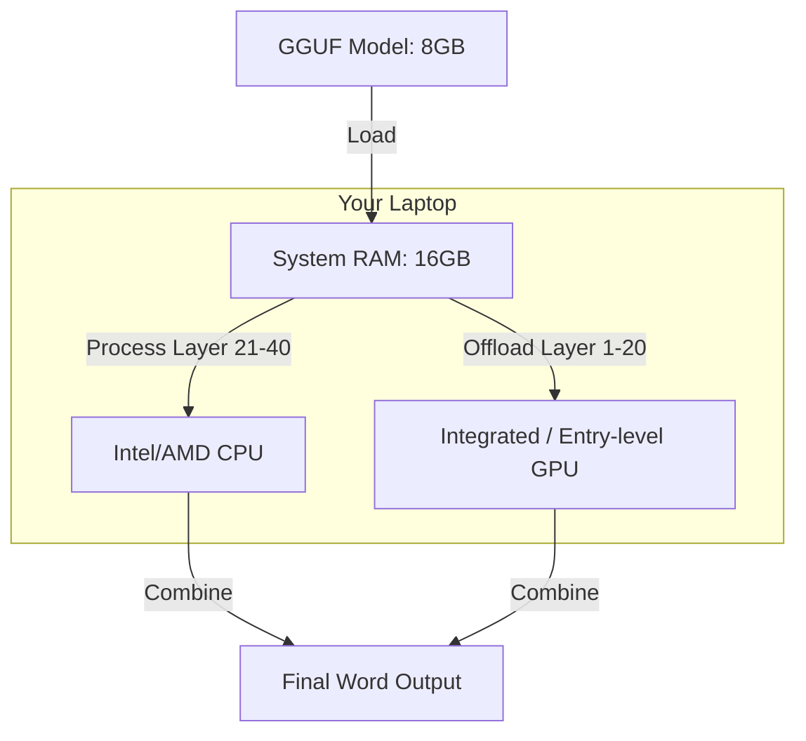

# 🧊 llama.cpp: AI for Everyone, Everywhere
> **Level:** Intermediate | **Language:** Hinglish | **Goal:** Local LLM execution ki art ko master karein, GGUF format, CPU inference, Apple Silicon optimization, aur 2026 ke patterns ko explore karte hue expensive GPUs ke bina "Edge" devices par AI deploy karne ke liye.

---

## 🧭 1. Beginner-Friendly Hinglish Explanation
Bade AI models ko chalane ke liye mahange NVIDIA GPUs chahiye hote hain. Par kya ho agar aapko model apne **Laptop**, **Phone**, ya **Raspberry Pi** par chalana ho?

**llama.cpp** ek aisa magic tool hai jo LLMs ko "Aam Aadmi" ke liye banata hai.
- **Pure C++:** Isse kisi bhari library (Python/PyTorch) ki zaroorat nahi hai. Ye bahut "Lightweight" hai.
- **Quantization King:** Ye model ko itna compress kar deta hai (GGUF format mein) ki wo aapke laptop ki RAM mein fit ho jata hai.
- **Hardware Agnostic:** Ye Intel CPU, AMD GPU, Apple M3 chip, aur NVIDIA GPUs par bhi chalta hai.

2026 mein, agar aapko "Privacy" chahiye ya aapke paas internet nahi hai, toh llama.cpp hi wo rasta hai jisse aap AI ko apne control mein rakh sakte hain.

---

## 🧠 2. Deep Technical Explanation
llama.cpp Llama (aur kai dusri) architectures ka ek high-performance C++ implementation hai.

### 1. The GGUF Format (The 'Container'):
- Ye GGML ka successor hai. Ye ek single binary file hai jo **Weights** aur **Metadata** (Tokenizer info, Model config) dono ko contain karti hai.
- Ise "Extensible" hone ke liye design kiya gaya hai—naye features bina purane models ko break kiye add kiye ja sakte hain.

### 2. Quantization (The 'Compression'):
- llama.cpp ne **K-Quants** (Q4_K_M, Q5_K_S) ko popular banaya hai.
- Ye sophisticated "Weight Grouping" ka use karta hai taaki ye ensure kiya ja sake ki 4-bits tak compress hone ke baad bhi model ki "Intelligence" loss na ho.

### 3. Unified Memory (Apple Silicon):
- Mac (M1/M2/M3) par, CPU aur GPU dono same RAM ko share karte hain. llama.cpp **Metal API** ke liye highly optimized hai, jisse ye MacBook Pro par 70B models ko usable speeds par run karne ki permission deta hai.

### 4. Grammar-Constrained Sampling:
- Ek unique feature jahan aap **GBNF grammars** ka use karke model ko majboor kar sakte hain ki wo sirf valid JSON ya ek specific format hi output kare.

---

## 🏗️ 3. llama.cpp vs. vLLM
| Feature | llama.cpp | vLLM |
| :--- | :--- | :--- |
| **Primary Goal** | **Local / Edge Portability** | High-Throughput Server ke liye |
| **Language** | C++ (Native) | Python / C++ |
| **VRAM Requirement** | Low (RAM par offload ho sakta hai) | High (GPU ki zaroorat hoti hai) |
| **Setup Complexity** | Very Low | Moderate |
| **Format** | **GGUF** | AWQ / GPTQ / FP16 |
| **Best For** | Laptop / Private Chat / IoT | API Provider / Chatbot ke liye |

---

## 📐 4. Mathematical Intuition
- **Perplexity Loss ($P$):**
  Jab aap model ko 16-bit se 4-bit par compress karte hain, to "Perplexity" (model kitna confused hai) thoda sa badh jata hai.
  - FP16: $5.60$
  - Q4_K_M: $5.62$
  - **Tradeoff:** Aap sirf **$0.3\%$** intelligence loss ke badle pure **$75\%$** memory bacha lete hain. Yahi wajah hai ki llama.cpp itna popular hai.

---

## 📊 5. The Hardware Offloading (Diagram)

```mermaid
graph TD
    subgraph "Your Laptop"
    RAM[System RAM: 16GB]
    CPU[Intel/AMD CPU]
    GPU[Integrated / Entry-level GPU]
    end
    
    Model[GGUF Model: 8GB] -- "Load" --> RAM
    RAM -- "Offload Layer 1-20" --> GPU
    RAM -- "Process Layer 21-40" --> CPU
    
    CPU & GPU -- "Combine" --> Result[Final Word Output]
```

---

## 💻 6. Production-Ready Examples (Running Llama-3 Locally)
```bash
# 2026 Pro-Tip: CLI ke liye 'main' aur API ke liye 'server' ka use karein.

# 1. GGUF model ko download karein (e.g., HuggingFace Bartowski se)
# 2. Interactive chat ko run karein
./main -m llama-3-8b.Q4_K_M.gguf \
    -n 512 \
    --repeat_penalty 1.1 \
    --color \
    -i -r "User:" \
    -p "You are a helpful assistant."

# 3. API Server ke roop mein run karein (OpenAI Compatible)
./server -m llama-3-8b.Q4_K_M.gguf \
    --port 8080 \
    --threads 8
```

---

## ❌ 7. Failure Cases
- **Slow Inference (1 tok/sec):** Ye aamtaur par tab hota hai jab model aapki RAM ke liye bahut bada ho aur OS SSD par swapping kar raha ho (jo ki $1000x$ slow hai). **Fix: Chhota Quantization use karein.**
- **CPU Overheating:** Laptop par 2 ghante tak heavy model chalane se wo extremely garam ho sakta hai.
- **Metal/CUDA mismatch:** Sahi flags ke saath compile na karna (`LLAMA_CUDA=1` ya `LLAMA_METAL=1`), jisse ye sirf "Slow CPU" par fall back kar jata hai.

---

## 🛠️ 8. Debugging Guide
- **Symptom:** RAM free hone ke baad bhi "Out of Memory" show hona.
- **Check:** **GPU Layers (`-ngl`)**. Ho sakta hai aap apne chhote GPU VRAM par bahut zyada layers offload karne ki koshish kar rahe hon. Layers ki sankhya ko kam karein (e.g., set `-ngl 10`).
- **Symptom:** "Garbled output" (ajeeb ya kharab output).
- **Check:** **Tokenizer / Prompt Template**. llama.cpp ko har ek model ke liye exact sahi prompt format (Llama-3, ChatML, etc.) ki zaroorat hoti hai.

---

## ⚖️ 9. Tradeoffs
- **CPU vs GPU Inference:**
  - CPU slow hota hai lekin uske paas huge RAM hoti hai (128GB+).
  - GPU $10x$ faster hota hai lekin RAM limited hoti hai (8-24GB).
- **Quantization level:**
  - Q2 (2-bit) bahut chhota hota hai lekin kafi "Hallucinate" karta hai.
  - Q8 (8-bit) perfect hota hai lekin size mein bada hota hai.

---

## 🛡️ 10. Security Concerns
- **Binary Execution:** llama.cpp ek compiled binary hai. Malware se bachne ke liye ise sirf official **ggerganov/llama.cpp** GitHub repo se hi download karein.

---

## 📈 11. Scaling Challenges
- **Concurrent Users:** llama.cpp koi server-first engine nahi hai. Agar ek saath 10 log ise use karenge, to ye vLLM ke mukable bahut slow chalega.

---

## 💸 12. Cost Considerations
- **Total Cost:** **$\$0$**. Aap ise us hardware par run karte hain jo aapke paas pehle se hai. AI Engineering seekhne ka ye sabse sasta tarika hai.

---

## ✅ 13. Best Practices
- **'Q4_K_M' use karein**: Ye size aur quality ke balance ke liye iska "Gold Standard" hai.
- **Mlock Enable karein:** OS ko model ko slow disk par move karne se rokne ke liye `--mlock` flag ka use karein.
- **Threads ko correctly set karein:** Aamtaur par, threads ko logical CPU cores ke bajaye **Physical CPU Cores** ki sankhya par set karein.

---

## ⚠️ 14. Common Mistakes
- **'GGML' download karna**: Ye ek purana aur dead format hai. Sirf **GGUF** ka hi use karein.
- **'mmap' use na karna:** mmap ko enable karna bhool jana (waise ab ye by default on hi rehta hai) jo ki "Instant" model loading ki permission deta hai.

---

## 📝 15. Interview Questions
1. **"GGML aur GGUF ke beech kya difference hai?"**
2. **"Explain karein ki kaise llama.cpp GPU par layers ko offload karne ki permission deta hai."**
3. **"Local AI inference ke liye Python ke mukable C++ behtar kyu hai?"** (Speed, memory control, aur no dependencies ki wajah se).

---

## 🚀 15. Latest 2026 Industry Patterns
- **Vision Support (Llava):** llama.cpp ab images ko perfectly handle karta hai, jisse aap "Local Vision AI" bana sakte hain.
- **MoE Optimization:** Apple Silicon par Mixtral jaise models ke liye isme kamaal ke speedups hain.
- **Mobile Integration:** llama.cpp ab "Privacy-first" local assistant features ke liye 2026 ki hazaron Android/iOS apps ke andar integrated hai.

