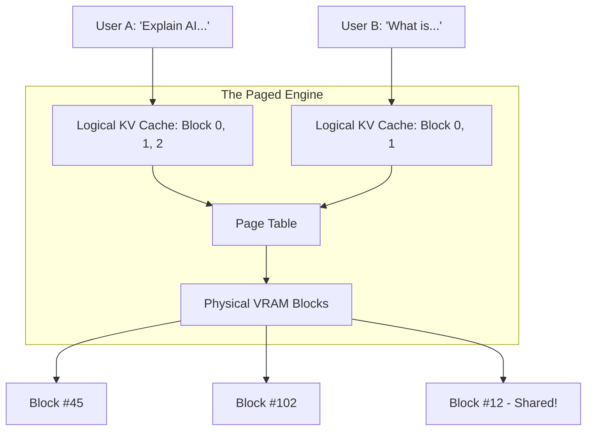

# 🚀 vLLM: High-Throughput LLM Serving
> **Level:** Advanced | **Language:** Hinglish | **Goal:** Master the world's fastest LLM serving engine, exploring PagedAttention, Continuous Batching, and the 2026 production patterns for deploying enterprise-grade AI APIs.

---

## 🧭 1. Beginner-Friendly Hinglish Explanation
Normal LLM serving slow hoti hai kyunki "Memory" waste hoti hai. 

- **The Problem:** Jab AI baat karta hai, wo har word ko "Yaad" (KV Cache) rakhta hai. Purane systems iske liye "Pehle se jagah" (Fixed Memory) reserve kar lete hain. Agar user ne 10 words likhe aur 1000 ki jagah reserve ki, toh baki ki 990 jagah barbad ho gayi.
- **vLLM ka Solution:** Isne OS ke "Virtual Memory" se idea churaya aur **PagedAttention** banaya. Isme memory "Chote-chote blocks" mein baant di jati hai. Jaise-jaise AI ko jagah chahiye, wo naya block le leta hai.

Isse kya hota hai? Aap ek hi GPU par $10x-20x$ zyada users handle kar sakte hain. 2026 mein, agar aap apna AI startup chala rahe hain, toh vLLM aapka sabse bada dost hai jo aapka bill kam karega.

---

## 🧠 2. Deep Technical Explanation
vLLM's core innovation is **PagedAttention** and **Continuous Batching.**

### 1. PagedAttention:
- Instead of allocating a contiguous block of memory for the KV Cache (which leads to fragmentation), vLLM stores it in non-contiguous pages.
- A **Page Table** maps logical tokens to physical blocks in VRAM. 
- This allows for **Zero Internal Fragmentation** and **Flexible Sharing** (e.g., when 10 users share the same system prompt).

### 2. Continuous Batching:
- Standard batching waits for ALL requests in a batch to finish before starting a new one.
- Continuous Batching allows new requests to "Join" the batch as soon as any request finishes. No more "Waiting for the slowest user."

### 3. Tensor Parallelism:
- Native support for splitting models (e.g., Llama-3-70B) across 2, 4, or 8 GPUs with zero effort.

---

## 🏗️ 3. Serving Engine Comparison
| Feature | Standard (HuggingFace) | vLLM (2026 Standard) | llama.cpp |
| :--- | :--- | :--- | :--- |
| **Throughput** | Low | **Extreme** | Moderate |
| **Latency** | Moderate | Low | **Ultra-Low (CPU/Edge)** |
| **Memory Management**| Fixed / Wasteful | **Dynamic (Paged)** | Minimal |
| **Multi-GPU** | Manual / Hard | **Automatic (TP)** | Possible |
| **Best For** | Prototyping | **Production API** | Local / Mobile |

---

## 📐 4. Mathematical Intuition
- **The Memory Utilization Formula:** 
  Standard systems utilize $\sim 20-40\%$ of KV Cache VRAM. vLLM utilizes **$96\%+$**.
- **The Throughput Equation:**
  $$\text{Throughput} \propto \frac{\text{Batch Size}}{\text{Average Latency}}$$
  By increasing the "Effective Batch Size" using PagedAttention, vLLM increases throughput linearly without hitting the VRAM wall.

---

## 📊 5. PagedAttention Architecture (Diagram)


---

## 💻 6. Production-Ready Examples (Serving with vLLM & Docker)
```bash
# 2026 Pro-Tip: Use Docker to ensure environment consistency.

# 1. Run vLLM with Llama-3-8B in 4-bit AWQ
docker run --gpus all -p 8000:8000 vllm/vllm-openai:latest \
    --model casperhansen/llama-3-8b-instruct-awq \
    --quantization awq \
    --dtype float16 \
    --max-model-len 4096

# 2. Test with cURL (OpenAI Compatible API)
curl http://localhost:8000/v1/chat/completions \
    -H "Content-Type: application/json" \
    -d '{
        "model": "llama-3-8b-instruct-awq",
        "messages": [{"role": "user", "content": "How does vLLM work?"}]
    }'
```

---

## ❌ 7. Failure Cases
- **Over-Subscription:** Trying to handle too many users at once, causing "PagedAttention" to run out of blocks, leading to "Request Dropping."
- **Unsupported Architecture:** Trying to run a very new model that vLLM hasn't implemented yet. **Fix: Use the 'Auto' model loader.**
- **GPU Hangs:** Long-running vLLM servers can sometimes "Hang" due to NCCL (Network) issues in multi-GPU setups.

---

## 🛠️ 8. Debugging Guide
- **Symptom:** "High latency even with low users."
- **Check:** **Quantization**. Ensure you are using AWQ or FP8. Full FP16 is much slower for memory-bound tasks.
- **Symptom:** "Out of Memory (OOM) on startup."
- **Check:** `--gpu-memory-utilization`. Default is 0.90. If your GPU is also running a UI, set it to 0.70.

---

## ⚖️ 9. Tradeoffs
- **Throughput vs. Latency:** High batching (Better throughput) can slightly increase the time for the "First Token" (Latency).
- **vLLM vs. TensorRT-LLM:** 
  - vLLM is easier and supports more models. 
  - TensorRT-LLM (NVIDIA) is slightly faster but much harder to setup.

---

## 🛡️ 10. Security Concerns
- **Prompt Injection in System Prompt:** If you use a shared system prompt in vLLM, ensure users can't "Escape" it to access other users' data (though vLLM is physically isolated per request).

---

## 📈 11. Scaling Challenges
- **Multi-Node Serving:** vLLM works great on one node (8 GPUs). Running one model across TWO nodes (16 GPUs) is much harder and requires **Ray**.

---

## 💸 12. Cost Considerations
- **Cost per Million Tokens:** Using vLLM can reduce your serving cost from **$\$10$** to **$\$0.50$** per million tokens compared to naive serving.

---

## ✅ 13. Best Practices
- **Use 'Pre-compiled' Kernels:** Ensure you are using the latest vLLM wheel for your CUDA version.
- **Enable Prefix Caching:** If users ask questions about the same PDF, vLLM will "Cache" the PDF tokens so they are calculated only once.
- **Use Chat Templates:** Use the built-in Jinja templates to ensure the `[INST]` or `<|user|>` tags are correct.

---

## ⚠️ 14. Common Mistakes
- **Running on old GPUs:** vLLM needs Ampere (A100) or newer for best performance.
- **Ignoring the CPU:** vLLM needs a fast CPU to handle the "Batch Management" logic, even if the math happens on GPU.

---

## 📝 15. Interview Questions
1. **"What is PagedAttention and how does it solve memory fragmentation?"**
2. **"Difference between Static Batching and Continuous Batching?"**
3. **"How does vLLM handle multiple users sharing the same context?"**

---

## 🚀 15. Latest 2026 Industry Patterns
- **FP8 Serving:** Native support for the H100/B200 FP8 format, doubling the throughput of FP16.
- **LoRA-on-the-fly:** Serving 100 different "Fine-tuned" models on a single vLLM instance by swapping small LoRA adapters instantly.
- **Speculative Decoding in vLLM:** Using a tiny "Draft model" inside vLLM to guess tokens for the main model, speeding up the API by $2x$.
