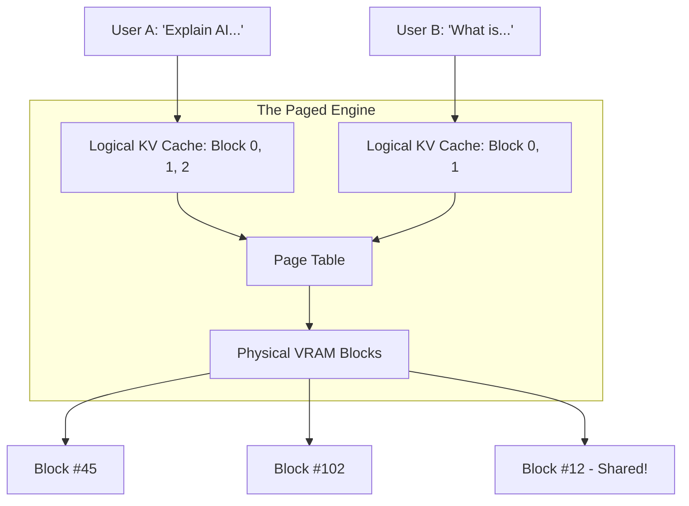

# 🚀 vLLM: High-Throughput LLM Serving
> **Level:** Advanced | **Language:** Hinglish | **Goal:** Duniya ke sabse tez LLM serving engine ko master karein, PagedAttention, Continuous Batching, aur 2026 mein enterprise-grade AI APIs deploy karne ke production patterns ko explore karte hue.

---

## 🧭 1. Beginner-Friendly Hinglish Explanation
Normal LLM serving slow hoti hai kyunki "Memory" waste hoti hai. 

- **The Problem:** Jab AI baat karta hai, wo har word ko "Yaad" (KV Cache) rakhta hai. Purane systems iske liye "Pehle se jagah" (Fixed Memory) reserve kar lete hain. Agar user ne 10 words likhe aur 1000 ki jagah reserve ki, toh baki ki 990 jagah barbad ho gayi.
- **vLLM ka Solution:** Isne OS ke "Virtual Memory" se idea churaya aur **PagedAttention** banaya. Isme memory "Chote-chote blocks" mein baant di jati hai. Jaise-jaise AI ko jagah chahiye, wo naya block le leta hai.

Isse kya hota hai? Aap ek hi GPU par $10x-20x$ zyada users handle kar sakte hain. 2026 mein, agar aap apna AI startup chala rahe hain, toh vLLM aapka sabse bada dost hai jo aapka bill kam karega.

---

## 🧠 2. Deep Technical Explanation
vLLM ka core innovation **PagedAttention** aur **Continuous Batching** hai.

### 1. PagedAttention:
- KV Cache ke liye ek contiguous (lagatar) memory block allocate karne ke bajaye (jisse fragmentation hoti hai), vLLM ise non-contiguous pages mein store karta hai.
- Ek **Page Table** logical tokens ko VRAM ke physical blocks par map karta hai.
- Isse **Zero Internal Fragmentation** aur **Flexible Sharing** (e.g., jab 10 users same system prompt share karte hain) achieve hoti hai.

### 2. Continuous Batching:
- Standard batching naya batch start karne se pehle batch ke SARE requests ke finish hone ka wait karti hai.
- Continuous Batching naye requests ko batch mein "Join" karne ki permission deti hai jaise hi koi request finish hota hai. Ab "slowest user ke liye wait karne" ki koi zaroorat nahi hai.

### 3. Tensor Parallelism:
- Models (e.g., Llama-3-70B) ko bina kisi extra effort ke 2, 4, ya 8 GPUs par split karne ka native support.

---

## 🏗️ 3. Serving Engine Comparison
| Feature | Standard (HuggingFace) | vLLM (2026 Standard) | llama.cpp |
| :--- | :--- | :--- | :--- |
| **Throughput** | Low | **Extreme** | Moderate |
| **Latency** | Moderate | Low | **Ultra-Low (CPU/Edge)** |
| **Memory Management**| Fixed / Wasteful | **Dynamic (Paged)** | Minimal |
| **Multi-GPU** | Manual / Hard | **Automatic (TP)** | Possible |
| **Best For** | Prototyping ke liye | **Production API ke liye** | Local / Mobile ke liye |

---

## 📐 4. Mathematical Intuition
- **The Memory Utilization Formula:**
  Standard systems KV Cache VRAM ka lagbhag $\sim 20-40\%$ hi utilize karte hain. vLLM pure **$96\%+$** utilize karta hai.
- **The Throughput Equation:**
  $$\text{Throughput} \propto \frac{\text{Batch Size}}{\text{Average Latency}}$$
  PagedAttention ka use karke "Effective Batch Size" ko badha kar, vLLM bina VRAM wall ko hit kiye throughput ko linearly badhata hai.

---

## 📊 5. PagedAttention Architecture (Diagram)

```mermaid
graph TD
    UserA[User A: 'Explain AI...'] --> Logical[Logical KV Cache: Block 0, 1, 2]
    UserB[User B: 'What is...'] --> LogicalB[Logical KV Cache: Block 0, 1]
    
    subgraph "The Paged Engine"
    Logical --> Table[Page Table]
    LogicalB --> Table
    Table --> Physical[Physical VRAM Blocks]
    end
    
    Physical --> B1[Block #45]
    Physical --> B2[Block #102]
    Physical --> B3[Block #12 - Shared!]
```

---

## 💻 6. Production-Ready Examples (Serving with vLLM & Docker)
```bash
# 2026 Pro-Tip: Environment consistency ensure karne ke liye Docker ka use karein.

# 1. vLLM ko Llama-3-8B 4-bit AWQ ke saath run karein
docker run --gpus all -p 8000:8000 vllm/vllm-openai:latest \
    --model casperhansen/llama-3-8b-instruct-awq \
    --quantization awq \
    --dtype float16 \
    --max-model-len 4096

# 2. cURL ke saath test karein (OpenAI Compatible API)
curl http://localhost:8000/v1/chat/completions \
    -H "Content-Type: application/json" \
    -d '{
        "model": "llama-3-8b-instruct-awq",
        "messages": [{"role": "user", "content": "How does vLLM work?"}]
    }'
```

---

## ❌ 7. Failure Cases
- **Over-Subscription:** Ek saath bahut saare users ko handle karne ki koshish karna, jisse "PagedAttention" ke blocks khatam ho jate hain aur "Request Dropping" (request drop hone) lagti hai.
- **Unsupported Architecture:** Ek bilkul naye model ko chalane ki koshish karna jise vLLM ne abhi tak implement na kiya ho. **Fix: 'Auto' model loader ka use karein.**
- **GPU Hangs:** Multi-GPU setups mein NCCL (Network) issues ki wajah se long-running vLLM servers kabhi-kabhi "Hang" ho sakte hain.

---

## 🛠️ 8. Debugging Guide
- **Symptom:** "Users kam hone ke baad bhi high latency show hona."
- **Check:** **Quantization**. Ensure karein ki aap AWQ ya FP8 use kar rahe hain. Memory-bound tasks ke liye full FP16 kafi slow hota hai.
- **Symptom:** "Startup par Out of Memory (OOM) error aana."
- **Check:** `--gpu-memory-utilization`. By default ye 0.90 hota hai. Agar aapka GPU UI bhi run kar raha hai, to ise 0.70 set karein.

---

## ⚖️ 9. Tradeoffs
- **Throughput vs. Latency:** High batching (Better throughput) "First Token" ke time (Latency) ko thoda sa badha sakti hai.
- **vLLM vs. TensorRT-LLM:**
  - vLLM aasan hai aur zyada models ko support karta hai.
  - TensorRT-LLM (NVIDIA) thoda faster hai lekin setup karna kafi mushkil hai.

---

## 🛡️ 10. Security Concerns
- **Prompt Injection in System Prompt:** Agar aap vLLM mein shared system prompt ka use karte hain, to ensure karein ki users dusre users ke data ko access karne ke liye isse "Escape" na kar sakein (halanki vLLM physically har request ke liye isolated hota hai).

---

## 📈 11. Scaling Challenges
- **Multi-Node Serving:** vLLM ek single node (8 GPUs) par bahut achha kaam karta hai. Ek model ko TWO nodes (16 GPUs) par chalana kafi mushkil hai aur iske liye **Ray** ki zaroorat hoti hai.

---

## 💸 12. Cost Considerations
- **Cost per Million Tokens:** Naive serving ke mukable vLLM ka use karne se aapki serving cost **$\$10$** se ghat kar **$\$0.50$** per million tokens tak aa sakti hai.

---

## ✅ 13. Best Practices
- **'Pre-compiled' Kernels ka use karein:** Ensure karein ki aap apne CUDA version ke liye latest vLLM wheel use kar rahe hain.
- **Prefix Caching Enable karein:** Agar users same PDF ke baare mein sawal puchte hain, to vLLM PDF tokens ko "Cache" kar lega taaki wo sirf ek hi baar calculate hon.
- **Chat Templates use karein:** `[INST]` ya `<|user|>` tags sahi hain ye ensure karne ke liye built-in Jinja templates ka use karein.

---

## ⚠️ 14. Common Mistakes
- **Purane GPUs par run karna:** Best performance ke liye vLLM ko Ampere (A100) ya usse naye GPU ki zaroorat hoti hai.
- **CPU ko ignore karna:** "Batch Management" logic ko handle karne ke liye vLLM ko ek fast CPU ki zaroorat hoti hai, chahe math calculations GPU par hi kyu na ho rahi hon.

---

## 📝 15. Interview Questions
1. **"PagedAttention kya hai aur ye memory fragmentation ko kaise solve karta hai?"**
2. **"Static Batching aur Continuous Batching ke beech kya difference hai?"**
3. **"vLLM same context share karne wale multiple users ko kaise handle karta hai?"**

---

## 🚀 15. Latest 2026 Industry Patterns
- **FP8 Serving:** H100/B200 FP8 format ka native support, jo FP16 ke mukable throughput ko double kar deta hai.
- **LoRA-on-the-fly:** Ek single vLLM instance par 100 different "Fine-tuned" models ko dynamically serve karna (chhote LoRA adapters ko aapas mein instantly swap karke).
- **Speculative Decoding in vLLM:** Main model ke tokens ko guess karne ke liye vLLM ke andar ek chhote "Draft model" ka use karna, jisse API ki speed $2x$ badh jati hai.

