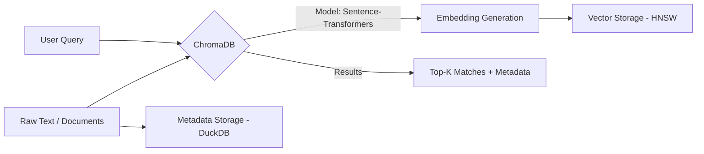

# 🎨 ChromaDB: The AI-Native Vector Database
> **Level:** Beginner to Intermediate | **Language:** Hinglish | **Goal:** Master the world's most developer-friendly open-source vector database, exploring how to build and query local RAG systems with zero configuration in 2026.

---

## 🧭 1. Beginner-Friendly Hinglish Explanation
Bade vector databases (jaise Pinecone) manage karna mushkil hota hai—accounts banao, API keys lo, internet connect karo. 

**ChromaDB** "AI ka SQLite" hai. 
- Ye aapke apne computer par chalta hai. 
- Iske liye koi heavy setup nahi chahiye. 
- Isme aap Text dalo, aur ye apne aap uski "Embedding" banakar store kar leta hai.

Sochiye aap ek "Private Chatbot" bana rahe hain jo aapke documents padhe. Aap ChromaDB mein documents daalte hain, aur jab aap kuch puchte hain, ChromaDB seconds mein sahi "Page" nikal kar AI ko de deta hai. 

Chroma ka mantra hai: **"Simple, Fast, and Open Source."**

---

## 🧠 2. Deep Technical Explanation
ChromaDB is a database built specifically for embeddings and their metadata.

### 1. The Architecture:
- Under the hood, it uses **HNSW** (Hierarchical Navigable Small World) for vector search.
- It uses **DuckDB** for metadata storage and filtering.
- **ClickHouse** is used for the production-scale version to handle massive throughput.

### 2. Automatic Embeddings:
- Unlike FAISS, where you must provide vectors, Chroma can integrate with models (OpenAI, HuggingFace, Ollama) to automatically convert your text into vectors when you `add()` it.

### 3. Metadata Filtering:
- You can store extra info with each vector (e.g., `source: "book1.pdf"`, `page: 5`). 
- When querying, you can say: *"Find me things similar to 'Dog', but ONLY from book1.pdf."* This is a powerful feature for real-world RAG.

---

## 🏗️ 3. ChromaDB vs. Pinecone
| Feature | ChromaDB | Pinecone |
| :--- | :--- | :--- |
| **Hosting** | **Local (Your PC)** | Managed Cloud |
| **Pricing** | **Free (Open Source)** | Usage-based (Paid) |
| **Setup** | `pip install chromadb` | API Key + Network |
| **Privacy** | **Total (Offline)** | Data is on Pinecone's servers |
| **Scale** | Great for single apps | Better for massive enterprises |

---

## 📐 4. Mathematical Intuition
- **The HNSW Graph:** 
  Imagine a graph where every point is a document. To find a document, you start at a random point and "Jump" to the neighbor that is closest to your target. 
  HNSW builds multiple "Layers" of these graphs—the top layer has very few points (long jumps), and the bottom layer has all points (short, precise jumps). This makes search $O(\log N)$.

---

## 📊 5. ChromaDB Workflow (Diagram)


---

## 💻 6. Production-Ready Examples (Building a Local Knowledge Base)
```python
# 2026 Pro-Tip: Use persistent storage so your data isn't lost on restart.

import chromadb

# 1. Initialize client with Persistence
client = chromadb.PersistentClient(path="./my_knowledge_base")

# 2. Create a Collection (Like a Table)
collection = client.create_collection(name="company_docs")

# 3. Add data (Metadata is key for filtering later!)
collection.add(
    documents=["Our office is in Bangalore", "Employees get free lunch"],
    metadatas=[{"category": "office"}, {"category": "perks"}],
    ids=["id1", "id2"]
)

# 4. Query
results = collection.query(
    query_texts=["Where do we work?"],
    n_results=1,
    where={"category": "office"} # Metadata Filter
)

print(results['documents'][0])
```

---

## ❌ 7. Failure Cases
- **VRAM Competition:** Running ChromaDB's embedding model on the same GPU as your LLM. Both will fight for memory and slow down. **Fix: Run Chroma on CPU if the dataset is small.**
- **Stale Persistence:** Updating your documents but forgetting to update the IDs in Chroma. You will end up with "Duplicate" data in your search results.
- **Collection Bloat:** Creating 1000s of collections. Chroma works better with a few large collections using metadata filters.

---

## 🛠️ 8. Debugging Guide
- **Symptom:** "Search results are irrelevant."
- **Check:** **Embedding Model**. If you added data with Model A and queried with Model B, the vectors won't match. **Always use the same model for Index and Query.**
- **Symptom:** "Import Error: DuckDB."
- **Check:** ChromaDB dependencies. Re-install using `pip install chromadb --upgrade`.

---

## ⚖️ 9. Tradeoffs
- **In-Memory vs. Persistent:** In-memory is $2x$ faster but data is lost on exit. Persistent is better for $99\%$ of use cases.
- **Local vs. Server Mode:** Chroma can run as a "Standalone Server" (using Docker) which is better for web apps than "Embedded Mode."

---

## 🛡️ 10. Security Concerns
- **Collection Injection:** If a user can control the `where` filter, they might be able to see documents they aren't authorized to see. **Always validate metadata filters on the backend.**

---

## 📈 11. Scaling Challenges
- **The Python Global Interpreter Lock (GIL):** High-traffic Python Chroma servers can hit a wall. **Use the 'Chroma-Go' or 'Rust' bindings for higher throughput in 2026.**

---

## 💸 12. Cost Considerations
- **Hosting:** You only pay for the SSD storage and RAM on your server. Zero per-request fees.

---

## ✅ 13. Best Practices
- **Use 'Update' instead of 'Add'** if you aren't sure if the ID already exists.
- **Index periodically:** If you add millions of docs, don't query while adding. Add them all, then let Chroma build the HNSW graph.
- **Custom Embedding Functions:** Use specialized models (like `multi-qa-mpnet-base-dot-v1`) if you are doing Question-Answering.

---

## ⚠️ 14. Common Mistakes
- **No Persistence:** Not setting a `path` and wondering where the data went after the script finished.
- **Ignoring IDs:** Using random IDs like `str(random.random())`. Use something meaningful (like the file hash) to prevent duplicates.

---

## 📝 15. Interview Questions
1. **"Why is ChromaDB called 'AI-Native'?"**
2. **"How does Metadata Filtering work in ChromaDB?"**
3. **"What is the difference between PersistentClient and HttpClient in Chroma?"**

---

## 🚀 15. Latest 2026 Industry Patterns
- **Multi-Modal Chroma:** Storing Images, Audio, and Text in the same collection using **CLIP** embeddings.
- **Edge Deployment:** ChromaDB running on mobile devices (via WASM/Rust) for local, private smartphone AI.
- **Hybrid Search in Chroma:** Using both Keyword (BM25) and Vector (Semantic) search in one single query.
