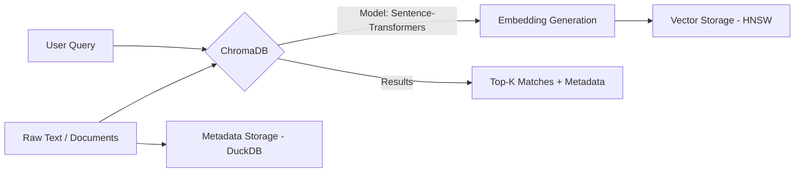

# 🎨 ChromaDB: The AI-Native Vector Database
> **Level:** Beginner to Intermediate | **Language:** Hinglish | **Goal:** Duniya ke sabse developer-friendly open-source vector database ko master karein, aur explore karein ki kaise 2026 mein zero configuration ke sath local RAG systems build aur query kiye jaate hain.

---

## 🧭 1. Beginner-Friendly Hinglish Explanation
Bade vector databases (jaise Pinecone) manage karna mushkil hota hai—accounts banao, API keys lo, internet connect karo. 

**ChromaDB** "AI ka SQLite" hai. 
- Ye aapke apne computer par chalta hai. 
- Iske liye koi heavy setup nahi chahiye. 
- Isme aap Text dalo, aur ye apne aap uski "Embedding" banakar store kar leta hai.

Sochiye aap ek "Private Chatbot" bana rahe hain jo aapke documents padhe. Aap ChromaDB mein documents daalte hain, aur jab aap kuch puchte hain, ChromaDB seconds mein sahi "Page" nikal kar AI ko de deta hai. 

Chroma ka mantra hai: **"Simple, Fast, and Open Source."**

---

## 🧠 2. Deep Technical Explanation
ChromaDB ek aisa database hai jo specifically embeddings aur unke metadata ke liye banaya gaya hai.

### 1. The Architecture:
- Under the hood, ye vector search ke liye **HNSW** (Hierarchical Navigable Small World) ka use karta hai.
- Ye metadata storage aur filtering ke liye **DuckDB** ka use karta hai.
- Massive throughput ko handle karne ke liye production-scale version mein **ClickHouse** ka use kiya jata hai.

### 2. Automatic Embeddings:
- FAISS ke opposite (jahan aapko vectors khud provide karne hote hain), Chroma models (OpenAI, HuggingFace, Ollama) ke saath integrate kar sakta hai, taaki jab aap data `add()` karein to ye automatically aapke text ko vectors mein convert kar de.

### 3. Metadata Filtering:
- Aap har vector ke saath extra info store kar sakte hain (e.g., `source: "book1.pdf"`, `page: 5`).
- Query karte samay aap keh sakte hain: *"Mujhe 'Dog' se similar cheezein dhoondh ke do, lekin ONLY book1.pdf se."* Real-world RAG ke liye ye ek bahut hi powerful feature hai.

---

## 🏗️ 3. ChromaDB vs. Pinecone
| Feature | ChromaDB | Pinecone |
| :--- | :--- | :--- |
| **Hosting** | **Local (Aapka PC)** | Managed Cloud |
| **Pricing** | **Free (Open Source)** | Usage-based (Paid) |
| **Setup** | `pip install chromadb` | API Key + Network |
| **Privacy** | **Total (Offline)** | Data Pinecone ke servers par hota hai |
| **Scale** | Single apps ke liye behtar hai | Massive enterprises ke liye behtar hai |

---

## 📐 4. Mathematical Intuition
- **The HNSW Graph:**
  Ek aise graph ko imagine karein jahan har ek point ek document hai. Kisi document ko find karne ke liye, aap ek random point se start karte hain aur target ke sabse close wale neighbor par "Jump" karte hain.
  HNSW in graphs ki multiple "Layers" banata hai—top layer mein bahut kam points hote hain (long jumps ke liye), aur bottom layer mein saare points hote hain (short, precise jumps ke liye). Isse search complexiy $O(\log N)$ ho jati hai.

---

## 📊 5. ChromaDB Workflow (Diagram)

```mermaid
graph LR
    Doc[Raw Text / Documents] --> Chroma{ChromaDB}
    Chroma -- "Model: Sentence-Transformers" --> Embed[Embedding Generation]
    Embed --> HNSW[Vector Storage - HNSW]
    Doc --> Metadata[Metadata Storage - DuckDB]
    
    Query[User Query] --> Chroma
    Chroma -- "Results" --> Context[Top-K Matches + Metadata]
```

---

## 💻 6. Production-Ready Examples (Building a Local Knowledge Base)
```python
# 2026 Pro-Tip: Persistent storage ka use karein taaki restart par aapka data lost na ho.

import chromadb

# 1. Persistence ke saath client ko initialize karein
client = chromadb.PersistentClient(path="./my_knowledge_base")

# 2. Collection (Table ki tarah) create karein
collection = client.create_collection(name="company_docs")

# 3. Data add karein (Baad mein filtering ke liye metadata key hai!)
collection.add(
    documents=["Our office is in Bangalore", "Employees get free lunch"],
    metadatas=[{"category": "office"}, {"category": "perks"}],
    ids=["id1", "id2"]
)

# 4. Query karein
results = collection.query(
    query_texts=["Where do we work?"],
    n_results=1,
    where={"category": "office"} # Metadata Filter
)

print(results['documents'][0])
```

---

## ❌ 7. Failure Cases
- **VRAM Competition:** ChromaDB ke embedding model ko usi same GPU par run karna jahan aapka LLM chal raha hai. Dono memory ke liye compete karenge aur speed slow ho jayegi. **Fix: Agar dataset chhota hai, to Chroma ko CPU par run karein.**
- **Stale Persistence:** Apne documents ko update karna lekin Chroma mein IDs ko update karna bhool jana. Isse aapke search results mein "Duplicate" data aane lagega.
- **Collection Bloat:** 1000s of collections create karna. Chroma metadata filters ka use karke kuch bade collections ke saath behtar kaam karta hai.

---

## 🛠️ 8. Debugging Guide
- **Symptom:** "Search results irrelevant hain."
- **Check:** **Embedding Model**. Agar aapne Model A ke saath data add kiya tha aur Model B ke saath query kar rahe hain, to vectors match nahi honge. **Index aur Query ke liye hamesha same model ka hi use karein.**
- **Symptom:** "Import Error: DuckDB."
- **Check:** ChromaDB dependencies. `pip install chromadb --upgrade` ka use karke re-install karein.

---

## ⚖️ 9. Tradeoffs
- **In-Memory vs. Persistent:** In-memory $2x$ faster hota hai lekin exit karne par data lost ho jata hai. Persistent $99\%$ use cases ke liye behtar hai.
- **Local vs. Server Mode:** Chroma ek "Standalone Server" (Docker ka use karke) ki tarah run kar sakta hai jo ki web apps ke liye "Embedded Mode" se behtar hai.

---

## 🛡️ 10. Security Concerns
- **Collection Injection:** Agar koi user `where` filter ko control kar sakta hai, to ho sakta hai wo un documents ko bhi dekh le jinhe dekhne ki permission use nahi hai. **Hamesha backend par metadata filters ko validate karein.**

---

## 📈 11. Scaling Challenges
- **The Python Global Interpreter Lock (GIL):** High-traffic Python Chroma servers par bandwidth limits aa sakti hain. **2026 mein higher throughput ke liye 'Chroma-Go' ya 'Rust' bindings ka use karein.**

---

## 💸 12. Cost Considerations
- **Hosting:** Aapko sirf apne server ke SSD storage aur RAM ke liye hi pay karna hota hai. Isme koi per-request fee nahi hoti.

---

## ✅ 13. Best Practices
- Agar aap sure nahi hain ki ID pehle se exist karti hai ya nahi, to **'Add' ke bajaye 'Update' use karein**.
- **Periodically Index karein:** Agar aap millions of docs add kar rahe hain, to adding ke dauran query na karein. Pehle sabhi ko add kar lein, phir Chroma ko HNSW graph build karne dein.
- **Custom Embedding Functions:** Agar aap Question-Answering kar rahe hain, to specialized models (jaise `multi-qa-mpnet-base-dot-v1`) ka use karein.

---

## ⚠️ 14. Common Mistakes
- **No Persistence:** `path` set na karna aur ye sochna ki script finish hone ke baad data kahan chala gaya.
- **IDs ko ignore karna:** `str(random.random())` jaise random IDs ka use karna. Duplicates ko rokne ke liye kuch meaningful use karein (jaise file hash).

---

## 📝 15. Interview Questions
1. **"ChromaDB ko 'AI-Native' kyu kaha jata hai?"**
2. **"ChromaDB mein Metadata Filtering kaise kaam karti hai?"**
3. **"Chroma mein PersistentClient aur HttpClient ke beech kya difference hai?"**

---

## 🚀 15. Latest 2026 Industry Patterns
- **Multi-Modal Chroma:** **CLIP** embeddings ka use karke same collection mein Images, Audio, aur Text store karna.
- **Edge Deployment:** Local aur private smartphone AI ke liye mobile devices par (WASM/Rust ke throw) ChromaDB run karna.
- **Hybrid Search in Chroma:** Ek hi query mein Keyword (BM25) aur Vector (Semantic) search dono ka use karna.

