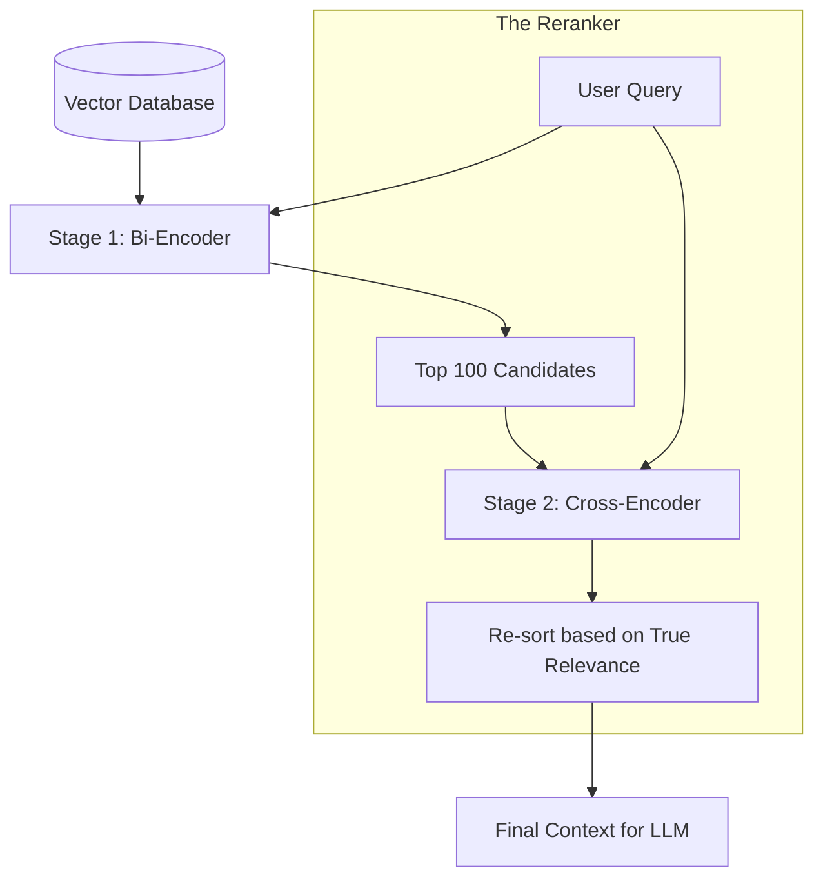

# 🎯 Cross-Encoder Reranking: The Truth-Checker
> **Level:** Advanced | **Language:** Hinglish | **Goal:** Master the second stage of high-precision retrieval, exploring why Bi-Encoders are fast but "Blind," and how Cross-Encoders act as a "Final Judge" to ensure $99\%+$ RAG accuracy in 2026.

---

## 🧭 1. Beginner-Friendly Hinglish Explanation
Search process ko ek "Audition" ki tarah sochiye:

1. **The Audition (Bi-Encoder / Vector Search):** 
   - 10,000 log aate hain. Hum jaldi-jaldi unki "Height" aur "Weight" (Vectors) check karke 10 logo ko select kar lete hain. Ye bahut fast hai, par hum unki "Acting" nahi dekh rahe.
2. **The Final Test (Cross-Encoder / Reranker):** 
   - Ab hum un 10 logo ka "Personal Interview" lete hain. Hum Query aur Document ko ek saath bithakar (Cross) dhyan se padhte hain. Ye slow hai, par ye batata hai ki kaunsa document "Asliyat" mein query se match karta hai.

**Reranking** ka matlab hai pehle 100 fast results nikalna, aur phir unhe ek "Smart Model" (Cross-Encoder) se re-sort karna taki sabse sahi answer hamesha #1 position par ho. 

2026 mein, bina Reranker ke RAG system "Bematlab" (Average) mana jata hai.

---

## 🧠 2. Deep Technical Explanation
The difference lies in how the models "See" the data.

### 1. Bi-Encoders (The "Audition" Model):
- Examples: BERT, OpenAI Embeddings.
- Query and Document are encoded **separately**. 
- Interaction only happens via a simple Dot Product at the end.
- **Problem:** The model can't see the fine-grained relationship between a specific word in the query and a specific word in the document.

### 2. Cross-Encoders (The "Judge" Model):
- Examples: BGE-Reranker, Cohere Rerank.
- Query and Document are fed into the model **together** as a single pair: `[CLS] Query [SEP] Document`.
- The model uses full **Self-Attention** across both. It can see exactly how the query relates to the content.
- It outputs a single score between $0$ and $1$.

### 3. The Two-Stage Pipeline:
- **Stage 1 (Retrieval):** Use Bi-Encoder (Fast) to get Top-100 candidates from Millions.
- **Stage 2 (Reranking):** Use Cross-Encoder (Smart but Slow) to re-order those 100.

---

## 🏗️ 3. Bi-Encoder vs. Cross-Encoder
| Feature | Bi-Encoder (Vector Search) | Cross-Encoder (Reranker) |
| :--- | :--- | :--- |
| **Input** | Query / Doc separately | **Query + Doc together** |
| **Interaction** | Low (Dot Product) | **Extreme (Self-Attention)** |
| **Speed** | Ultra-Fast ($O(1)$ with index)| Slow ($O(N)$) |
| **Accuracy** | Good | **Superior** |
| **Max Scale** | **Billions** | **Max ~100-200 docs** |

---

## 📐 4. Mathematical Intuition
- **Self-Attention Complexity:** 
  A Cross-Encoder with sequence length $L$ has a complexity of $O(L^2)$. 
  If you try to compare a Query with 1 Million documents using a Cross-Encoder, the complexity would be $1,000,000 \times L^2$. This is impossible.
  By only reranking 100 docs, we make the cost manageable: $100 \times L^2$.

---

## 📊 5. The Reranking Workflow (Diagram)


---

## 💻 6. Production-Ready Examples (Using BGE-Reranker in Python)
```python
# 2026 Pro-Tip: Use Cross-Encoders to filter out 'Hallucination' context.

from sentence_transformers import CrossEncoder

# 1. Load a powerful Reranker model
model = CrossEncoder('BAAI/bge-reranker-v2-m3', device='cuda')

query = "How to reset the database password?"
documents = [
    "To change your login details, go to settings...",
    "To reset the DB password, run 'ALTER USER' command.",
    "Our database uses high-end encryption for passwords."
]

# 2. Get scores for Query-Document pairs
# This model sees the query and doc TOGETHER
scores = model.predict([(query, doc) for doc in documents])

# 3. Sort documents by score
results = sorted(zip(documents, scores), key=lambda x: x[1], reverse=True)

for doc, score in results:
    print(f"Score: {score:.4f} | Content: {doc[:50]}...")
```

---

## ❌ 7. Failure Cases
- **Over-truncation:** If the Bi-Encoder (Stage 1) misses the "Right" document entirely, the Reranker (Stage 2) will never see it. The Reranker can only re-sort what it is given.
- **Latency Spikes:** Adding a Reranker adds $\sim 100-500ms$ to every query. If your app needs sub-100ms response, you can't use a heavy Cross-Encoder.
- **Context Window Exhaustion:** Trying to rerank documents that are too long (e.g., 5000 words each). Most rerankers have a limit of 512 tokens.

---

## 🛠️ 8. Debugging Guide
- **Symptom:** "Top result is still wrong."
- **Check:** **Top-K**. Maybe the correct doc is at position #150, but you only reranked the top 100. Increase the retrieval limit.
- **Symptom:** "GPU Memory Error."
- **Check:** **Batch size**. Reranking 100 documents one-by-one is slow. Reranking them in a batch of 32 is faster but uses more VRAM.

---

## ⚖️ 9. Tradeoffs
- **Model Size:** 
  - Small Rerankers (e.g., BGE-Small) are fast but less accurate. 
  - Large Rerankers (e.g., based on Llama-3) are extremely smart but very expensive.
- **API vs. Self-hosted:** 
  - Cohere Rerank API is easy. 
  - Self-hosting BGE gives you data privacy and zero per-request cost.

---

## 🛡️ 10. Security Concerns
- **Prompt Injection in Context:** An attacker can put "Instruction tags" in a document. The Reranker might see these and give the document a high score because it "looks" like a direct answer, even if it's malicious.

---

## 📈 11. Scaling Challenges
- **Throughput:** A single GPU can only rerank $\sim 10-20$ queries per second (assuming 100 docs each). For millions of users, you need a massive cluster of Reranking nodes.

---

## 💸 12. Cost Considerations
- **Compute Inflation:** Adding a Reranker usually doubles the compute cost of your retrieval pipeline. Only use it for tasks where "Accuracy is Life" (Medical, Legal, Finance).

---

## ✅ 13. Best Practices
- **Thresholding:** If the top Reranker score is less than $0.1$, don't send it to the LLM. It's better to say "I don't know" than to give wrong context.
- **Multi-stage Reranking:** Use a fast, small Reranker for the top 100, then a giant LLM-based Reranker for the top 5.
- **Train on your own data:** If you have "Click data" (users clicking on search results), use it to fine-tune your Reranker.

---

## ⚠️ 14. Common Mistakes
- **Reranking too many docs:** Trying to rerank 1000 docs. It's a waste of time. Focus on the top 50-100.
- **Ignoring the Score Scale:** Each Reranker model has a different score range. Some are $0-1$, some are raw logits. Don't compare scores from different models.

---

## 📝 15. Interview Questions
1. **"Why can't we use a Cross-Encoder for the initial search across 1 Billion documents?"**
2. **"What is the 'Attention' difference between a Bi-Encoder and a Cross-Encoder?"**
3. **"How does a Reranker help in reducing LLM hallucinations?"**

---

## 🚀 15. Latest 2026 Industry Patterns
- **LLM-as-a-Reranker:** Using models like Llama-3-8B with a specific "Pointwise" prompt to rerank documents. It's slower but matches human judgment $95\%+$.
- **ColBERTv2:** A "Late Interaction" model that gives Cross-Encoder accuracy with Bi-Encoder speed by storing multiple vectors per token.
- **Learnable Rerankers:** Systems that automatically improve their reranking logic based on "Human Feedback" (RLHF) in real-time.
