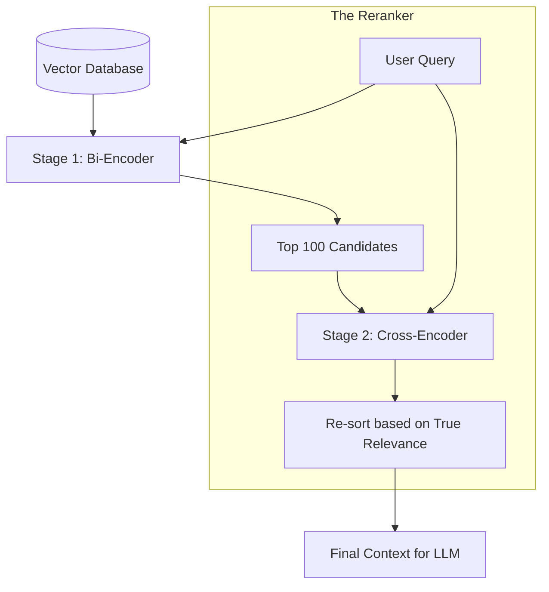

# 🎯 Cross-Encoder Reranking: The Truth-Checker
> **Level:** Advanced | **Language:** Hinglish | **Goal:** High-precision retrieval ke second stage ko master karein, explore karein ki kyu Bi-encoders tez par "Blind" hote hain, aur kaise Cross-encoders "Final Judge" ki tarah kaam karke 2026 mein $99\%+$ RAG accuracy ensure karte hain.

---

## 🧭 1. Beginner-Friendly Hinglish Explanation
Search process ko ek "Audition" ki tarah sochiye:

1. **The Audition (Bi-Encoder / Vector Search):** 
   - 10,000 log aate hain. Hum jaldi-jaldi unki "Height" aur "Weight" (Vectors) check karke 10 logo ko select kar lete hain. Ye bahut fast hai, par hum unki "Acting" nahi dekh rahe.
2. **The Final Test (Cross-Encoder / Reranker):** 
   - Now we take their "Personal Interview." We make the Query and the Document sit together (Cross) and read them carefully. This is slow, but it tells us which document actually matches the query in reality.

**Reranking** ka matlab hai pehle 100 fast results nikalna, aur phir unhe ek "Smart Model" (Cross-Encoder) se re-sort karna taki sabse sahi answer hamesha #1 position par ho. 

2026 mein, bina Reranker ke RAG system "Bematlab" (Average) mana jata hai.

---

## 🧠 2. Deep Technical Explanation
Main difference is baat mein hai ki models data ko kaise "See" (samajhte/dekhte) karte hain.

### 1. Bi-Encoders (The "Audition" Model):
- Examples: BERT, OpenAI Embeddings.
- Query aur Document ko **separately** (alag-alag) encode kiya jata hai.
- Dono ke beech ka interaction sirf end mein ek simple Dot Product ke throw hota hai.
- **Problem:** Model query ke kisi specific word aur document ke kisi specific word ke beech ke fine-grained relationship ko nahi dekh pata.

### 2. Cross-Encoders (The "Judge" Model):
- Examples: BGE-Reranker, Cohere Rerank.
- Query aur Document ko ek saath model mein ek single pair ke roop mein feed kiya jata hai: `[CLS] Query [SEP] Document`.
- Model dono ke beech full **Self-Attention** ka use karta hai. Ye dekh sakta hai ki query document ke content se exact kaise relate karti hai.
- Ye $0$ aur $1$ ke beech ek single score output karta hai.

### 3. The Two-Stage Pipeline:
- **Stage 1 (Retrieval):** Millions documents mein se Top-100 candidates nikalne ke liye Bi-Encoder (Fast) ka use karein.
- **Stage 2 (Reranking):** Un 100 candidates ko re-order (re-sort) karne ke liye Cross-Encoder (Smart but Slow) ka use karein.

---

## 🏗️ 3. Bi-Encoder vs. Cross-Encoder
| Feature | Bi-Encoder (Vector Search) | Cross-Encoder (Reranker) |
| :--- | :--- | :--- |
| **Input** | Query / Doc alag-alag | **Query + Doc ek saath** |
| **Interaction** | Low (Dot Product) | **Extreme (Self-Attention)** |
| **Speed** | Ultra-Fast ($O(1)$ index ke saath)| Slow ($O(N)$) |
| **Accuracy** | Good | **Superior** |
| **Max Scale** | **Billions** | **Max ~100-200 docs** |

---

## 📐 4. Mathematical Intuition
- **Self-Attention Complexity:**
  Sequence length $L$ wale Cross-Encoder ki complexity $O(L^2)$ hoti hai.
  Agar aap Cross-Encoder ka use karke ek Query ko 1 Million documents ke saath compare karne ki koshish karenge, to complexity $1,000,000 \times L^2$ ho jayegi, jo ki impossible hai.
  Sirf 100 docs ko rerank karke, hum is cost ko manageable bana dete hain: $100 \times L^2$.

---

## 📊 5. The Reranking Workflow (Diagram)

```mermaid
graph TD
    User[User Query] --> Bi[Stage 1: Bi-Encoder]
    DB[(Vector Database)] --> Bi
    Bi --> Candidates[Top 100 Candidates]
    
    subgraph "The Reranker"
    Candidates --> Cross[Stage 2: Cross-Encoder]
    User --> Cross
    Cross --> Sort[Re-sort based on True Relevance]
    end
    
    Sort --> LLM[Final Context for LLM]
```

---

## 💻 6. Production-Ready Examples (Using BGE-Reranker in Python)
```python
# 2026 Pro-Tip: 'Hallucination' context ko filter karne ke liye Cross-Encoders ka use karein.

from sentence_transformers import CrossEncoder

# 1. Ek powerful Reranker model ko load karein
model = CrossEncoder('BAAI/bge-reranker-v2-m3', device='cuda')

query = "How to reset the database password?"
documents = [
    "To change your login details, go to settings...",
    "To reset the DB password, run 'ALTER USER' command.",
    "Our database uses high-end encryption for passwords."
]

# 2. Query-Document pairs ke liye scores get karein
# Ye model query aur doc ko EK SAATH (together) dekhta hai
scores = model.predict([(query, doc) for doc in documents])

# 3. Documents ko score ke basis par sort karein
results = sorted(zip(documents, scores), key=lambda x: x[1], reverse=True)

for doc, score in results:
    print(f"Score: {score:.4f} | Content: {doc[:50]}...")
```

---

## ❌ 7. Failure Cases
- **Over-truncation:** Agar Bi-Encoder (Stage 1) "Sahi" document ko poori tarah se miss kar deta hai, to Reranker (Stage 2) use kabhi nahi dekh payega. Reranker sirf unhi cheezon ko re-sort kar sakta hai jo use di jati hain.
- **Latency Spikes:** Reranker add karne se har query mein $\sim 100-500ms$ ka extra time add ho jata hai. Agar aapke app ko sub-100ms response time chahiye, to aap heavy Cross-Encoder use nahi kar sakte.
- **Context Window Exhaustion:** Aise documents ko rerank karne ki koshish karna jo bahut zyada lambe hon (e.g., 5000 words each). Zyada tar rerankers ki limit 512 tokens ki hoti hai.

---

## 🛠️ 8. Debugging Guide
- **Symptom:** "Top result abhi bhi wrong hai."
- **Check:** **Top-K**. Maybe the correct doc is at position #150, but you only reranked the top 100. Increase the retrieval limit.
- **Symptom:** "GPU Memory Error."
- **Check:** **Batch size**. 100 documents ko ek-ek karke rerank karna slow hota hai. Unhe 32 ke batch mein rerank karna faster hota hai lekin isse VRAM zyada use hoga.

---

## ⚖️ 9. Tradeoffs
- **Model Size:**
  - Chhote Rerankers (e.g., BGE-Small) fast hote hain lekin kam accurate hote hain.
  - Bade Rerankers (e.g., Llama-3 par based) extremely smart hote hain lekin kafi expensive hote hain.
- **API vs. Self-hosted:**
  - Cohere Rerank API use karna easy hai.
  - BGE ko self-host karne se aapko data privacy aur zero per-request cost milti hai.

---

## 🛡️ 10. Security Concerns
- **Prompt Injection in Context:** Koi attacker kisi document mein "Instruction tags" daal sakta hai. Reranker in tags ko dekh kar document ko high score de sakta hai kyunki wo ek direct answer ki tarah "looks" (dikhta) hai, chahe wo malicious hi kyu na ho.

---

## 📈 11. Scaling Challenges
- **Throughput:** Ek single GPU har second sirf $\sim 10-20$ queries ko hi rerank kar sakta hai (agar har query mein 100 docs hon). Millions of users ke liye, aapko Reranking nodes ka ek massive cluster chahiye hoga.

---

## 💸 12. Cost Considerations
- **Compute Inflation:** Reranker add karne se aamtaur par aapke retrieval pipeline ki compute cost double ho jati hai. Ise sirf unhi tasks ke liye use karein jahan "Accuracy hi Life (sab kuch) hai" (jaise Medical, Legal, Finance).

---

## ✅ 13. Best Practices
- **Thresholding:** Agar top Reranker score $0.1$ se kam hai, to use LLM ko na bhejen. Galat context dene se behtar hai ki aap "I don't know" keh dein.
- **Multi-stage Reranking:** Top 100 ke liye ek fast aur small Reranker ka use karein, phir top 5 ke liye ek giant LLM-based Reranker use karein.
- **Apne data par train karein:** Agar aapke paas "Click data" (users click behavior search results par) hai, to iska use apne Reranker ko fine-tune karne ke liye karein.

---

## ⚠️ 14. Common Mistakes
- **Bahut zyada docs ko rerank karna:** 1000 docs ko rerank karne ki koshish karna. Ye time ki waste hai. Sirf top 50-100 par focus karein.
- **Score Scale ko ignore karna:** Har ek Reranker model ka score range different hota hai. Kuch $0-1$ hote hain, to kuch raw logits hote hain. Different models ke scores ko aapas mein compare na karein.

---

## 📝 15. Interview Questions
1. **"Hum 1 Billion documents ke initial search ke liye directly Cross-Encoder ka use kyu nahi kar sakte?"**
2. **"Bi-Encoder aur Cross-Encoder ke beech kya 'Attention' difference hai?"**
3. **"LLM hallucinations ko reduce karne mein ek Reranker kaise help karta hai?"**

---

## 🚀 15. Latest 2026 Industry Patterns
- **LLM-as-a-Reranker:** Documents ko rerank karne ke liye ek specific "Pointwise" prompt ke saath Llama-3-8B jaise models ka use karna. Ye slow hai lekin human judgment se $95\%+$ match karta hai.
- **ColBERTv2:** Ek "Late Interaction" model jo har token ke liye multiple vectors store karke Bi-Encoder ki speed ke saath Cross-Encoder jaisi accuracy deta hai.
- **Learnable Rerankers:** Aise systems jo real-time mein "Human Feedback" (RLHF) ke basis par apni reranking logic ko automatically improve karte hain.

