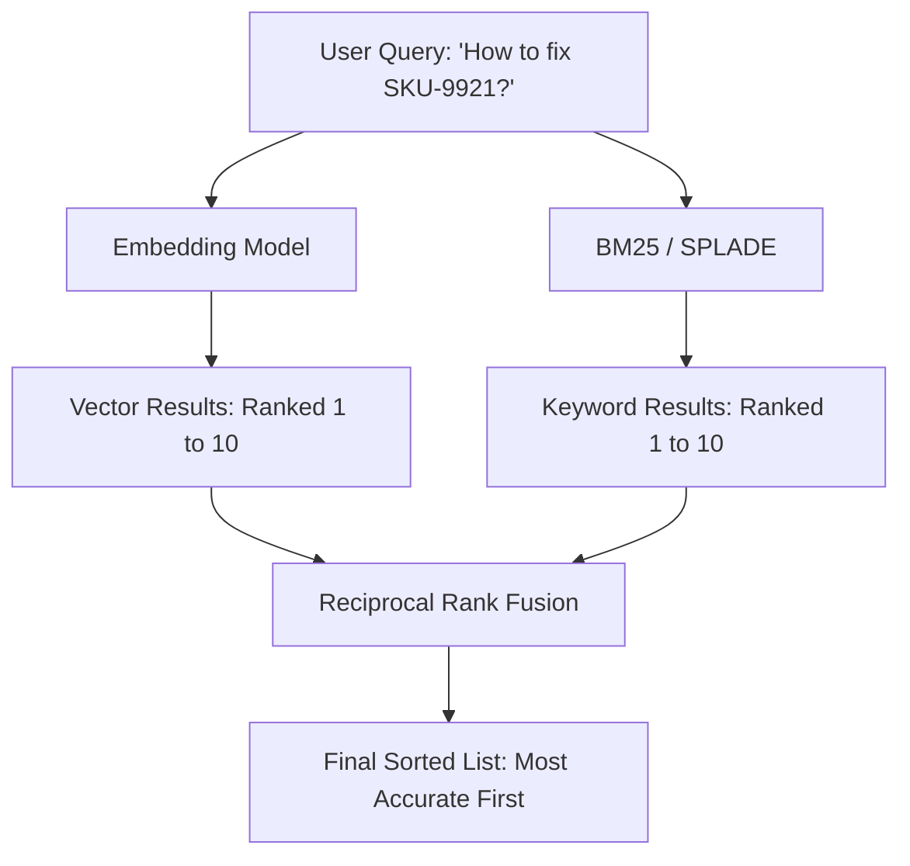

# 🧬 Hybrid Search: The Best of Both Worlds
> **Level:** Advanced | **Language:** Hinglish | **Goal:** Master the combination of Semantic (Vector) and Keyword (BM25) search, exploring Reciprocal Rank Fusion (RRF), Sparse-Dense vectors, and the 2026 strategies for building "Ultra-Accurate" retrieval systems.

---

## 🧭 1. Beginner-Friendly Hinglish Explanation
Search ke do tareeke hote hain:

1. **Keyword Search (BM25):** 
   - Ye bilkul "Control + F" ki tarah hai. Agar aapne "Dog" search kiya, toh ye un documents ko dhoondhega jahan "Dog" word likha hai. 
   - **Problem:** Agar document mein "Puppy" likha hai, toh ye use miss kar dega.
2. **Semantic Search (Vector):** 
   - Ye "Meaning" dhoondhta hai. "Dog" search karne par ye "Puppy" ya "Labrador" bhi nikal dega.
   - **Problem:** Agar aapne koi ajeeb "Product ID" (jaise `SKU-9921`) search kiya, toh AI confuse ho jayega kyunki uska koi "Meaning" nahi hai.

**Hybrid Search** dono ko mila deta hai. 
- Ye meaning bhi dekhta hai aur exact words bhi. 
- 2026 mein, koi bhi professional RAG system sirf vector search use nahi karta, wo **Hybrid** use karta hai taki koi bhi important info miss na ho.

---

## 🧠 2. Deep Technical Explanation
Hybrid Search combines **Dense Retrieval** and **Sparse Retrieval.**

### 1. Dense Vectors (Semantic):
- Generated by LLMs/Embedding models (e.g., OpenAI `text-embedding-3-small`).
- Captures context and synonyms.
- High memory usage, sensitive to "Domain Shift."

### 2. Sparse Vectors (Keyword):
- Generated by algorithms like **BM25** or learned sparse models like **SPLADE.**
- Captures exact terms, technical jargon, and IDs.
- Very efficient, great for "Out-of-vocabulary" terms.

### 3. Reciprocal Rank Fusion (RRF):
- The industry standard algorithm to combine two different lists of results. 
- It doesn't look at the "Score" (which might be in different scales), it only looks at the **Rank** (Position).
- $$RRFScore(d) = \sum_{r \in R} \frac{1}{k + r(d)}$$ where $k$ is a smoothing constant (usually 60).

---

## 🏗️ 3. Dense vs. Sparse vs. Hybrid
| Feature | Dense (Vector) | Sparse (BM25) | Hybrid |
| :--- | :--- | :--- | :--- |
| **Concept Matching** | **Excellent** | Poor | **Excellent** |
| **Exact Matching** | Poor | **Excellent** | **Excellent** |
| **Technical Terms** | Moderate | **Excellent** | **Best** |
| **Cold Start Data** | Good | **Excellent** | **Best** |
| **Architecture** | Complex (LLM) | Simple (Math) | Advanced |

---

## 📐 4. Mathematical Intuition
- **The "Rank" vs "Score" Problem:** 
  Dense scores are usually $0.7$ to $0.9$. Sparse scores can be $10.0$ to $100.0$. You cannot just add them. 
  **RRF** solves this by treating a 1st place rank in Vector as equal to a 1st place rank in BM25, regardless of the raw score.

---

## 📊 5. Hybrid Search Pipeline (Diagram)


---

## 💻 6. Production-Ready Examples (Conceptual Hybrid Implementation)
```python
# 2026 Pro-Tip: Use RRF to combine results from multiple search engines.

def rrf_score(results_list, k=60):
    """
    results_list: A list of lists, where each inner list contains document IDs.
    """
    scores = {}
    for results in results_list:
        for rank, doc_id in enumerate(results):
            # Rank is 0-indexed, so we add 1
            score = 1.0 / (k + (rank + 1))
            scores[doc_id] = scores.get(doc_id, 0) + score
            
    # Sort by score descending
    sorted_docs = sorted(scores.items(), key=lambda x: x[1], reverse=True)
    return sorted_docs

# Example:
vector_results = ["docA", "docB", "docC"]
keyword_results = ["docC", "docA", "docE"]

final_results = rrf_score([vector_results, keyword_results])
print("Final Ranked Documents:", final_results)
```

---

## ❌ 7. Failure Cases
- **Metric Dilution:** If one of the search methods (e.g., BM25) is returning garbage, RRF might still give its results a high weight, polluting the final list.
- **High Latency:** Doing two searches instead of one. **Fix: Run them in parallel using `asyncio`.**
- **Over-reliance on Keywords:** If your documents have lots of "Spam keywords," the Sparse search will dominate the Hybrid results.

---

## 🛠️ 8. Debugging Guide
- **Symptom:** "Product IDs are not being found."
- **Check:** **Sparse Weights**. Are you using Hybrid search? If not, the vector model is likely "Smoothing over" the specific characters of the ID.
- **Symptom:** "Results are the same as pure Vector search."
- **Check:** **Normalization**. Ensure your BM25 implementation is properly tuned for the document lengths.

---

## ⚖️ 9. Tradeoffs
- **Complexity vs. Accuracy:** Hybrid search requires managing two indexes. Is the $10-15\%$ accuracy boost worth the extra server cost? Usually, YES for production.
- **Alpha Parameter:** Some systems (like Weaviate) use an `alpha` parameter instead of RRF. 
  - `alpha = 1`: Pure Vector. 
  - `alpha = 0`: Pure Keyword.

---

## 🛡️ 10. Security Concerns
- **Keyword Stuffing:** Attackers can inject specific "Invisible keywords" into documents to make them rank #1 in a Hybrid search, bypassing semantic filters.

---

## 📈 11. Scaling Challenges
- **Two-Phase Commit:** When a document is deleted, you must ensure it is removed from BOTH the Vector index and the Keyword index simultaneously.

---

## 💸 12. Cost Considerations
- **Storage:** You need to store the raw text twice (once in the Vector DB and once in a Search Engine like Elasticsearch).

---

## ✅ 13. Best Practices
- **Use Cross-Encoders for Reranking:** After Hybrid search gives you the top 20 results, use a **Cross-Encoder** to pick the absolute best one (See next module).
- **Tune 'k' in RRF:** The default 60 is good, but if you have very short lists, $k=20$ might be better.
- **Use SPLADE:** In 2026, SPLADE (Sparse Lexical and Expansion) is replacing BM25 as it is "Learnable" and better at synonyms.

---

## ⚠️ 14. Common Mistakes
- **Linear Combination:** Just adding the scores: `(0.8 + 55.0)`. This is a mathematical sin because the scales are different. **Always use RRF or Normalized scores.**
- **Ignoring Stopwords:** Not removing "the", "is", "a" from the Sparse search, which creates lots of noise.

---

## 📝 15. Interview Questions
1. **"What is Reciprocal Rank Fusion (RRF) and why is it preferred over linear scoring?"**
2. **"Why is Vector search bad at finding specific serial numbers or SKU codes?"**
3. **"Explain how Hybrid Search helps with the 'Domain Shift' problem."**

---

## 🚀 15. Latest 2026 Industry Patterns
- **ColBERT-style Retrieval:** Using multi-vector representations that capture both global meaning and specific word-level detail without needing two separate indexes.
- **Auto-Hybrid:** AI systems that automatically decide whether to use Vector, Keyword, or both based on the "Intent" of the user's query.
- **Vector-Native Keyword Search:** New databases like **Pinecone** and **Qdrant** that implement keyword search *inside* the vector engine using the same hardware.
