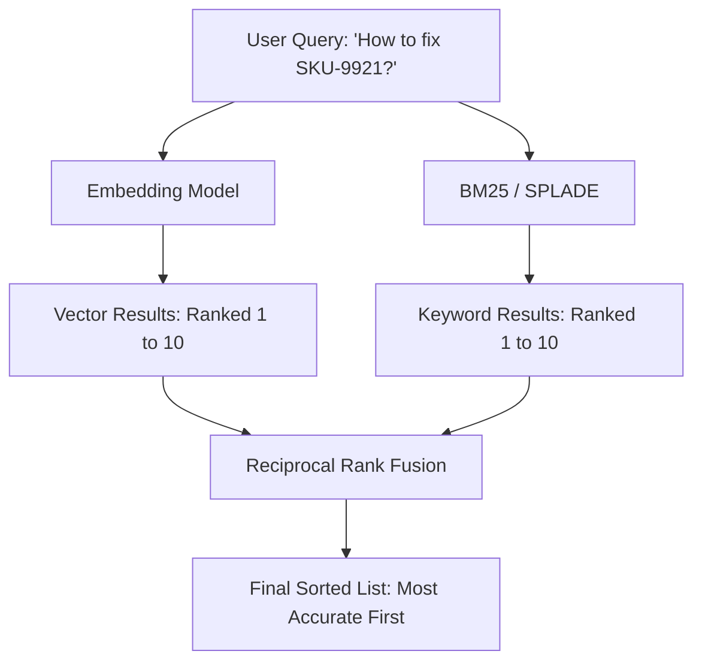

# 🧬 Hybrid Search: The Best of Both Worlds
> **Level:** Advanced | **Language:** Hinglish | **Goal:** Semantic (Vector) aur Keyword (BM25) search ke combination ko master karein, Reciprocal Rank Fusion (RRF), Sparse-Dense vectors, aur 2026 mein "Ultra-Accurate" retrieval systems build karne ki strategies ko explore karte hue.

---

## 🧭 1. Beginner-Friendly Hinglish Explanation
Search ke do tareeke hote hain:

1. **Keyword Search (BM25):** 
   - Ye bilkul "Control + F" ki tarah hai. Agar aapne "Dog" search kiya, toh ye un documents ko dhoondhega jahan "Dog" word likha hai. 
   - **Problem:** Agar document mein "Puppy" likha hai, toh ye use miss kar dega.
2. **Semantic Search (Vector):** 
   - Ye "Meaning" dhoondhta hai. "Dog" search karne par ye "Puppy" ya "Labrador" bhi nikal dega.
   - **Problem:** Agar aapne koi ajeeb "Product ID" (jaise `SKU-9921`) search kiya, toh AI confuse ho jayega kyunki uska koi "Meaning" nahi hai.

**Hybrid Search** dono ko mila deta hai. 
- Ye meaning bhi dekhta hai aur exact words bhi. 
- 2026 mein, koi bhi professional RAG system sirf vector search use nahi karta, wo **Hybrid** use karta hai taki koi bhi important info miss na ho.

---

## 🧠 2. Deep Technical Explanation
Hybrid Search **Dense Retrieval** aur **Sparse Retrieval** ko combine karta hai.

### 1. Dense Vectors (Semantic):
- Inhe LLMs/Embedding models (jaise OpenAI `text-embedding-3-small`) generate karte hain.
- Ye context aur synonyms ko capture karte hain.
- High memory usage hota hai, aur ye "Domain Shift" ke liye sensitive hote hain.

### 2. Sparse Vectors (Keyword):
- Inhe **BM25** jaise algorithms ya **SPLADE** jaise learned sparse models generate karte hain.
- Ye exact terms, technical jargon aur IDs ko capture karte hain.
- Bahut efficient hote hain, aur "Out-of-vocabulary" terms ke liye bahut acche hote hain.

### 3. Reciprocal Rank Fusion (RRF):
- Do alag-alag results ki lists ko combine karne ke liye ye ek industry-standard algorithm hai.
- Ye "Score" (jo alag-alag scales mein ho sakta hai) ko nahi dekhta, ye sirf **Rank** (Position) ko dekhta hai.
- $$RRFScore(d) = \sum_{r \in R} \frac{1}{k + r(d)}$$ jahan $k$ ek smoothing constant hai (aamtaur par 60).

---

## 🏗️ 3. Dense vs. Sparse vs. Hybrid
| Feature | Dense (Vector) | Sparse (BM25) | Hybrid |
| :--- | :--- | :--- | :--- |
| **Concept Matching** | **Excellent** | Poor | **Excellent** |
| **Exact Matching** | Poor | **Excellent** | **Excellent** |
| **Technical Terms** | Moderate | **Excellent** | **Best** |
| **Cold Start Data** | Good | **Excellent** | **Best** |
| **Architecture** | Complex (LLM) | Simple (Math) | Advanced |

---

## 📐 4. Mathematical Intuition
- **The "Rank" vs "Score" Problem:** 
  Dense scores aamtaur par $0.7$ se $0.9$ hote hain. Sparse scores $10.0$ se $100.0$ ho sakte hain. Aap inhe direct add nahi kar sakte. 
  **RRF** is problem ko solve karta hai vector mein 1st rank ko BM25 ke 1st rank ke equal treat karke, bina raw score ki parwah kiye.

---

## 📊 5. Hybrid Search Pipeline (Diagram)

```mermaid
graph TD
    Query[User Query: 'How to fix SKU-9921?'] --> Dense[Embedding Model]
    Query --> Sparse[BM25 / SPLADE]
    
    Dense --> List1[Vector Results: Ranked 1 to 10]
    Sparse --> List2[Keyword Results: Ranked 1 to 10]
    
    List1 --> RRF[Reciprocal Rank Fusion]
    List2 --> RRF
    
    RRF --> Final[Final Sorted List: Most Accurate First]
```

---

## 💻 6. Production-Ready Examples (Conceptual Hybrid Implementation)
```python
# 2026 Pro-Tip: Use RRF to combine results from multiple search engines.

def rrf_score(results_list, k=60):
    """
    results_list: A list of lists, where each inner list contains document IDs.
    """
    scores = {}
    for results in results_list:
        for rank, doc_id in enumerate(results):
            # Rank is 0-indexed, so we add 1
            score = 1.0 / (k + (rank + 1))
            scores[doc_id] = scores.get(doc_id, 0) + score
            
    # Sort by score descending
    sorted_docs = sorted(scores.items(), key=lambda x: x[1], reverse=True)
    return sorted_docs

# Example:
vector_results = ["docA", "docB", "docC"]
keyword_results = ["docC", "docA", "docE"]

final_results = rrf_score([vector_results, keyword_results])
print("Final Ranked Documents:", final_results)
```

---

## ❌ 7. Failure Cases
- **Metric Dilution:** Agar koi ek search method (jaise BM25) kachra (garbage) return kar raha hai, toh bhi RRF uske results ko high weight de sakta hai, jisse final list kharab ho sakti hai.
- **High Latency:** Ek ki jagah do search karna. **Fix: Inhe `asyncio` ka use karke parallel mein run karein.**
- **Over-reliance on Keywords:** Agar aapke documents mein bahut saare "Spam keywords" hain, toh Sparse search Hybrid results par dominate karegi.

---

## 🛠️ 8. Debugging Guide
- **Symptom:** "Product IDs nahi mil rahe hain."
- **Check:** **Sparse Weights**. Kya aap Hybrid search use kar rahe hain? Agar nahi, toh vector model shayad ID ke specific characters ko "smooth over" (ignore) kar raha hai.
- **Symptom:** "Results bilkul pure Vector search jaise hain."
- **Check:** **Normalization**. Ensure karein ki aapka BM25 implementation document lengths ke liye properly tuned hai.

---

## ⚖️ 9. Tradeoffs
- **Complexity vs. Accuracy:** Hybrid search ke liye do indexes ko manage karna padta hai. Kya $10-15\%$ accuracy boost extra server cost ke layak hai? Production ke liye, aamtaur par YES.
- **Alpha Parameter:** Kuch systems (jaise Weaviate) RRF ki jagah `alpha` parameter ka use karte hain. 
  - `alpha = 1`: Pure Vector. 
  - `alpha = 0`: Pure Keyword.

---

## 🛡️ 10. Security Concerns
- **Keyword Stuffing:** Attackers documents mein specific "Invisible keywords" inject kar sakte hain taaki wo Hybrid search mein #1 par rank karein, semantic filters ko bypass karte hue.

---

## 📈 11. Scaling Challenges
- **Two-Phase Commit:** Jab koi document delete hota hai, toh aapko ensure karna hoga ki wo Vector index aur Keyword index DONO se ek sath remove ho.

---

## 💸 12. Cost Considerations
- **Storage:** Aapko raw text ko do baar store karna padega (ek baar Vector DB mein aur ek baar Elasticsearch jaise Search Engine mein).

---

## ✅ 13. Best Practices
- **Use Cross-Encoders for Reranking:** Jab Hybrid search aapko top 20 results de de, toh absolute best ko select karne ke liye **Cross-Encoder** ka use karein (See next module).
- **Tune 'k' in RRF:** Default 60 achha hai, par agar aapke paas bahut short lists hain, toh $k=20$ better ho sakta hai.
- **Use SPLADE:** 2026 mein, SPLADE (Sparse Lexical and Expansion) BM25 ko replace kar raha hai kyunki ye "Learnable" hai aur synonyms ko behtar handle karta hai.

---

## ⚠️ 14. Common Mistakes
- **Linear Combination:** Direct scores ko add kar dena: `(0.8 + 55.0)`. Ye ek mathematical sin hai kyunki dono ke scales alag hain. **Hamesha RRF ya Normalized scores ka use karein.**
- **Ignoring Stopwords:** Sparse search se "the", "is", "a" ko remove na karna, jisse bahut saara noise create hota hai.

---

## 📝 15. Interview Questions
1. **"Reciprocal Rank Fusion (RRF) kya hai aur ise linear scoring ke upar kyu prefer kiya jata hai?"**
2. **"Vector search specific serial numbers ya SKU codes ko find karne mein kyu kharab hai?"**
3. **"Explain karein ki Hybrid Search kaise 'Domain Shift' problem mein help karta hai."**

---

## 🚀 15. Latest 2026 Industry Patterns
- **ColBERT-style Retrieval:** Multi-vector representations ka use karna jo global meaning aur specific word-level detail dono ko capture karte hain bina do alag indexes ki need ke.
- **Auto-Hybrid:** AI systems jo user ki query ke "Intent" ke basis par automatically decide karte hain ki kab Vector, Keyword, ya dono use karne hain.
- **Vector-Native Keyword Search:** Naye databases jaise **Pinecone** aur **Qdrant** jo keyword search ko *inside* the vector engine implement karte hain, same hardware ka use karke.
