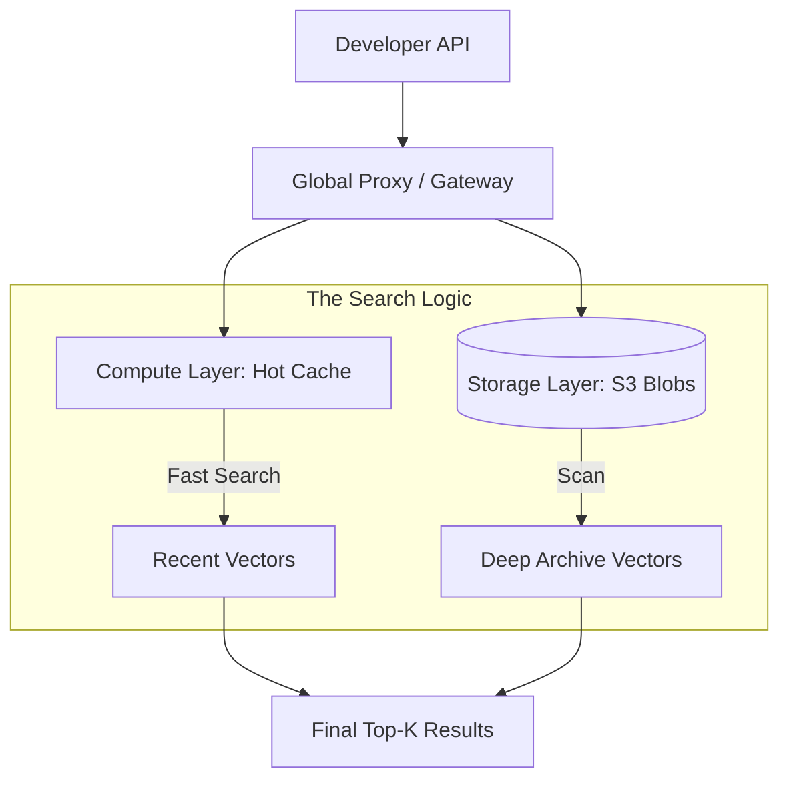

# 🌲 Pinecone: Enterprise-Scale Vector Search
> **Level:** Intermediate | **Language:** Hinglish | **Goal:** Master the world's leading managed vector database, exploring Serverless architectures, Namespace management, and the 2026 patterns for scaling RAG to billions of records.

---

## 🧭 1. Beginner-Friendly Hinglish Explanation
Agar aapki company ke paas itna data hai ki wo ek computer mein nahi aa sakta (Petabytes of data), toh aap ChromaDB ya FAISS use nahi kar sakte. Aapko ek "Cloud Database" chahiye jo apne aap bada ho sake (Auto-scaling).

**Pinecone** "Vector Databases ka AWS" hai. 
- Isme aapko koi server install nahi karna padta. 
- Bas ek API key lo aur vectors "Upload" kar do. 
- Pinecone unhe hazaron servers par distribute kar deta hai aur seconds mein search karke deta hai.

Sochiye aap ek "Global Knowledge Base" bana rahe hain jahan duniya bhar ki legal kitabein hain. Pinecone ensure karega ki chahe 100 users hon ya 1 Million, search hamesha fast rahe.

---

## 🧠 2. Deep Technical Explanation
Pinecone is a managed, cloud-native vector database optimized for high-performance retrieval.

### 1. Pinecone Serverless (The 2026 Shift):
- Unlike the old "Pod-based" model (where you pay for a server 24/7), **Pinecone Serverless** decouples storage from compute.
- You only pay for what you use. 
- It uses **S3** for long-term storage and **Hot Cache** for fast queries.

### 2. Index Types:
- **Serverless Index:** Auto-scaling, cost-effective for most RAG apps.
- **Pod-based Index (s1, p1, p2):** Better for "Ultra-low latency" where you need consistent performance without "Cold starts."

### 3. Namespaces:
- A way to partition data within a single index. 
- **Use Case:** Every user gets their own namespace. User A can never see User B's vectors, even if they share the same index. This is $100\%$ secure and efficient.

### 4. Sparse-Dense Vectors (Hybrid):
- Pinecone supports "Sparse" vectors (BM25 style) alongside "Dense" vectors (Embeddings). This allows for **Hybrid Search** in a single call.

---

## 🏗️ 3. Pinecone vs. Qdrant vs. Weaviate
| Feature | Pinecone | Qdrant | Weaviate |
| :--- | :--- | :--- | :--- |
| **Model** | Managed Only | Open Source / Cloud | Open Source / Cloud |
| **Setup** | **Zero (API only)** | Moderate | High |
| **Scaling** | **Infinite (Auto)** | Manual / Clustering | Manual / Clustering |
| **Complexity** | **Very Low** | Moderate | High (GraphQL) |
| **Best For** | Fast Prototyping & Enterprise | Custom Infra / Privacy | Knowledge Graphs |

---

## 📐 4. Mathematical Intuition
- **The "Freshness" vs. "Recall" Tradeoff:** 
  When you upload a new vector, it takes a few seconds to become searchable. This is because Pinecone must update its "HNSW-like" graph in the background. 
  In Serverless, this metadata update is asynchronous to keep the "Write" operation fast.

---

## 📊 5. Pinecone Serverless Architecture (Diagram)


---

## 💻 6. Production-Ready Examples (Enterprise RAG with Pinecone)
```python
# 2026 Pro-Tip: Use Serverless indexes to save 80% on costs for RAG.

from pinecone import Pinecone, ServerlessSpec

# 1. Initialize
pc = Pinecone(api_key="YOUR_API_KEY")

# 2. Create Serverless Index
index_name = "global-legal-base"
if index_name not in pc.list_indexes().names():
    pc.create_index(
        name=index_name,
        dimension=1536, # OpenAI embedding size
        metric="cosine",
        spec=ServerlessSpec(cloud="aws", region="us-east-1")
    )

# 3. Upsert with Namespace (Isolation)
index = pc.Index(index_name)
index.upsert(
    vectors=[
        {"id": "doc1", "values": [0.1]*1536, "metadata": {"text": "Contract laws..."}}
    ],
    namespace="client-abc"
)

# 4. Query with filter
results = index.query(
    namespace="client-abc",
    vector=[0.1]*1536,
    top_k=5,
    include_metadata=True,
    filter={"category": {"$eq": "contracts"}}
)
```

---

## ❌ 7. Failure Cases
- **Metric Mismatch:** Creating an index with "Euclidean" metric but sending vectors intended for "Cosine." Results will be complete garbage.
- **API Rate Limiting:** Sending 100,000 vectors in 100,000 separate calls. **Fix: Use batch upserts (max 2MB per call).**
- **Region Mismatch:** Your AI server is in AWS-Mumbai, but Pinecone is in AWS-Virginia. The network "Latency" will make your RAG feel slow.

---

## 🛠️ 8. Debugging Guide
- **Symptom:** "Vectors are missing after upload."
- **Check:** **Namespace**. Are you querying the same namespace you uploaded to? (Default is empty string).
- **Symptom:** "Upsert is failing with 'Payload too large'."
- **Check:** **Metadata size**. Pinecone allows up to 40KB of metadata per vector. If you are trying to store a whole book in metadata, it will fail.

---

## ⚖️ 9. Tradeoffs
- **Serverless vs. Pods:** 
  - Serverless has a "Cold start" (slight delay) if not used for a long time. 
  - Pods are hamesha "Garam" (hot) and fast, but cost money even when idle.
- **Dimension size:** 1536 dims is more accurate but $2x$ slower and more expensive than 768 dims.

---

## 🛡️ 10. Security Concerns
- **API Key Leakage:** If your Pinecone key is leaked, anyone can delete your entire vector database. **Always use Environment Variables and rotate keys.**
- **Privacy Compliance:** Ensure your data region (e.g., EU-West-1) matches your GDPR requirements.

---

## 📈 11. Scaling Challenges
- **Billions of Vectors:** For extremely large indexes, Pinecone automatically "Shards" the data. You don't see it, but you pay for the increased "Compute" used to search across shards.

---

## 💸 12. Cost Considerations
- **Storage:** $\$0.33$ per GB per month.
- **Read/Write:** Paid per "Read Unit" (RU) and "Write Unit" (WU). 
- **Optimization:** Use **Metadata Filtering** to reduce the number of vectors Pinecone has to "Scan," which reduces the RU cost.

---

## ✅ 13. Best Practices
- **Use Batch Upserts:** Group vectors into batches of 100 or 200.
- **Normalize Vectors:** Even if using Cosine, normalizing vectors to length 1 can slightly speed up the math.
- **Monitor with Pinecone Console:** Use the usage graphs to find "Spikes" in costs.

---

## ⚠️ 14. Common Mistakes
- **Storing PII in Metadata:** Pinecone metadata is NOT encrypted at the field level. Don't store passwords or private names there.
- **Ignoring the 'Wait':** Assuming the data is searchable 1ms after upload. Give it $\sim 1-2$ seconds.

---

## 📝 15. Interview Questions
1. **"What is the advantage of Pinecone Serverless over Pod-based indexes?"**
2. **"How do you implement multi-tenancy in Pinecone?"** (Namespaces).
3. **"What happens if you query a Pinecone index with a vector of the wrong dimension?"** (API Error 400).

---

## 🚀 15. Latest 2026 Industry Patterns
- **Pinecone Inference API:** In 2026, Pinecone can also "Generate" embeddings for you, so you don't need OpenAI anymore. One single API for Embedding + Storage.
- **Streaming Indexing:** Direct integration with Kafka/Confluent for real-time vector updates from your logs.
- **Integrated Reranking:** Pinecone now has a "Rerank" step built into the query API, improving RAG accuracy by $20\%$ with one flag.
