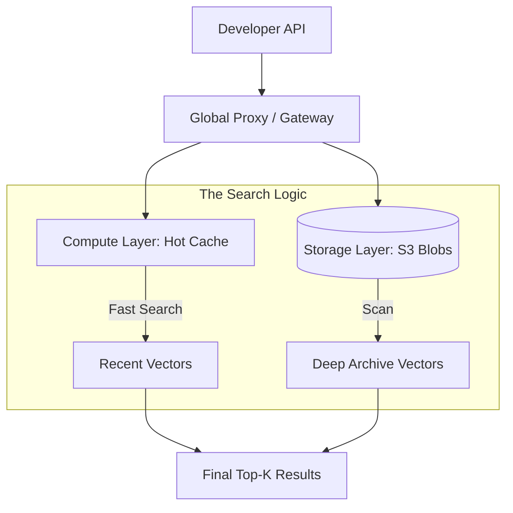

# 🌲 Pinecone: Enterprise-Scale Vector Search
> **Level:** Intermediate | **Language:** Hinglish | **Goal:** Duniya ke leading managed vector database ko master karein, Serverless architectures, Namespace management, aur 2026 mein billions of records tak RAG scale karne ke patterns ko explore karte hue.

---

## 🧭 1. Beginner-Friendly Hinglish Explanation
Agar aapki company ke paas itna data hai ki wo ek computer mein nahi aa sakta (Petabytes of data), toh aap ChromaDB ya FAISS use nahi kar sakte. Aapko ek "Cloud Database" chahiye jo apne aap bada ho sake (Auto-scaling).

**Pinecone** "Vector Databases ka AWS" hai. 
- Isme aapko koi server install nahi karna padta. 
- Bas ek API key lo aur vectors "Upload" kar do. 
- Pinecone unhe hazaron servers par distribute kar deta hai aur seconds mein search karke deta hai.

Sochiye aap ek "Global Knowledge Base" bana rahe hain jahan duniya bhar ki legal kitabein hain. Pinecone ensure karega ki chahe 100 users hon ya 1 Million, search hamesha fast rahe.

---

## 🧠 2. Deep Technical Explanation
Pinecone ek managed, cloud-native vector database hai jo high-performance retrieval ke liye optimized hai.

### 1. Pinecone Serverless (The 2026 Shift):
- Purane "Pod-based" model (jahan aapko 24/7 server ke liye pay karna padta tha) ke mukable, **Pinecone Serverless** storage ko compute se alag (decouple) karta hai.
- Aap sirf utna hi pay karte hain jitna aap use karte hain. 
- Ye long-term storage ke liye **S3** aur fast queries ke liye **Hot Cache** ka use karta hai.

### 2. Index Types:
- **Serverless Index:** Auto-scaling, aur zyadatar RAG apps ke liye cost-effective.
- **Pod-based Index (s1, p1, p2):** "Ultra-low latency" ke liye behtar hai jahan aapko bina kisi "Cold start" ke consistent performance chahiye hoti hai.

### 3. Namespaces:
- Ek single index ke andar data ko partition karne ka tareeka. 
- **Use Case:** Har user ko apna namespace milta hai. User A kabhi bhi User B ke vectors nahi dekh sakta, chahe wo same index share kar rahe hon. Ye $100\%$ secure aur efficient hai.

### 4. Sparse-Dense Vectors (Hybrid):
- Pinecone "Dense" vectors (Embeddings) ke sath-sath "Sparse" vectors (BM25 style) ko bhi support karta hai. Isse ek hi call mein **Hybrid Search** possible ho jati hai.

---

## 🏗️ 3. Pinecone vs. Qdrant vs. Weaviate
| Feature | Pinecone | Qdrant | Weaviate |
| :--- | :--- | :--- | :--- |
| **Model** | Managed Only | Open Source / Cloud | Open Source / Cloud |
| **Setup** | **Zero (API only)** | Moderate | High |
| **Scaling** | **Infinite (Auto)** | Manual / Clustering | Manual / Clustering |
| **Complexity** | **Very Low** | Moderate | High (GraphQL) |
| **Best For** | Fast Prototyping & Enterprise | Custom Infra / Privacy | Knowledge Graphs |

---

## 📐 4. Mathematical Intuition
- **The "Freshness" vs. "Recall" Tradeoff:** 
  Jab aap ek naya vector upload karte hain, toh use searchable banane mein kuch seconds lagte hain. Aisa isliye hai kyunki Pinecone ko background mein apne "HNSW-like" graph ko update karna hota hai. 
  Serverless mein, "Write" operation ko fast rakhne ke liye ye metadata update asynchronous hota hai.

---

## 📊 5. Pinecone Serverless Architecture (Diagram)

```mermaid
graph TD
    User[Developer API] --> Proxy[Global Proxy / Gateway]
    Proxy --> Cache[Compute Layer: Hot Cache]
    Proxy --> S3[(Storage Layer: S3 Blobs)]
    
    subgraph "The Search Logic"
    Cache -- "Fast Search" --> R1[Recent Vectors]
    S3 -- "Scan" --> R2[Deep Archive Vectors]
    end
    
    R1 & R2 --> Merge[Final Top-K Results]
```

---

## 💻 6. Production-Ready Examples (Enterprise RAG with Pinecone)
```python
# 2026 Pro-Tip: Use Serverless indexes to save 80% on costs for RAG.

from pinecone import Pinecone, ServerlessSpec

# 1. Initialize
pc = Pinecone(api_key="YOUR_API_KEY")

# 2. Create Serverless Index
index_name = "global-legal-base"
if index_name not in pc.list_indexes().names():
    pc.create_index(
        name=index_name,
        dimension=1536, # OpenAI embedding size
        metric="cosine",
        spec=ServerlessSpec(cloud="aws", region="us-east-1")
    )

# 3. Upsert with Namespace (Isolation)
index = pc.Index(index_name)
index.upsert(
    vectors=[
        {"id": "doc1", "values": [0.1]*1536, "metadata": {"text": "Contract laws..."}}
    ],
    namespace="client-abc"
)

# 4. Query with filter
results = index.query(
    namespace="client-abc",
    vector=[0.1]*1536,
    top_k=5,
    include_metadata=True,
    filter={"category": {"$eq": "contracts"}}
)
```

---

## ❌ 7. Failure Cases
- **Metric Mismatch:** "Euclidean" metric ke sath index banana par vectors "Cosine" ke liye design kiye gaye send karna. Isse results bilkul garbage aayenge.
- **API Rate Limiting:** Sending 100,000 vectors in 100,000 separate calls. **Fix: Use batch upserts (max 2MB per call).**
- **Region Mismatch:** Aapka AI server AWS-Mumbai mein hai, par Pinecone AWS-Virginia mein hai. Network "Latency" ki wajah se aapka RAG system slow feel hoga.

---

## 🛠️ 8. Debugging Guide
- **Symptom:** "Upload ke baad vectors missing hain."
- **Check:** **Namespace**. Kya aap usi namespace ko query kar rahe hain jisme aapne upload kiya tha? (Default empty string hota hai).
- **Symptom:** "Upsert fail ho raha hai 'Payload too large' ke sath."
- **Check:** **Metadata size**. Pinecone har vector ke liye 40KB tak ke metadata ki permission deta hai. Agar aap metadata mein puri book store karne ki koshish karenge, toh ye fail ho jayega.

---

## ⚖️ 9. Tradeoffs
- **Serverless vs. Pods:** 
  - Serverless mein agar lambe samay tak use na kiya jaye toh ek "Cold start" (thoda delay) ho sakta hai.
  - Pods hamesha "Garam" (hot) aur fast hote hain, par idle rehne par bhi cost charge karte hain.
- **Dimension size:** 1536 dims zyada accurate hote hain par 768 dims ke mukable $2x$ slow aur expensive hote hain.

---

## 🛡️ 10. Security Concerns
- **API Key Leakage:** Agar aapki Pinecone key leak ho jati hai, toh koi bhi aapka poora vector database delete kar sakta hai. **Hamesha Environment Variables ka use karein aur keys ko rotate karte rahein.**
- **Privacy Compliance:** Ensure karein ki aapka data region (jaise EU-West-1) aapki GDPR requirements ke sath match karta ho.

---

## 📈 11. Scaling Challenges
- **Billions of Vectors:** Extremely large indexes ke liye, Pinecone data ko automatically "Shard" kar deta hai. Ye aapko dikhta nahi hai, par shards ke across search karne ke liye use hone wale increased "Compute" ke liye aapko pay karna padta hai.

---

## 💸 12. Cost Considerations
- **Storage:** $\$0.33$ per GB per month.
- **Read/Write:** Paid per "Read Unit" (RU) aur "Write Unit" (WU).
- **Optimization:** Pinecone ko "Scan" karne ke liye vectors ki quantity ko kam karne ke liye **Metadata Filtering** ka use karein, jo RU cost ko reduce karta hai.

---

## ✅ 13. Best Practices
- **Use Batch Upserts:** Vectors ko 100 ya 200 ke batches mein group karke upload karein.
- **Normalize Vectors:** Agar Cosine use kar rahe hain, toh bhi vectors ko length 1 par normalize karne se math thoda fast ho sakta hai.
- **Monitor with Pinecone Console:** Costs mein "Spikes" ko detect karne ke liye usage graphs ka use karein.

---

## ⚠️ 14. Common Mistakes
- **Storing PII in Metadata:** Pinecone metadata field level par encrypted nahi hota. Wahan passwords ya private names store na karein.
- **Ignoring the 'Wait':** Maan lena ki data upload hone ke 1ms baad hi searchable ho jayega. Ise $\sim 1-2$ seconds ka samay dein.

---

## 📝 15. Interview Questions
1. **"Pod-based indexes ke upar Pinecone Serverless ka kya advantage hai?"**
2. **"Pinecone mein multi-tenancy kaise implement karte hain?"** (Namespaces).
3. **"Kya hoga agar aap wrong dimension ke vector ke sath Pinecone index ko query karenge?"** (API Error 400).

---

## 🚀 15. Latest 2026 Industry Patterns
- **Pinecone Inference API:** 2026 mein, Pinecone embeddings ko bhi "Generate" kar sakta hai, isliye ab aapko OpenAI ki need nahi hai. Embedding + Storage ke liye ek single API.
- **Streaming Indexing:** Aapke logs se real-time vector updates ke liye Kafka/Confluent ke sath direct integration.
- **Integrated Reranking:** Pinecone ke paas ab query API mein built-in "Rerank" step hai, jo ek single flag ke sath RAG accuracy ko $20\%$ badha deta hai.
