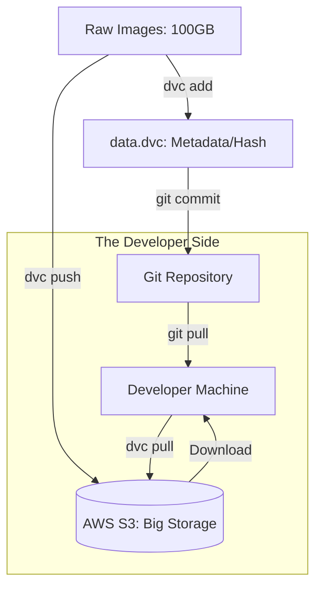

# 📊 Data Versioning: The Git for Large Datasets
> **Level:** Intermediate | **Language:** Hinglish | **Goal:** Master the art of tracking changes in your data, exploring DVC, LakeFS, and the 2026 patterns for ensuring "Data Reproducibility" in AI pipelines.

---

## 🧭 1. Beginner-Friendly Hinglish Explanation
Hum sab jaante hain ki Code ke liye **Git** hota hai. Agar code kharab ho jaye, toh hum `git checkout` karke purana code la sakte hain. Par data ka kya?

- **The Problem:** Maan lo aapka model train hua "Version 1" data par. Kal aapne dataset mein 10,000 nayi images add ki. Phir aapne realize kiya ki wo images kharab thin aur aapko "Kal wala data" wapas chahiye. 
- Aap datasets ko Git mein nahi daal sakte kyunki wo bahut bade hote hain (Gigabytes/Terabytes).

**Data Versioning** ka matlab hai: "Data ko version karna bina use Git mein dale." 
- Ye bilkul waise hi hai jaise aap kisi badi file ka "Link" (Shortcut) store karte hain. 
- Link chota hota hai (Git handle kar sakta hai), par asli data bade storage (S3/Cloud) mein hota hai.

2026 mein, agar aapka data versioned nahi hai, toh aap kabhi bhi apne model ki success ko "Repeat" nahi kar payenge.

---

## 🧠 2. Deep Technical Explanation
Data versioning solves the problem of **Dataset Drift** and **Irreproducibility.**

### 1. Data Version Control (DVC):
- DVC creates lightweight `.dvc` files that contain the **Hash (MD5)** of the actual data.
- You commit the `.dvc` file to Git.
- The actual data is pushed to a "Remote" (AWS S3, Google Cloud Storage).
- To get the data back: `git checkout v1.0` then `dvc pull`.

### 2. LakeFS:
- The "Git for Data Lakes." 
- It allows you to create "Branches" of your entire S3 bucket. 
- You can experiment on `branch-new-data` without affecting the `master` dataset used in production.

### 3. Feature Stores (Tecton / Feast):
- Storing "Features" (pre-processed data) with versions.
- Ensures that the same "Math" is applied to data during **Training** and **Inference.**

---

## 🏗️ 4. Data Versioning Tools Comparison
| Tool | Best For | Storage | Complexity |
| :--- | :--- | :--- | :--- |
| **DVC** | **Individual / Small Teams** | S3 / Local / GCS | Moderate |
| **LakeFS** | **Big Data / Data Lakes** | S3 / Azure / GCP | High |
| **Pachyderm** | **Data Pipelines** | Kubernetes-native | High |
| **Git LFS** | **Small binary assets** | GitHub | Low |

---

## 📐 4. Mathematical Intuition
- **The Hash Identity:** 
  In 2026, we don't trust "File Names." We trust **Hashes (SHA-256/MD5).** 
  If the hash of your 100GB dataset changes by even 1 bit, it's a NEW version. This ensures that your model was trained on the *exact* same bits every single time.

---

## 📊 5. DVC Workflow (Diagram)


---

## 💻 6. Production-Ready Examples (Basic DVC Usage)
```bash
# 2026 Pro-Tip: Never check in large CSVs or Images directly to Git.

# 1. Initialize DVC
dvc init

# 2. Add a large dataset
dvc add data/training_images.zip

# 3. Commit the .dvc metadata to Git
git add data/training_images.zip.dvc .gitignore
git commit -m "Add version 1 of training images"

# 4. Push the actual data to S3
dvc remote add -d mys3 s3://my-bucket/dvc-storage
dvc push

# 5. On another machine:
git pull
dvc pull  # Automatically downloads the right version of the ZIP file
```

---

## ❌ 7. Failure Cases
- **Diverged DVC/Git:** You committed the `.dvc` file but forgot to `dvc push` the data. Now your teammate has the "Link" but can't download the file. **Fix: Use Pre-commit hooks to automate this.**
- **Storage Deletion:** Someone cleaned up the S3 bucket and deleted old data versions. Your Git history is now "Broken."
- **Data Corruption:** A partial upload to S3 that looks complete but isn't. **Fix: Use MD5 checksum verification.**

---

## 🛠️ 8. Debugging Guide
- **Symptom:** "`dvc pull` says file not found."
- **Check:** **Remote Config**. Are you pointing to the right S3 bucket?
- **Symptom:** "The dataset looks the same but the model is performing differently."
- **Check:** **Hidden changes**. Did someone change the "Order" of rows in a CSV? Even if content is same, order change can affect some training algorithms.

---

## ⚖️ 9. Tradeoffs
- **Full Copy vs. Symlinks:** DVC uses symlinks to avoid copying data on your local disk, saving space.
- **Git LFS vs. DVC:** 
  - Git LFS is easier for small assets (logos, icons). 
  - DVC is better for massive AI datasets and pipelines.

---

## 🛡️ 10. Security Concerns
- **Sensitive Data in S3:** If your S3 bucket is public, anyone with the `.dvc` file (from your public GitHub) can download your private dataset. **Always keep your Data Remotes private.**

---

## 📈 11. Scaling Challenges
- **Data Lineage:** Tracking which *version* of data produced which *version* of a model. This is called **"Lineage Tracking"** and requires integration between DVC and MLflow.

---

## 💸 12. Cost Considerations
- **Egress Fees:** Moving 1TB of data from S3 to your local machine for training can cost $\$20-50$ in "Egress fees." **Train inside the same Cloud region to avoid this.**

---

## ✅ 13. Best Practices
- **Never modify a versioned file:** If you want to change the data, create a new folder or file and version it. 
- **Use 'Data Pipelines' (dvc.yaml):** Define how raw data is transformed into features. If the raw data changes, DVC knows exactly which parts of the pipeline to re-run.
- **Label your data:** Use DVC tags (e.g., `v1.0-gold-standard`) to mark important dataset milestones.

---

## ⚠️ 14. Common Mistakes
- **Manually deleting files in S3:** This breaks the DVC link. Always use `dvc gc` (Garbage Collection) to safely remove old data.
- **Adding the actual data to Git:** If you see a $100$ MB file in your Git history, you've made a mistake!

---

## 📝 15. Interview Questions
1. **"Why shouldn't we store large datasets in Git directly?"**
2. **"Explain how DVC tracks data without storing it in the repository."**
3. **"What is 'Data Lineage' and why is it important for AI audits?"**

---

## 🚀 15. Latest 2026 Industry Patterns
- **Diff-able Datasets:** New formats (like **Delta Lake**) that allow you to see exactly which "Rows" changed between two versions of a 1 Billion row table.
- **Streaming Data Versioning:** Tracking versions of data as it flows through Kafka/Spark in real-time.
- **AI-Verified Versions:** Systems that automatically "Test" a new data version (for bias or errors) before allowing it to be "Merged" into the master dataset.
