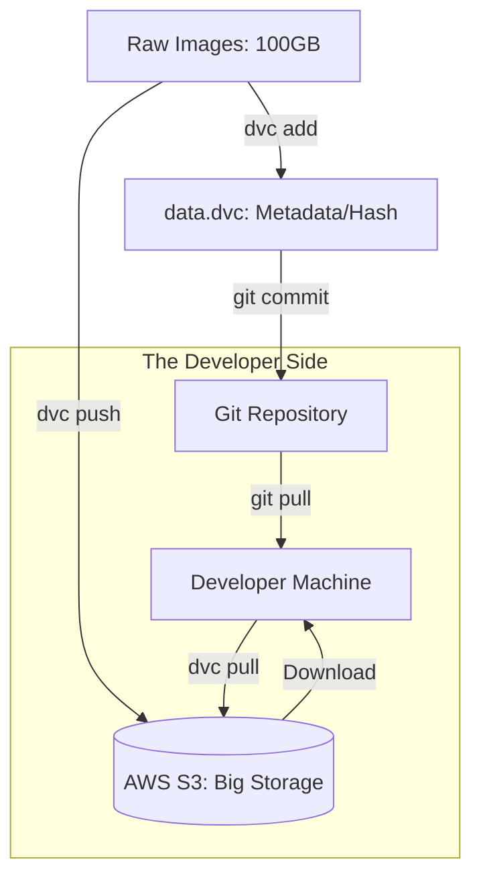

# 📊 Data Versioning: The Git for Large Datasets
> **Level:** Intermediate | **Language:** Hinglish | **Goal:** Apne data mein changes track karne ki art ko master karein, DVC, LakeFS, aur 2026 ke patterns ko explore karte hue AI pipelines mein "Data Reproducibility" ensure karne ke liye.

---

## 🧭 1. Beginner-Friendly Hinglish Explanation
Hum sab jaante hain ki Code ke liye **Git** hota hai. Agar code kharab ho jaye, toh hum `git checkout` karke purana code la sakte hain. Par data ka kya?

- **The Problem:** Maan lo aapka model train hua "Version 1" data par. Kal aapne dataset mein 10,000 nayi images add ki. Phir aapne realize kiya ki wo images kharab thin aur aapko "Kal wala data" wapas chahiye. 
- Aap datasets ko Git mein nahi daal sakte kyunki wo bahut bade hote hain (Gigabytes/Terabytes).

**Data Versioning** ka matlab hai: "Data ko version karna bina use Git mein dale." 
- Ye bilkul waise hi hai jaise aap kisi badi file ka "Link" (Shortcut) store karte hain. 
- Link chota hota hai (Git handle kar sakta hai), par asli data bade storage (S3/Cloud) mein hota hai.

2026 mein, agar aapka data versioned nahi hai, toh aap kabhi bhi apne model ki success ko "Repeat" nahi kar payenge.

---

## 🧠 2. Deep Technical Explanation
Data versioning **Dataset Drift** aur **Irreproducibility** ki problem ko solve karta hai.

### 1. Data Version Control (DVC):
- DVC lightweight `.dvc` files create karta hai jisme actual data ka **Hash (MD5)** hota hai.
- Aap `.dvc` file ko Git mein commit karte hain.
- Actual data ko ek "Remote" (AWS S3, Google Cloud Storage) par push kiya jata hai.
- Data ko wapas pane ke liye: `git checkout v1.0` aur phir `dvc pull`.

### 2. LakeFS:
- Ye "Data Lakes ke liye Git" ki tarah hai. 
- Ye aapko aapke poore S3 bucket ke "Branches" banane ki permission deta hai. 
- Aap production mein use hone wale `master` dataset ko affect kiye bina `branch-new-data` par experiment kar sakte hain.

### 3. Feature Stores (Tecton / Feast):
- Versions ke sath "Features" (pre-processed data) ko store karna.
- Ye ensure karta hai ki **Training** aur **Inference** ke dauran data par same "Math" (preprocessing logic) apply ho.

---

## 🏗️ 4. Data Versioning Tools Comparison
| Tool | Best For | Storage | Complexity |
| :--- | :--- | :--- | :--- |
| **DVC** | **Individual / Small Teams** | S3 / Local / GCS | Moderate |
| **LakeFS** | **Big Data / Data Lakes** | S3 / Azure / GCP | High |
| **Pachyderm** | **Data Pipelines** | Kubernetes-native | High |
| **Git LFS** | **Small binary assets** | GitHub | Low |

---

## 📐 4. Mathematical Intuition
- **The Hash Identity:** 
  2026 mein, hum "File Names" par trust nahi karte. Hum **Hashes (SHA-256/MD5)** par trust karte hain. 
  Agar aapke 100GB dataset ka hash 1 bit bhi change hota hai, toh ye ek NAYI version hai. Ye ensure karta hai ki aapka model har baar *exact* usi data par train ho.

---

## 📊 5. DVC Workflow (Diagram)

```mermaid
graph TD
    Raw[Raw Images: 100GB] -- "dvc add" --> Hash[data.dvc: Metadata/Hash]
    Raw -- "dvc push" --> S3[(AWS S3: Big Storage)]
    
    Hash -- "git commit" --> Git[Git Repository]
    
    subgraph "The Developer Side"
    Git -- "git pull" --> Dev[Developer Machine]
    Dev -- "dvc pull" --> S3
    S3 -- "Download" --> Dev
    end
```

---

## 💻 6. Production-Ready Examples (Basic DVC Usage)
```bash
# 2026 Pro-Tip: Never check in large CSVs or Images directly to Git.

# 1. Initialize DVC
dvc init

# 2. Add a large dataset
dvc add data/training_images.zip

# 3. Commit the .dvc metadata to Git
git add data/training_images.zip.dvc .gitignore
git commit -m "Add version 1 of training images"

# 4. Push the actual data to S3
dvc remote add -d mys3 s3://my-bucket/dvc-storage
dvc push

# 5. On another machine:
git pull
dvc pull  # Automatically downloads the right version of the ZIP file
```

---

## ❌ 7. Failure Cases
- **Diverged DVC/Git:** Aapne `.dvc` file toh commit kar di par data `dvc push` karna bhool gaye. Ab aapke teammate ke paas "Link" toh hai par wo file download nahi kar sakta. **Fix: Ise automate karne ke liye Pre-commit hooks ka use karein.**
- **Storage Deletion:** Kisi ne S3 bucket ko clean up kiya aur purane data versions ko delete kar diya. Ab aapki Git history "Broken" ho gayi hai.
- **Data Corruption:** S3 par partial upload jo complete lagta hai par hota nahi. **Fix: MD5 checksum verification ka use karein.**

---

## 🛠️ 8. Debugging Guide
- **Symptom:** "`dvc pull` file not found error deta hai."
- **Check:** **Remote Config**. Kya aap sahi S3 bucket ko point kar rahe hain?
- **Symptom:** "Dataset same dikh raha hai par model alag perform kar raha hai."
- **Check:** **Hidden changes**. Kya kisi ne CSV mein rows ka "Order" change kar diya hai? Bhale hi content same ho, order change hone se training algorithms affect ho sakte hain.

---

## ⚖️ 9. Tradeoffs
- **Full Copy vs. Symlinks:** Space save karne ke liye DVC local disk par data copy karne se bachne ke liye symlinks ka use karta hai.
- **Git LFS vs. DVC:** 
  - Git LFS small assets (logos, icons) ke liye aasan hai. 
  - DVC massive AI datasets aur pipelines ke liye behtar hai.

---

## 🛡️ 10. Security Concerns
- **Sensitive Data in S3:** Agar aapka S3 bucket public hai, toh koi bhi `.dvc` file (aapke public GitHub se) lekar aapka private dataset download kar sakta hai. **Hamesha apne Data Remotes ko private rakhein.**

---

## 📈 11. Scaling Challenges
- **Data Lineage:** Ye track karna ki ki kis *version* ke data se kis *version* ka model bana hai. Ise **"Lineage Tracking"** kehte hain aur iske liye DVC aur MLflow ke beech integration ki need hoti hai.

---

## 💸 12. Cost Considerations
- **Egress Fees:** Training ke liye S3 se 1TB data local machine par lane mein $\$20-50$ ki "Egress fees" lag sakti hai. **Isse bachne ke liye hamesha same Cloud region ke andar hi train karein.**

---

## ✅ 13. Best Practices
- **Never modify a versioned file:** Agar aap data ko change karna chahte hain, toh ek naya folder ya file banayein aur use version karein.
- **Use 'Data Pipelines' (dvc.yaml):** Define karein ki raw data features mein kaise transform hota hai. Agar raw data change hota hai, toh DVC ko pata hota hai ki pipeline ke kis part ko re-run karna hai.
- **Label your data:** Important dataset milestones ko mark karne ke liye DVC tags (jaise `v1.0-gold-standard`) ka use karein.

---

## ⚠️ 14. Common Mistakes
- **Manually deleting files in S3:** Isse DVC link break ho jata hai. Purane data ko safely remove karne ke liye hamesha `dvc gc` (Garbage Collection) ka use karein.
- **Adding the actual data to Git:** Agar aapko apni Git history mein $100$ MB ki file dikh rahi hai, toh aapne koi mistake ki hai!

---

## 📝 15. Interview Questions
1. **"Hume large datasets ko directly Git mein kyu store nahi karna chahiye?"**
2. **"Explain karein ki DVC bina repository mein store kiye data ko kaise track karta hai."**
3. **" 'Data Lineage' kya hai aur ye AI audits ke liye kyu important hai?"**

---

## 🚀 15. Latest 2026 Industry Patterns
- **Diff-able Datasets:** Naye formats (jaise **Delta Lake**) jo aapko exact ye dekhne ki permission dete hain ki 1 Billion row table ke do versions ke beech kaun si "Rows" change hui hain.
- **Streaming Data Versioning:** Kafka/Spark ke through real-time mein flow hone wale data ke versions ko track karna.
- **AI-Verified Versions:** Aise systems jo master dataset mein "Merge" karne ki permission dene se pehle new data version ko automatically "Test" (bias or errors ke liye) karte hain.
