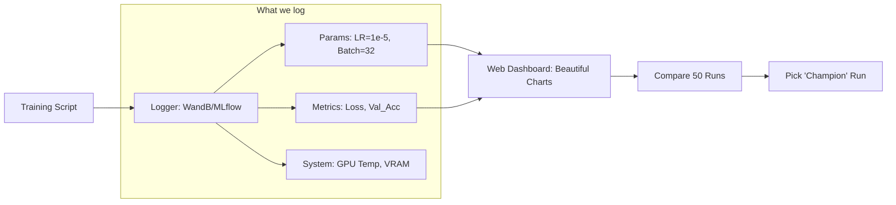

# 🧪 Experiment Tracking: The Scientist's Lab Notebook
> **Level:** Intermediate | **Language:** Hinglish | **Goal:** Master the art of tracking AI research, exploring how to log Hyperparameters, Metrics, and Artefacts to ensure every breakthrough is reproducible in 2026.

---

## 🧭 1. Beginner-Friendly Hinglish Explanation
AI model banana ek "Experiment" hai. 

- Maan lo aap "Biryani" bana rahe hain. Aapne 10 baar try kiya: kabhi namak zyada, kabhi mirch kam, kabhi chawal der tak pakaye. 
- **The Problem:** 11th baar jab aapki biryani "Perfect" bani, toh aap bhool gaye ki aapne kitni mirch dali thi!

**Experiment Tracking** ka yahi kaam hai. 
- Ye aapka "Digital Register" hai. 
- Har baar jab aap model train karte hain, ye apne aap likh leta hai ki:
  1. Learning rate kya tha?
  2. Batch size kya tha?
  3. Accuracy kitni aayi?
  4. Kaunsa GPU use hua?

2026 mein, professional engineers kabhi bhi bina **WandB (Weights & Biases)** ya **MLflow** ke training nahi karte. Bina tracking ke kaam karna "Andhere mein teer marna" (Guessing) hai.

---

## 🧠 2. Deep Technical Explanation
Experiment tracking manages the **Hyperparameters**, **Metrics**, and **System State.**

### 1. Hyperparameters:
- Values set before training: `learning_rate`, `dropout`, `optimizer`, `architecture`.
- Tracking these allows you to do **Hyperparameter Search** (finding the best combination).

### 2. Metrics (Time-series):
- Values that change during training: `loss`, `accuracy`, `perplexity`.
- These are logged at every "Step" or "Epoch" to create graphs.

### 3. Artefacts:
- Files generated during the run: `confusion_matrix.png`, `sample_predictions.csv`, `model.onnx`.

### 4. System Metadata:
- CPU/GPU utilization, RAM usage, Python version, Git commit.

---

## 🏗️ 3. Tools of the Trade
| Tool | Best For | Architecture | Pricing |
| :--- | :--- | :--- | :--- |
| **Weights & Biases (WandB)** | **Deep Learning / Team collab** | SaaS (Cloud) | Free for Personal / Paid for Org |
| **MLflow** | **Enterprise / Lifecycle** | Self-hosted / Open Source | **Free** |
| **TensorBoard** | **Debugging single runs** | Local | **Free** |
| **Comet.ml** | **Automated Insights** | SaaS | Paid |

---

## 📐 4. Mathematical Intuition
- **The Convergence Graph:** 
  By tracking the **Loss Curve**, you can mathematically predict if your model will "Converge" (become smart) or "Explode" (fail). If the slope is flat for 1000 steps, you should kill the job to save GPU money.
- **Correlation Analysis:** 
  Tools like WandB allow you to see a "Parallel Coordinates Plot" to find which hyperparameter (e.g., Learning Rate) is most correlated with your final accuracy.

---

## 📊 5. Experiment Tracking Workflow (Diagram)


---

## 💻 6. Production-Ready Examples (Using Weights & Biases)
```python
# 2026 Pro-Tip: Always log your 'config' so you can replicate the run later.

import wandb

# 1. Initialize the run
wandb.init(
    project="Llama-Instruction-Tuning",
    config={
        "learning_rate": 2e-5,
        "epochs": 3,
        "batch_size": 16,
        "architecture": "Transformer-7B"
    }
)

# 2. Simulate Training
for epoch in range(wandb.config.epochs):
    # ... Training Logic ...
    train_loss = 0.5 / (epoch + 1)
    val_acc = 0.8 + (epoch * 0.05)
    
    # 3. Log metrics at every step
    wandb.log({
        "epoch": epoch,
        "loss": train_loss,
        "val_accuracy": val_acc
    })

# 4. Finish the run
wandb.finish()
```

---

## ❌ 7. Failure Cases
- **Logging too much:** Logging 1GB of data every second (e.g., images of every batch). This will slow down your training and cost a lot in storage.
- **Missing Metadata:** Logging the loss but forgetting to log the "Learning Rate." Now you don't know *why* the loss is good!
- **Diverged Code:** You have the logs, but you changed the code and didn't "Commit" it. Now you can't re-run the experiment. **Always ensure Git is clean before starting.**

---

## 🛠️ 8. Debugging Guide
- **Symptom:** "Graphs are not showing up in the dashboard."
- **Check:** **Internet Connection**. Most tools need internet to send logs to the cloud. If you are offline, use `dryrun` mode.
- **Symptom:** "Learning rate graph is just a straight line."
- **Check:** **Logger Implementation**. Did you log the "initial" value instead of the "current" scheduled value?

---

## ⚖️ 9. Tradeoffs
- **SaaS (Cloud) vs. Self-hosted:** 
  - SaaS (WandB) is zero-maintenance but your logs are on their servers. 
  - Self-hosted (MLflow) is private but you have to manage the database and server.
- **Console vs. Visual:** `print()` statements are easy, but visual charts allow you to find "Patterns" that text can't show.

---

## 🛡️ 10. Security Concerns
- **Sensitive Info in Logs:** Accidentally logging user data (PII) or API keys in the experiment "Config." **Always sanitize your configs before logging.**

---

## 📈 11. Scaling Challenges
- **Multi-GPU Sync:** When 1000 GPUs are training, you only want ONE of them (the "Rank 0") to log to the dashboard, otherwise you get 1000 overlapping lines!

---

## 💸 12. Cost Considerations
- **Storage of Artefacts:** WandB charges for storage. Don't save every 100MB model checkpoint to the cloud. Only save the "Best" one.

---

## ✅ 13. Best Practices
- **Auto-tagging:** Automatically tag runs with your branch name (e.g., `feature-better-attention`).
- **Log System Metrics:** High GPU temperature can lead to "Throttling," which explains why training suddenly slowed down.
- **Group Runs:** Group multiple "Tries" of the same experiment under one name for easier averaging.

---

## ⚠️ 14. Common Mistakes
- **Killing runs manually:** Not logging that a run was "Canceled." This leaves a "Zombie run" in your dashboard that looks like it's still running.
- **Not comparing:** Doing 100 runs but never looking at the "Compare" tab to find the winner.

---

## 📝 15. Interview Questions
1. **"What is the difference between Hyperparameters and Metrics?"**
2. **"Why should we log Git Commit Hashes in an experiment tracker?"**
3. **"How do you handle logging in a multi-node distributed training setup?"** (Only log from rank 0).

---

## 🚀 15. Latest 2026 Industry Patterns
- **AI-Powered Insights:** Trackers that automatically say: *"Bhai, your loss is increasing. You should probably reduce the Learning Rate by 50%."*
- **Real-time Gradient Monitoring:** Seeing a heatmap of your neural network's brain *while* it's training to find "Dead layers."
- **Federated Experimentation:** Tracking experiments across different companies or departments without sharing the actual data.
