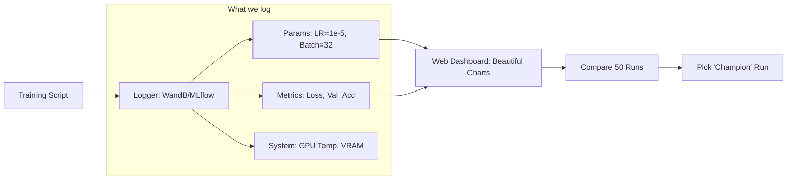

# 🧪 Experiment Tracking: The Scientist's Lab Notebook
> **Level:** Intermediate | **Language:** Hinglish | **Goal:** AI research ko track karne ki art ko master karein, explore karte hue ki kaise Hyperparameters, Metrics, aur Artefacts ko log kiya jaye taaki 2026 mein har breakthrough reproducible ho.

---

## 🧭 1. Beginner-Friendly Hinglish Explanation
AI model banana ek "Experiment" hai. 

- Maan lo aap "Biryani" bana rahe hain. Aapne 10 baar try kiya: kabhi namak zyada, kabhi mirch kam, kabhi chawal der tak pakaye. 
- **The Problem:** 11th baar jab aapki biryani "Perfect" bani, toh aap bhool gaye ki aapne kitni mirch dali thi!

**Experiment Tracking** ka yahi kaam hai. 
- Ye aapka "Digital Register" hai. 
- Har baar jab aap model train karte hain, ye apne aap likh leta hai ki:
  1. Learning rate kya tha?
  2. Batch size kya tha?
  3. Accuracy kitni aayi?
  4. Kaunsa GPU use hua?

2026 mein, professional engineers kabhi bhi bina **WandB (Weights & Biases)** ya **MLflow** ke training nahi karte. Bina tracking ke kaam karna "Andhere mein teer marna" (Guessing) hai.

---

## 🧠 2. Deep Technical Explanation
Experiment tracking **Hyperparameters**, **Metrics** aur **System State** ko manage karta hai.

### 1. Hyperparameters:
- Training se pehle set kiye jane wale values: `learning_rate`, `dropout`, `optimizer`, `architecture`.
- Inhe track karne se aap **Hyperparameter Search** (best combination find karna) kar sakte hain.

### 2. Metrics (Time-series):
- Training ke dauran badalne wale values: `loss`, `accuracy`, `perplexity`.
- Graphs banane ke liye inhe har "Step" ya "Epoch" par log kiya jata hai.

### 3. Artefacts:
- Run ke dauran generate hone wali files: `confusion_matrix.png`, `sample_predictions.csv`, `model.onnx`.

### 4. System Metadata:
- CPU/GPU utilization, RAM usage, Python version, Git commit details.

---

## 🏗️ 3. Tools of the Trade
| Tool | Best For | Architecture | Pricing |
| :--- | :--- | :--- | :--- |
| **Weights & Biases (WandB)** | **Deep Learning / Team collab** | SaaS (Cloud) | Free for Personal / Paid for Org |
| **MLflow** | **Enterprise / Lifecycle** | Self-hosted / Open Source | **Free** |
| **TensorBoard** | **Debugging single runs** | Local | **Free** |
| **Comet.ml** | **Automated Insights** | SaaS | Paid |

---

## 📐 4. Mathematical Intuition
- **The Convergence Graph:** 
  **Loss Curve** ko track karke, aap mathematically predict kar sakte hain ki aapka model "Converge" (smart banega) hoga ya "Explode" (fail) hoga. Agar slope 1000 steps tak bilkul flat rehta hai, toh aapko GPU ke paise bachane ke liye job ko kill kar dena chahiye.
- **Correlation Analysis:** 
  WandB jaise tools aapko ek "Parallel Coordinates Plot" dekhne ki permission dete hain taaki aap find kar sakein ki kaun sa hyperparameter (jaise Learning Rate) aapki final accuracy se sabse zyada correlated hai.

---

## 📊 5. Experiment Tracking Workflow (Diagram)

```mermaid
graph LR
    Script[Training Script] --> Logger[Logger: WandB/MLflow]
    
    subgraph "What we log"
    Logger --> Params[Params: LR=1e-5, Batch=32]
    Logger --> Metrics[Metrics: Loss, Val_Acc]
    Logger --> System[System: GPU Temp, VRAM]
    end
    
    Params & Metrics --> Dashboard[Web Dashboard: Beautiful Charts]
    Dashboard --> Compare[Compare 50 Runs]
    Compare --> Best[Pick 'Champion' Run]
```

---

## 💻 6. Production-Ready Examples (Using Weights & Biases)
```python
# 2026 Pro-Tip: Always log your 'config' so you can replicate the run later.

import wandb

# 1. Initialize the run
wandb.init(
    project="Llama-Instruction-Tuning",
    config={
        "learning_rate": 2e-5,
        "epochs": 3,
        "batch_size": 16,
        "architecture": "Transformer-7B"
    }
)

# 2. Simulate Training
for epoch in range(wandb.config.epochs):
    # ... Training Logic ...
    train_loss = 0.5 / (epoch + 1)
    val_acc = 0.8 + (epoch * 0.05)
    
    # 3. Log metrics at every step
    wandb.log({
        "epoch": epoch,
        "loss": train_loss,
        "val_accuracy": val_acc
    })

# 4. Finish the run
wandb.finish()
```

---

## ❌ 7. Failure Cases
- **Logging too much:** Har second 1GB data log karna (jaise har batch ki images). Ye aapki training ko slow kar dega aur storage cost ko badha dega.
- **Missing Metadata:** Loss log karna par "Learning Rate" log karna bhool jana. Ab aapko pata hi nahi chalega ki loss kis wajah se achha aaya!
- **Diverged Code:** Aapke paas logs toh hain, par aapne code change kar diya aur use "Commit" nahi kiya. Ab aap us experiment ko dubara run nahi kar sakte. **Training start karne se pehle hamesha ensure karein ki Git repository clean ho.**

---

## 🛠️ 8. Debugging Guide
- **Symptom:** "Dashboard mein graphs show nahi ho rahe hain."
- **Check:** **Internet Connection**. Zyadatar tools ko cloud par logs send karne ke liye internet ki need hoti hai. Agar aap offline hain, toh `dryrun` mode ka use karein.
- **Symptom:** "Learning rate graph sirf ek straight line hai."
- **Check:** **Logger Implementation**. Kya aapne "current" scheduled value ke bajaye sirf "initial" value ko log kar diya hai?

---

## ⚖️ 9. Tradeoffs
- **SaaS (Cloud) vs. Self-hosted:** 
  - SaaS (WandB) zero-maintenance hota hai par aapke logs unke servers par hote hain. 
  - Self-hosted (MLflow) private hota hai par aapko database aur server khud manage karna padta hai.
- **Console vs. Visual:** `print()` statements easy hote hain, par visual charts aapko aise "Patterns" dekhne mein help karte hain jo text ke through nahi dikhte.

---

## 🛡️ 10. Security Concerns
- **Sensitive Info in Logs:** Experiment ke "Config" mein galti se user data (PII) ya API keys log kar dena. **Hamesha logging se pehle apne configs ko sanitize karein.**

---

## 📈 11. Scaling Challenges
- **Multi-GPU Sync:** Jab 1000 GPUs train ho rahe hon, toh aap chahte hain ki sirf ek hi GPU (jo "Rank 0" ho) dashboard par log kare, warna dashboard par 1000 overlapping lines dikhne lagengi!

---

## 💸 12. Cost Considerations
- **Storage of Artefacts:** WandB storage ke liye charge karta hai. Har 100MB model checkpoint ko cloud par save na karein. Sirf "Best" checkpoint ko hi save karein.

---

## ✅ 13. Best Practices
- **Auto-tagging:** Runs ko automatically apne branch name ke sath tag karein (jaise `feature-better-attention`).
- **Log System Metrics:** High GPU temperature ki wajah se hardware "Throttling" ho sakti hai, jo explain karegi ki training suddenly kyu slow hui.
- **Group Runs:** Averages ko easily find karne ke liye ek hi experiment ke multiple trials ko ek name ke under group karein.

---

## ⚠️ 14. Common Mistakes
- **Killing runs manually:** Run ke "Canceled" hone ke status ko log na karna. Isse dashboard mein ek "Zombie run" reh jata hai jo dikhata hai ki run abhi bhi chal raha hai.
- **Not comparing:** 100 runs run karna par winner ko find karne ke liye kabhi "Compare" tab ko check hi na karna.

---

## 📝 15. Interview Questions
1. **"Hyperparameters aur Metrics ke beech kya difference hai?"**
2. **"Hume experiment tracker mein Git Commit Hashes kyu log karne chahiye?"**
3. **"Aap multi-node distributed training setup mein logging ko kaise handle karenge?"** (Sirf rank 0 se log karein).

---

## 🚀 15. Latest 2026 Industry Patterns
- **AI-Powered Insights:** Trackers jo automatically batate hain: *"Bhai, aapka loss badh raha hai. Aapko shayad Learning Rate ko 50% se reduce kar dena chahiye."*
- **Real-time Gradient Monitoring:** Training ke dauran hi aapke neural network ke brain ka heatmap dekhna taaki "Dead layers" ko identify kiya ja sake.
- **Federated Experimentation:** Actual data share kiye bina alag-alag companies ya departments ke across experiments ko track karna.
