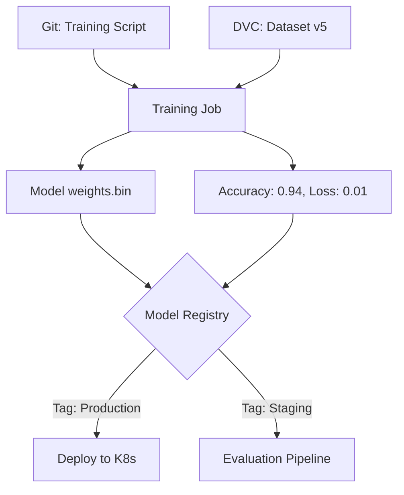

# 📦 Model Versioning: Managing the Weights of Time
> **Level:** Intermediate | **Language:** Hinglish | **Goal:** Master the art of tracking AI model changes, exploring Model Registries, Semantic Versioning for weights, and the 2026 strategies for reproducible AI deployments.

---

## 🧭 1. Beginner-Friendly Hinglish Explanation
Normal software mein "Version" ka matlab hota hai code change hona (v1.0 to v1.1). Par AI mein sirf code nahi badalta.

- **The Problem:** Maan lo aapne ek model train kiya jo $90\%$ accurate tha. Kal aapne naya data dala aur phir se train kiya, par ab accuracy $85\%$ ho gayi. Ab aap pichle model par "Wapas" (Rollback) kaise jayenge?
- **Model Versioning** ka matlab hai: "Model ke weights (the actual file) ko ek fixed ID ke saath save karna." 

Isse humein pata hota hai ki:
1. Kaunsa data use hua tha?
2. Kaunsa code (Algorithm) use hua tha?
3. Kaunsa GPU use hua tha?

2026 mein, agar aapke paas **Model Registry** nahi hai, toh aap "Production-ready" nahi hain.

---

## 🧠 2. Deep Technical Explanation
Model versioning tracks the **Weights (Artifacts)** and their associated **Metadata.**

### 1. The Model Registry:
- A central repository (like GitHub but for models).
- Popular tools: **MLflow**, **HuggingFace Hub (Private)**, **DVC**, **BentoML.**

### 2. Versioning Levels:
- **v1.0.0 (Semantic Versioning):** 
  - **Major:** Change in architecture (e.g., Llama-2 to Llama-3).
  - **Minor:** Significant fine-tuning on new data.
  - **Patch:** Retraining on corrected labels or small updates.

### 3. Traceability:
- Every model version must be linked to a specific **Git Commit Hash** (Code) and a **Data Version** (DVC/LakeFS).
- This ensures that if a model starts behaving badly in 2027, you can "Re-create" exactly how it was built in 2026.

### 4. Model Stages:
- **None:** Initial upload.
- **Staging:** Undergoing testing/validation.
- **Production:** Currently serving live traffic.
- **Archived:** Replaced by a newer version.

---

## 🏗️ 3. Model Versioning vs. Git
| Feature | Git (Code) | Model Registry (Weights) |
| :--- | :--- | :--- |
| **Object Size** | Small (Text) | **Huge (Gigabytes/Terabytes)** |
| **Storage** | GitHub / GitLab | **S3 / GCS / Azure Blob** |
| **Diffing** | Line by line | **Impossible (Binary)** |
| **Primary Key** | Commit Hash | Version + Tags |
| **Metadata** | Commit Message | Metrics (Accuracy, Latency) |

---

## 📐 4. Mathematical Intuition
- **The Reproducibility Gap:** 
  If you have the same code and same data, but different **Random Seeds** or different **CUDNN versions**, the model weights will be different. 
  Model versioning solves this by saving the "Final Result" (The Weights) so you don't have to rely on the "Process" being $100\%$ reproducible.

---

## 📊 5. Model Registry Workflow (Diagram)


---

## 💻 6. Production-Ready Examples (Using MLflow for Versioning)
```python
# 2026 Pro-Tip: Never manually name files 'model_final_v2_last.pt'. Use a registry.

import mlflow

# 1. Start an experiment
mlflow.set_experiment("Llama-3-FineTuning")

with mlflow.start_run():
    # ... Training Code ...
    accuracy = 0.95
    
    # 2. Log Metrics
    mlflow.log_metric("accuracy", accuracy)
    
    # 3. Log the Model (Weights)
    # This automatically assigns a version number (v1, v2, etc.)
    mlflow.pytorch.log_model(model, "model", registered_model_name="CustomerSupportModel")

print("Model successfully registered! 📦")
```

---

## ❌ 7. Failure Cases
- **Ghost Models:** A model is running in production, but nobody knows where the weights file is or who trained it.
- **Dependency Hell:** Loading a v1 model weights with v2 library code. The model will produce garbage or crash. **Fix: Store the 'requirements.txt' inside the model registry.**
- **Storage Cleanup:** Deleting old versions to save space, then realizing you need to rollback to a version from 6 months ago.

---

## 🛠️ 8. Debugging Guide
- **Symptom:** "Model prediction is different on Dev vs. Prod."
- **Check:** **Model Version**. Are they using the same version ID? 
- **Check:** **Library Versions**. Ensure the environment is identical. Use **Docker**.
- **Symptom:** "Model loading is slow."
- **Check:** **Storage Backend**. Are you loading a 10GB model from a slow S3 region?

---

## ⚖️ 9. Tradeoffs
- **Full Weight vs. Delta:** 
  - Storing the full 70GB model for every tiny change (Expensive). 
  - Storing only the "Delta" (Changes) or LoRA weights (Cheaper but more complex to load).
- **Public vs. Private Registry:** 
  - Public (HuggingFace) is easy. 
  - Private (S3/Local MLflow) is more secure for company secrets.

---

## 🛡️ 10. Security Concerns
- **Model Tampering:** If someone gains access to your registry, they can replace your "Production" model with a malicious one. **Enable 'Model Signing' (Digital Signatures).**

---

## 📈 11. Scaling Challenges
- **Large Artifacts:** How to sync a 400B model (800GB) across 50 data centers? You need **Global Content Delivery (CDN)** for your models.

---

## 💸 12. Cost Considerations
- **Storage Tiering:** Move "Archived" models from High-performance SSD storage to "S3 Glacier" (Cold storage) after 30 days of inactivity.

---

## ✅ 13. Best Practices
- **Never delete 'Production' history:** Keep a record of every model that has ever served a real user.
- **Link to Data:** Every model must have a `dataset_id` in its metadata.
- **Use 'Aliases':** Instead of hardcoding `v45` in your code, use aliases like `@prod` or `@champion`.

---

## ⚠️ 14. Common Mistakes
- **Relying on File Names:** `model_v2_new.pth` is the enemy of stability.
- **Forgetting the Tokenizer:** If you update the model but keep the old tokenizer, the model will be broken. **Save the Tokenizer alongside the Model.**

---

## 📝 15. Interview Questions
1. **"Why is a Model Registry better than just saving files on S3?"**
2. **"How do you handle 'Rollbacks' in an AI production system?"**
3. **"What metadata is mandatory to store along with a model version?"**

---

## 🚀 15. Latest 2026 Industry Patterns
- **immutable Models:** Using Blockchain-style hashes to ensure that a model "Production_v1" can NEVER be changed once it is tagged.
- **Self-Documenting Models:** Models that generate their own "Model Card" (Documentation) automatically during the versioning process.
- **Edge Registry:** Specialized registries that automatically "Convert" and "Quantize" a model for mobile devices as soon as it is tagged as `@prod`.
