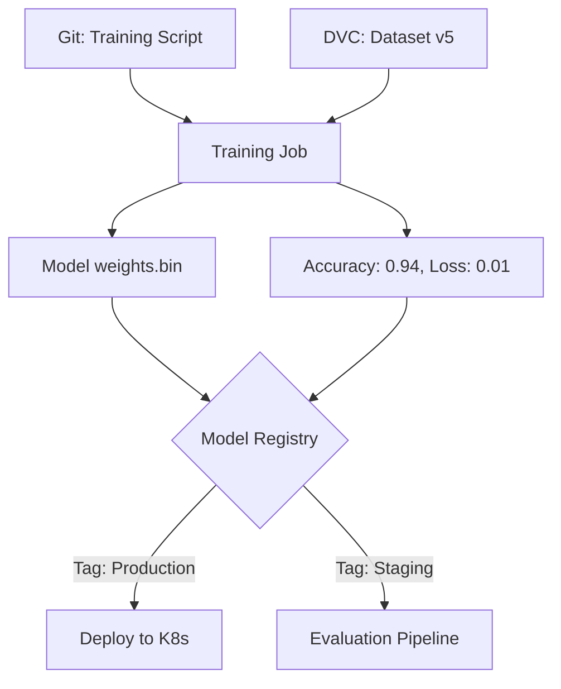

# 📦 Model Versioning: Managing the Weights of Time
> **Level:** Intermediate | **Language:** Hinglish | **Goal:** AI model changes track karne ki art ko master karein, Model Registries, weights ke liye Semantic Versioning, aur 2026 mein reproducible AI deployments ki strategies ko explore karte hue.

---

## 🧭 1. Beginner-Friendly Hinglish Explanation
Normal software mein "Version" ka matlab hota hai code change hona (v1.0 to v1.1). Par AI mein sirf code nahi badalta.

- **The Problem:** Maan lo aapne ek model train kiya jo $90\%$ accurate tha. Kal aapne naya data dala aur phir se train kiya, par ab accuracy $85\%$ ho gayi. Ab aap pichle model par "Wapas" (Rollback) kaise jayenge?
- **Model Versioning** ka matlab hai: "Model ke weights (the actual file) ko ek fixed ID ke saath save karna." 

Isse humein pata hota hai ki:
1. Kaunsa data use hua tha?
2. Kaunsa code (Algorithm) use hua tha?
3. Kaunsa GPU use hua tha?

2026 mein, agar aapke paas **Model Registry** nahi hai, toh aap "Production-ready" nahi hain.

---

## 🧠 2. Deep Technical Explanation
Model versioning **Weights (Artifacts)** aur unse jude **Metadata** ko track karta hai.

### 1. The Model Registry:
- Ek central repository (jaise GitHub code ke liye hota hai, waise hi ye models ke liye hota hai).
- Popular tools: **MLflow**, **HuggingFace Hub (Private)**, **DVC**, **BentoML.**

### 2. Versioning Levels:
- **v1.0.0 (Semantic Versioning):** 
  - **Major:** Architecture mein change (jaise Llama-2 se Llama-3).
  - **Minor:** Naye data par significant fine-tuning.
  - **Patch:** Corrected labels par retraining ya small updates.

### 3. Traceability:
- Every model version ko ek specific **Git Commit Hash** (Code) aur ek **Data Version** (DVC/LakeFS) ke sath link hona chahiye.
- Ye ensure karta hai ki agar 2027 mein koi model kharab behave karne lage, toh aap exact waise hi "Re-create" kar sakein jaise use 2026 mein banaya gaya tha.

### 4. Model Stages:
- **None:** Initial upload.
- **Staging:** Testing/validation ke under chal raha hai.
- **Production:** Currently live traffic ko serve kar raha hai.
- **Archived:** Naye version se replace ho chuka hai.

---

## 🏗️ 3. Model Versioning vs. Git
| Feature | Git (Code) | Model Registry (Weights) |
| :--- | :--- | :--- |
| **Object Size** | Small (Text) | **Huge (Gigabytes/Terabytes)** |
| **Storage** | GitHub / GitLab | **S3 / GCS / Azure Blob** |
| **Diffing** | Line by line | **Impossible (Binary)** |
| **Primary Key** | Commit Hash | Version + Tags |
| **Metadata** | Commit Message | Metrics (Accuracy, Latency) |

---

## 📐 4. Mathematical Intuition
- **The Reproducibility Gap:** 
  Agar aapke paas same code aur same data hai, par different **Random Seeds** ya different **CUDNN versions** hain, toh model weights alag ho jayenge. 
  Model versioning is problem ko "Final Result" (Weights) ko save karke solve karti hai taaki aapko "Process" ke $100\%$ reproducible hone par rely na karna pade.

---

## 📊 5. Model Registry Workflow (Diagram)

```mermaid
graph TD
    Code[Git: Training Script] --> Train[Training Job]
    Data[DVC: Dataset v5] --> Train
    
    Train --> Weights[Model weights.bin]
    Train --> Metrics[Accuracy: 0.94, Loss: 0.01]
    
    Weights & Metrics --> Registry{Model Registry}
    Registry -- "Tag: Production" --> Deploy[Deploy to K8s]
    Registry -- "Tag: Staging" --> Eval[Evaluation Pipeline]
```

---

## 💻 6. Production-Ready Examples (Using MLflow for Versioning)
```python
# 2026 Pro-Tip: Never manually name files 'model_final_v2_last.pt'. Use a registry.

import mlflow

# 1. Start an experiment
mlflow.set_experiment("Llama-3-FineTuning")

with mlflow.start_run():
    # ... Training Code ...
    accuracy = 0.95
    
    # 2. Log Metrics
    mlflow.log_metric("accuracy", accuracy)
    
    # 3. Log the Model (Weights)
    # This automatically assigns a version number (v1, v2, etc.)
    mlflow.pytorch.log_model(model, "model", registered_model_name="CustomerSupportModel")

print("Model successfully registered! 📦")
```

---

## ❌ 7. Failure Cases
- **Ghost Models:** Ek model production mein chal raha hai, par koi nahi jaanta ki uski weights file kahan hai ya use kisne train kiya tha.
- **Dependency Hell:** v2 library code ke sath v1 model weights ko load karna. Isse model garbage output dega ya crash ho jayega. **Fix: Model registry ke andar hi 'requirements.txt' ko store karein.**
- **Storage Cleanup:** Space save karne ke liye purane versions ko delete ko delete kar dena, aur baad mein realize karna ki aapko 6 mahine purane version par rollback karna pad raha hai.

---

## 🛠️ 8. Debugging Guide
- **Symptom:** "Dev vs. Prod par model prediction alag hai."
- **Check:** **Model Version**. Are they using the same version ID? 
- **Check:** **Library Versions**. Ensure the environment is identical. Use **Docker**.
- **Symptom:** "Model loading is slow."
- **Check:** **Storage Backend**. Are you loading a 10GB model from a slow S3 region?

---

## ⚖️ 9. Tradeoffs
- **Full Weight vs. Delta:** 
  - Har chote change ke liye poore 70GB model ko store karna (Expensive). 
  - Sirf "Delta" (Changes) ya LoRA weights ko store karna (Sasta par load karne mein complex).
- **Public vs. Private Registry:** 
  - Public (HuggingFace) is easy. 
  - Private (S3/Local MLflow) is more secure for company secrets.

---

## 🛡️ 10. Security Concerns
- **Model Tampering:** Agar koi aapki registry ka access pa leta hai, toh wo aapke "Production" model ko kisi malicious model se replace kar sakta hai. **'Model Signing' (Digital Signatures) ko enable karein.**

---

## 📈 11. Scaling Challenges
- **Large Artifacts:** 50 data centers ke across 400B model (800GB) ko kaise sync karein? Aapko apne models ke liye **Global Content Delivery (CDN)** ki zaroorat hogi.

---

## 💸 12. Cost Considerations
- **Storage Tiering:** 30 days tak inactive rehne ke baad "Archived" models ko High-performance SSD storage se "S3 Glacier" (Cold storage) mein move kar dein.

---

## ✅ 13. Best Practices
- **Never delete 'Production' history:** Aise har model ka record rakhein jisne kabhi kisi real user ko serve kiya ho.
- **Link to Data:** Every model must have a `dataset_id` in its metadata.
- **Use 'Aliases':** Instead of hardcoding `v45` in your code, use aliases like `@prod` or `@champion`.

---

## ⚠️ 14. Common Mistakes
- **Relying on File Names:** `model_v2_new.pth` is the enemy of stability.
- **Forgetting the Tokenizer:** Agar aap model ko update karte hain par purana tokenizer hi use karte rehte hain, toh model toot (break) jayega. **Tokenizer ko hamesha Model ke sath hi save karein.**

---

## 📝 15. Interview Questions
1. **"Model Registry sirf S3 par files save karne se behtar kyu hai?"**
2. **"Aap AI production system mein 'Rollbacks' ko kaise handle karte hain?"**
3. **"Model version ke sath kaun-kaun sa metadata store karna mandatory hai?"**

---

## 🚀 15. Latest 2026 Industry Patterns
- **immutable Models:** Blockchain-style hashes ka use karna taaki ye ensure kiya ja sake ki ek baar tag hone ke baad "Production_v1" model ko KABHI bhi change na kiya ja sake.
- **Self-Documenting Models:** Models jo versioning process ke dauran automatically apna khud ka "Model Card" (Documentation) generate karte hain.
- **Edge Registry:** Specialized registries jo model ke `@prod` tag hote hi use mobile devices ke liye automatically "Convert" aur "Quantize" kar deti hain.
