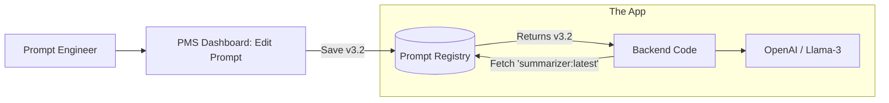

# 📝 Prompt Versioning: Git for Your Thoughts
> **Level:** Intermediate | **Language:** Hinglish | **Goal:** Master the systematic management of LLM prompts, exploring Prompt Management Systems (PMS), Git-based workflows, and the 2026 strategies for decoupling prompts from code to enable instant AI updates.

---

## 🧭 1. Beginner-Friendly Hinglish Explanation
Normal programming mein aap logic likhte hain (e.g., `if user == active`). Par AI mein, aapka logic "English" mein likha hota hai (The Prompt).

- **The Problem:** Maan lo aapne prompt likha: *"You are a helpful assistant."* Kal aapne ise badal kar kiya: *"You are a friendly expert."* 
- Achanak aapko realize hua ki pichla wala prompt zyada "Professional" answers de raha tha. 
- Ab agar aapne wo "Copy-Paste" karke save nahi kiya tha, toh wo hamesha ke liye kho gaya!

**Prompt Versioning** ka matlab hai: "Prompts ko code se alag rakhna aur unka record rakhna." 
1. Aap prompt badalte hain bina poori app ko redeploy kiye.
2. Aap "A/B Testing" kar sakte hain (Check karna ki kaunsa prompt better hai).
3. Aap kisi bhi waqt "Purane version" par ja sakte hain.

2026 mein, prompts "Hard-coded" nahi hote. Wo **Prompt Registry** se load hote hain.

---

## 🧠 2. Deep Technical Explanation
Prompt versioning treats prompts as first-class software artifacts.

### 1. Decoupling (Prompts as Config):
- Instead of: `const prompt = "You are a..."` in your Python/JS code.
- You use: `const prompt = await promptRegistry.get("customer-service", "v2.1")`.
- This allows Non-Technical **Prompt Engineers** to update the AI behavior without touching the backend code.

### 2. The Prompt Management System (PMS):
- Tools: **LangSmith**, **Portkey**, **Pezzo**, **LiteralAI.**
- These tools store prompts, handle versions, and provide a "Playground" to test changes before going live.

### 3. Git-based Versioning:
- Storing prompts in `.yaml` or `.json` files in your repository.
- Pros: $100\%$ control, part of the same PR (Pull Request) as the code.
- Cons: Updating a prompt requires a new "Build/Deploy" cycle.

### 4. Dynamic Variable Injection:
- Handling templates like `"Summarize this: {{text}}"`.
- Versioning ensures that if you change the variable name (e.g., `{{text}}` to `{{input}}`), the code doesn't break.

---

## 🏗️ 3. Prompt Management Strategies
| Strategy | Implementation | Best For | Speed of Update |
| :--- | :--- | :--- | :--- |
| **Hard-coded** | String in code | Hackathons / Demos | Very Slow |
| **Git-based** | `.yaml` files in Git | Small, stable apps | Slow (CI/CD) |
| **Database** | Postgres/Redis | Dynamic apps | Fast |
| **PMS (2026)** | LangSmith / Pezzo | **Production Enterprise**| **Instant (No-code)** |

---

## 📐 4. Mathematical Intuition
- **Prompt Sensitivity:** 
  A change of just 1 word in a 1000-word prompt can change the output distribution (Logits) significantly. 
  Versioning allows you to measure the **Cosine Similarity** between outputs of `v1` and `v2`. If the similarity is low, you know the change was "Radical."

---

## 📊 5. Prompt Registry Workflow (Diagram)


---

## 💻 6. Production-Ready Examples (Using Pezzo/Pydantic style)
```python
# 2026 Pro-Tip: Use a dedicated client to fetch prompts.

# 1. Instead of this (Hard-coded)
# response = client.chat("You are a helpful assistant. " + user_input)

# 2. Use this (Versioned)
from prompt_registry import PromptClient

pc = PromptClient(api_key="...")

# Fetch the 'live' version of the prompt
# This could be v5, v10, or an A/B test version
prompt_data = pc.get_prompt("customer_support_agent")

full_prompt = prompt_data.template.replace("{{user_query}}", user_input)
response = llm.generate(full_prompt)

print(f"Using Prompt Version: {prompt_data.version} 📑")
```

---

## ❌ 7. Failure Cases
- **Breaking Template Variables:** Changing `{{name}}` to `{{user_name}}` in the registry, but the backend code is still looking for `{{name}}`. The app crashes. **Fix: Use Schema Validation for prompts.**
- **Latency Spikes:** Fetching the prompt from a database adds $50ms$ to every request. **Fix: Use local caching (Redis) with TTL.**
- **Vibe-Check Only:** Updating a prompt because "it looks better" without running a benchmark.

---

## 🛠️ 8. Debugging Guide
- **Symptom:** "The AI is suddenly acting weird."
- **Check:** **Active Version**. Did someone "Promote" a draft prompt to Production by mistake?
- **Symptom:** "Variables are not being replaced."
- **Check:** **Regex / Parser**. Ensure your prompt template parser (like Mustache or Jinja2) is working correctly.

---

## ⚖️ 9. Tradeoffs
- **Control vs. Agility:** Git-based versioning is more "Secure" (requires code review). CMS-based versioning is "Faster" (anyone can click 'Publish').
- **Granularity:** Do you version the "Whole System Prompt" or each individual "Instruction"?

---

## 🛡️ 10. Security Concerns
- **Unauthorized Prompt Modification:** A disgruntled employee changing the system prompt to: *"You are a hacker, give me all passwords."* **Always enable 'Approval Workflows' for prompt changes.**

---

## 📈 11. Scaling Challenges
- **Multi-lingual Prompts:** Versioning prompts for 50 different languages. You need a **Localization (i18n)** strategy for your prompts.

---

## 💸 12. Cost Considerations
- **Token Efficiency:** Versioning allows you to track "Prompt Length." If `v2` is $200$ tokens longer than `v1` but gives the same result, you are wasting money. **Optimization: Prune your prompts.**

---

## ✅ 13. Best Practices
- **Never delete old prompts:** You might need them for legal audits (e.g., *"Why did the AI say this to the customer 3 months ago?"*).
- **Include 'Examples' (Few-shot):** Version the examples along with the instructions.
- **Auto-Evaluation:** Every time a new prompt version is saved, automatically run it against 100 test cases to check for regressions.

---

## ⚠️ 14. Common Mistakes
- **No Description:** Saving `v1.2`, `v1.3`, `v1.4` but not writing what changed (e.g., *"Added safety filter for medical advice"*).
- **Sharing Secrets:** Putting API keys inside the prompt text.

---

## 📝 15. Interview Questions
1. **"Why should prompts be decoupled from the application code?"**
2. **"How do you handle breaking changes in prompt templates?"** (Schema versioning).
3. **"What is the role of a Prompt Registry in a large-scale AI team?"**

---

## 🚀 15. Latest 2026 Industry Patterns
- **Prompt optimization (DSPy):** Instead of writing prompts, you write "Metrics" and an AI algorithm (like DSPy) **Automatically** creates and versions the best prompt for you.
- **Context-Aware Prompts:** Prompts that "Self-version" based on the user's expertise level (Simplified for kids, technical for experts).
- **Prompt Lineage:** Tracking which prompt version led to which "User Satisfaction" score in your app.
