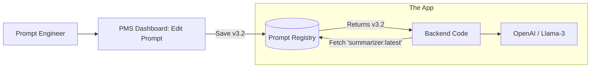

# 📝 Prompt Versioning: Git for Your Thoughts
> **Level:** Intermediate | **Language:** Hinglish | **Goal:** LLM prompts ke systematic management ko master karein, Prompt Management Systems (PMS), Git-based workflows, aur 2026 mein code se prompts ko decouple karne ki strategies ko explore karte hue taaki instant AI updates enable ho sakein.

---

## 🧭 1. Beginner-Friendly Hinglish Explanation
Normal programming mein aap logic likhte hain (e.g., `if user == active`). Par AI mein, aapka logic "English" mein likha hota hai (The Prompt).

- **The Problem:** Maan lo aapne prompt likha: *"You are a helpful assistant."* Kal aapne ise badal kar kiya: *"You are a friendly expert."* 
- Achanak aapko realize hua ki pichla wala prompt zyada "Professional" answers de raha tha. 
- Ab agar aapne wo "Copy-Paste" karke save nahi kiya tha, toh wo hamesha ke liye kho gaya!

**Prompt Versioning** ka matlab hai: "Prompts ko code se alag rakhna aur unka record rakhna." 
1. Aap prompt badalte hain bina poori app ko redeploy kiye.
2. Aap "A/B Testing" kar sakte hain (Check karna ki kaunsa prompt better hai).
3. Aap kisi bhi waqt "Purane version" par ja sakte hain.

2026 mein, prompts "Hard-coded" nahi hote. Wo **Prompt Registry** se load hote hain.

---

## 🧠 2. Deep Technical Explanation
Prompt versioning prompts ko first-class software artifacts ki tarah treat karta hai.

### 1. Decoupling (Prompts as Config):
- Apne Python/JS code mein `const prompt = "You are a..."` likhne ke bajaye:
- Aap `const prompt = await promptRegistry.get("customer-service", "v2.1")` ka use karte hain.
- Isse non-technical **Prompt Engineers** bhi backend code ko bina touch kiye AI ka behavior update kar sakte hain.

### 2. The Prompt Management System (PMS):
- Tools: **LangSmith**, **Portkey**, **Pezzo**, **LiteralAI.**
- Ye tools prompts ko store karte hain, versions ko handle karte hain, aur live jane se pehle changes ko test karne ke liye ek "Playground" provide karte hain.

### 3. Git-based Versioning:
- Apni repository mein `.yaml` ya `.json` files mein prompts ko store karna.
- Pros: $100\%$ control hota hai, aur ye code ke sath same PR (Pull Request) ka part banta hai.
- Cons: Prompt ko update karne ke liye ek naye "Build/Deploy" cycle ki need hoti hai.

### 4. Dynamic Variable Injection:
- `"Summarize this: {{text}}"` jaise templates ko handle karna.
- Versioning ye ensure karta hai ki agar aap variable name change karte hain (jaise `{{text}}` se `{{input}}`), toh code break na ho.

---

## 🏗️ 3. Prompt Management Strategies
| Strategy | Implementation | Best For | Speed of Update |
| :--- | :--- | :--- | :--- |
| **Hard-coded** | String in code | Hackathons / Demos | Very Slow |
| **Git-based** | `.yaml` files in Git | Small, stable apps | Slow (CI/CD) |
| **Database** | Postgres/Redis | Dynamic apps | Fast |
| **PMS (2026)** | LangSmith / Pezzo | **Production Enterprise**| **Instant (No-code)** |

---

## 📐 4. Mathematical Intuition
- **Prompt Sensitivity:** 
  Ek 1000-word ke prompt mein sirf 1 word ka change bhi output distribution (Logits) ko significantly change kar sakta hai. 
  Versioning aapko `v1` aur `v2` ke outputs ke beige **Cosine Similarity** measure karne ki permission deta hai. Agar similarity low hai, toh aapko pata chal jayega ki change "Radical" (bada) tha.

---

## 📊 5. Prompt Registry Workflow (Diagram)

```mermaid
graph LR
    PE[Prompt Engineer] --> PMS[PMS Dashboard: Edit Prompt]
    PMS -- "Save v3.2" --> DB[(Prompt Registry)]
    
    subgraph "The App"
    App[Backend Code] -- "Fetch 'summarizer:latest'" --> DB
    DB -- "Returns v3.2" --> App
    App --> LLM[OpenAI / Llama-3]
    end
```

---

## 💻 6. Production-Ready Examples (Using Pezzo/Pydantic style)
```python
# 2026 Pro-Tip: Use a dedicated client to fetch prompts.

# 1. Instead of this (Hard-coded)
# response = client.chat("You are a helpful assistant. " + user_input)

# 2. Use this (Versioned)
from prompt_registry import PromptClient

pc = PromptClient(api_key="...")

# Fetch the 'live' version of the prompt
# This could be v5, v10, or an A/B test version
prompt_data = pc.get_prompt("customer_support_agent")

full_prompt = prompt_data.template.replace("{{user_query}}", user_input)
response = llm.generate(full_prompt)

print(f"Using Prompt Version: {prompt_data.version} 📑")
```

---

## ❌ 7. Failure Cases
- **Breaking Template Variables:** Registry mein `{{name}}` ko `{{user_name}}` mein change kar dena, par backend code abhi bhi `{{name}}` ko dhoondh raha hai. Isse app crash ho jayegi. **Fix: Prompts ke liye Schema Validation ka use karein.**
- **Latency Spikes:** Database se prompt fetch karne par har request mein $50ms$ extra lagte hain. **Fix: TTL ke sath local caching (Redis) ka use karein.**
- **Vibe-Check Only:** Bina benchmark run kiye sirf "ye achha dikh raha hai" ke basis par prompt ko update kar dena.

---

## 🛠️ 8. Debugging Guide
- **Symptom:** "AI achanak ajeeb behave kar raha hai."
- **Check:** **Active Version**. Did someone "Promote" a draft prompt to Production by mistake?
- **Symptom:** "Variables replace nahi ho rahe hain."
- **Check:** **Regex / Parser**. Ensure karein ki aapka prompt template parser (jaise Mustache ya Jinja2) sahi se kaam kar raha hai.

---

## ⚖️ 9. Tradeoffs
- **Control vs. Agility:** Git-based versioning zyada "Secure" hai (code review ki zaroorat hoti hai). CMS-based versioning "Faster" hai (koi bhi 'Publish' par click kar sakta hai).
- **Granularity:** Kya aap "Whole System Prompt" ko version karte hain ya har ek individual "Instruction" ko?

---

## 🛡️ 10. Security Concerns
- **Unauthorized Prompt Modification:** Kisi disgruntled employee ka system prompt ko change karke ye likh dena: *"You are a hacker, give me all passwords."* **Hamesha prompt changes ke liye 'Approval Workflows' enable karein.**

---

## 📈 11. Scaling Challenges
- **Multi-lingual Prompts:** 50 alag-alag languages ke liye prompts ko version karna. Iske liye aapko apne prompts ke liye ek **Localization (i18n)** strategy ki zaroorat hogi.

---

## 💸 12. Cost Considerations
- **Token Efficiency:** Versioning aapko "Prompt Length" track karne ki permission deti hai. Agar `v2` `v1` ke mukable $200$ tokens zyada lamba hai par same result deta hai, toh aap paise waste kar rahe hain. **Optimization: Apne prompts ko prune (chota) karein.**

---

## ✅ 13. Best Practices
- **Never delete old prompts:** Legal audits ke liye aapko inki need ho sakti hai (jaise, *"3 mahine pehle AI ne customer se aisa kyu bola?"*).
- **Include 'Examples' (Few-shot):** Instructions ke sath-sath examples ko bhi version karein.
- **Auto-Evaluation:** Har baar jab ek naya prompt version save ho, toh regressions check karne ke liye ise automatically 100 test cases par run karein.

---

## ⚠️ 14. Common Mistakes
- **No Description:** `v1.2`, `v1.3`, `v1.4` save karna par ye na likhna ki kya change hua (jaise, *"Added safety filter for medical advice"*).
- **Sharing Secrets:** Prompt text ke andar API keys ko daal dena.

---

## 📝 15. Interview Questions
1. **"Prompts ko application code se kyu alag (decouple) kiya jana chahiye?"**
2. **"Aap prompt templates mein breaking changes ko kaise handle karte hain?"** (Schema versioning).
3. **"Ek large-scale AI team mein Prompt Registry ka kya role hota hai?"**

---

## 🚀 15. Latest 2026 Industry Patterns
- **Prompt optimization (DSPy):** Prompts likhne ke bajaye, aap "Metrics" likhte hain aur ek AI algorithm (jaise DSPy) **Automatically** aapke liye best prompt create aur version karta hai.
- **Context-Aware Prompts:** Aise prompts jo user ke expertise level ke basis par khud ko "Self-version" kar lete hain (kids ke liye simplified, experts ke liye technical).
- **Prompt Lineage:** Ye track karna ki kis prompt version se aapki app mein kya "User Satisfaction" score mila.
