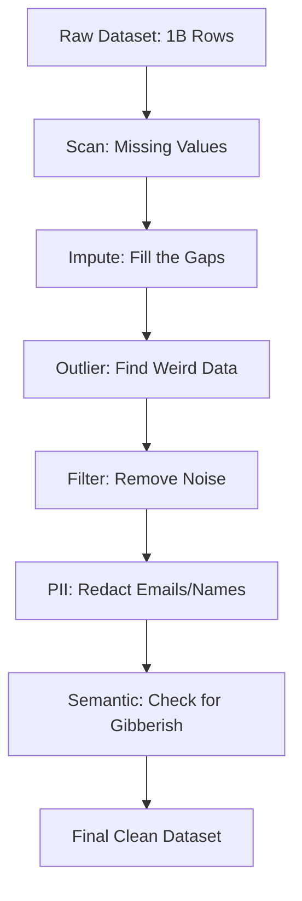

# 🧼 Data Cleaning for AI: Scrubbing the Knowledge
> **Level:** Intermediate | **Language:** Hinglish | **Goal:** Master the systematic removal of noise and errors from AI datasets, exploring Outlier detection, PII removal, and the 2026 patterns for "Semantic Cleaning" using small language models.

---

## 🧭 1. Beginner-Friendly Hinglish Explanation
Data Cleaning ek "Ghar ki safai" ki tarah hai. 

Maan lo aap ek kitabon ki almari (AI Dataset) set kar rahe hain:
- Kuch kitabein "Fati-purani" hain (Broken text).
- Kuch mein sirf "Random symbols" hain (Binary junk).
- Kuch mein kisi ka "Personal address" likha hai (Privacy risk).
- Kuch kitabein "Duplicate" hain.

**Data Cleaning** ka matlab hai in sab cheezon ko hatana taki aapka AI sirf "Sahi aur Saf" info se seekhe.
- **Outliers:** Wo data jo baaki sabse itna alag hai ki wo "Galti" lagta hai (jaise koi 200 saal ka aadmi).
- **Imputation:** Agar kisi form mein "City" missing hai, toh use "N/A" se bhar dena ya "Estimate" karna.

2026 mein, professional models "Raw internet" par train nahi hote. Wo "Polished" data par train hote hain.

---

## 🧠 2. Deep Technical Explanation
Data cleaning is the process of fixing or removing incorrect, corrupted, incorrectly formatted, duplicate, or incomplete data within a dataset.

### 1. Handling Missing Data (Imputation):
- **Mean/Median Imputation:** Replace missing values with the average. Good for simple stats.
- **K-Nearest Neighbors (KNN) Imputation:** Find similar rows and use their values to fill the gap.
- **Model-based Imputation:** Use a small model to predict the missing value.

### 2. Outlier Detection:
- **Z-Score:** If a data point is more than 3 standard deviations from the mean, it's likely an outlier.
- **Isolation Forest:** An AI algorithm specifically for finding "Anomalies" in high-dimensional data.

### 3. PII (Personally Identifiable Information) Redaction:
- Removing Emails, SSNs, Phone Numbers, and Names.
- Tools: **Microsoft Presidio**, **Private AI**, **SpaCy NER.**

### 4. Semantic Cleaning (The 2026 Way):
- Using an LLM to "Read" a sentence and say: *"Does this sentence make sense?"* 
- If the model says it's "Gibberish" or "Harmful," we delete it.

---

## 🏗️ 3. Cleaning Techniques Comparison
| Issue | Method | Tool | Risk |
| :--- | :--- | :--- | :--- |
| **Missing Values** | Imputation | Scikit-Learn | Introducing Bias |
| **Outliers** | Z-Score / IQR | Pandas / NumPy | Deleting real extremes |
| **Duplicates** | Exact / Fuzzy | Dedupe.io / MinHash| Deleting unique data |
| **Privacy (PII)** | NER Redaction | **Presidio** | Missing hidden PII |
| **Gibberish** | Perplexity Filter | **fastText** | Deleting 'Slang' |

---

## 📐 4. Mathematical Intuition
- **The Z-Score Formula:** 
  $$z = \frac{x - \mu}{\sigma}$$
  - $x$: The value.
  - $\mu$: Mean of the dataset.
  - $\sigma$: Standard deviation.
  If $|z| > 3$, the point is an outlier. This is the "Gold Standard" for cleaning numerical sensor data or financial data.

---

## 📊 5. The Data Cleaning Workflow (Diagram)


---

## 💻 6. Production-Ready Examples (PII Redaction with Python)
```python
# 2026 Pro-Tip: Never train on raw user logs. Always redact PII.

from presidio_analyzer import AnalyzerEngine
from presidio_anonymizer import AnonymizerEngine

# 1. Setup the 'Brain' that finds PII
analyzer = AnalyzerEngine()
anonymizer = AnonymizerEngine()

text = "My name is Sameer and my email is sameer@example.com."

# 2. Analyze the text
results = analyzer.analyze(text=text, entities=["PERSON", "EMAIL_ADDRESS"], language='en')

# 3. Anonymize (Replace with placeholders)
anonymized_result = anonymizer.anonymize(
    text=text,
    analyzer_results=results
)

print(f"Original: {text}")
print(f"Cleaned: {anonymized_result.text} 🛡️")
```

---

## ❌ 7. Failure Cases
- **Over-Anonymization:** Replacing "President Obama" with "[PERSON]". Now the model doesn't know who the text is about. **Fix: Use 'Pseudonymization' (Replace Sameer with User_123) instead of Redaction.**
- **Deleting Real Data:** In a stock market crash, the data looks like an "Outlier," but it's REAL and important. If you clean it, your AI will be "Blind" to crashes.
- **Bias Injection:** If you impute "Gender" based on "Salary," you will reinforce sexist stereotypes in your AI model.

---

## 🛠️ 8. Debugging Guide
- **Symptom:** "Model accuracy dropped after cleaning."
- **Check:** **Cleaning Logic**. Did you delete too many rows? Check the "Row Count" before and after. If you lost $>10\%$ of data, your filters are too strict.
- **Symptom:** "PII is still visible in logs."
- **Check:** **Regex Patterns**. Ensure you are checking for International phone formats (e.g., `+91...`).

---

## ⚖️ 9. Tradeoffs
- **Manual vs. Auto:** Manual cleaning is perfect but slow. Auto-cleaning is fast but makes mistakes. 
- **Delete vs. Correct:** 
  - Deleting is safer but reduces data size. 
  - Correcting (Imputation) is riskier but keeps the dataset large.

---

## 🛡️ 10. Security Concerns
- **Sensitive Data in Checkpoints:** If you clean the data *after* the model has started training, the model might have already "seen" the secret info. **Always clean at the START of the pipeline.**

---

## 📈 11. Scaling Challenges
- **The Million Column Problem:** Cleaning a table with 1000s of columns. You need **Parallel Processing (Dask/Spark)** to check each column for outliers.

---

## 💸 12. Cost Considerations
- **Human Labeling:** Sometimes you need humans to "Verify" the cleaning. This can cost $\$10,000+$ for a large dataset. **Strategy: Use a 'Random Sample' for human verification.**

---

## ✅ 13. Best Practices
- **Never overwrite the raw data:** Always save the cleaned version in a new file (e.g., `data_v1_clean.csv`).
- **Use standard formats:** Store cleaned data as **Parquet**—it's faster to read and keeps the "Data Types" intact.
- **Keep a 'Cleaning Log':** *"Removed 500 rows due to missing email, redacted 200 phone numbers."*

---

## ⚠️ 14. Common Mistakes
- **Assuming data is clean:** "I downloaded it from a reputable site." (Spoiler: It's still dirty).
- **Ignoring context:** Deleting "100" as an outlier in an age column, not realizing it was a dataset about "Centenarians."

---

## 📝 15. Interview Questions
1. **"What is the difference between Mean and KNN Imputation?"**
2. **"How do you handle PII in a dataset used for public AI training?"**
3. **"What are 'Isolation Forests' and how do they find anomalies?"**

---

## 🚀 15. Latest 2026 Industry Patterns
- **LLM-based Data Refinement:** Using an LLM to not just "Clean" but "Rewrite" messy logs into high-quality training text.
- **Differential Privacy:** Adding "Mathematical Noise" to a dataset so that the AI can learn patterns but can't "Identify" any single individual.
- **Clean-Room Environments:** Specialized cloud setups (like AWS Clean Rooms) where companies can "Clean and Join" their data without actually seeing each other's private records.
