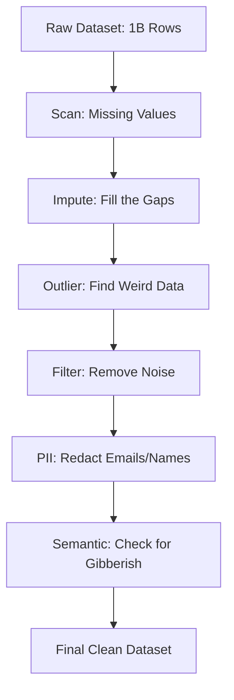

# 🧼 Data Cleaning for AI: Scrubbing the Knowledge
> **Level:** Intermediate | **Language:** Hinglish | **Goal:** AI datasets se noise aur errors ko systematically remove karne ko master karein, Outlier detection, PII removal, aur small language models ka use karke "Semantic Cleaning" ke 2026 patterns ko explore karte hue.

---

## 🧭 1. Beginner-Friendly Hinglish Explanation
Data Cleaning ek "Ghar ki safai" ki tarah hai. 

Maan lo aap ek kitabon ki almari (AI Dataset) set kar rahe hain:
- Kuch kitabein "Fati-purani" hain (Broken text).
- Kuch mein sirf "Random symbols" hain (Binary junk).
- Kuch mein kisi ka "Personal address" likha hai (Privacy risk).
- Kuch kitabein "Duplicate" hain.

**Data Cleaning** ka matlab hai in sab cheezon ko hatana taki aapka AI sirf "Sahi aur Saf" info se seekhe.
- **Outliers:** Wo data jo baaki sabse itna alag hai ki wo "Galti" lagta hai (jaise koi 200 saal ka aadmi).
- **Imputation:** Agar kisi form mein "City" missing hai, toh use "N/A" se bhar dena ya "Estimate" karna.

2026 mein, professional models "Raw internet" par train nahi hote. Wo "Polished" data par train hote hain.

---

## 🧠 2. Deep Technical Explanation
Data cleaning dataset ke andar incorrect, corrupted, galat formatted, duplicate ya incomplete data ko fix ya remove karne ki process hai.

### 1. Handling Missing Data (Imputation):
- **Mean/Median Imputation:** Missing values ko average se replace karna. Simple statistics ke liye achha hai.
- **K-Nearest Neighbors (KNN) Imputation:** Similar rows ko find karna aur gap ko fill karne ke liye unke values ka use karna.
- **Model-based Imputation:** Missing value ko predict karne ke liye ek chote model ka use karna.

### 2. Outlier Detection:
- **Z-Score:** Agar koi data point mean se 3 standard deviations se zyada door hai, toh wo ek outlier ho sakta hai.
- **Isolation Forest:** High-dimensional data mein "Anomalies" ko find karne ke liye ek specific AI algorithm.

### 3. PII (Personally Identifiable Information) Redaction:
- Emails, SSNs, Phone Numbers aur Names ko remove karna.
- Tools: **Microsoft Presidio**, **Private AI**, **SpaCy NER.**

### 4. Semantic Cleaning (The 2026 Way):
- Ek LLM ka use karke sentence ko "Read" karna aur check karna: *"Kya is sentence ka koi sense ban raha hai?"* 
- Agar model ise "Gibberish" (bakwas) ya "Harmful" batata hai, toh hum ise delete kar dete hain.

---

## 🏗️ 3. Cleaning Techniques Comparison
| Issue | Method | Tool | Risk |
| :--- | :--- | :--- | :--- |
| **Missing Values** | Imputation | Scikit-Learn | Introducing Bias |
| **Outliers** | Z-Score / IQR | Pandas / NumPy | Deleting real extremes |
| **Duplicates** | Exact / Fuzzy | Dedupe.io / MinHash| Deleting unique data |
| **Privacy (PII)** | NER Redaction | **Presidio** | Missing hidden PII |
| **Gibberish** | Perplexity Filter | **fastText** | Deleting 'Slang' |

---

## 📐 4. Mathematical Intuition
- **The Z-Score Formula:** 
  $$z = \frac{x - \mu}{\sigma}$$
  - $x$: Value.
  - $\mu$: Dataset ka Mean.
  - $\sigma$: Standard deviation.
  Agar $|z| > 3$ hai, toh point ek outlier hai. Numerical sensor data ya financial data ko clean karne ke liye ye ek "Gold Standard" hai.

---

## 📊 5. The Data Cleaning Workflow (Diagram)

```mermaid
graph TD
    Raw[Raw Dataset: 1B Rows] --> Scan[Scan: Missing Values]
    Scan --> Impute[Impute: Fill the Gaps]
    
    Impute --> Outlier[Outlier: Find Weird Data]
    Outlier --> Filter[Filter: Remove Noise]
    
    Filter --> PII[PII: Redact Emails/Names]
    PII --> Semantic[Semantic: Check for Gibberish]
    
    Semantic --> Clean[Final Clean Dataset]
```

---

## 💻 6. Production-Ready Examples (PII Redaction with Python)
```python
# 2026 Pro-Tip: Never train on raw user logs. Always redact PII.

from presidio_analyzer import AnalyzerEngine
from presidio_anonymizer import AnonymizerEngine

# 1. Setup the 'Brain' that finds PII
analyzer = AnalyzerEngine()
anonymizer = AnonymizerEngine()

text = "My name is Sameer and my email is sameer@example.com."

# 2. Analyze the text
results = analyzer.analyze(text=text, entities=["PERSON", "EMAIL_ADDRESS"], language='en')

# 3. Anonymize (Replace with placeholders)
anonymized_result = anonymizer.anonymize(
    text=text,
    analyzer_results=results
)

print(f"Original: {text}")
print(f"Cleaned: {anonymized_result.text} 🛡️")
```

---

## ❌ 7. Failure Cases
- **Over-Anonymization:** "President Obama" ko "[PERSON]" se replace karna. Ab model ko nahi pata ki text kis ke baare mein hai. **Fix: Redaction ke bajaye 'Pseudonymization' (jaise Sameer ko User_123 se replace karna) ka use karein.**
- **Deleting Real Data:** Stock market crash ke dauran data ek "Outlier" jaisa dikhta hai, par wo REAL aur important hota hai. Agar aap use clean kar denge, toh aapka AI crashes ke liye "Blind" ho jayega.
- **Bias Injection:** Agar aap "Salary" ke basis par "Gender" impute karte hain, toh aap apne AI model mein sexist stereotypes ko badhava denge.

---

## 🛠️ 8. Debugging Guide
- **Symptom:** "Cleaning ke baad model accuracy drop ho gayi."
- **Check:** **Cleaning Logic**. Kya aapne bahut saari rows delete kar di hain? Cleaning se pehle aur baad ke "Row Count" ko check karein. Agar aapne $>10\%$ data kho diya hai, toh aapke filters ko bahut strict hain.
- **Symptom:** "Logs mein abhi bhi PII dikh raha hai."
- **Check:** **Regex Patterns**. Ensure karein ki aap International phone formats (jaise `+91...`) ko bhi check kar rahe hain.

---

## ⚖️ 9. Tradeoffs
- **Manual vs. Auto:** Manual cleaning perfect hai par slow hai. Auto-cleaning fast hai par mistakes karti hai.
- **Delete vs. Correct:** 
  - Delete karna safe hai par isse data size kam ho jata hai.
  - Correct karna (Imputation) risky hai par isse dataset bada rehta hai.

---

## 🛡️ 10. Security Concerns
- **Sensitive Data in Checkpoints:** Agar aap model ki training start hone ke *baad* data clean karte hain, toh model pehle hi secret info ko "dekh" chuka hoga. **Hamesha pipeline ke START mein hi data clean karein.**

---

## 📈 11. Scaling Challenges
- **The Million Column Problem:** 1000s of columns wali table ko clean karna. Har column ke outliers ko check karne ke liye aapko **Parallel Processing (Dask/Spark)** ki need hogi.

---

## 💸 12. Cost Considerations
- **Human Labeling:** Kabhi-kabhi aapko cleaning ko "Verify" karne ke liye humans ki need hoti hai. Kisi large dataset ke liye iski cost $\$10,000+$ tak ho sakti hai. **Strategy: Human verification ke liye ek 'Random Sample' ka use karein.**

---

## ✅ 13. Best Practices
- **Never overwrite the raw data:** Raw data ko kabhi overwrite na karein. Cleaned version ko hamesha ek new file (jaise `data_v1_clean.csv`) mein save karein.
- **Use standard formats:** Cleaned data ko **Parquet** format mein store karein—ise read karna fast hota hai aur ye "Data Types" ko intact rakhta hai.
- **Keep a 'Cleaning Log':** *"Removed 500 rows due to missing email, redacted 200 phone numbers."*

---

## ⚠️ 14. Common Mistakes
- **Assuming data is clean:** "Maine ise ek reputable site se download kiya hai." (Spoiler: Fir bhi data dirty ho sakta hai).
- **Ignoring context:** Age column mein "100" ko outlier samajh kar delete kar dena, bina ye realize kiye ki ye dataset "Centenarians" (100 saal ke logo) ke baare mein tha.

---

## 📝 15. Interview Questions
1. **"Mean aur KNN Imputation ke beige kya difference hai?"**
2. **"Public AI training ke liye use hone wale dataset mein aap PII ko kaise handle karte hain?"**
3. **" 'Isolation Forests' kya hain aur ye anomalies ko kaise find karte hain?"**

---

## 🚀 15. Latest 2026 Industry Patterns
- **LLM-based Data Refinement:** LLM ka use karke sirf "Clean" hi nahi balki messy logs ko high-quality training text mein "Rewrite" karna.
- **Differential Privacy:** Dataset mein "Mathematical Noise" add karna taaki AI patterns ko seekh sake par kisi single individual ko "Identify" na kiya ja sake.
- **Clean-Room Environments:** Specialized cloud setups (jaise AWS Clean Rooms) jahan companies ek-dusre ke private records ko bina dekhe apne data ko "Clean aur Join" kar sakti hain.
