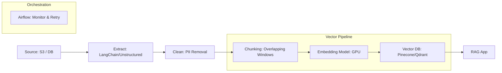

# 🏗️ Data Pipelines for AI: The Nervous System
> **Level:** Advanced | **Language:** Hinglish | **Goal:** Master the flow of data from source to model, exploring Orchestration, Data Lakes, and the 2026 patterns for building resilient, high-throughput pipelines for training and RAG.

---

## 🧭 1. Beginner-Friendly Hinglish Explanation
AI model ek "Petrol Engine" ki tarah hai. Agar aap usme "Ganda petrol" (Dirty data) dalenge ya petrol "Dheere-dheere" (Low throughput) denge, toh engine stop ho jayega.

**Data Pipeline** ka matlab hai wo "Pipes" jo data ko source (jaise Website, Database, Logs) se khinch kar AI model tak pahunchati hain.
- **Extraction:** Data ko dhoondhna.
- **Transformation:** Data ko "Saaf" karna aur "AI-Ready" banana (Markdown mein convert karna, Embeddings banana).
- **Loading:** Data ko Vector Database ya Model training folder mein save karna.

2026 mein, AI model se zyada importance "Data Flow" ki hai. Agar aapka pipeline fast aur reliable hai, toh aapka AI hamesha "Updated" aur "Smart" rahega.

---

## 🧠 2. Deep Technical Explanation
AI data pipelines are specialized **DAGs (Directed Acyclic Graphs)** that handle both unstructured and structured data.

### 1. Orchestration (The Brain):
- Tools: **Apache Airflow**, **Dagster**, **Prefect**, **Temporal.**
- These tools manage "Task Dependencies." 
- *Example:* Task B (Embeddings) should only start AFTER Task A (Text Extraction) is finished successfully.

### 2. Data Lake vs. Data Warehouse:
- **Data Lake (S3/GCS):** Stores raw, unstructured data (PDFs, Images, JSON). Essential for pretraining.
- **Data Warehouse (BigQuery/Snowflake):** Stores structured, tabular data. Used for fine-tuning on business metrics.

### 3. Mediation (The Glue):
- Pipelines must handle "Rate Limits" of AI APIs (OpenAI/Claude) and "Retry Logic" if a GPU node fails.

---

## 🏗️ 3. Pipeline Architectures
| Pattern | How it Works | Best For | Complexity |
| :--- | :--- | :--- | :--- |
| **Batch** | Process data once a day | Fine-tuning / Analytics | Low |
| **Streaming** | Process data as it arrives | Real-time RAG / Alerts | High |
| **Lambda** | Combine Batch + Stream | Enterprise Systems | Very High |
| **Medallion** | Bronze (Raw) $\to$ Silver $\to$ Gold (Clean) | Data Lake Management | **Best Practice** |

---

## 📐 4. Mathematical Intuition
- **Throughput Calculation:** 
  If you have 1 Million documents and each document takes 2 seconds to process (OCR + Embedding):
  - 1 Thread: $\sim 23$ days.
  - 100 Parallel Threads: $\sim 5.5$ hours.
  - **The Math:** $\text{Time} = \frac{\text{Docs} \times \text{Processing Time}}{\text{Parallelism}}$. 
  Data Engineering is the art of maximizing $Parallelism$.

---

## 📊 5. The AI Data Pipeline (Diagram)


---

## 💻 6. Production-Ready Examples (Simple Pipeline with Prefect)
```python
# 2026 Pro-Tip: Use 'Tasks' and 'Flows' to make your pipeline observable.

from prefect import task, flow

@task(retries=3, retry_delay_seconds=10)
def extract_data():
    # Simulate fetching data from a database
    return ["Doc 1 content", "Doc 2 content"]

@task
def transform_data(data):
    # Clean and structure the data
    return [d.upper() for d in data]

@task
def load_to_vector_db(clean_data):
    # Imagine calling Pinecone/Chroma here
    print(f"Loading {len(clean_data)} docs to Vector DB... ✅")

@flow(name="AI-Ingestion-Pipeline")
def my_ai_pipeline():
    raw_data = extract_data()
    clean_data = transform_data(raw_data)
    load_to_vector_db(clean_data)

if __name__ == "__main__":
    my_ai_pipeline()
```

---

## ❌ 7. Failure Cases
- **Data Skew:** One task gets a 500MB PDF while others get 1KB text files. The 500MB task becomes a "Bottleneck."
- **Silent Failures:** The OCR task fails and returns empty text. The pipeline says "Success," but your Vector DB is now full of "Empty" vectors. **Fix: Use Data Quality Checks (Great Expectations).**
- **Dependency Hell:** Upgrading the `sentence-transformers` library breaks the embedding task, but the rest of the pipeline keeps running.

---

## 🛠️ 8. Debugging Guide
- **Symptom:** "Pipeline is stuck."
- **Check:** **Orchestrator Logs**. Is a task waiting for a "Lock" on the database?
- **Symptom:** "Vector search is giving weird results."
- **Check:** **Transformation Logic**. Did the chunking step accidentally cut words in the middle?

---

## ⚖️ 9. Tradeoffs
- **ETL vs. ELT:** 
  - ETL: Clean data *before* storing. 
  - ELT: Store raw data *first*, then clean it inside the database. ELT is better for AI because you can re-process the raw data with new AI models later.
- **Python vs. SQL:** Python is better for unstructured data (PDFs/Images). SQL is faster for structured data.

---

## 🛡️ 10. Security Concerns
- **Credentials Leakage:** Hardcoding S3 keys in your Airflow DAGs. **Use 'Secret Managers' (Vault/AWS Secrets Manager).**

---

## 📈 11. Scaling Challenges
- **The "Thundering Herd" Problem:** When your pipeline suddenly starts 10,000 embedding requests at once, crashing the GPU server. **Use 'Rate Limiters' and 'Queues' (RabbitMQ/SQS).**

---

## 💸 12. Cost Considerations
- **Storage cost of 'Bronze' (Raw) data:** Storing every version of every PDF. **Set Lifecycle Policies to move old data to 'Cold Storage'.**

---

## ✅ 13. Best Practices
- **Idempotency:** A pipeline should be "Re-runnable." If it fails at $50\%$, running it again should not create duplicate data.
- **Schema Evolution:** What happens when you add a new field (like `summary`) to your Vector DB? Your pipeline must handle it gracefully.
- **Modular Code:** Keep your "Extractor," "Embedder," and "Loader" as separate Python classes.

---

## ⚠️ 14. Common Mistakes
- **No Monitoring:** Running a pipeline and not knowing it failed until a user complains.
- **Ignoring Retries:** Network requests fail all the time. Always use `retries=3`.

---

## 📝 15. Interview Questions
1. **"What is a DAG and why is it used in Data Engineering?"**
2. **"Explain the difference between Batch and Streaming pipelines for RAG."**
3. **"How do you ensure data quality in an automated AI pipeline?"**

---

## 🚀 15. Latest 2026 Industry Patterns
- **Declarative Pipelines:** Using tools like **dbt** or **SQLMesh** to define "What" the data should look like, and let the system figure out "How" to build it.
- **AI-Agentic Pipelines:** Pipelines that use a small LLM to "Decide" which path a document should take (e.g., *"This is a resume, send it to the HR-Chunker"*).
- **Zero-Copy Data Sharing:** Sharing data between Snowflake and your GPU server without physically "Copying" the files, saving massive time.
