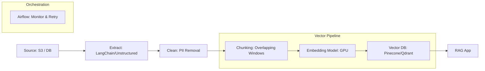

# 🏗️ Data Pipelines for AI: The Nervous System
> **Level:** Advanced | **Language:** Hinglish | **Goal:** Source se model tak data ke flow ko master karein, Orchestration, Data Lakes, aur training aur RAG ke liye resilient, high-throughput pipelines build karne ke 2026 patterns ko explore karte hue.

---

## 🧭 1. Beginner-Friendly Hinglish Explanation
AI model ek "Petrol Engine" ki tarah hai. Agar aap usme "Ganda petrol" (Dirty data) dalenge ya petrol "Dheere-dheere" (Low throughput) denge, toh engine stop ho jayega.

**Data Pipeline** ka matlab hai wo "Pipes" jo data ko source (jaise Website, Database, Logs) se khinch kar AI model tak pahunchati hain.
- **Extraction:** Data ko dhoondhna.
- **Transformation:** Data ko "Saaf" karna aur "AI-Ready" banana (Markdown mein convert karna, Embeddings banana).
- **Loading:** Data ko Vector Database ya Model training folder mein save karna.

2026 mein, AI model se zyada importance "Data Flow" ki hai. Agar aapka pipeline fast aur reliable hai, toh aapka AI hamesha "Updated" aur "Smart" rahega.

---

## 🧠 2. Deep Technical Explanation
AI data pipelines specialized **DAGs (Directed Acyclic Graphs)** hote hain jo structured aur unstructured dono tarah ke data ko handle karte hain.

### 1. Orchestration (The Brain):
- Tools: **Apache Airflow**, **Dagster**, **Prefect**, **Temporal.**
- Ye tools "Task Dependencies" ko manage karte hain. 
- *Example:* Task B (Embeddings) tabhi start hona chahiye jab Task A (Text Extraction) successfully finish ho jaye.

### 2. Data Lake vs. Data Warehouse:
- **Data Lake (S3/GCS):** Raw, unstructured data (PDFs, Images, JSON) ko store karta hai. Pretraining ke liye essential hai.
- **Data Warehouse (BigQuery/Snowflake):** Structured, tabular data ko store karta hai. Business metrics par fine-tuning karne ke liye use hota hai.

### 3. Mediation (The Glue):
- Pipelines ko AI APIs (OpenAI/Claude) ke "Rate Limits" aur agar koi GPU node fail ho jaye toh "Retry Logic" ko handle karna padta hai.

---

## 🏗️ 3. Pipeline Architectures
| Pattern | How it Works | Best For | Complexity |
| :--- | :--- | :--- | :--- |
| **Batch** | Process data once a day | Fine-tuning / Analytics | Low |
| **Streaming** | Process data as it arrives | Real-time RAG / Alerts | High |
| **Lambda** | Combine Batch + Stream | Enterprise Systems | Very High |
| **Medallion** | Bronze (Raw) $\to$ Silver $\to$ Gold (Clean) | Data Lake Management | **Best Practice** |

---

## 📐 4. Mathematical Intuition
- **Throughput Calculation:** 
  Agar aapke paas 1 Million documents hain aur har document ko process karne mein (OCR + Embedding) 2 seconds lagte hain:
  - 1 Thread: $\sim 23$ days.
  - 100 Parallel Threads: $\sim 5.5$ hours.
  - **The Math:** $\text{Time} = \frac{\text{Docs} \times \text{Processing Time}}{\text{Parallelism}}$. 
  Data Engineering asal mein $Parallelism$ ko maximize karne ki art hai.

---

## 📊 5. The AI Data Pipeline (Diagram)

```mermaid
graph LR
    Src[Source: S3 / DB] --> Extract[Extract: LangChain/Unstructured]
    Extract --> Clean[Clean: PII Removal]
    Clean --> Chunk[Chunking: Overlapping Windows]
    
    subgraph "Vector Pipeline"
    Chunk --> Embed[Embedding Model: GPU]
    Embed --> VDB[Vector DB: Pinecone/Qdrant]
    end
    
    subgraph "Orchestration"
    Airflow[Airflow: Monitor & Retry]
    end
    
    VDB --> App[RAG App]
```

---

## 💻 6. Production-Ready Examples (Simple Pipeline with Prefect)
```python
# 2026 Pro-Tip: Use 'Tasks' and 'Flows' to make your pipeline observable.

from prefect import task, flow

@task(retries=3, retry_delay_seconds=10)
def extract_data():
    # Simulate fetching data from a database
    return ["Doc 1 content", "Doc 2 content"]

@task
def transform_data(data):
    # Clean and structure the data
    return [d.upper() for d in data]

@task
def load_to_vector_db(clean_data):
    # Imagine calling Pinecone/Chroma here
    print(f"Loading {len(clean_data)} docs to Vector DB... ✅")

@flow(name="AI-Ingestion-Pipeline")
def my_ai_pipeline():
    raw_data = extract_data()
    clean_data = transform_data(raw_data)
    load_to_vector_db(clean_data)

if __name__ == "__main__":
    my_ai_pipeline()
```

---

## ❌ 7. Failure Cases
- **Data Skew:** Alignment issue. Kisi ek task ko 500MB ki PDF milti hai aur dusron ko 1KB ki text files. Wo 500MB wala task ek "Bottleneck" ban jata hai.
- **Silent Failures:** OCR task fail ho jata hai aur empty text return karta hai. Pipeline "Success" show karti hai, par aapka Vector DB ab "Empty" vectors se bhar chuka hai. **Fix: Data Quality Checks (jaise Great Expectations) ka use karein.**
- **Dependency Hell:** `sentence-transformers` library ko upgrade karne se embedding task break ho jata hai, par baaki pipeline chalti rehti hai.

---

## 🛠️ 8. Debugging Guide
- **Symptom:** "Pipeline stuck hai."
- **Check:** **Orchestrator Logs**. Is a task waiting for a "Lock" on the database?
- **Symptom:** "Vector search ajeeb results de raha hai."
- **Check:** **Transformation Logic**. Did the chunking step accidentally cut words in the middle?

---

## ⚖️ 9. Tradeoffs
- **ETL vs. ELT:** 
  - ETL: Data ko store karne se *pehle* clean karna.
  - ELT: Raw data ko *pehle* store karna, phir use database ke andar clean karna. ELT AI ke liye behtar hai kyunki aap yaad mein raw data ko new AI models ke sath re-process kar sakte hain.
- **Python vs. SQL:** Python unstructured data (PDFs/Images) ke liye behtar hai. SQL structured data ke liye fast hai.

---

## 🛡️ 10. Security Concerns
- **Credentials Leakage:** Apne Airflow DAGs mein S3 keys ko hardcode karna. **Hamesha 'Secret Managers' (jaise Vault/AWS Secrets Manager) ka use karein.**

---

## 📈 11. Scaling Challenges
- **The "Thundering Herd" Problem:** Jab aapka pipeline ek sath 10,000 embedding requests start kar deta hai, jisse GPU server crash ho jata hai. **Iske liye 'Rate Limiters' aur 'Queues' (RabbitMQ/SQS) ka use karein.**

---

## 💸 12. Cost Considerations
- **Storage cost of 'Bronze' (Raw) data:** Storing every version of every PDF. **Old data ko 'Cold Storage' mein move karne ke liye Lifecycle Policies set karein.**

---

## ✅ 13. Best Practices
- **Idempotency:** Ek pipeline "Re-runnable" hona chahiye. Agar ye $50\%$ par fail hota hai, toh ise fir se run karne par duplicate data create nahi hona chahiye.
- **Schema Evolution:** What happens when you add a new field (like `summary`) to your Vector DB? Your pipeline must handle it gracefully.
- **Modular Code:** Apne "Extractor", "Embedder" aur "Loader" ko separate Python classes ke roop mein rakhein.

---

## ⚠️ 14. Common Mistakes
- **No Monitoring:** Pipeline ko run karna aur user ke complain karne tak uske fail hone ke baare mein na pata chalna.
- **Ignoring Retries:** Network requests har samay fail ho sakti hain. Hamesha `retries=3` ka use karein.

---

## 📝 15. Interview Questions
1. **"DAG kya hai aur ise Data Engineering mein kyu use kiya jata hai?"**
2. **"RAG ke liye Batch aur Streaming pipelines ke beige difference ko explain karein."**
3. **"Aap ek automated AI pipeline mein data quality kaise ensure karte hain?"**

---

## 🚀 15. Latest 2026 Industry Patterns
- **Declarative Pipelines:** **dbt** ya **SQLMesh** jaise tools ka use karke ye define karna ki data "kaisa" dikhna chahiye, aur system ko khud figure out karne dena ki ise "kaise" banana hai.
- **AI-Agentic Pipelines:** Pipelines jo ek chote LLM ka use karke "Decide" karte hain ki kisi document ko kaun sa path lena chahiye (jaise, *"Ye ek resume hai, ise HR-Chunker ke paas bhejo"*).
- **Zero-Copy Data Sharing:** Files ko physically "Copy" kiye bina Snowflake aur GPU server ke beige data share karna, jisse massive time save hota hai.
