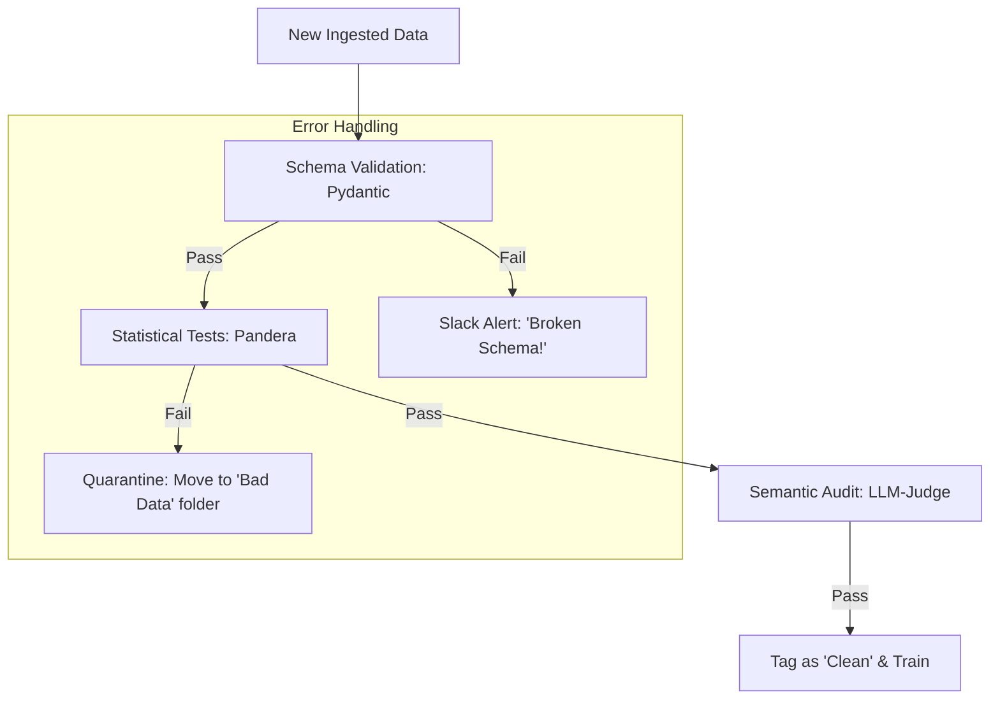

# 💎 Data Quality for AI: The Gold Standard
> **Level:** Intermediate | **Language:** Hinglish | **Goal:** Master the systematic verification of AI data, exploring Unit Tests for data, Schema Validation, and the 2026 patterns for "Automated Data Auditing" to prevent model degradation.

---

## 🧭 1. Beginner-Friendly Hinglish Explanation
Maan lo aap ek AI bana rahe hain jo "Chay" (Tea) banana sikhaye. 
- Agar aapke dataset mein 1000 recipes hain, par unme se 100 mein "Namak" (Salt) likha hai bajaye "Chini" (Sugar) ke, toh aapka AI "Gandi chay" banayega.

**Data Quality** ka matlab hai: "Data ko train karne se pehle ye check karna ki wo Sahi, Complete, aur Consistent hai."
- **Accuracy:** Kya data sach hai? (E.g., "Paris is the capital of France" vs "Paris is in Italy").
- **Completeness:** Kya koi zaroori field khali toh nahi?
- **Consistency:** Kya har jagah "Date" ka format same hai (DD-MM-YYYY)?

2026 mein, hum data ko "Ankh band karke" (Blindly) use nahi karte. Hum data ke liye bhi "Unit Tests" likhte hain.

---

## 🧠 2. Deep Technical Explanation
Data Quality (DQ) for AI is about maintaining the integrity of the data throughout its lifecycle.

### 1. Schema Validation:
- Ensuring data follows a strict structure (e.g., `user_id` must be an integer, `email` must match a regex).
- Tools: **Pydantic**, **Pandera**, **JSON Schema.**

### 2. Statistical DQ (Unit Tests for Data):
- **Range Checks:** "Age" must be between 0 and 120.
- **Null Checks:** "Text" column must not have more than $5\%$ empty values.
- **Distribution Checks:** Ensure that the "Sentiment" distribution hasn't suddenly changed from $50\%$ positive to $99\%$ positive (which indicates a data collection error).

### 3. Great Expectations (The Industry Standard):
- A library that allows you to write "Expectations" for your data. 
- *Example:* "I expect the 'price' column to be non-negative."
- It generates beautiful "Data Quality Reports" automatically.

### 4. Semantic Quality:
- Using a "Model-as-a-Judge" to check if the data is toxic, biased, or nonsensical.

---

## 🏗️ 3. Data Quality Pillars
| Pillar | Metric | Goal |
| :--- | :--- | :--- |
| **Validity** | Schema matching | Data follows the rules |
| **Accuracy** | Real-world truth | Data is factually correct |
| **Completeness** | Null count | No missing information |
| **Consistency** | Standardized formats | Same data looks the same everywhere |
| **Timeliness** | Freshness | Data is not outdated |
| **Uniqueness** | Duplicate count | No redundant information |

---

## 📐 4. Mathematical Intuition
- **The Kullback-Leibler (KL) Divergence:** 
  We use KL Divergence to measure **"Dataset Drift."** 
  - If $P$ is the distribution of your original training data.
  - If $Q$ is the distribution of the NEW data coming in today.
  - If $D_{KL}(P || Q)$ is high, it means the data has changed significantly, and your model might fail. This is a mathematical "Red Alert" for Data Quality.

---

## 📊 5. The Data Quality Loop (Diagram)


---

## 💻 6. Production-Ready Examples (Data Validation with Pandera)
```python
# 2026 Pro-Tip: Use Pandera to enforce types and ranges in your DataFrames.

import pandas as pd
import pandera as pa

# 1. Define the 'Expectations' (The Schema)
schema = pa.DataFrameSchema({
    "user_id": pa.Column(int, checks=pa.Check.gt(0)),
    "email": pa.Column(str, checks=pa.Check.str_matches(r".+@.+\..+")),
    "rating": pa.Column(float, checks=pa.Check.in_range(1, 5)),
})

# 2. Sample Data
df = pd.DataFrame({
    "user_id": [1, 2, 3],
    "email": ["a@b.com", "c@d.com", "bad-email"],
    "rating": [4.5, 3.0, 6.0] # 6.0 is out of range!
})

# 3. Validate
try:
    schema.validate(df)
except pa.errors.SchemaErrors as err:
    print("Data Quality Failed! ❌")
    print(err.failure_cases) # Shows exactly which rows and values failed
```

---

## ❌ 7. Failure Cases
- **Silent Degradation:** The data format changed slightly (e.g., prices are now in "Cents" instead of "Dollars"). Your code doesn't crash, but your model's predictions become $100x$ wrong.
- **The "N/A" Trap:** A dataset where $90\%$ of rows have "N/A" in the most important column. The model trains on the remaining $10\%$, creating a biased view of the world.
- **Feedback Loops:** Training an AI on its own output (Synthetic data) without quality checks. The errors multiply until the model becomes unusable.

---

## 🛠️ 8. Debugging Guide
- **Symptom:** "Model is biased against a certain group."
- **Check:** **Class Balance**. Check your dataset stats. Does one group represent only $0.1\%$ of the data? Use **Synthetic Minority Over-sampling (SMOTE)** to fix it.
- **Symptom:** "NaN Errors during training."
- **Check:** **Input data**. A single "NaN" (Not a Number) value in a hidden column can cause the whole neural network's weights to become "NaN" (Infinity).

---

## ⚖️ 9. Tradeoffs
- **Strict vs. Loose Validation:** 
  - Strict: Your pipeline stops for every tiny error (Safe but slow). 
  - Loose: You ignore small errors to keep the pipeline moving (Risky).
- **Manual vs. Automated Audit:** 
  - Manual (Human) is best for "Nonsense" detection. 
  - Automated is best for "Format" detection.

---

## 🛡️ 10. Security Concerns
- **Adversarial Data Quality:** An attacker purposely sends data that is "Just on the edge" of your quality checks (e.g., age 119) to mess up your model's statistics without triggering alerts.

---

## 📈 11. Scaling Challenges
- **DQ at Petabyte Scale:** You can't run Pydantic on 1 Billion rows in one go. You need **distributed DQ tools** like **Deequ (for Spark)** or **Cloud Dataprep.**

---

## 💸 12. Cost Considerations
- **Data Quality as Insurance:** Spending $\$5,000$ on automated DQ tools can save you $\$500,000$ in lost revenue caused by a broken model in production.

---

## ✅ 13. Best Practices
- **Data Quality as a 'Gate':** If DQ fails, the training job should NOT start.
- **Measure 'Freshness':** If your RAG data is older than 24 hours, trigger an alert.
- **Use 'Great Expectations' for external data:** Never trust data provided by a third-party without running it through a DQ suite.

---

## ⚠️ 14. Common Mistakes
- **Only checking the Schema:** Checking that `price` is a float but not checking that `price` is $> 0$.
- **Ignoring the 'Why':** Finding bad data and deleting it, but not fixing the "Source" (The broken sensor or scraping script).

---

## 📝 15. Interview Questions
1. **"How do you handle 'Dataset Drift' in a production AI system?"** (KL Divergence).
2. **"What is the role of 'Great Expectations' in an MLOps pipeline?"**
3. **"How do you detect 'Silent Failures' in your data?"**

---

## 🚀 15. Latest 2026 Industry Patterns
- **Generative DQ:** Using a specialized "DQ-Model" that automatically WRITES the test cases for your data after observing it for a few days.
- **In-Database Validation:** Running quality checks directly inside Snowflake or BigQuery using SQL-based DQ rules.
- **Continuous Auditing:** A background AI agent that constantly "Surfs" your vector database to find and flag hallucinations or incorrect embeddings.
