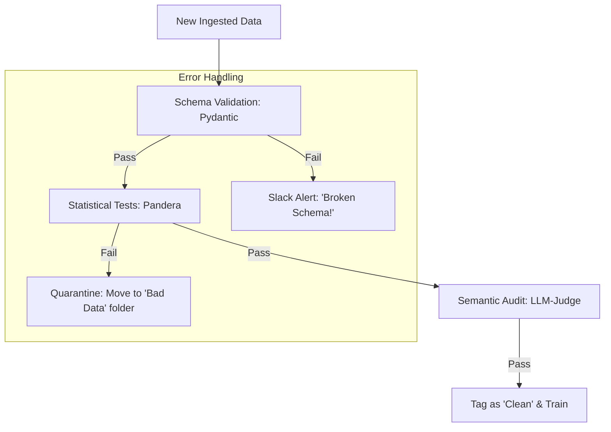

# 💎 Data Quality for AI: The Gold Standard
> **Level:** Intermediate | **Language:** Hinglish | **Goal:** AI data ke systematic verification ko master karein, data ke liye Unit Tests, Schema Validation, aur model degradation ko rokne ke liye "Automated Data Auditing" ke 2026 patterns ko explore karte hue.

---

## 🧭 1. Beginner-Friendly Hinglish Explanation
Maan lo aap ek AI bana rahe hain jo "Chay" (Tea) banana sikhaye. 
- Agar aapke dataset mein 1000 recipes hain, par unme se 100 mein "Namak" (Salt) likha hai bajaye "Chini" (Sugar) ke, toh aapka AI "Gandi chay" banayega.

**Data Quality** ka matlab hai: "Data ko train karne se pehle ye check karna ki wo Sahi, Complete, aur Consistent hai."
- **Accuracy:** Kya data sach hai? (E.g., "Paris is the capital of France" vs "Paris is in Italy").
- **Completeness:** Kya koi zaroori field khali toh nahi?
- **Consistency:** Kya har jagah "Date" ka format same hai (DD-MM-YYYY)?

2026 mein, hum data ko "Ankh band karke" (Blindly) use nahi karte. Hum data ke liye bhi "Unit Tests" likhte hain.

---

## 🧠 2. Deep Technical Explanation
AI ke liye Data Quality (DQ) ka matlab pure lifecycle ke dauran data ki integrity ko maintain rakhna hai.

### 1. Schema Validation:
- Ye ensure karna ki data ek strict structure ko follow kare (jaise `user_id` integer hona chahiye, `email` regex ke sath match hona chahiye).
- Tools: **Pydantic**, **Pandera**, **JSON Schema.**

### 2. Statistical DQ (Unit Tests for Data):
- **Range Checks:** "Age" hamesha 0 aur 120 ke beech honi chahiye.
- **Null Checks:** "Text" column mein $5\%$ se zyada empty values nahi honi chahiye.
- **Distribution Checks:** Ensure karein ki "Sentiment" ki distribution achanak $50\%$ positive se $99\%$ positive par change na ho gayi ho (jo data collection error ki taraf ishara karta hai).

### 3. Great Expectations (The Industry Standard):
- Ek library jo aapko aapke data ke liye "Expectations" (ummeedein) likhne ki permission deti hai.
- *Example:* "I expect the 'price' column to be non-negative."
- Ye automatically beautiful "Data Quality Reports" generate karti hai.

### 4. Semantic Quality:
- Data toxic, biased, ya nonsensical toh nahi hai, ye check karne ke liye "Model-as-a-Judge" ka use karna.

---

## 🏗️ 3. Data Quality Pillars
| Pillar | Metric | Goal |
| :--- | :--- | :--- |
| **Validity** | Schema matching | Data follows the rules |
| **Accuracy** | Real-world truth | Data is factually correct |
| **Completeness** | Null count | No missing information |
| **Consistency** | Standardized formats | Same data looks the same everywhere |
| **Timeliness** | Freshness | Data is not outdated |
| **Uniqueness** | Duplicate count | No redundant information |

---

## 📐 4. Mathematical Intuition
- **The Kullback-Leibler (KL) Divergence:** 
  Hum **"Dataset Drift"** ko measure karne ke liye KL Divergence ka use karte hain.
  - Agar $P$ aapke original training data ki distribution hai.
  - Agar $Q$ aaj aane wale NAYE data ki distribution hai.
  - Agar $D_{KL}(P || Q)$ high hai, toh iska matlab hai ki data significantly change ho gaya hai, aur aapka model fail ho sakta hai. Data Quality ke liye ye ek mathematical "Red Alert" hai.

---

## 📊 5. The Data Quality Loop (Diagram)

```mermaid
graph TD
    Data[New Ingested Data] --> Schema[Schema Validation: Pydantic]
    Schema -- "Pass" --> Stats[Statistical Tests: Pandera]
    Stats -- "Pass" --> Semantic[Semantic Audit: LLM-Judge]
    
    subgraph "Error Handling"
    Schema -- "Fail" --> Alert[Slack Alert: 'Broken Schema!']
    Stats -- "Fail" --> Reject[Quarantine: Move to 'Bad Data' folder]
    end
    
    Semantic -- "Pass" --> Ready[Tag as 'Clean' & Train]
```

---

## 💻 6. Production-Ready Examples (Data Validation with Pandera)
```python
# 2026 Pro-Tip: Use Pandera to enforce types and ranges in your DataFrames.

import pandas as pd
import pandera as pa

# 1. Define the 'Expectations' (The Schema)
schema = pa.DataFrameSchema({
    "user_id": pa.Column(int, checks=pa.Check.gt(0)),
    "email": pa.Column(str, checks=pa.Check.str_matches(r".+@.+\..+")),
    "rating": pa.Column(float, checks=pa.Check.in_range(1, 5)),
})

# 2. Sample Data
df = pd.DataFrame({
    "user_id": [1, 2, 3],
    "email": ["a@b.com", "c@d.com", "bad-email"],
    "rating": [4.5, 3.0, 6.0] # 6.0 is out of range!
})

# 3. Validate
try:
    schema.validate(df)
except pa.errors.SchemaErrors as err:
    print("Data Quality Failed! ❌")
    print(err.failure_cases) # Shows exactly which rows and values failed
```

---

## ❌ 7. Failure Cases
- **Silent Degradation:** Data format thoda sa change ho jana (jaise prices ab "Dollars" ke bajaye "Cents" mein hain). Aapka code crash nahi hoga, par aapke model ke predictions $100x$ galat ho jayenge.
- **The "N/A" Trap:** Ek aisa dataset jahan $90\%$ rows ke sabse important column mein "N/A" likha ho. Model bache hue $10\%$ par hi train ho jata hai, jisse duniya ka ek biased view create hota hai.
- **Feedback Loops:** Bina quality checks ke AI ko uske apne hi output (Synthetic data) par train karna. Errors multiply hote chale jate hain jab tak ki model bilkul unusable na ho jaye.

---

## 🛠️ 8. Debugging Guide
- **Symptom:** "Model kisi particular group ke against biased hai."
- **Check:** **Class Balance**. Apne dataset ke statistics check karein. Kya koi group data ka sirf $0.1\%$ hi represent kar raha hai? Ise fix karne ke liye **Synthetic Minority Over-sampling (SMOTE)** ka use karein.
- **Symptom:** "Training ke dauran NaN Errors aa rahe hain."
- **Check:** **Input data**. Kisi hidden column mein ek single "NaN" (Not a Number) value pure neural network ke weights ko "NaN" (Infinity) bana sakti hai.

---

## ⚖️ 9. Tradeoffs
- **Strict vs. Loose Validation:** 
  - Strict: Har ek chote error par aapka pipeline stop ho jata hai (Safe par slow).
  - Loose: Pipeline ko chalta rakhne ke liye aap chote errors ko ignore kar dete hain (Risky).
- **Manual vs. Automated Audit:** 
  - Manual (Human) audit "Nonsense" (bakwas) detect karne ke liye best hai.
  - Automated audit "Format" detect karne ke liye best hai.

---

## 🛡️ 10. Security Concerns
- **Adversarial Data Quality:** Ek attacker jaanबूझकर aisa data send karta hai jo aapke quality checks ki "boundary" (jaise age 119) par ho, taaki bina kisi alert ko trigger kiye aapke model ke statistics ko kharab kar sake.

---

## 📈 11. Scaling Challenges
- **DQ at Petabyte Scale:** Aap 1 Billion rows par ek sath Pydantic run nahi kar sakte. Iske liye aapko **distributed DQ tools** jaise **Deequ (Spark ke liye)** ya **Cloud Dataprep** ki zaroorat padegi.

---

## 💸 12. Cost Considerations
- **Data Quality as Insurance:** Automated DQ tools par $\$5,000$ spend karna production mein broken model ki wajah se hone wale $\$500,000$ ke revenue loss ko bachane ke barabar hai.

---

## ✅ 13. Best Practices
- **Data Quality as a 'Gate':** Agar DQ fail hota hai, toh training job start nahi honi chahiye.
- **Measure 'Freshness':** Agar aapka RAG data 24 hours se zyada purana hai, toh alert trigger karein.
- **Use 'Great Expectations' for external data:** Kisi third-party ke diye gaye data par bina DQ suite run kiye kabhi trust na karein.

---

## ⚠️ 14. Common Mistakes
- **Only checking the Schema:** Ye check karna ki `price` float hai par ye check na karna ki `price` $> 0$ hona chahiye.
- **Ignoring the 'Why':** Bad data milne par use delete toh kar dena, par "Source" (jaise broken sensor ya scraping script) ko fix na karna.

---

## 📝 15. Interview Questions
1. **"Aap production AI system mein 'Dataset Drift' ko kaise handle karte hain?"** (KL Divergence).
2. **"MLOps pipeline mein 'Great Expectations' ka kya role hai?"**
3. **"Aap apne data mein 'Silent Failures' ko kaise detect karte hain?"**

---

## 🚀 15. Latest 2026 Industry Patterns
- **Generative DQ:** Ek specialized "DQ-Model" ka use karna jo data ko kuch din observe karne ke baad automatically test cases likh leta hai.
- **In-Database Validation:** SQL-based DQ rules ka use karke Snowflake ya BigQuery ke andar hi directly quality checks run karna.
- **Continuous Auditing:** Ek background AI agent jo hallucinations ya incorrect embeddings ko find aur flag karne ke liye aapke vector database ko continuously "Surf" karta rehta hai.
