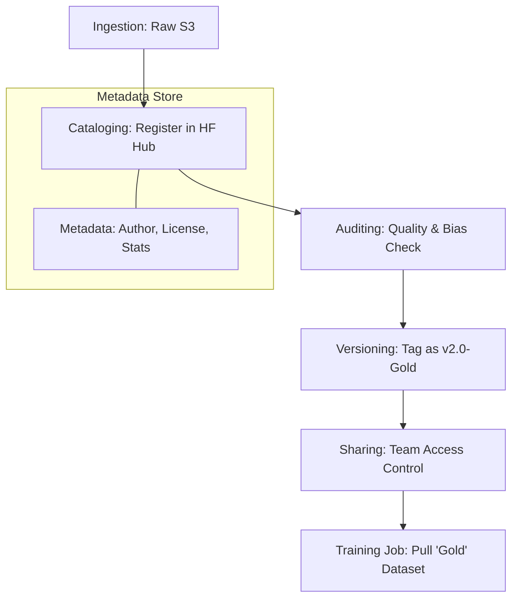

# 🗃️ Dataset Management: The Librarian of AI
> **Level:** Intermediate | **Language:** Hinglish | **Goal:** Master the organization, storage, and sharing of AI datasets, exploring Model Cards, Data Catalogs, and the 2026 patterns for managing "Data Lifecycle" in enterprise AI.

---

## 🧭 1. Beginner-Friendly Hinglish Explanation
Model train karne ke liye aapko hazaron "Datasets" chahiye hote hain. 

- **The Problem:** 6 mahine baad aapko yaad nahi rehta ki "Dataset_v2.zip" mein kya tha? Wo kisne banaya tha? Kya wo data "Copyrighted" hai ya "Public"?
- **Dataset Management** ka matlab hai: "Data ko ek system mein organize karna." 

Ye bilkul ek **Library** ki tarah hai:
1. Har dataset par ek "Label" (Metadata) hota hai.
2. Har dataset ka ek "Malik" (Owner) hota hai.
3. Humein pata hota hai ki ye data "Kahan se aaya" (Source) aur "Kahan gaya" (Lineage).

2026 mein, data sirf ek "File" nahi hai, wo ek **Asset** hai jise dhyan se manage karna padta hai legal aur quality reasons ki wajah se.

---

## 🧠 2. Deep Technical Explanation
Dataset management involves **Cataloging**, **Versioning**, and **Governance.**

### 1. The Data Catalog:
- Tools: **HuggingFace Hub**, **Unity Catalog (Databricks)**, **Alation.**
- A searchable UI where you can find all datasets in your company. 
- You can filter by "Size," "Modality" (Text/Image), or "License."

### 2. Model Cards & Data Cards:
- A "Passport" for each dataset.
- It contains:
  - **Motivation:** Why was this data collected?
  - **Composition:** What is inside (e.g., 50% code, 50% news)?
  - **Collection Process:** Scraped? Human-labeled?
  - **Ethical Considerations:** Does it contain bias?

### 3. Data Sovereignty & Localization:
- Ensuring that "European User Data" stays in Europe and isn't used to train a model in the USA (GDPR compliance).

---

## 🏗️ 3. Dataset Storage Formats
| Format | Best For | Compression | Speed |
| :--- | :--- | :--- | :--- |
| **JSONL** | Small/Medium Text | Moderate | Slow |
| **Parquet** | **Tabular Data** | **High (Columnar)** | **Fast** |
| **TFRecord** | TensorFlow / Images | High | Fast |
| **WebDataset** | **Giant Image/Audio sets** | **High (Sharded)** | **Extreme (Sequential)** |
| **Arrow** | In-memory processing | None | Instant |

---

## 📐 4. Mathematical Intuition
- **The Sampling Bias:** 
  If you have a 10TB dataset, you can't read it all to check for bias. You must use **Stratified Sampling**. 
  - If $1\%$ of your data is "Medical," your $1$GB sample must also have exactly $1\%$ medical data. 
  - Management tools help you track these **Distributions** automatically.

---

## 📊 5. Dataset Management Lifecycle (Diagram)


---

## 💻 6. Production-Ready Examples (Creating a Dataset Card - Markdown)
```markdown
# 📄 Dataset Card: Legal-Hindi-v1

### 1. Overview
- **Owner:** SusaLabs AI Team
- **Modality:** Text (Instruction-Response)
- **Language:** Hindi (Devanagari)
- **Size:** 50,000 pairs (200MB)

### 2. Source
- Scraped from Indian High Court public judgments.
- Cleaned by 'Hindi-Cleaning-Bot-v2'.

### 3. License
- CC-BY-SA 4.0 (Open for Research and Commercial use).

### 4. Known Biases
- Over-representation of property disputes. Under-representation of criminal law.

### 5. Version History
- **v1.0:** Initial release.
- **v1.1:** Fixed Unicode errors in Marathi-origin names.
```

---

## ❌ 7. Failure Cases
- **Data Orphanage:** A team spends $\$50,000$ to create a dataset, but the engineer leaves the company, and nobody knows where the S3 bucket is.
- **License Violation:** Training a commercial model on "GPL" or "Research Only" data. The company gets sued for Millions. **Fix: Use 'License Validation' in your data catalog.**
- **Version Mismatch:** Researcher A is using "V2" and Researcher B is using "V3," but they are comparing their models' accuracies. The results are scientifically invalid.

---

## 🛠️ 8. Debugging Guide
- **Symptom:** "Dataset is too slow to load during training."
- **Check:** **Storage Format**. Are you reading 1 Million small JSON files? Convert them to **WebDataset (tar files)** to read them sequentially.
- **Symptom:** "Unauthorized access error."
- **Check:** **IAM Roles / Permissions**. Ensure the training GPU node has read access to the specific S3 bucket.

---

## ⚖️ 9. Tradeoffs
- **Centralized vs. De-centralized:** 
  - Centralized (One big Hub) is easy to manage but can become a bottleneck. 
  - De-centralized (Every team has their own S3) is flexible but creates "Data Silos."
- **Raw vs. Processed:** Storing only "Final" data vs. storing every intermediate step. Storing every step uses $10x$ more space but is safer for auditing.

---

## 🛡️ 10. Security Concerns
- **Dataset Poisoning:** An attacker modifies a dataset in the Hub to include a "Backdoor." **Use 'Write-once' policies for production datasets.**

---

## 📈 11. Scaling Challenges
- **The Petabyte Catalog:** Searching through 1 Million datasets. You need **Semantic Search** (Vector search) to find the right dataset (e.g., *"Find me datasets about Hindi Legal documents"*).

---

## 💸 12. Cost Considerations
- **Storage duplication:** 10 teams having their own copy of Wikipedia. **Solution: Use 'Deduplication' at the storage layer or 'Reference links'.**

---

## ✅ 13. Best Practices
- **Auto-generate Stats:** Every dataset in your hub should automatically show: "Word Count," "Language Distribution," and "Top 10 Topics."
- **Immutable Tags:** Once a dataset is tagged as `v1.0`, it should NEVER be modified. Any change must result in `v1.1`.
- **Set Retention Policies:** Automatically delete "Intermediate/Temporary" datasets after 30 days to save cost.

---

## ⚠️ 14. Common Mistakes
- **No Documentation:** A folder named `data_final_final_2` with no README.
- **Ignoring Data Privacy:** Storing sensitive data in a shared team hub without "Masking."

---

## 📝 15. Interview Questions
1. **"What is a 'Model Card' and how does it differ from a 'Data Card'?"**
2. **"Which storage format would you choose for 1 Billion images for training? Why?"** (WebDataset/Sequential).
3. **"How do you handle dataset versioning for a model that needs to be retrained every week?"**

---

## 🚀 15. Latest 2026 Industry Patterns
- **Dataset-as-a-Service (DaaS):** Internal APIs that serve "Slices" of data on-demand, rather than making you download a giant ZIP file.
- **AI Governance Portals:** Dashboards for legal teams to see exactly what data was used to train "Model X" to ensure compliance.
- **Auto-Discovery:** Tools that scan your S3 buckets and "Guess" the contents to automatically build a catalog for you.
