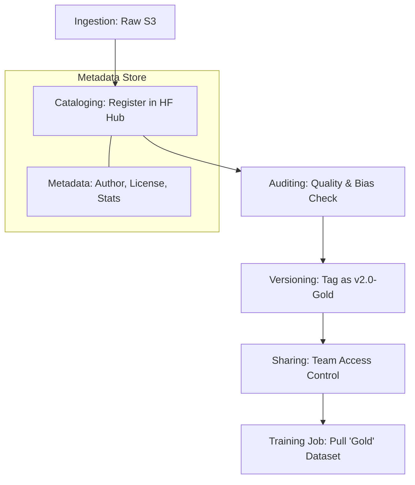

# 🗃️ Dataset Management: The Librarian of AI
> **Level:** Intermediate | **Language:** Hinglish | **Goal:** AI datasets ke organization, storage, aur sharing ko master karein, Model Cards, Data Catalogs, aur enterprise AI mein "Data Lifecycle" manage karne ke 2026 patterns ko explore karte hue.

---

## 🧭 1. Beginner-Friendly Hinglish Explanation
Model train karne ke liye aapko hazaron "Datasets" chahiye hote hain. 

- **The Problem:** 6 mahine baad aapko yaad nahi rehta ki "Dataset_v2.zip" mein kya tha? Wo kisne banaya tha? Kya wo data "Copyrighted" hai ya "Public"?
- **Dataset Management** ka matlab hai: "Data ko ek system mein organize karna." 

Ye bilkul ek **Library** ki tarah hai:
1. Har dataset par ek "Label" (Metadata) hota hai.
2. Har dataset ka ek "Malik" (Owner) hota.
3. Humein pata hota hai ki ye data "Kahan se aaya" (Source) aur "Kahan gaya" (Lineage).

2026 mein, data sirf ek "File" nahi hai, wo ek **Asset** hai jise dhyan se manage karna padta hai legal aur quality reasons ki wajah se.

---

## 🧠 2. Deep Technical Explanation
Dataset management mein **Cataloging**, **Versioning** aur **Governance** shamil hain.

### 1. The Data Catalog:
- Tools: **HuggingFace Hub**, **Unity Catalog (Databricks)**, **Alation.**
- Ek searchable UI jahan aap apni company ke sabhi datasets dhoondh sakte hain.
- Aap "Size", "Modality" (Text/Image) ya "License" ke basis par filter kar sakte hain.

### 2. Model Cards & Data Cards:
- Har dataset ke liye ek tarah ka "Passport".
- Isme shamil hote hain:
  - **Motivation:** Ye data kyu collect kiya gaya tha?
  - **Composition:** Iske andar kya hai (jaise $50\%$ code, $50\%$ news)?
  - **Collection Process:** Data kaise collect kiya gaya? (Scraped? Human-labeled?)
  - **Ethical Considerations:** Kya isme koi bias hai?

### 3. Data Sovereignty & Localization:
- Ye ensure karna ki "European User Data" Europe mein hi rahe aur use USA mein kisi model ko train karne ke liye use na kiya jaye (GDPR compliance).

---

## 🏗️ 3. Dataset Storage Formats
| Format | Best For | Compression | Speed |
| :--- | :--- | :--- | :--- |
| **JSONL** | Small/Medium Text | Moderate | Slow |
| **Parquet** | **Tabular Data** | **High (Columnar)** | **Fast** |
| **TFRecord** | TensorFlow / Images | High | Fast |
| **WebDataset** | **Giant Image/Audio sets** | **High (Sharded)** | **Extreme (Sequential)** |
| **Arrow** | In-memory processing | None | Instant |

---

## 📐 4. Mathematical Intuition
- **The Sampling Bias:** 
  Agar aapke paas 10TB ka dataset hai, toh aap bias check karne ke liye use poora read nahi kar sakte. Aapko **Stratified Sampling** ka use karna hoga. 
  - Agar aapke data ka $1\%$ portion "Medical" hai, toh aapke $1$GB sample mein bhi exact $1\%$ medical data hona chahiye. 
  - Management tools in **Distributions** ko automatically track karne mein aapki help karte hain.

---

## 📊 5. Dataset Management Lifecycle (Diagram)

```mermaid
graph TD
    Ingest[Ingestion: Raw S3] --> Catalog[Cataloging: Register in HF Hub]
    Catalog --> Audit[Auditing: Quality & Bias Check]
    Audit --> Version[Versioning: Tag as v2.0-Gold]
    Version --> Share[Sharing: Team Access Control]
    
    subgraph "Metadata Store"
    Catalog --- Meta[Metadata: Author, License, Stats]
    end
    
    Share --> Train[Training Job: Pull 'Gold' Dataset]
```

---

## 💻 6. Production-Ready Examples (Creating a Dataset Card - Markdown)
```markdown
# 📄 Dataset Card: Legal-Hindi-v1

### 1. Overview
- **Owner:** SusaLabs AI Team
- **Modality:** Text (Instruction-Response)
- **Language:** Hindi (Devanagari)
- **Size:** 50,000 pairs (200MB)

### 2. Source
- Scraped from Indian High Court public judgments.
- Cleaned by 'Hindi-Cleaning-Bot-v2'.

### 3. License
- CC-BY-SA 4.0 (Open for Research and Commercial use).

### 4. Known Biases
- Over-representation of property disputes. Under-representation of criminal law.

### 5. Version History
- **v1.0:** Initial release.
- **v1.1:** Fixed Unicode errors in Marathi-origin names.
```

---

## ❌ 7. Failure Cases
- **Data Orphanage:** Ek team dataset banane ke liye $\$50,000$ spend karti hai, par engineer company chhod deta hai aur ab kisi ko nahi pata ki S3 bucket kahan hai.
- **License Violation:** Kisi commercial model ko "GPL" ya "Research Only" data par train karna. Isse company par Millions ka lawsuit ho sakta hai. **Fix: Apne data catalog mein 'License Validation' ka use karein.**
- **Version Mismatch:** Researcher A "V2" use kar raha hai aur Researcher B "V3", par wo apne models ki accuracy ko compare kar rahe hain. Aise results scientifically invalid hote hain.

---

## 🛠️ 8. Debugging Guide
- **Symptom:** "Training ke dauran dataset load hone mein bahut time lag raha hai."
- **Check:** **Storage Format**. Kya aap 1 Million small JSON files ko read kar rahe hain? Inhe sequentially read karne ke liye **WebDataset (tar files)** mein convert karein.
- **Symptom:** "Unauthorized access error."
- **Check:** **IAM Roles / Permissions**. Ensure karein ki training GPU node ke paas us specific S3 bucket ke liye read access ho.

---

## ⚖️ 9. Tradeoffs
- **Centralized vs. De-centralized:** 
  - Centralized (Ek bada Hub) manage karne mein aasan hai par ye ek bottleneck ban sakta hai.
  - De-centralized (Har team ka apna S3) flexible hai par isse "Data Silos" (data ka alag-alag bat jana) create hote hain.
- **Raw vs. Processed:** Sirf "Final" data ko store karna vs har intermediate step ko store karna. Har step ko store karne mein $10x$ zyada space lagta hai par auditing ke liye ye safe hota hai.

---

## 🛡️ 10. Security Concerns
- **Dataset Poisoning:** Ek attacker Hub mein kisi dataset ko modify karke usme "Backdoor" add kar deta hai. **Production datasets ke liye 'Write-once' policies ka use karein.**

---

## 📈 11. Scaling Challenges
- **The Petabyte Catalog:** 1 Million datasets ke across search karna. Sahi dataset ko find karne ke liye aapko **Semantic Search** (Vector search) ki need hogi (jaise, *"Find me datasets about Hindi Legal documents"*).

---

## 💸 12. Cost Considerations
- **Storage duplication:** 10 teams ka Wikipedia ki apni alag copy rakhna. **Solution: Storage layer par 'Deduplication' ya 'Reference links' ka use karein.**

---

## ✅ 13. Best Practices
- **Auto-generate Stats:** Aapke hub ke har dataset par automatically show hona chahiye: "Word Count", "Language Distribution", aur "Top 10 Topics".
- **Immutable Tags:** Ek baar jab koi dataset `v1.0` tag ho jaye, toh use KABHI bhi modify nahi kiya jana chahiye. Koi bhi change hone par version `v1.1` banana chahiye.
- **Set Retention Policies:** Cost save karne ke liye 30 days ke baad "Intermediate/Temporary" datasets ko automatically delete kar dein.

---

## ⚠️ 14. Common Mistakes
- **No Documentation:** Bina kisi README ke `data_final_final_2` naam ka folder bana dena.
- **Ignoring Data Privacy:** Bina "Masking" ke sensitive data ko kisi shared team hub mein store kar dena.

---

## 📝 15. Interview Questions
1. **" 'Model Card' kya hai aur ye 'Data Card' se kaise alag hai?"**
2. **"Training ke liye 1 Billion images ke liye aap kaun sa storage format select karenge? Kyu?"** (WebDataset/Sequential).
3. **"Aap us model ke liye dataset versioning ko kaise handle karenge jise har week retrain karne ki zaroorat hoti hai?"**

---

## 🚀 15. Latest 2026 Industry Patterns
- **Dataset-as-a-Service (DaaS):** Internal APIs jo demand ke basis par data ke "Slices" serve karti hain, bajaye iske ki aapko ek giant ZIP file download karni pade.
- **AI Governance Portals:** Legal teams ke liye dashboards jo ye show karte hain ki compliance ensure karne ke liye "Model X" ko train karne mein kaun sa data use kiya gaya tha.
- **Auto-Discovery:** Tools jo aapke S3 buckets ko scan karte hain aur automatically aapke liye catalog build karne ke liye contents ko "Guess" (predict) karte hain.
