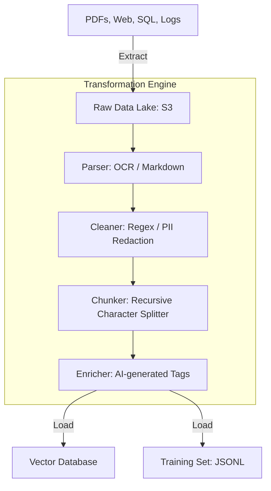

# 🔄 ETL for AI: Extract, Transform, Load
> **Level:** Intermediate | **Language:** Hinglish | **Goal:** Master the specific data processing steps for AI, exploring how to convert raw messy sources into "Gold-Standard" datasets for Training and Retrieval in 2026.

---

## 🧭 1. Beginner-Friendly Hinglish Explanation
ETL ek "Kitchen Process" ki tarah hai:

1. **Extract (Sabzi Lana):** 
   - Raw data ko sources (Website, PDF, Database) se nikalna. Abhi ye sabzi "Messy" hai (Mitti lagi hai).
2. **Transform (Chop & Cook):** 
   - Data ko saaf karna. Galtiyan hatana. Use AI ke liye "Digestible" banana (jaise Text ko Chunks mein todna).
3. **Load (Plate par Parosna):** 
   - Final data ko "Vector Database" ya "Training Folder" mein dalna taki AI use kha sake (Process kar sake).

AI mein **Transform** sabse zaroori step hai. 
- Agar aapne PDF ko sahi se Markdown mein convert nahi kiya, toh AI ko "Tables" aur "Headers" samajh nahi aayenge. 
- ETL ka goal ye hai ki AI ko hamesha "Pure aur Structured" information mile.

---

## 🧠 2. Deep Technical Explanation
ETL for AI is different from traditional BI (Business Intelligence) ETL.

### 1. Extraction (Unstructured First):
- In AI, $90\%$ of data is unstructured.
- Tools: **PyMuPDF (PDFs)**, **BeautifulSoup (Web)**, **Whisper (Audio)**, **MarkItDown (Microsoft).**
- Goal: Get the cleanest text representation possible.

### 2. Transformation (The AI Special):
- **De-noising:** Removing HTML boilerplates, ads, and irrelevant meta-data.
- **Normalization:** Converting all text to a consistent encoding (UTF-8) and format (Markdown is best).
- **Enrichment:** Using a small LLM to "Summarize" or "Tag" the data during the ETL process.
- **Chunking:** Splitting long text into $512$ or $1024$ token pieces with "Overlap" to maintain context.

### 3. Loading (Multi-destination):
- **Vector DB:** For RAG (Real-time).
- **Parquet/JSONL:** For Training (Offline).
- **Elasticsearch:** For Keyword search.

---

## 🏗️ 3. ETL vs. ELT in AI
| Feature | ETL (Standard) | ELT (Modern AI) |
| :--- | :--- | :--- |
| **Philosophy** | Clean then store | **Store then clean** |
| **Flexibility** | Low (Hard to change) | **High (Re-process anytime)** |
| **Storage** | SQL / Data Warehouse | **Data Lake (S3)** |
| **Tooling** | Informatica / Talend | **Python / Spark / dbt** |
| **Best For** | Financial Reports | **AI Training / RAG** |

---

## 📐 4. Mathematical Intuition
- **The Chunking Math:** 
  If you have a 10,000-word document and your context window is 512 tokens:
  - Without Overlap: You might cut a sentence in the middle, losing meaning.
  - **With 20% Overlap:** Each chunk shares $100$ tokens with the next one. This ensures that the "Semantic Meaning" is preserved across chunks.
  - $\text{Number of Chunks} = \frac{\text{Total Tokens}}{\text{Chunk Size} - \text{Overlap}}$

---

## 📊 5. The AI ETL Pipeline (Diagram)


---

## 💻 6. Production-Ready Examples (A Robust Transformation Script)
```python
# 2026 Pro-Tip: Use 'LangChain' or 'LlamaIndex' for advanced chunking.

from langchain.text_splitter import RecursiveCharacterTextSplitter

def ai_transform(raw_text):
    # 1. Cleaning: Remove excess whitespace
    clean_text = " ".join(raw_text.split())
    
    # 2. Chunking: Use a recursive splitter to keep sentences whole
    splitter = RecursiveCharacterTextSplitter(
        chunk_size=1000,
        chunk_overlap=200,
        length_function=len,
        separators=["\n\n", "\n", ".", "!", "?", " ", ""]
    )
    
    chunks = splitter.split_text(clean_text)
    return chunks

# This ensures your AI doesn't get 'broken' sentences in its context.
```

---

## ❌ 7. Failure Cases
- **Encoding Issues:** Text from a 20-year-old database showing up as "". **Fix: Always use `chardet` to detect encoding.**
- **Table Corruption:** PDF tables turning into a long, unreadable string of numbers. **Fix: Use specialized table parsers like 'Unstructured.io'.**
- **PII Leakage:** Accidentally loading customer phone numbers into the training set, which the model then "Memorizes" and leaks to other users.

---

## 🛠️ 8. Debugging Guide
- **Symptom:** "AI is answering with 'None' or empty text."
- **Check:** **Extraction Step**. Did the PDF have "Image-only" pages? You need **OCR (Tesseract/PaddleOCR).**
- **Symptom:** "Search is finding the wrong section of the document."
- **Check:** **Metadata mapping**. Ensure the "Chunk ID" correctly links to the original "File Name" and "Page Number."

---

## ⚖️ 9. Tradeoffs
- **Fixed vs. Recursive Chunking:** 
  - Fixed is fast but ugly. 
  - Recursive is smart but takes more CPU.
- **On-the-fly vs. Pre-processed:** 
  - On-the-fly is always updated. 
  - Pre-processed is $100x$ faster for the user.

---

## 🛡️ 10. Security Concerns
- **Data Provenance:** Knowing exactly where a piece of data came from. If a model says something "Toxic," you must be able to find the exact raw file that caused it in the ETL pipeline.

---

## 📈 11. Scaling Challenges
- **Millions of Small Files:** S3 is slow when reading 1 million $1$KB files. **Solution: Bundle them into 'WebDataset' or 'TFRecord' formats.**

---

## 💸 12. Cost Considerations
- **OCR Cost:** Using high-end AI OCR (like AWS Textract or Azure Document Intelligence) can cost $\$1.50$ per 1000 pages. **Strategy: Use open-source OCR for $90\%$ of docs.**

---

## ✅ 13. Best Practices
- **Version your ETL code:** If you change the chunking logic, you MUST re-index your entire Vector DB.
- **Log every step:** "Source X -> Extracted Y chars -> Created Z chunks."
- **Use 'Checksums':** Before processing a file, check its hash. If it hasn't changed, skip it to save time/cost.

---

## ⚠️ 14. Common Mistakes
- **Ignoring Headers:** Treating headers just like normal text, which makes the AI miss the "Topic" of the chunk.
- **No Overlap:** Cutting context in half.

---

## 📝 15. Interview Questions
1. **"What is the difference between Chunking with and without overlap?"**
2. **"How do you handle PDF tables in an AI ETL pipeline?"**
3. **"Why is Markdown the preferred 'Transform' format for LLM data?"**

---

## 🚀 15. Latest 2026 Industry Patterns
- **Semantic Chunking:** Using an AI model to "Look" at the text and decide where a topic ends, rather than using a fixed character count.
- **Multimodal ETL:** A single pipeline that extracts Text from Video, OCR from Images, and Transcripts from Audio simultaneously.
- **Auto-tagging ETL:** Pipelines that use a tiny "SLM" (Small Language Model) to automatically tag every chunk with `domain`, `sentiment`, and `urgency`.
