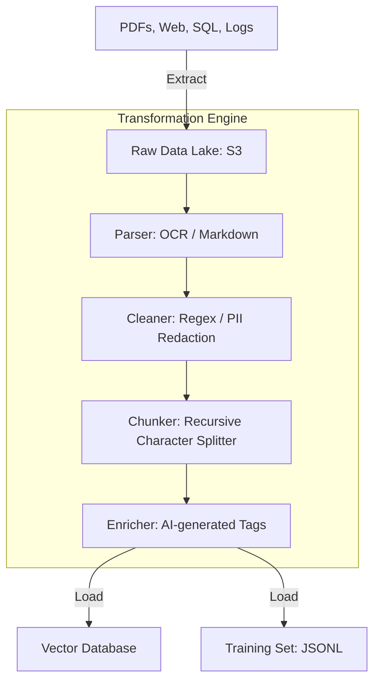

# 🔄 ETL for AI: Extract, Transform, Load
> **Level:** Intermediate | **Language:** Hinglish | **Goal:** AI ke liye specific data processing steps ko master karein, explore karte hue ki kaise raw messy sources ko 2026 mein Training aur Retrieval ke liye "Gold-Standard" datasets mein convert kiya jaye.

---

## 🧭 1. Beginner-Friendly Hinglish Explanation
ETL ek "Kitchen Process" ki tarah hai:

1. **Extract (Sabzi Lana):** 
   - Raw data ko sources (Website, PDF, Database) se nikalna. Abhi ye sabzi "Messy" hai (Mitti lagi hai).
2. **Transform (Chop & Cook):** 
   - Data ko saaf karna. Galtiyan hatana. Use AI ke liye "Digestible" banana (jaise Text ko Chunks mein todna).
3. **Load (Plate par Parosna):** 
   - Final data ko "Vector Database" ya "Training Folder" mein dalna taki AI use kha sake (Process kar sake).

AI mein **Transform** sabse zaroori step hai. 
- Agar aapne PDF ko sahi se Markdown mein convert nahi kiya, toh AI ko "Tables" aur "Headers" samajh nahi aayenge. 
- ETL ka goal ye hai ki AI ko hamesha "Pure aur Structured" information mile.

---

## 🧠 2. Deep Technical Explanation
AI ke liye ETL traditional BI (Business Intelligence) ETL se alag hota hai.

### 1. Extraction (Unstructured First):
- AI mein, $90\%$ data unstructured hota hai.
- Tools: **PyMuPDF (PDFs)**, **BeautifulSoup (Web)**, **Whisper (Audio)**, **MarkItDown (Microsoft).**
- Goal: Sabse clean text representation hasil karna.

### 2. Transformation (The AI Special):
- **De-noising:** HTML boilerplates, ads aur irrelevant meta-data ko remove karna.
- **Normalization:** Sabhi text ko ek consistent encoding (UTF-8) aur format (Markdown sabse best hai) mein convert karna.
- **Enrichment:** ETL process ke dauran data ko "Summarize" ya "Tag" karne ke liye ek chote LLM ka use karna.
- **Chunking:** Context ko maintain rakhne ke liye long text ko "Overlap" ke sath $512$ ya $1024$ token pieces mein split karna.

### 3. Loading (Multi-destination):
- **Vector DB:** RAG ke liye (Real-time).
- **Parquet/JSONL:** Training ke liye (Offline).
- **Elasticsearch:** Keyword search ke liye.

---

## 🏗️ 3. ETL vs. ELT in AI
| Feature | ETL (Standard) | ELT (Modern AI) |
| :--- | :--- | :--- |
| **Philosophy** | Clean then store | **Store then clean** |
| **Flexibility** | Low (Hard to change) | **High (Re-process anytime)** |
| **Storage** | SQL / Data Warehouse | **Data Lake (S3)** |
| **Tooling** | Informatica / Talend | **Python / Spark / dbt** |
| **Best For** | Financial Reports | **AI Training / RAG** |

---

## 📐 4. Mathematical Intuition
- **The Chunking Math:** 
  Agar aapke paas 10,000-word ka document hai aur aapka context window 512 tokens ka hai:
  - Without Overlap: Aap sentence ko beech mein se cut kar sakte hain, jisse meaning lost ho jata hai.
  - **With 20% Overlap:** Har chunk apne se agle chunk ke sath $100$ tokens share karta hai. Ye ensure karta hai ki chunks ke across "Semantic Meaning" bani rahe.
  - $\text{Number of Chunks} = \frac{\text{Total Tokens}}{\text{Chunk Size} - \text{Overlap}}$

---

## 📊 5. The AI ETL Pipeline (Diagram)

```mermaid
graph TD
    Sources[PDFs, Web, SQL, Logs] -- "Extract" --> Staging[Raw Data Lake: S3]
    
    subgraph "Transformation Engine"
    Staging --> Parse[Parser: OCR / Markdown]
    Parse --> Clean[Cleaner: Regex / PII Redaction]
    Clean --> Chunk[Chunker: Recursive Character Splitter]
    Chunk --> Meta[Enricher: AI-generated Tags]
    end
    
    Meta -- "Load" --> VDB[Vector Database]
    Meta -- "Load" --> Train[Training Set: JSONL]
```

---

## 💻 6. Production-Ready Examples (A Robust Transformation Script)
```python
# 2026 Pro-Tip: Use 'LangChain' or 'LlamaIndex' for advanced chunking.

from langchain.text_splitter import RecursiveCharacterTextSplitter

def ai_transform(raw_text):
    # 1. Cleaning: Remove excess whitespace
    clean_text = " ".join(raw_text.split())
    
    # 2. Chunking: Use a recursive splitter to keep sentences whole
    splitter = RecursiveCharacterTextSplitter(
        chunk_size=1000,
        chunk_overlap=200,
        length_function=len,
        separators=["\n\n", "\n", ".", "!", "?", " ", ""]
    )
    
    chunks = splitter.split_text(clean_text)
    return chunks

# This ensures your AI doesn't get 'broken' sentences in its context.
```

---

## ❌ 7. Failure Cases
- **Encoding Issues:** 20-year-old database se text aane par "" ki tarah show hona. **Fix: Encoding ko detect karne ke liye hamesha `chardet` ka use karein.**
- **Table Corruption:** PDF tables ka numbers ki ek lambi, unreadable string mein badal jana. **Fix: 'Unstructured.io' jaise specialized table parsers ka use karein.**
- **PII Leakage:** Galti se customer phone numbers ko training set mein load kar dena, jisse model baad mein unhe "Memorize" kar leta hai aur dusre users ke samne leak kar deta hai.

---

## 🛠️ 8. Debugging Guide
- **Symptom:** "AI 'None' ya empty text ke sath answer de raha hai."
- **Check:** **Extraction Step**. Kya PDF mein "Image-only" pages hain? Aapko **OCR (Tesseract/PaddleOCR)** ki need hai.
- **Symptom:** "Search document ka galat section find kar raha hai."
- **Check:** **Metadata mapping**. Ensure karein ki "Chunk ID" original "File Name" aur "Page Number" ke sath sahi se link ho.

---

## ⚖️ 9. Tradeoffs
- **Fixed vs. Recursive Chunking:** 
  - Fixed fast hota hai par visual formatting ko bigad sakta hai.
  - Recursive smart hota hai par isme compute resource zyada lagte hain.
- **On-the-fly vs. Pre-processed:** 
  - On-the-fly hamesha updated rehta hai.
  - Pre-processed user ke liye $100x$ fast hota hai.

---

## 🛡️ 10. Security Concerns
- **Data Provenance:** Ye jaanna ki data ka koi piece kahan se aaya hai. Agar model kuch "Toxic" bolta hai, toh aapko ETL pipeline mein us exact raw file ko find karne ke qabil hona chahiye jo iski wajah bani.

---

## 📈 11. Scaling Challenges
- **Millions of Small Files:** 1 Million $1$KB files ko read karne par S3 slow ho jata hai. **Solution: Inhe 'WebDataset' ya 'TFRecord' formats mein bundle karein.**

---

## 💸 12. Cost Considerations
- **OCR Cost:** High-end AI OCR (jaise AWS Textract ya Azure Document Intelligence) ka use karne par $\$1.50$ per 1000 pages tak cost aa sakti hai. **Strategy: $90\%$ docs ke liye open-source OCR ka use karein.**

---

## ✅ 13. Best Practices
- **Version your ETL code:** Agar aap chunking logic badalte hain, toh aapko apne poore Vector DB ko re-index karna MUST hai.
- **Log every step:** "Source X -> Extracted Y chars -> Created Z chunks."
- **Use 'Checksums':** Kisi file ko process karne se pehle uska hash check karein. Agar hash change nahi hua hai, toh time/cost save karne ke liye use skip kar dein.

---

## ⚠️ 14. Common Mistakes
- **Ignoring Headers:** Headers ko normal text ki tarah treat karna, jisse AI chunk ke "Topic" ko samajhne se chuk jata hai.
- **No Overlap:** Context ko beech se cut kar dena (overlap na dena).

---

## 📝 15. Interview Questions
1. **"Overlap ke sath aur overlap ke bina Chunking karne mein kya difference hai?"**
2. **"Aap AI ETL pipeline mein PDF tables ko kaise handle karenge?"**
3. **"LLM data ke liye Markdown preferred 'Transform' format kyu hai?"**

---

## 🚀 15. Latest 2026 Industry Patterns
- **Semantic Chunking:** Fixed character count ka use karne ke bajaye, ek AI model ka use karke text ko "Look" karna aur decide karna ki topic kahan end hota hai.
- **Multimodal ETL:** Ek single pipeline jo Video se Text, Images se OCR aur Audio se Transcripts ko ek sath extract karti hai.
- **Auto-tagging ETL:** Pipelines jo ek tiny "SLM" (Small Language Model) ka use karke automatically har chunk ko `domain`, `sentiment`, aur `urgency` ke sath tag karti hain.
