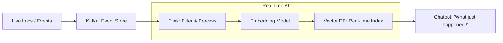

# 🌊 Streaming Data for AI: Real-Time Intelligence
> **Level:** Advanced | **Language:** Hinglish | **Goal:** Master the processing of data as it flows, exploring Kafka, Flink, and the 2026 patterns for building "Living" RAG systems and real-time AI monitoring.

---

## 🧭 1. Beginner-Friendly Hinglish Explanation
Zyadatar AI systems "Purane data" par kaam karte hain (jaise 1 din pehle ke news). Par kuch systems ko "Abhi isi waqt" wala data chahiye.

- **Batch Processing:** Jaise aap din mein ek baar fridge bharte hain.
- **Streaming Processing:** Jaise aapke ghar mein paani ka "Nal" (Tap). Jab nal khola, paani aa gaya.

**Streaming Data** ka matlab hai AI ko hamesha "Live" rakhna. 
- Maan lo aap "Stock Market AI" bana rahe hain. Aapko 1 ghante purana data nahi chahiye, aapko 1 "Second" purana data chahiye. 
- Iske liye hum **Kafka** jaise tools use karte hain jo data ko "Stream" karte hain. Jaise hi market mein price badla, AI use dekhta hai aur action leta hai.

2026 mein, "Static AI" boriyat hai. Asli value "Live, Real-time AI" mein hai.

---

## 🧠 2. Deep Technical Explanation
Streaming for AI involves handling **Unbounded Data Sets** with low latency.

### 1. The Message Broker (The Highway):
- Tools: **Apache Kafka**, **Redpanda**, **Amazon Kinesis.**
- These act as a buffer. If the AI is slow to process, Kafka stores the messages until the AI is ready.

### 2. Stream Processing (The Engine):
- Tools: **Apache Flink**, **Spark Streaming**, **Bytewax (Python-native).**
- These allow you to "Filter," "Aggregate," and "Join" data as it flows.
- *Example:* "Take the last 5 minutes of tweets and calculate the average sentiment."

### 3. Real-time Vector Updates:
- As soon as a news article is published, the streaming pipeline:
  1. Extracts text.
  2. Generates embeddings.
  3. Updates the Vector Database (Pinecone/Qdrant).
- Result: Your RAG system knows about the news within milliseconds.

---

## 🏗️ 3. Batch vs. Streaming AI
| Feature | Batch (Nightly) | Streaming (Real-time) |
| :--- | :--- | :--- |
| **Latency** | Hours / Days | **Milliseconds / Seconds** |
| **Data Scope** | Full Dataset | **Sliding Windows** |
| **Cost** | Lower (Compute is optimized) | **Higher (Servers always running)** |
| **Complexity** | Low | **High (State management)** |
| **Best For** | Pretraining / Analytics | **Trading / Customer Support** |

---

## 📐 4. Mathematical Intuition
- **The Sliding Window:** 
  In streaming, you don't calculate on "All data." You calculate on a **Window**.
  - **Tumbling Window:** Every 5 minutes, calculate once.
  - **Sliding Window:** Every 1 second, calculate for the "Last 5 minutes." 
  This requires $O(1)$ updates—you add the NEW data point and subtract the EXPIRED data point from your sum.

---

## 📊 5. The Streaming AI Pipeline (Diagram)


---

## 💻 6. Production-Ready Examples (Streaming with Bytewax - Python)
```python
# 2026 Pro-Tip: Bytewax is the easiest way to do streaming in Python for AI.

from bytewax.dataflow import Dataflow
from bytewax.connectors.stdio import StdOutput
from bytewax.connectors.kafka import KafkaSource

flow = Dataflow("ai-sentiment-stream")

# 1. Read from Kafka
flow.input("input", KafkaSource(["live-tweets"], brokers=["localhost:9092"]))

# 2. Process: Simple Sentiment logic
def analyze_sentiment(tweet):
    # Imagine calling a small model here
    return {"text": tweet, "sentiment": "positive"}

flow.map(analyze_sentiment)

# 3. Output to console or a Vector DB
flow.output("out", StdOutput())

# Run with: python -m bytewax.run flow
```

---

## ❌ 7. Failure Cases
- **Data Out-of-Order:** A message sent at 10:00:00 arrives at 10:00:05 because of network lag. If your AI depends on "Sequence," this breaks everything. **Fix: Use 'Watermarks' to wait for late data.**
- **Backpressure:** The AI is taking 2 seconds to process each message, but messages are arriving at 100 per second. The buffer (Kafka) will eventually fill up and crash.
- **State Loss:** The streaming server crashes and "forgets" that it already processed message #500. It starts from #400 again, creating duplicates. **Fix: Use 'Checkpoints' in Flink.**

---

## 🛠️ 8. Debugging Guide
- **Symptom:** "Results are lagging behind."
- **Check:** **Consumer Lag**. Use `kafka-consumer-groups` to see how many messages are waiting. If lag is high, add more AI worker nodes.
- **Symptom:** "Double counting of events."
- **Check:** **Idempotency**. Ensure your Vector DB update logic uses a `unique_id` so the same message doesn't create two vectors.

---

## ⚖️ 9. Tradeoffs
- **Exact vs. Approximate:** In streaming, calculating the "Exact" median of 1 Billion items is hard. Use **Sketching algorithms** (like HLL) for $99\%$ accurate estimates in real-time.
- **Latency vs. Throughput:** Waiting for 100 messages to process them as a batch (Batching) is more efficient but increases individual latency.

---

## 🛡️ 10. Security Concerns
- **Stream Hijacking:** An attacker injecting fake "Live events" to bias a real-time trading AI. **Always authenticate your Kafka producers.**

---

## 📈 11. Scaling Challenges
- **Partitioning:** Splitting a stream across 100 GPUs. You must ensure that all messages from "User A" go to the "Same GPU" if state is needed. This is called **Key-based Partitioning.**

---

## 💸 12. Cost Considerations
- **Compute Cost:** Streaming servers must be ON $24/7$. This is much more expensive than a Batch job that runs for 1 hour at night. **Optimization: Use 'Auto-scaling' based on Kafka lag.**

---

## ✅ 13. Best Practices
- **Use 'At-least-once' delivery:** Better to process twice than to miss a message.
- **Schema Registry:** Use **Avro** or **Protobuf** to ensure that the "Structure" of messages doesn't change and break the AI.
- **Dead Letter Queues (DLQ):** If a message is "Corrupted" and the AI can't read it, send it to a separate "Fail" folder instead of stopping the whole pipeline.

---

## ⚠️ 14. Common Mistakes
- **Processing one-by-one:** Calling an LLM API for EVERY message. This will cost millions. **Solution: Buffer messages for 1 second and call the LLM in a batch.**
- **No monitoring for Lag:** Realizing your "Real-time" AI is actually 4 hours behind.

---

## 📝 15. Interview Questions
1. **"What is 'Backpressure' in a streaming system and how do you handle it?"**
2. **"Explain the difference between 'Event Time' and 'Processing Time'."**
3. **"How do you update a Vector Database in real-time without causing inconsistencies?"**

---

## 🚀 15. Latest 2026 Industry Patterns
- **Serverless Streaming:** Tools like **Upstash Kafka** that scale to zero when no data is flowing.
- **Direct LLM Streaming:** Kafka connectors that "Pipe" data directly into vLLM and store the result in Qdrant with zero custom code.
- **Streaming RAG (LiveRAG):** RAG systems that don't just "Search" but "Subscribe" to topics. When new info arrives, the UI updates the user's answer automatically.
