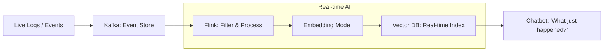

# 🌊 Streaming Data for AI: Real-Time Intelligence
> **Level:** Advanced | **Language:** Hinglish | **Goal:** Data flow hote hi uski processing ko master karein, Kafka, Flink, aur "Living" RAG systems aur real-time AI monitoring build karne ke 2026 patterns ko explore karte hue.

---

## 🧭 1. Beginner-Friendly Hinglish Explanation
Zyadatar AI systems "Purane data" par kaam karte hain (jaise 1 din pehle ke news). Par kuch systems ko "Abhi isi waqt" wala data chahiye.

- **Batch Processing:** Jaise aap din mein ek baar fridge bharte hain.
- **Streaming Processing:** Jaise aapke ghar mein paani ka "Nal" (Tap). Jab nal khola, paani aa gaya.

**Streaming Data** ka matlab hai AI ko hamesha "Live" rakhna. 
- Maan lo aap "Stock Market AI" bana rahe hain. Aapko 1 ghante purana data nahi chahiye, aapko 1 "Second" purana data chahiye. 
- Iske liye hum **Kafka** jaise tools use karte hain jo data ko "Stream" karte hain. Jaise hi market mein price badla, AI use dekhta hai aur action leta hai.

2026 mein, "Static AI" boriyat hai. Asli value "Live, Real-time AI" mein hai.

---

## 🧠 2. Deep Technical Explanation
AI ke liye Streaming ka matlab low latency ke sath **Unbounded Data Sets** ko handle karna hai.

### 1. The Message Broker (The Highway):
- Tools: **Apache Kafka**, **Redpanda**, **Amazon Kinesis.**
- Ye ek buffer ki tarah kaam karte hain. Agar AI processing mein slow hai, toh Kafka messages ko tab tak store karke rakhta hai jab tak AI ready na ho jaye.

### 2. Stream Processing (The Engine):
- Tools: **Apache Flink**, **Spark Streaming**, **Bytewax (Python-native).**
- Ye aapko data ke flow hone ke dauran hi use "Filter", "Aggregate", aur "Join" karne ki permission dete hain.
- *Example:* "Pichle 5 minutes ke tweets ko lo aur unka average sentiment calculate karo."

### 3. Real-time Vector Updates:
- Jaise hi koi news article publish hota hai, streaming pipeline:
  1. Text extract karta hai.
  2. Embeddings generate karta hai.
  3. Vector Database (Pinecone/Qdrant) ko update karta hai.
- Result: Your RAG system knows about the news within milliseconds.

---

## 🏗️ 3. Batch vs. Streaming AI
| Feature | Batch (Nightly) | Streaming (Real-time) |
| :--- | :--- | :--- |
| **Latency** | Hours / Days | **Milliseconds / Seconds** |
| **Data Scope** | Full Dataset | **Sliding Windows** |
| **Cost** | Lower (Compute is optimized) | **Higher (Servers always running)** |
| **Complexity** | Low | **High (State management)** |
| **Best For** | Pretraining / Analytics | **Trading / Customer Support** |

---

## 📐 4. Mathematical Intuition
- **The Sliding Window:** 
  Streaming mein, aap "All data" par calculation nahi karte. Aap ek **Window** par calculation karte hain.
  - **Tumbling Window:** Har 5 minutes mein ek baar calculate karna.
  - **Sliding Window:** Har 1 second mein "Pichle 5 minutes" ke liye calculate karna. 
  Iske liye $O(1)$ updates ki need hoti hai—aap naya data point add karte hain aur sum se EXPIRED data point ko subtract kar dete hain.

---

## 📊 5. The Streaming AI Pipeline (Diagram)

```mermaid
graph LR
    Log[Live Logs / Events] --> Kafka[Kafka: Event Store]
    Kafka --> Flink[Flink: Filter & Process]
    
    subgraph "Real-time AI"
    Flink --> Embed[Embedding Model]
    Embed --> VDB[Vector DB: Real-time Index]
    end
    
    VDB --> App[Chatbot: 'What just happened?']
```

---

## 💻 6. Production-Ready Examples (Streaming with Bytewax - Python)
```python
# 2026 Pro-Tip: Bytewax is the easiest way to do streaming in Python for AI.

from bytewax.dataflow import Dataflow
from bytewax.connectors.stdio import StdOutput
from bytewax.connectors.kafka import KafkaSource

flow = Dataflow("ai-sentiment-stream")

# 1. Read from Kafka
flow.input("input", KafkaSource(["live-tweets"], brokers=["localhost:9092"]))

# 2. Process: Simple Sentiment logic
def analyze_sentiment(tweet):
    # Imagine calling a small model here
    return {"text": tweet, "sentiment": "positive"}

flow.map(analyze_sentiment)

# 3. Output to console or a Vector DB
flow.output("out", StdOutput())

# Run with: python -m bytewax.run flow
```

---

## ❌ 7. Failure Cases
- **Data Out-of-Order:** Network lag ki wajah se 10:00:00 par send kiya gaya message 10:00:05 par pahunchta hai. Agar aapka AI "Sequence" (kram) par depend karta hai, toh isse sab kharab ho jayega. **Fix: Late data ka wait karne ke liye 'Watermarks' ka use karein.**
- **Backpressure:** AI har message ko process karne mein 2 seconds le raha hai, par messages 100 per second ki speed se aa rahe hain. Buffer (Kafka) eventually full ho jayega aur crash ho jayega.
- **State Loss:** Streaming server crash ho jata hai aur "bhool" jata hai ki usne pehle hi message #500 ko process kar liya tha. Ye fir se #400 se start karta hai, jisse duplicates create hote hain. **Fix: Flink mein 'Checkpoints' ka use karein.**

---

## 🛠️ 8. Debugging Guide
- **Symptom:** "Results lag kar rahe hain."
- **Check:** **Consumer Lag**. `kafka-consumer-groups` ka use karke check karein ki kitne messages queue mein hain. Agar lag high hai, toh aur AI worker nodes add karein.
- **Symptom:** "Events double count ho rahe hain."
- **Check:** **Idempotency**. Enure karein ki aapki Vector DB update logic ek `unique_id` ka use karti ho taaki same message do vectors create na kare.

---

## ⚖️ 9. Tradeoffs
- **Exact vs. Approximate:** Streaming mein, 1 Billion items ka "Exact" median calculate karna mushkil hai. Real-time mein $99\%$ accurate estimates ke liye **Sketching algorithms** (jaise HLL) ka use karein.
- **Latency vs. Throughput:** Batch ke roop mein process karne ke liye 100 messages ka wait karna (Batching) zyada efficient hai par isse individual latency badh jati hai.

---

## 🛡️ 10. Security Concerns
- **Stream Hijacking:** Ek attacker real-time trading AI ko bias karne ke liye fake "Live events" inject kar deta hai. **Hamesha apne Kafka producers ko authenticate karein.**

---

## 📈 11. Scaling Challenges
- **Partitioning:** Ek stream ko 100 GPUs ke across split karna. Agar state ki zaroorat hai, toh aapko ensure karna hoga ki "User A" ke sabhi messages "Same GPU" par jayein. Ise **Key-based Partitioning** kehte hain.

---

## 💸 12. Cost Considerations
- **Compute Cost:** Streaming servers ko $24/7$ ON rehna padta hai. Ye raat mein sirf 1 hour chalne wale Batch job ke mukable bahut zyada expensive hai. **Optimization: Kafka lag ke basis par 'Auto-scaling' ka use karein.**

---

## ✅ 13. Best Practices
- **Use 'At-least-once' delivery:** Message miss hone se behtar hai ki use do baar process kar liya jaye.
- **Schema Registry:** **Avro** ya **Protobuf** ka use karein taaki ye ensure ho ki messages ka "Structure" change na ho aur AI break na kare.
- **Dead Letter Queues (DLQ):** Agar koi message "Corrupted" hai aur AI use read nahi kar sakta, toh pure pipeline ko rokne ke bajaye use ek separate "Fail" folder mein send kar dein.

---

## ⚠️ 14. Common Mistakes
- **Processing one-by-one:** HAR message ke liye LLM API call karna. Isse lakhs ka bill ban sakta hai. **Solution: Messages ko 1 second ke liye buffer karein aur batch mein LLM call karein.**
- **No monitoring for Lag:** Ye realize hi na karna ki aapka "Real-time" AI actually 4 hours piche chal raha hai.

---

## 📝 15. Interview Questions
1. **"Streaming system mein 'Backpressure' kya hai aur aap ise kaise handle karte hain?"**
2. **" 'Event Time' aur 'Processing Time' ke beige ke difference ko explain karein."**
3. **"Aap bina kisi inconsistency ke real-time mein Vector Database ko kaise update karte hain?"**

---

## 🚀 15. Latest 2026 Industry Patterns
- **Serverless Streaming:** **Upstash Kafka** jaise tools jo data flow na hone par zero tak scale ho jate hain.
- **Direct LLM Streaming:** Kafka connectors jo data ko directly vLLM mein "Pipe" karte hain aur bina kisi custom code ke result ko Qdrant mein store karte hain.
- **Streaming RAG (LiveRAG):** RAG systems jo sirf "Search" nahi karte balki topics par "Subscribe" karte hain. Jab naya info aata hai, toh UI automatically user ke answer ko update kar deta hai.
