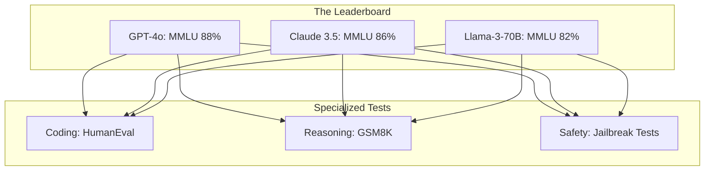

# 🏁 Benchmarking: The AI Olympics
> **Level:** Advanced | **Language:** Hinglish | **Goal:** Master the standard tests used to compare AI models globally, exploring MMLU, GSM8K, HumanEval, and the 2026 strategies for avoiding "Data Contamination" in benchmarks.

---

## 🧭 1. Beginner-Friendly Hinglish Explanation
Har AI company claim karti hai ki unka model "Duniya ka best" hai. Par hum kaise maane?

- **The Problem:** Ek model "Poetry" mein acha ho sakta hai, par "Math" mein zero. Doosra "Coding" mein king hai par "History" mein bekar.
- **Benchmarking** ka matlab hai AI ko ek "Common Exam" dena jisse sabko ek hi scale par napa ja sake.

Ye bilkul **JEE or SAT** exams ki tarah hai:
1. **MMLU:** General knowledge aur subjects ka test.
2. **GSM8K:** 8th-grade math problems ka test.
3. **HumanEval:** Coding skills ka test.

2026 mein, model ki aukat uske **Benchmark Scores** se tay hoti hai. Par ek bada khatra hai—"Cheating." Agar model ne test ke questions training ke waqt hi dekh liye hon, toh uska score "Fake" hoga. Isse hum **"Data Contamination"** kehte hain.

---

## 🧠 2. Deep Technical Explanation
Benchmarking is the quantitative measurement of model performance across standardized datasets.

### 1. Key Academic Benchmarks:
- **MMLU (Massive Multitask Language Understanding):** 57 subjects (STEM, Humanities, etc.). Measures broad world knowledge.
- **GSM8K (Grade School Math 8K):** Multi-step math reasoning. Hard for models because one small mistake in the middle ruins the answer.
- **HumanEval / MBPP:** Python coding tasks. Measured by `Pass@1` (Did the first code snippet run correctly?).
- **GPQA (Graduate-Level Google-Proof Q&A):** Extremely hard science questions that even non-expert humans can't answer with Google.

### 2. Chatbot Arena (The 2026 Reality):
- Academic benchmarks are becoming "Contaminated." 
- **LMSYS Chatbot Arena** uses "Crowdsourced ELO" where humans chat with two anonymous models and vote for the better one. This is the most trusted "Real-world" benchmark today.

### 3. ARC (Abstraction and Reasoning Corpus):
- A benchmark for "Fluid Intelligence." It tests if a model can solve a puzzle it has NEVER seen before, using pure logic.

---

## 🏗️ 3. Benchmark Categories
| Category | Benchmark Name | Measures |
| :--- | :--- | :--- |
| **General Knowledge** | MMLU / MMLU-Pro | World knowledge & Logic |
| **Reasoning / Math** | GSM8K / MATH | Multi-step problem solving |
| **Coding** | HumanEval / LiveCodeBench| Code generation accuracy |
| **Truthfulness** | TruthfulQA / HellaSwag | Avoiding hallucinations |
| **Instruction Following**| IFEval | Following strict constraints |

---

## 📐 4. Mathematical Intuition
- **ELO Rating System:** 
  Used in Chatbot Arena. If Model A (Rating 1200) beats Model B (Rating 1000), it gains fewer points than if it beats a model with 1500 rating.
  $$E_A = \frac{1}{1 + 10^{(R_B - R_A)/400}}$$
  - $E_A$: Expected score for Model A.
  - $R_A, R_B$: Current ratings.
  This ensures that "Popularity" doesn't win over "Quality."

---

## 📊 5. Benchmark Performance Comparison (Diagram)


---

## 💻 6. Production-Ready Examples (Running a Simple Evaluation with LM-Eval-Harness)
```bash
# 2026 Pro-Tip: Use the 'LM Evaluation Harness' to run standard benchmarks.

# 1. Install the harness
pip install lm-eval

# 2. Run MMLU on a local model (Llama-3-8B)
# This will take a few hours depending on your GPU.
lm_eval --model hf \
    --model_args pretrained=meta-llama/Meta-Llama-3-8B \
    --tasks mmlu \
    --device cuda:0 \
    --batch_size 8

# Output will show accuracy across all 57 subjects.
```

---

## ❌ 7. Failure Cases
- **Data Contamination:** The benchmark questions were accidentally included in the model's training data. The model is "Memorizing," not "Reasoning."
- **Benchmark Saturation:** When models reach $99\%$ on a benchmark, that benchmark is dead. We need harder ones (like GPQA).
- **Goodhart's Law:** "When a measure becomes a target, it ceases to be a good measure." Models are being trained specifically to "Beat the Benchmark" instead of being useful in the real world.

---

## 🛠️ 8. Debugging Guide
- **Symptom:** "Model has high MMLU but is terrible at chatting."
- **Check:** **Instruction Tuning**. MMLU tests "Knowledge," not "Chat capability." Ensure your model is fine-tuned for following instructions (**IFEval**).
- **Symptom:** "Pass@1 coding score is zero."
- **Check:** **Greedy Decoding**. Ensure you are using `temperature=0` during benchmarks for reproducible results.

---

## ⚖️ 9. Tradeoffs
- **Academic vs. Human Eval:** 
  - Academic is fast and reproducible. 
  - Human Eval (Arena) is messy but more "True" to user experience.
- **Zero-shot vs. Few-shot:** 
  - Zero-shot (No examples) is harder and shows raw power. 
  - Few-shot (Providing 5 examples) shows the model's ability to learn in-context.

---

## 🛡️ 10. Security Concerns
- **Benchmark Leakage:** Hackers leaking the "Golden Answers" of secret benchmarks so companies can "Train" on them and fake their results.

---

## 📈 11. Scaling Challenges
- **The 'N-shot' Memory Wall:** Running 32-shot benchmarks on a 400B model needs massive VRAM to store the context.

---

## 💸 12. Cost Considerations
- **Evaluation Compute:** Running a full suite of benchmarks (MMLU + GSM8K + HumanEval) can cost $\$100+$ in GPU rental time. **Strategy: Run benchmarks only on 'Release Candidate' models.**

---

## ✅ 13. Best Practices
- **Use 'Live' Benchmarks:** Use datasets that are updated every week (like **LiveCodeBench**) to avoid contamination.
- **Check for N-gram overlap:** Before training, check if your training data has more than $20\%$ overlap with standard benchmarks. If yes, your scores are invalid.
- **Report 95% Confidence Intervals:** Don't just say "82%". Say "82% +/- 1.5%".

---

## ⚠️ 14. Common Mistakes
- **Only reporting the 'Best' run:** Picking the highest score out of 10 runs. **Always report the Average.**
- **Ignoring Model Size:** Comparing a 7B model to a 175B model and saying 175B is "Better." (Duh!). Compare **Performance-per-Parameter**.

---

## 📝 15. Interview Questions
1. **"What is 'Data Contamination' and how do you detect it?"**
2. **"Explain the difference between Zero-shot and Few-shot evaluation."**
3. **"Why is MMLU considered the most important benchmark for LLMs?"**

---

## 🚀 15. Latest 2026 Industry Patterns
- **Vision Benchmarks (MMMU):** Testing if models can understand charts, medical images, and engineering diagrams.
- **Agentic Benchmarks (GAIA):** Testing if an AI can "Use a browser" or "Run a script" to solve a multi-step task.
- **Dynamic Evals:** Benchmarks where the questions are generated by an AI on-the-fly, so the model can't memorize them.
