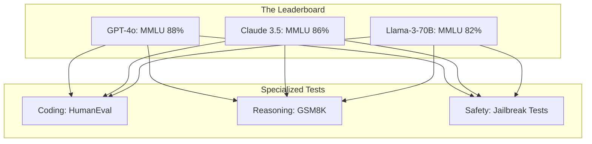

# 🏁 Benchmarking: The AI Olympics
> **Level:** Advanced | **Language:** Hinglish | **Goal:** Globally AI models ko compare karne wale standard tests ko master karein, MMLU, GSM8K, HumanEval, aur benchmarks mein "Data Contamination" se bachne ke 2026 strategies ko explore karte hue.

---

## 🧭 1. Beginner-Friendly Hinglish Explanation
Har AI company claim karti hai ki unka model "Duniya ka best" hai. Par hum kaise maane?

- **The Problem:** Ek model "Poetry" mein acha ho sakta hai, par "Math" mein zero. Doosra "Coding" mein king hai par "History" mein bekar.
- **Benchmarking** ka matlab hai AI ko ek "Common Exam" dena jisse sabko ek hi scale par napa ja sake.

Ye bilkul **JEE or SAT** exams ki tarah hai:
1. **MMLU:** General knowledge aur subjects ka test.
2. **GSM8K:** 8th-grade math problems ka test.
3. **HumanEval:** Coding skills ka test.

2026 mein, model ki aukat uske **Benchmark Scores** se tay hoti hai. Par ek bada khatra hai—"Cheating." Agar model ne test ke questions training ke waqt hi dekh liye hon, toh uska score "Fake" hoga. Isse hum **"Data Contamination"** kehte hain.

---

## 🧠 2. Deep Technical Explanation
Benchmarking standardized datasets ke across model performance ka quantitative measurement hai.

### 1. Key Academic Benchmarks:
- **MMLU (Massive Multitask Language Understanding):** 57 subjects (STEM, Humanities, etc.). Ye broad world knowledge ko measure karta hai.
- **GSM8K (Grade School Math 8K):** Multi-step math reasoning. Models ke liye hard hota hai kyunki beech mein ek choti si galti bhi answer ko kharab kar deti hai.
- **HumanEval / MBPP:** Python coding tasks. Ise `Pass@1` ke through measure kiya jata hai (Kya pehla code snippet sahi se run hua?).
- **GPQA (Graduate-Level Google-Proof Q&A):** Extremely hard science questions jinhe non-expert humans Google ki help se bhi answer nahi kar sakte.

### 2. Chatbot Arena (The 2026 Reality):
- Academic benchmarks ab "Contaminated" ho rahe hain.
- **LMSYS Chatbot Arena** "Crowdsourced ELO" ka use karta hai jahan humans do anonymous models ke sath chat karte hain aur behtar wale ko vote dete hain. Aaj ke time mein ye sabse trusted "Real-world" benchmark hai.

### 3. ARC (Abstraction and Reasoning Corpus):
- "Fluid Intelligence" ke liye ek benchmark. Ye test karta hai ki kya koi model kisi aise puzzle ko pure logic se solve kar sakta hai jo usne PEHLE KABHI nahi dekha.

---

## 🏗️ 3. Benchmark Categories
| Category | Benchmark Name | Measures |
| :--- | :--- | :--- |
| **General Knowledge** | MMLU / MMLU-Pro | World knowledge & Logic |
| **Reasoning / Math** | GSM8K / MATH | Multi-step problem solving |
| **Coding** | HumanEval / LiveCodeBench| Code generation accuracy |
| **Truthfulness** | TruthfulQA / HellaSwag | Avoiding hallucinations |
| **Instruction Following**| IFEval | Following strict constraints |

---

## 📐 4. Mathematical Intuition
- **ELO Rating System:** 
  Chatbot Arena mein use hota hai. Agar Model A (Rating 1200) Model B (Rating 1000) ko beat karta hai, toh use uske mukable kam points milenge jab wo 1500 rating wale model ko beat karega.
  $$E_A = \frac{1}{1 + 10^{(R_B - R_A)/400}}$$
  - $E_A$: Model A ka Expected score.
  - $R_A, R_B$: Current ratings.
  This ensures that "Popularity" doesn't win over "Quality."

---

## 📊 5. Benchmark Performance Comparison (Diagram)

```mermaid
graph TD
    subgraph "The Leaderboard"
    M1[GPT-4o: MMLU 88%]
    M2[Claude 3.5: MMLU 86%]
    M3[Llama-3-70B: MMLU 82%]
    end
    
    subgraph "Specialized Tests"
    C1[Coding: HumanEval]
    R1[Reasoning: GSM8K]
    S1[Safety: Jailbreak Tests]
    end
    
    M1 --> C1 & R1 & S1
    M2 --> C1 & R1 & S1
    M3 --> C1 & R1 & S1
```

---

## 💻 6. Production-Ready Examples (Running a Simple Evaluation with LM-Eval-Harness)
```bash
# 2026 Pro-Tip: Use the 'LM Evaluation Harness' to run standard benchmarks.

# 1. Install the harness
pip install lm-eval

# 2. Run MMLU on a local model (Llama-3-8B)
# This will take a few hours depending on your GPU.
lm_eval --model hf \
    --model_args pretrained=meta-llama/Meta-Llama-3-8B \
    --tasks mmlu \
    --device cuda:0 \
    --batch_size 8

# Output will show accuracy across all 57 subjects.
```

---

## ❌ 7. Failure Cases
- **Data Contamination:** Benchmark ke questions galti se model ke training data mein include ho gaye the. Model "Reasoning" nahi, "Memorization" (ratta) kar raha hai.
- **Benchmark Saturation:** Jab models kisi benchmark par $99\%$ reach kar jate hain, toh wo benchmark dead ho jata hai. Humein aur harder benchmarks (jaise GPQA) ki need hoti hai.
- **Goodhart's Law:** "Jab koi measure target ban jata hai, toh wo ek achha measure nahi rehta." Models ko real world mein useful banane ke bajaye specifically "Benchmark ko beat karne" ke liye train kiya ja raha hai.

---

## 🛠️ 8. Debugging Guide
- **Symptom:** "Model ka MMLU high hai par chatting mein kharab hai."
- **Check:** **Instruction Tuning**. MMLU "Knowledge" ko test karta hai, "Chat capability" ko nahi. Ensure karein ki aapka model instructions follow karne ke liye fine-tuned ho (**IFEval**).
- **Symptom:** "Pass@1 coding score zero hai."
- **Check:** **Greedy Decoding**. reproducible results ke liye benchmarks ke dauran ensure karein ki aap `temperature=0` use kar rahe hain.

---

## ⚖️ 9. Tradeoffs
- **Academic vs. Human Eval:** 
  - Academic fast aur reproducible hota hai.
  - Human Eval (Arena) thoda messy hai par user experience ke zyada "True" hota hai.
- **Zero-shot vs. Few-shot:** 
  - Zero-shot (Bina kisi example ke) harder hota hai aur raw power ko show karta hai.
  - Few-shot (5 examples provide karna) model ki in-context seekhne ki ability ko show karta hai.

---

## 🛡️ 10. Security Concerns
- **Benchmark Leakage:** Hackers ka secret benchmarks ke "Golden Answers" ko leak kar dena taaki companies unpar apane models ko "Train" karke fake results dikha sakein.

---

## 📈 11. Scaling Challenges
- **The 'N-shot' Memory Wall:** Ek 400B model par 32-shot benchmarks run karne ke liye context ko store karne ke liye massive VRAM ki need hoti hai.

---

## 💸 12. Cost Considerations
- **Evaluation Compute:** Benchmarks ka ek full suite (MMLU + GSM8K + HumanEval) run karne par GPU rental time mein $\$100+$ ki cost aa sakti hai. **Strategy: Benchmarks ko sirf 'Release Candidate' models par hi run karein.**

---

## ✅ 13. Best Practices
- **Use 'Live' Benchmarks:** Contamination se bachne ke liye aise datasets ka use karein jo har week update hote hain (jaise **LiveCodeBench**).
- **Check for N-gram overlap:** Training se pehle check karein ki kya aapke training data ka standard benchmarks ke sath $20\%$ se zyada overlap toh nahi hai. Agar haan, toh aapke scores invalid hain.
- **Report 95% Confidence Intervals:** Sirf "82%" na kahein. Kahein "82% +/- 1.5%".

---

## ⚠️ 14. Common Mistakes
- **Only reporting the 'Best' run:** 10 runs mein se highest score ko pick karke dikhana. **Hamesha Average score hi report karein.**
- **Ignoring Model Size:** Ek 7B model ko 175B model se compare karna aur kehna ki 175B "Better" hai. Compare karne ke liye **Performance-per-Parameter** ka use karein.

---

## 📝 15. Interview Questions
1. **" 'Data Contamination' kya hai aur aap ise kaise detect karte hain?"**
2. **"Zero-shot aur Few-shot evaluation ke beech ke difference ko explain karein."**
3. **"LLMs ke liye MMLU ko sabse important benchmark kyu mana jata hai?"**

---

## 🚀 15. Latest 2026 Industry Patterns
- **Vision Benchmarks (MMMU):** Ye test karna ki kya models charts, medical images, aur engineering diagrams ko samajh sakte hain.
- **Agentic Benchmarks (GAIA):** Ye test karna ki kya ek AI kisi multi-step task ko solve karne ke liye "browser use kar sakta hai" ya "script run kar sakta hai".
- **Dynamic Evals:** Aise benchmarks jahan questions AI ke dwara on-the-fly generate kiye jate hain, taaki model unhe yaad na kar sake.
