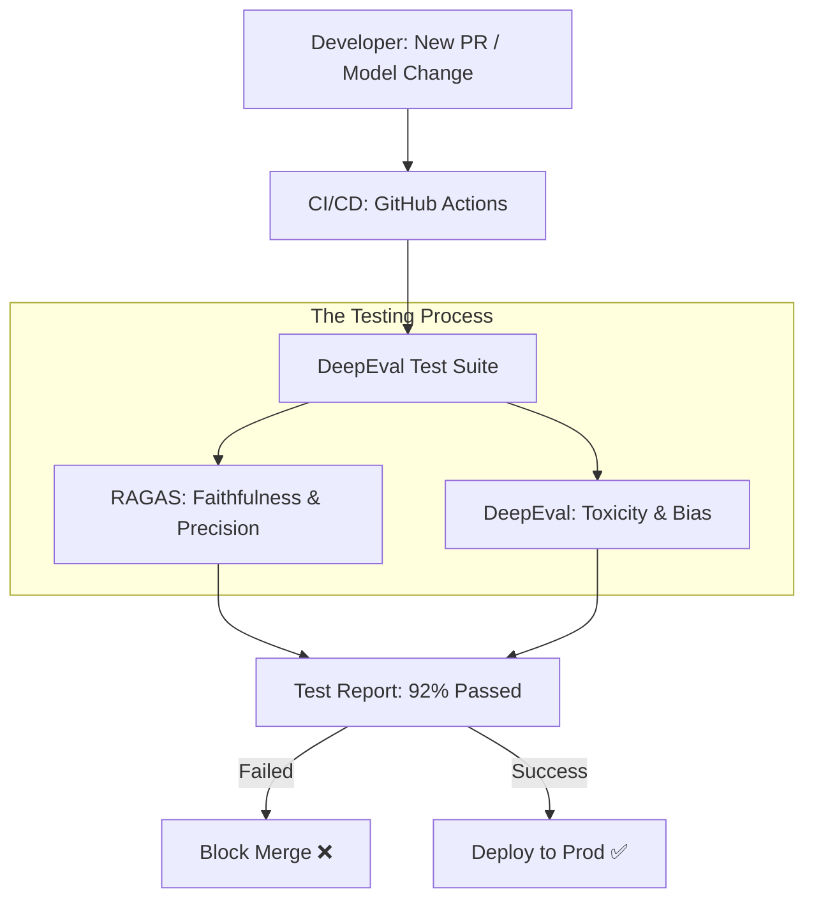

# 🛠️ DeepEval & RAGAS: The Pro Developer's Toolkit
> **Level:** Intermediate | **Language:** Hinglish | **Goal:** Master the two most popular open-source libraries for LLM and RAG evaluation, exploring how to integrate automated quality checks into your Python code and CI/CD pipelines in 2026.

---

## 🧭 1. Beginner-Friendly Hinglish Explanation
Model bana liya, RAG setup kar liya. Ab "Testing" ki bari hai. 

- **Manual Testing:** Aap khud baithe hain aur har answer ko dekh rahe hain. (Bahut slow aur boring).
- **Automated Testing:** Aap code likhte hain jo apne aap check kare ki AI sahi hai ya nahi.

**DeepEval** aur **RAGAS** do aise "Toolboxes" hain jo aapko ye tests likhne mein help karte hain.
1. **DeepEval:** Ye "Pytest" ki tarah hai. Aap "Assert" karte hain ki *"AI ka answer 80% relevant hona chahiye"*. Agar nahi hai, toh test fail ho jata hai.
2. **RAGAS:** Ye specially RAG (Knowledge-based AI) ke liye hai. Ye "Faithfulness" (Sachai) aur "Retrieval" ko score karta hai.

2026 mein, professional AI projects mein inka use mandatory hai taaki hum bina dare naye changes deploy kar sakein.

---

## 🧠 2. Deep Technical Explanation
These libraries provide **Metric-based evaluation** and **Test suite management.**

### 1. DeepEval (The "Framework"):
- It treats LLM evaluation like **Unit Testing.**
- Key Metrics: `HallucinationMetric`, `SummarizationMetric`, `BiasMetric`, `ToxicityMetric`.
- It has a UI (Confident AI) where you can track test results over time.

### 2. RAGAS (The "Specialist"):
- Focused on the "RAG Triad."
- It uses a "Judge LLM" (defaulting to OpenAI) to decompose answers into atomic claims and verify them against context.
- It can generate **Synthetic Test Data**: It takes your documents and automatically creates 100 Query-Answer pairs to test your model.

### 3. Integration:
- Both libraries can be integrated into **GitHub Actions**. If the model's "Faithfulness" score drops below $0.8$ in a PR, the build fails.

---

## 🏗️ 3. DeepEval vs. RAGAS
| Feature | DeepEval | RAGAS |
| :--- | :--- | :--- |
| **Primary Focus** | General LLM Unit Testing | **RAG-specific Evaluation** |
| **Testing Style** | `assert_test` (Pytest style) | Dataset Evaluation (Bulk) |
| **Metrics** | 15+ (Safety, Bias, Summarization) | 5+ (The RAG Triad) |
| **Synthetic Data** | Limited | **Advanced (Evolution-based)** |
| **Dashboard** | **DeepEval Confident AI (Built-in)**| None (Needs external UI) |

---

## 📐 4. Mathematical Intuition
- **The Faithfulness Algorithm (RAGAS):**
  1. **Decomposition:** Answer $\to$ List of statements $S_1, S_2, ... S_n$.
  2. **Verification:** Check if each $S_i$ is supported by context $C$.
  3. **Score:** $\frac{\text{Supported Statements}}{\text{Total Statements}}$
  This simple ratio is surprisingly powerful at detecting hallucinations in 2026 systems.

---

## 📊 5. Evaluation Automation (Diagram)


---

## 💻 6. Production-Ready Examples (A Unified Evaluation Script)
```python
# 2026 Pro-Tip: Combine both for the ultimate safety net.

from deepeval.metrics import HallucinationMetric
from deepeval.test_case import LLMTestCase
from ragas.metrics import faithfulness

# 1. DeepEval: Check for hallucinations (Binary/Score)
def check_safety(query, context, answer):
    metric = HallucinationMetric(threshold=0.5)
    test_case = LLMTestCase(input=query, actual_output=answer, retrieval_context=[context])
    metric.measure(test_case)
    return metric.score, metric.reason

# 2. RAGAS: Check for faithfulness (Detailed)
# (In a real scenario, you'd use the RAGAS library to evaluate a whole dataset)

print("Running Automated AI Audit... 🤖")
score, reason = check_safety("Who is the CEO?", "The CEO is Sameer.", "Sameer is the CEO.")
print(f"Hallucination Score: {score} | Reason: {reason}")
```

---

## ❌ 7. Failure Cases
- **Cost Explosion:** Running DeepEval on 10,000 queries using GPT-4o every time you make a small code change. **Fix: Use a smaller local model like Llama-3-8B for the 'Judge' tasks.**
- **False Negatives:** The AI judge says "Fail" because the AI answer was "Better" and "More Detailed" than the golden reference.
- **Environment Drift:** The tests pass on your laptop but fail on the server because of different Python versions or missing API keys.

---

## 🛠️ 8. Debugging Guide
- **Symptom:** "Metrics are returning 0.0 for everything."
- **Check:** **API Keys**. Ensure `OPENAI_API_KEY` is set. These libraries are "Models-as-a-Judge" and need an LLM to work.
- **Symptom:** "Tests are very slow."
- **Check:** **Concurrency**. Use `deepeval test run --parallel 4` to run multiple tests at once.

---

## ⚖️ 9. Tradeoffs
- **Custom vs. Library Metrics:** Libraries are fast to setup, but sometimes you need a "Custom Metric" (e.g., *"Did the AI follow our specific company's brand voice?"*). Both libraries allow custom G-Eval prompts.

---

## 🛡️ 10. Security Concerns
- **Eval Set Leakage:** If your evaluation set is public, an AI model can "Learn" it and pass all tests perfectly, while still being bad in the real world. **Keep your test sets private.**

---

## 📈 11. Scaling Challenges
- **Evaluating Multimodal AI:** Neither DeepEval nor RAGAS (in early 2026) are perfect for Video or Audio evaluation. You still need custom scripts for those.

---

## 💸 12. Cost Considerations
- **The 'Judge' Tax:** Every test costs money. **Optimization: Run 'DeepEval' on every commit, but run 'RAGAS' (Detailed) only once a week.**

---

## ✅ 13. Best Practices
- **Use 'G-Eval':** A method where you define a rubric (instructions) for the judge. This makes the evaluation much more specific to your business needs.
- **Continuous Monitoring:** Integrate DeepEval with your production logs. If a user "Thumbs down" an answer, send it automatically to the evaluation suite to find out why.
- **Synthetic Data Generation:** Use RAGAS to generate 50 test cases for every new document you add to your system.

---

## ⚠️ 14. Common Mistakes
- **Relying on defaults:** Using the default "Helpfulness" prompt which is too generic.
- **No thresholding:** Not failing the build when scores are low.

---

## 📝 15. Interview Questions
1. **"What is the difference between DeepEval and RAGAS?"**
2. **"How does 'Synthetic Data Generation' in RAGAS work?"** (Evolutionary approach).
3. **"How do you implement an AI Unit Test in a CI/CD pipeline?"**

---

## 🚀 15. Latest 2026 Industry Patterns
- **LLM-Judge Orchestration:** Systems that pick the best "Judge" for each test (e.g., a "Math-Judge" for math tests and a "Legal-Judge" for legal tests).
- **Self-Healing AI:** If DeepEval detects a low score, it automatically triggers a "Retraining" or "Prompt Optimization" job.
- **Visual Evals:** New extensions for DeepEval that can judge the "Layout" and "Images" generated by multimodal models.
