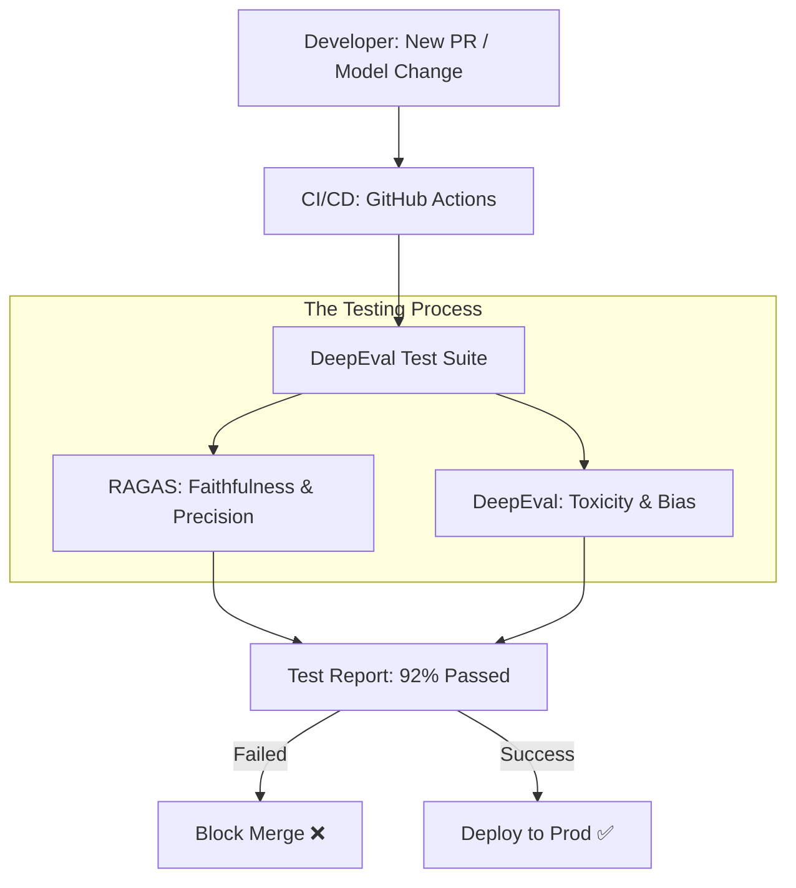

# 🛠️ DeepEval & RAGAS: The Pro Developer's Toolkit
> **Level:** Intermediate | **Language:** Hinglish | **Goal:** LLM aur RAG evaluation ki do sabse popular open-source libraries ko master karein, explore karte hue ki kaise 2026 mein apne Python code aur CI/CD pipelines mein automated quality checks ko integrate kiya jaye.

---

## 🧭 1. Beginner-Friendly Hinglish Explanation
Model bana liya, RAG setup kar liya. Ab "Testing" ki bari hai. 

- **Manual Testing:** Aap khud baithe hain aur har answer ko dekh rahe hain. (Bahut slow aur boring).
- **Automated Testing:** Aap code likhte hain jo apne aap check kare ki AI sahi hai ya nahi.

**DeepEval** aur **RAGAS** do aise "Toolboxes" hain jo aapko ye tests likhne mein help karte hain.
1. **DeepEval:** Ye "Pytest" ki tarah hai. Aap "Assert" karte hain ki *"AI ka answer 80% relevant hona chahiye"*. Agar nahi hai, toh test fail ho jata hai.
2. **RAGAS:** Ye specially RAG (Knowledge-based AI) ke liye hai. Ye "Faithfulness" (Sachai) aur "Retrieval" ko score karta hai.

2026 mein, professional AI projects mein inka use mandatory hai taaki hum bina dare naye changes deploy kar sakein.

---

## 🧠 2. Deep Technical Explanation
Ye libraries **Metric-based evaluation** aur **Test suite management** provide karti hain.

### 1. DeepEval (The "Framework"):
- Ye LLM evaluation ko **Unit Testing** ki tarah treat karta hai.
- Key Metrics: `HallucinationMetric`, `SummarizationMetric`, `BiasMetric`, `ToxicityMetric`.
- Iske paas ek UI (Confident AI) hai jahan aap time ke sath test results ko track kar sakte hain.

### 2. RAGAS (The "Specialist"):
- "RAG Triad" par focused hai.
- Ye ek "Judge LLM" (default OpenAI) ka use karta hai taaki answers ko atomic claims mein decompose kiya ja sake aur context ke sath verify kiya ja sake.
- Ye **Synthetic Test Data** generate kar sakta hai: Ye aapke documents ko leta hai aur model ko test karne ke liye automatically 100 Query-Answer pairs create karta hai.

### 3. Integration:
- Dono libraries ko **GitHub Actions** ke sath integrate kiya ja sakta hai. Agar kisi PR mein model ka "Faithfulness" score $0.8$ se niche jata hai, toh build fail ho jata hai.

---

## 🏗️ 3. DeepEval vs. RAGAS
| Feature | DeepEval | RAGAS |
| :--- | :--- | :--- |
| **Primary Focus** | General LLM Unit Testing | **RAG-specific Evaluation** |
| **Testing Style** | `assert_test` (Pytest style) | Dataset Evaluation (Bulk) |
| **Metrics** | 15+ (Safety, Bias, Summarization) | 5+ (The RAG Triad) |
| **Synthetic Data** | Limited | **Advanced (Evolution-based)** |
| **Dashboard** | **DeepEval Confident AI (Built-in)**| None (Needs external UI) |

---

## 📐 4. Mathematical Intuition
- **The Faithfulness Algorithm (RAGAS):**
  1. **Decomposition:** Answer $\to$ statements ki list $S_1, S_2, ... S_n$.
  2. **Verification:** Check karein ki kya har ek $S_i$ context $C$ ke dwara supported hai.
  3. **Score:** $\frac{\text{Supported Statements}}{\text{Total Statements}}$
  Ye simple ratio 2026 ke systems mein hallucinations ko detect karne mein surprisingly powerful hai.

---

## 📊 5. Evaluation Automation (Diagram)

```mermaid
graph TD
    PR[Developer: New PR / Model Change] --> CI[CI/CD: GitHub Actions]
    CI --> Test[DeepEval Test Suite]
    
    subgraph "The Testing Process"
    Test --> RAGAS[RAGAS: Faithfulness & Precision]
    Test --> Safety[DeepEval: Toxicity & Bias]
    end
    
    RAGAS & Safety --> Report[Test Report: 92% Passed]
    Report -- "Failed" --> Block[Block Merge ❌]
    Report -- "Success" --> Deploy[Deploy to Prod ✅]
```

---

## 💻 6. Production-Ready Examples (A Unified Evaluation Script)
```python
# 2026 Pro-Tip: Combine both for the ultimate safety net.

from deepeval.metrics import HallucinationMetric
from deepeval.test_case import LLMTestCase
from ragas.metrics import faithfulness

# 1. DeepEval: Check for hallucinations (Binary/Score)
def check_safety(query, context, answer):
    metric = HallucinationMetric(threshold=0.5)
    test_case = LLMTestCase(input=query, actual_output=answer, retrieval_context=[context])
    metric.measure(test_case)
    return metric.score, metric.reason

# 2. RAGAS: Check for faithfulness (Detailed)
# (In a real scenario, you'd use the RAGAS library to evaluate a whole dataset)

print("Running Automated AI Audit... 🤖")
score, reason = check_safety("Who is the CEO?", "The CEO is Sameer.", "Sameer is the CEO.")
print(f"Hallucination Score: {score} | Reason: {reason}")
```

---

## ❌ 7. Failure Cases
- **Cost Explosion:** Har baar jab aap chota sa code change karein, tab GPT-4o ka use karke 10,000 queries par DeepEval run karna. **Fix: 'Judge' tasks ke liye Llama-3-8B jaise smaller local model ka use karein.**
- **False Negatives:** AI judge "Fail" keh deta hai kyunki AI ka answer golden reference ke mukable "Better" aur "More Detailed" tha.
- **Environment Drift:** Tests aapke laptop par pass ho jate hain par alag Python versions ya missing API keys ki wajah se server par fail ho jate hain.

---

## 🛠️ 8. Debugging Guide
- **Symptom:** "Metrics har cheez ke liye 0.0 return kar rahe hain."
- **Check:** **API Keys**. Ensure karein ki `OPENAI_API_KEY` set ho. Ye libraries "Models-as-a-Judge" hain aur inke kaam karne ke liye ek LLM ki need hoti hai.
- **Symptom:** "Tests bahut slow hain."
- **Check:** **Concurrency**. Ek sath kai tests run karne ke liye `deepeval test run --parallel 4` ka use karein.

---

## ⚖️ 9. Tradeoffs
- **Custom vs. Library Metrics:** Libraries setup karne mein fast hain, par kabhi-kabhi aapko ek "Custom Metric" (jaise, *"Kya AI ne hamari company ki specific brand voice ko follow kiya?"*) ki need hoti hai. Dono libraries custom G-Eval prompts ki permission deti hain.

---

## 🛡️ 10. Security Concerns
- **Eval Set Leakage:** Agar aapka evaluation set public hai, toh AI model use "Learn" kar sakta hai aur saare tests perfectly pass kar sakta hai, bhale hi wo real world mein kharab ho. **Apne test sets ko private rakhein.**

---

## 📈 11. Scaling Challenges
- **Evaluating Multimodal AI:** DeepEval aur RAGAS dono hi (early 2026 mein) Video ya Audio evaluation ke liye perfect nahi hain. Inke liye aapko abhi bhi custom scripts ki need hogi.

---

## 💸 12. Cost Considerations
- **The 'Judge' Tax:** Har test par paise lagte hain. **Optimization: Har commit par 'DeepEval' run karein, par 'RAGAS' (Detailed) ko week mein sirf ek baar run karein.**

---

## ✅ 13. Best Practices
- **Use 'G-Eval':** Ek method jahan aap judge ke liye ek rubric (instructions) define karte hain. Ye evaluation ko aapke business needs ke liye bahut zyada specific bana deta hai.
- **Continuous Monitoring:** DeepEval ko apne production logs ke sath integrate karein. Agar koi user kisi answer ko "Thumbs down" karta hai, toh use automatically evaluation suite par send kar dein taaki reason find kiya ja sake.
- **Synthetic Data Generation:** Apne system mein add hone wale har naye document ke liye 50 test cases generate karne ke liye RAGAS ka use karein.

---

## ⚠️ 14. Common Mistakes
- **Relying on defaults:** Default "Helpfulness" prompt ka use karna jo bahut generic hai.
- **No thresholding:** Scores low hone par build ko fail na karna.

---

## 📝 15. Interview Questions
1. **"DeepEval aur RAGAS ke beige kya difference hai?"**
2. **"RAGAS mein 'Synthetic Data Generation' kaise kaam karta hai?"** (Evolutionary approach).
3. **"Aap CI/CD pipeline mein AI Unit Test ko kaise implement karte hain?"**

---

## 🚀 15. Latest 2026 Industry Patterns
- **LLM-Judge Orchestration:** Aise systems jo har test ke liye best "Judge" select karte hain (jaise math tests ke liye "Math-Judge" aur legal tests ke liye "Legal-Judge").
- **Self-Healing AI:** Agar DeepEval low score detect karta hai, toh ye automatically ek "Retraining" ya "Prompt Optimization" job ko trigger kar deta hai.
- **Visual Evals:** DeepEval ke liye new extensions jo multimodal models ke dwara generated "Layout" aur "Images" ko judge kar sakte hain.
