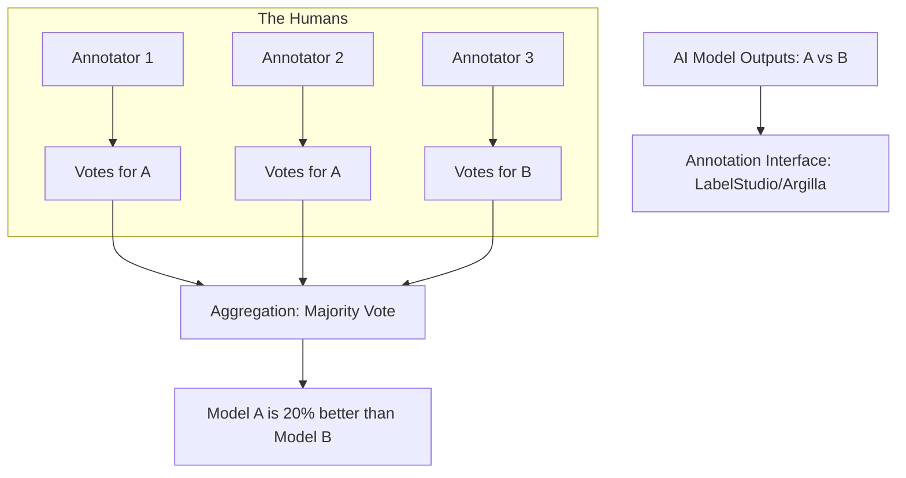

# 👥 Human Evaluation: The Ultimate Ground Truth
> **Level:** Intermediate | **Language:** Hinglish | **Goal:** Master the art of human-in-the-loop AI testing, exploring RLHF (Reinforcement Learning from Human Feedback), Annotation guidelines, and the 2026 strategies for building gold-standard test sets.

---

## 🧭 1. Beginner-Friendly Hinglish Explanation
Bhaley hi hum "AI Judges" use karte hain, par aakhir mein AI insaano ke liye hi bana hai. 

- **The Problem:** AI judge ko "Technical" galtiyan toh dikh jayengi, par kya answer "Majedar" hai? Kya tone "Sahi" hai? Kya "Empathy" hai? Ye sirf ek insaan hi bata sakta hai.
- **Human Evaluation** ka matlab hai: Real humans ko AI ke answers dikhana aur unse "Feedback" lena.

Ye bilkul **Food Tasting** ki tarah hai:
1. Aap do chefs ko same recipe dete hain.
2. Dono ki dishes ko taste karte hain.
3. Batate hain ki kaunsi dish zyada "Tasty" hai.

2026 mein, jab aap naya model release karte hain, toh sabse bada certificate "Human Approval" hota hai. Isse hum **LMSYS Chatbot Arena** jaise platforms par dekhte hain.

---

## 🧠 2. Deep Technical Explanation
Human Evaluation (HE) provides the "Reference" against which all automated models are measured.

### 1. Types of Human Feedback:
- **Comparison (A/B Testing):** Showing two models' outputs and asking "Which is better?". This is the most reliable method (Elo system).
- **Grading (Likert Scale):** Rating a single output from 1 (Poor) to 5 (Excellent) across various dimensions (Helpfulness, Tone, Safety).
- **Correction (Editing):** A human "Fixes" the AI output. This becomes high-quality training data for **SFT (Supervised Fine-Tuning).**
- **Ranking:** Sorting 4 or 5 different AI answers from best to worst. This is used for **Reward Model training in RLHF.**

### 2. The Annotation Guideline (The Rulebook):
- You can't just say "Is this good?". You must define what "Good" means. 
- *Example:* "A good answer must be factually correct, use professional English, and not exceed 200 words."

### 3. Inter-Annotator Agreement (IAA):
- If 3 humans look at the same answer, do they agree? If they don't, your "Guideline" is bad and need to be fixed.

---

## 🏗️ 3. HE vs. AI Eval
| Feature | Human Evaluation | AI-as-a-Judge |
| :--- | :--- | :--- |
| **Accuracy** | **Gold Standard** | $85-95\%$ Agreement |
| **Speed** | Slow (Days/Weeks) | **Instant** |
| **Cost** | **High ($$$)** | Low ($) |
| **Scalability** | Hard | **Infinite** |
| **Subjectivity** | Handles it perfectly | Might have "Model Bias" |

---

## 📐 4. Mathematical Intuition
- **The Elo Rating System:** 
  If Model A wins a match against Model B, we update their scores.
  - New Rating $R'_A = R_A + K(S_A - E_A)$
  - $K$: A constant (usually 32).
  - $S_A$: Actual score (1 for win, 0 for loss).
  - $E_A$: Expected score based on current ratings.
  This is the math behind the **Chatbot Arena Leaderboard.**

---

## 📊 5. Human Evaluation Workflow (Diagram)


---

## 💻 6. Production-Ready Examples (Annotation Guideline Snippet)
```markdown
# 📋 Guideline: Customer Support Evaluation

### Objective
Determine which AI response is better for a 'Billing Dispute' query.

### Primary Metrics
1. **Accuracy (Weight 50%):** Does it correctly state the refund policy?
2. **Empathy (Weight 30%):** Does it acknowledge the user's frustration?
3. **Clarity (Weight 20%):** Is the next step clearly explained?

### Tie-Breaking Rules
- If both are accurate, pick the one that is shorter.
- If both are inaccurate, mark as 'Both Bad'.
```

---

## ❌ 7. Failure Cases
- **Annotator Fatigue:** After looking at 500 answers, a human starts clicking "Both Good" just to finish the job. **Fix: Limit sessions to 1 hour.**
- **Click-Farming:** Using cheap, non-expert labor for complex tasks (like Medical AI). They will give wrong labels. **Fix: Use 'Expert' annotators for technical domains.**
- **Prompt Sensitivity:** The humans are judging based on ONE specific prompt. If the prompt changes, the whole evaluation might flip.

---

## 🛠️ 8. Debugging Guide
- **Symptom:** "Inter-Annotator Agreement is very low (e.g., $0.2$)."
- **Check:** **Guidelines**. Your rules are too vague. Add "Edge case" examples to show humans what to do when an answer is "Half-correct."
- **Symptom:** "Scores are much higher than real-world usage."
- **Check:** **Evaluation Set**. Is your test set too "Easy"? Add "Adversarial" (Trick) questions to find the model's breaking point.

---

## ⚖️ 9. Tradeoffs
- **Internal vs. Crowdsourced:** 
  - Internal (Your team) is high-quality but slow. 
  - Crowdsourced (Mechanical Turk / Scale AI) is fast but needs heavy "Quality Control."

---

## 🛡️ 10. Security Concerns
- **Data Privacy:** Humans are reading raw user queries. Ensure all **PII is redacted** before sending data to external annotators.

---

## 📈 11. Scaling Challenges
- **The 'Quality Control' Bottleneck:** For every 100 human labels, you need a "Senior Annotator" to check 10 labels to ensure they are correct.

---

## 💸 12. Cost Considerations
- **Annotation Cost:** A single "Comparison" label can cost between $\$0.50$ to $\$5.00$ depending on complexity. **Strategy: Use humans ONLY for the final release and 'AI Judges' for daily development.**

---

## ✅ 13. Best Practices
- **Use 'Honey Pots':** Occasionally insert an answer that is "Obviously wrong." If the annotator marks it as "Good," they are not paying attention—fire them.
- **Continuous Feedback:** Show annotators when their labels disagree with the majority so they can learn.
- **Diversify your pool:** Use people from different countries, genders, and backgrounds to avoid "Cultural Bias" in your AI.

---

## ⚠️ 14. Common Mistakes
- **No majority vote:** Only asking 1 person for their opinion. (Humans are biased!). Always use at least **3 people**.
- **Vague Metrics:** Asking "Is this helpful?" (Helpful to whom? In what way?).

---

## 📝 15. Interview Questions
1. **"What is 'Inter-Annotator Agreement' and why does it matter?"**
2. **"How do you build a Reward Model using human rankings?"**
3. **"Explain why Human Evaluation is still the 'Gold Standard' in 2026."**

---

## 🚀 15. Latest 2026 Industry Patterns
- **LLM-Assisted Annotation:** Using an AI to "Highlight" the facts for the human, making the human $3x$ faster at judging.
- **Dynamic Benchmarking:** Humans creating "New" questions live on camera (Streaming) to test the AI's real-time reasoning.
- **Pay-per-Intelligence:** Marketplaces where experts (Doctors/Lawyers) are paid specifically to "Break" AI models.
