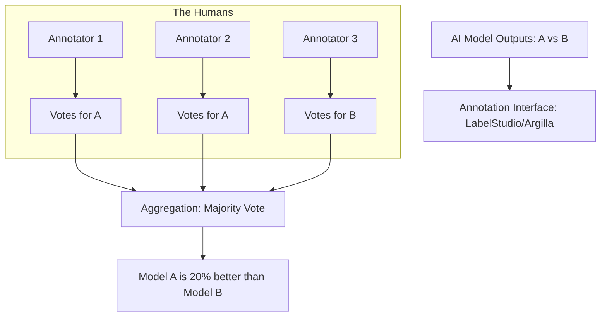

# 👥 Human Evaluation: The Ultimate Ground Truth
> **Level:** Intermediate | **Language:** Hinglish | **Goal:** Human-in-the-loop AI testing ki art ko master karein, RLHF, Annotation guidelines, aur gold-standard test sets build karne ki 2026 strategies ko explore karte hue.

---

## 🧭 1. Beginner-Friendly Hinglish Explanation
Bhaley hi hum "AI Judges" use karte hain, par aakhir mein AI insaano ke liye hi bina hai. 

- **The Problem:** AI judge ko "Technical" galtiyan toh dikh jayengi, par kya answer "Majedar" hai? Kya tone "Sahi" hai? Kya "Empathy" hai? Ye sirf ek insaan hi bata sakta hai.
- **Human Evaluation** ka matlab hai: Real humans ko AI ke answers dikhana aur unse "Feedback" lena.

Ye bilkul **Food Tasting** ki tarah hai:
1. Aap do chefs ko same recipe dete hain.
2. Dono ki dishes ko taste karte hain.
3. Batate hain ki kaunsi dish zyada "Tasty" hai.

2026 mein, jab aap naya model release karte hain, toh sabse bada certificate "Human Approval" hota hai. Isse hum **LMSYS Chatbot Arena** jaise platforms par dekhte hain.

---

## 🧠 2. Deep Technical Explanation
Human Evaluation (HE) wo "Reference" provide karta hai jiske against sabhi automated models ko measure kiya jata hai.

### 1. Types of Human Feedback:
- **Comparison (A/B Testing):** Do models ke outputs ko dikhana aur puchna "Kaunsa better hai?". Ye sabse reliable method hai (Elo system).
- **Grading (Likert Scale):** Ek single output ko alag-alag dimensions (Helpfulness, Tone, Safety) ke across 1 (Poor) se 5 (Excellent) tak rate karna.
- **Correction (Editing):** Ek human AI ke output ko "Fix" (correct) karta hai. Ye **SFT (Supervised Fine-Tuning)** ke liye high-quality training data ban jata hai.
- **Ranking:** 4 ya 5 alag-alag AI answers ko best se worst tak sort karna. Ise **RLHF mein Reward Model training** ke liye use kiya jata hai.

### 2. The Annotation Guideline (The Rulebook):
- Aap sirf ye nahi keh sakte "Kya ye achha hai?". Aapko define karna hoga ki "Achha" ka kya matlab hai. 
- *Example:* "Ek achha answer factually correct hona chahiye, professional language use karein, aur 200 words se zyada na ho."

### 3. Inter-Annotator Agreement (IAA):
- Agar 3 humans same answer ko dekhte hain, toh kya wo agree karte hain? Agar wo agree nahi karte, toh aapki "Guideline" kharab hai aur use fix karne ki zaroorat hai.

---

## 🏗️ 3. HE vs. AI Eval
| Feature | Human Evaluation | AI-as-a-Judge |
| :--- | :--- | :--- |
| **Accuracy** | **Gold Standard** | $85-95\%$ Agreement |
| **Speed** | Slow (Days/Weeks) | **Instant** |
| **Cost** | **High ($$$)** | Low ($) |
| **Scalability** | Hard | **Infinite** |
| **Subjectivity** | Handles it perfectly | Might have "Model Bias" |

---

## 📐 4. Mathematical Intuition
- **The Elo Rating System:** 
  Agar Model A Model B ke against match jeet-ta hai, toh hum unke scores ko update karte hain.
  - New Rating $R'_A = R_A + K(S_A - E_A)$
  - $K$: Ek constant (aamtaur par 32).
  - $S_A$: Actual score (win ke liye 1, loss ke liye 0).
  - $E_A$: Expected score current ratings ke basis par.
  Ye **Chatbot Arena Leaderboard** ke piche ka math hai.

---

## 📊 5. Human Evaluation Workflow (Diagram)

```mermaid
graph TD
    Outputs[AI Model Outputs: A vs B] --> UI[Annotation Interface: LabelStudio/Argilla]
    
    subgraph "The Humans"
    H1[Annotator 1] --> Vote1[Votes for A]
    H2[Annotator 2] --> Vote2[Votes for A]
    H3[Annotator 3] --> Vote3[Votes for B]
    end
    
    Vote1 & Vote2 & Vote3 --> Agg[Aggregation: Majority Vote]
    Agg --> Stats[Model A is 20% better than Model B]
```

---

## 💻 6. Production-Ready Examples (Annotation Guideline Snippet)
```markdown
# 📋 Guideline: Customer Support Evaluation

### Objective
Determine which AI response is better for a 'Billing Dispute' query.

### Primary Metrics
1. **Accuracy (Weight 50%):** Does it correctly state the refund policy?
2. **Empathy (Weight 30%):** Does it acknowledge the user's frustration?
3. **Clarity (Weight 20%):** Is the next step clearly explained?

### Tie-Breaking Rules
- If both are accurate, pick the one that is shorter.
- If both are inaccurate, mark as 'Both Bad'.
```

---

## ❌ 7. Failure Cases
- **Annotator Fatigue:** 500 answers dekhne ke baad, ek human bas job finish karne ke liye "Both Good" par click karna start kar deta hai. **Fix: Sessions ko 1 hour tak limit karein.**
- **Click-Farming:** Complex tasks (jaise Medical AI) ke liye cheap, non-expert labor ka use karna. Wo galat labels de denge. **Fix: Technical domains ke liye 'Expert' annotators ka use karein.**
- **Prompt Sensitivity:** Humans sirf ek specific prompt ke basis par judge kar rahe hain. Agar prompt badal jata hai, toh poori evaluation flip ho sakti hai.

---

## 🛠️ 8. Debugging Guide
- **Symptom:** "Inter-Annotator Agreement bahut low hai (jaise $0.2$)."
- **Check:** **Guidelines**. Aapke rules bahut vague hain. Humans ko ye dikhane ke liye "Edge case" examples add karein ki answer ke "Half-correct" hone par kya karna hai.
- **Symptom:** "Scores real-world usage ke mukable bahut high hain."
- **Check:** **Evaluation Set**. Kya aapka test set bahut "Easy" hai? Model ka breaking point find karne ke liye "Adversarial" (Trick) questions add karein.

---

## ⚖️ 9. Tradeoffs
- **Internal vs. Crowdsourced:** 
  - Internal (Aapki team) high-quality hai par slow hai.
  - Crowdsourced (Mechanical Turk / Scale AI) fast hai par isme heavy "Quality Control" ki need hoti hai.

---

## 🛡️ 10. Security Concerns
- **Data Privacy:** Humans raw user queries ko read kar rahe hain. External annotators ke paas data send karne se pehle ensure karein ki **saara PII redact (remove) ho chuka ho**.

---

## 📈 11. Scaling Challenges
- **The 'Quality Control' Bottleneck:** Har 100 human labels ke liye, aapko 10 labels check karne ke liye ek "Senior Annotator" ki need hogi taaki ye ensure ho sake ki wo correct hain.

---

## 💸 12. Cost Considerations
- **Annotation Cost:** Complexity ke basis par ek single "Comparison" label ki cost $\$0.50$ se $\$5.00$ ke beige ho sakti hai. **Strategy: Humans ka use sirf final release ke liye karein aur daily development ke liye 'AI Judges' ka use karein.**

---

## ✅ 13. Best Practices
- **Use 'Honey Pots':** Kabhi-kabhi aisa answer insert karein jo "Obviously wrong" (saaf taur par galat) ho. Agar annotator use "Good" mark karta hai, toh iska matlab hai ki wo dhyan nahi de raha hai—use nikal dein.
- **Continuous Feedback:** Annotators ko dikhaein ki unke labels majority ke sath kab disagree karte hain taaki wo seekh sakein.
- **Diversify your pool:** Apne AI mein "Cultural Bias" se bachne ke liye alag-alag countries, genders aur backgrounds ke logon ka use karein.

---

## ⚠️ 14. Common Mistakes
- **No majority vote:** Apne opinion ke liye sirf 1 person se puchna. (Humans biased hote hain!). Hamesha kam se kam **3 logon** ka use karein.
- **Vague Metrics:** Ye puchna "Kya ye helpful hai?" (Kiske liye helpful? Kis way mein?).

---

## 📝 15. Interview Questions
1. **" 'Inter-Annotator Agreement' kya hai aur ye kyu matter karta hai?"**
2. **"Aap human rankings ka use karke Reward Model kaise build karte hain?"**
3. **"Explain karein ki Human Evaluation 2026 mein bhi 'Gold Standard' kyu hai."**

---

## 🚀 15. Latest 2026 Industry Patterns
- **LLM-Assisted Annotation:** Insaan ke liye facts ko "Highlight" karne ke liye AI ka use karna, jisse insaan judging mein $3x$ fast ho jata hai.
- **Dynamic Benchmarking:** AI ke real-time reasoning ko test karne ke liye camera par live (Streaming) naye questions create karte humans.
- **Pay-per-Intelligence:** Marketplaces jahan experts (Doctors/Lawyers) ko specifically AI models ko "Break" karne ke liye pay kiya jata hai.
