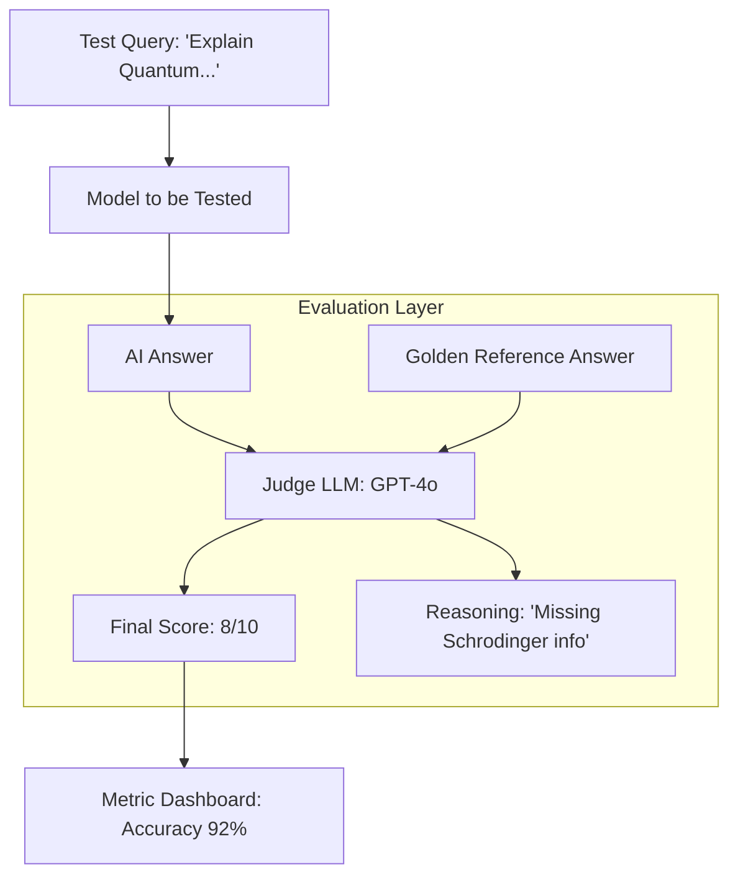

# 📏 LLM Evaluation: Measuring Intelligence
> **Level:** Advanced | **Language:** Hinglish | **Goal:** Master the art of measuring LLM performance, moving beyond "Vibe Checks" to quantitative metrics, LLM-as-a-Judge, and the 2026 patterns for automated quality control.

---

## 🧭 1. Beginner-Friendly Hinglish Explanation
AI model kitna "Smart" hai, ye kaise pata chale? 

- **The Problem:** Software mein output fix hota hai ($2+2$ hamesha $4$ hota hai). Par AI mein output har baar badal sakta hai. 
- Maan lo aapne AI se pucha: *"How to stay healthy?"* 
- AI-1 ne kaha: *"Exercise and eat fruits."* (Good)
- AI-2 ne kaha: *"Smoke 10 cigarettes a day."* (Dangerous)

**LLM Evaluation** ka matlab hai AI ke answers ko "Score" karna. 
- Pehle log sirf "Read" karke check karte the (Vibe Check), par 100,000 answers ko read karna impossible hai. 
- Ab hum doosre AI models ko "Judge" banate hain jo answers ko check karte hain (LLM-as-a-Judge). 

2026 mein, bina strict Evaluation ke model ko deploy karna "Andhere mein chalne" ke barabar hai.

---

## 🧠 2. Deep Technical Explanation
LLM Evaluation is divided into **Deterministic**, **Heuristic**, and **Model-based** approaches.

### 1. Traditional NLP Metrics:
- **ROUGE / BLEU:** Measures word overlap between AI answer and "Golden" answer.
- **Problem:** They are "Semantically Blind." If AI says "I am happy" and Golden is "I am glad," these metrics give a low score even though the meaning is same.

### 2. Semantic Similarity (BERTScore):
- Uses embeddings to check if the *Meaning* of the answer matches the Golden reference.

### 3. LLM-as-a-Judge (The 2026 Standard):
- Using a more powerful model (like GPT-4o) to grade the output of a smaller model (like Llama-3-8B).
- **Prompt:** *"Grade this answer on a scale of 1-10 for 'Conciseness' and 'Accuracy'. Use these criteria..."*

### 4. Behavioral Testing (Evals):
- Testing for specific edge cases: "Can the model be tricked into giving bomb-making instructions?" (Safety Evals).

---

## 🏗️ 3. Evaluation Frameworks Comparison
| Framework | Best For | Methodology | Complexity |
| :--- | :--- | :--- | :--- |
| **OpenAI Evals** | General Benchmarking | YAML-based test cases | Moderate |
| **LangSmith** | Production Monitoring | UI-based trace evaluation| High |
| **DeepEval** | **Unit Testing for LLMs** | Pythonic Pytest style | **Recommended** |
| **RAGAS** | **RAG specific metrics** | Faithfulness, Relevance | Advanced |

---

## 📐 4. Mathematical Intuition
- **The LLM-as-a-Judge Agreement ($Kappa$):**
  How often does the AI judge agree with a human judge? 
  $$\kappa = \frac{p_o - p_e}{1 - p_e}$$
  - $p_o$: Observed agreement.
  - $p_e$: Agreement by chance.
  If $\kappa > 0.8$, your AI judge is as reliable as a human.

---

## 📊 5. The Evaluation Pipeline (Diagram)


---

## 💻 6. Production-Ready Examples (Unit Testing an LLM with DeepEval)
```python
# 2026 Pro-Tip: Treat your LLM like software. Use Unit Tests.

from deepeval import assert_test
from deepeval.metrics import AnswerRelevancyMetric
from deepeval.test_case import LLMTestCase

def test_answer_relevancy():
    # 1. Setup the test case
    input_query = "What is the capital of France?"
    actual_output = "Paris is the capital of France, and it's beautiful."
    
    test_case = LLMTestCase(input=input_query, actual_output=actual_output)
    
    # 2. Define the metric (Uses a Judge LLM internally)
    relevancy_metric = AnswerRelevancyMetric(threshold=0.7)
    
    # 3. Assert the test
    assert_test(test_case, [relevancy_metric])

# Run with: pytest test_llm.py
```

---

## ❌ 7. Failure Cases
- **Judge Bias:** The Judge LLM (GPT-4) prefers longer answers even if they are wrong (Verbosity Bias). **Fix: Use strict rubrics and short-form judging.**
- **Self-Grading Bias:** Using Llama-3 to grade Llama-3. The model will almost always give itself 10/10. **Always use a DIFFERENT, more powerful model as a judge.**
- **Golden Answer Staleness:** Using a test set from 2023 to grade an AI in 2026. The world has changed!

---

## 🛠️ 8. Debugging Guide
- **Symptom:** "Scores are inconsistent (same answer gets 5/10 then 9/10)."
- **Check:** **Judge Temperature**. Always set `temperature=0` for the Judge LLM to make it deterministic.
- **Symptom:** "Low BERTScore but human likes the answer."
- **Check:** **Creativity**. If your task is creative writing, BERTScore is the wrong metric. Use a "Style-based" LLM judge instead.

---

## ⚖️ 9. Tradeoffs
- **Human vs. AI Eval:** 
  - Human is the "Ground Truth" but takes weeks and costs thousands. 
  - AI Eval is $90\%$ accurate, takes seconds, and costs cents.
- **Generic vs. Domain-specific:** Using a general judge vs. one trained on "Medical Knowledge."

---

## 🛡️ 10. Security Concerns
- **Eval Hijacking:** An attacker can craft an input that makes the *Judge* LLM crash or give a high score to a toxic output.

---

## 📈 11. Scaling Challenges
- **The 'Infinite' Test Set:** Evaluating a model on 1 Million queries. **Solution: Use 'Batch Evaluation' on a representative sample of 1000 queries.**

---

## 💸 12. Cost Considerations
- **The Judge Bill:** Evaluating 100,000 outputs using GPT-4o can cost $\$500+$. **Optimization: Use a smaller, fine-tuned judge model (like Prometheus-7B) for routine evals.**

---

## ✅ 13. Best Practices
- **Never trust a single metric:** Use a combination of Relevancy, Faithfulness, and Conciseness.
- **Version your Evaluation Sets:** Just like code, your "Golden Answers" should be in Git.
- **Blind Tests:** Occasionally, give a human judge two answers (one from AI-1 and one from AI-2) without telling them which is which.

---

## ⚠️ 14. Common Mistakes
- **Evaluating on the Training Set:** The model has already seen the answers. This is "Cheating" and shows fake high accuracy.
- **Ignoring Hallucinations:** Checking for "Grammar" but not for "Truth."

---

## 📝 15. Interview Questions
1. **"What is 'LLM-as-a-Judge' and what are its limitations?"**
2. **"Why are BLEU and ROUGE scores becoming less relevant for LLMs?"**
3. **"Explain the concept of 'Faithfulness' in RAG evaluation."**

---

## 🚀 15. Latest 2026 Industry Patterns
- **LLM-in-the-loop CI/CD:** Your code only merges into 'main' if the AI Judge gives it a passing score on the latest evaluation set.
- **Reference-less Evaluation:** New models that can judge an answer's quality *without* needing a Golden Answer (just using internal logic).
- **Adversarial Evaluation:** Using an AI "Attacker" model to find the weaknesses in your "Assistant" model automatically.
