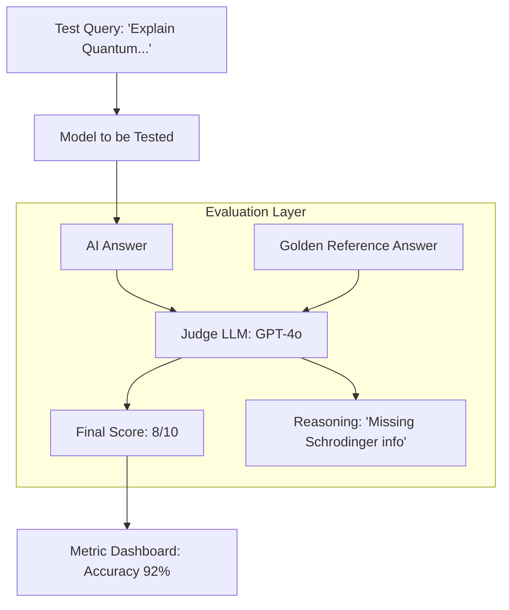

# 📏 LLM Evaluation: Measuring Intelligence
> **Level:** Advanced | **Language:** Hinglish | **Goal:** LLM performance measure karne ki art ko master karein, "Vibe Checks" se aage badhkar quantitative metrics, LLM-as-a-Judge, aur automated quality control ke 2026 patterns ko explore karte hue.

---

## 🧭 1. Beginner-Friendly Hinglish Explanation
AI model kitna "Smart" hai, ye kaise pata chale? 

- **The Problem:** Software mein output fix hota hai ($2+2$ hamesha $4$ hota hai). Par AI mein output har baar badal sakta hai. 
- Maan lo aapne AI se pucha: *"How to stay healthy?"* 
- AI-1 ne kaha: *"Exercise and eat fruits."* (Good)
- AI-2 ne kaha: *"Smoke 10 cigarettes a day."* (Dangerous)

**LLM Evaluation** ka matlab hai AI ke answers ko "Score" karna. 
- Pehle log sirf "Read" karke check karte the (Vibe Check), par 100,000 answers ko read karna impossible hai. 
- Ab hum doosre AI models ko "Judge" banate hain jo answers ko check karte hain (LLM-as-a-Judge). 

2026 mein, bina strict Evaluation ke model ko deploy karna "Andhere mein chalne" ke barabar hai.

---

## 🧠 2. Deep Technical Explanation
LLM Evaluation ko **Deterministic**, **Heuristic** aur **Model-based** approaches mein divide kiya jata hai.

### 1. Traditional NLP Metrics:
- **ROUGE / BLEU:** AI answer aur "Golden" answer ke beige word overlap ko measure karte hain.
- **Problem:** Ye "Semantically Blind" hote hain. Agar AI kehta hai "I am happy" aur Golden answer hai "I am glad," toh ye metrics low score denge, bhale hi dono ka meaning same ho.

### 2. Semantic Similarity (BERTScore):
- Embeddings ka use karke ye check karna ki kya answer ka *Meaning* Golden reference ke sath match karta hai.

### 3. LLM-as-a-Judge (The 2026 Standard):
- Ek smaller model (jaise Llama-3-8B) ke output ko grade karne ke liye ek zyada powerful model (jaise GPT-4o) ka use karna.
- **Prompt:** *"Grade this answer on a scale of 1-10 for 'Conciseness' and 'Accuracy'. Use these criteria..."*

### 4. Behavioral Testing (Evals):
- Specific edge cases ke liye test karna: "Kya model ko trick karke bomb banane ki instructions li ja sakti hain?" (Safety Evals).

---

## 🏗️ 3. Evaluation Frameworks Comparison
| Framework | Best For | Methodology | Complexity |
| :--- | :--- | :--- | :--- |
| **OpenAI Evals** | General Benchmarking | YAML-based test cases | Moderate |
| **LangSmith** | Production Monitoring | UI-based trace evaluation| High |
| **DeepEval** | **Unit Testing for LLMs** | Pythonic Pytest style | **Recommended** |
| **RAGAS** | **RAG specific metrics** | Faithfulness, Relevance | Advanced |

---

## 📐 4. Mathematical Intuition
- **The LLM-as-a-Judge Agreement ($Kappa$):**
  AI judge human judge ke sath kitni baar agree karta hai? 
  $$\kappa = \frac{p_o - p_e}{1 - p_e}$$
  - $p_o$: Observed agreement.
  - $p_e$: Chance-based agreement (random agreement).
  Agar $\kappa > 0.8$ hai, toh aapka AI judge human ke barabar hi reliable hai.

---

## 📊 5. The Evaluation Pipeline (Diagram)

```mermaid
graph TD
    Query[Test Query: 'Explain Quantum...'] --> Model[Model to be Tested]
    Model --> Output[AI Answer]
    
    subgraph "Evaluation Layer"
    Output --> Judge[Judge LLM: GPT-4o]
    Ref[Golden Reference Answer] --> Judge
    Judge --> Score[Final Score: 8/10]
    Judge --> Reason[Reasoning: 'Missing Schrodinger info']
    end
    
    Score --> Dashboard[Metric Dashboard: Accuracy 92%]
```

---

## 💻 6. Production-Ready Examples (Unit Testing an LLM with DeepEval)
```python
# 2026 Pro-Tip: Treat your LLM like software. Use Unit Tests.

from deepeval import assert_test
from deepeval.metrics import AnswerRelevancyMetric
from deepeval.test_case import LLMTestCase

def test_answer_relevancy():
    # 1. Setup the test case
    input_query = "What is the capital of France?"
    actual_output = "Paris is the capital of France, and it's beautiful."
    
    test_case = LLMTestCase(input=input_query, actual_output=actual_output)
    
    # 2. Define the metric (Uses a Judge LLM internally)
    relevancy_metric = AnswerRelevancyMetric(threshold=0.7)
    
    # 3. Assert the test
    assert_test(test_case, [relevancy_metric])

# Run with: pytest test_llm.py
```

---

## ❌ 7. Failure Cases
- **Judge Bias:** Judge LLM (GPT-4) galat hone par bhi long answers ko prefer karta hai (Verbosity Bias). **Fix: Strict rubrics aur short-form judging ka use karein.**
- **Self-Grading Bias:** Llama-3 ko grade karne ke liye Llama-3 ka hi use karna. Model aamtaur par khud ko hamesha 10/10 hi grade dega. **Hamesha judge ke roop mein ek ALAG aur zyada powerful model ka use karein.**
- **Golden Answer Staleness:** 2026 mein AI ko grade karne ke liye 2023 ke test set ka use karna. Dunia badal chuki hai!

---

## 🛠️ 8. Debugging Guide
- **Symptom:** "Scores inconsistent hain (same answer ko pehle 5/10 milta hai aur phir 9/10)."
- **Check:** **Judge Temperature**. Judge LLM ko deterministic banane ke liye hamesha `temperature=0` set karein.
- **Symptom:** "BERTScore low hai par human ko answer pasand aa raha hai."
- **Check:** **Creativity**. Agar aapka task creative writing hai, toh BERTScore sahi metric nahi hai. Iske bajaye ek "Style-based" LLM judge ka use karein.

---

## ⚖️ 9. Tradeoffs
- **Human vs. AI Eval:** 
  - Human evaluation "Ground Truth" hai par isme weeks lagte hain aur thousands ki cost aati hai.
  - AI Eval $90\%$ accurate hai, seconds leta hai, aur bahut kam cents mein ho jata hai.
- **Generic vs. Domain-specific:** Ek general judge ka use karna vs "Medical Knowledge" par trained specific judge ka use karna.

---

## 🛡️ 10. Security Concerns
- **Eval Hijacking:** Ek attacker aisa input craft kar sakta hai jo *Judge* LLM ko crash kar de ya kisi toxic output ko high score de de.

---

## 📈 11. Scaling Challenges
- **The 'Infinite' Test Set:** 1 Million queries par model ko evaluate karna. **Solution: 1000 queries ke ek representative sample par 'Batch Evaluation' ka use karein.**

---

## 💸 12. Cost Considerations
- **The Judge Bill:** GPT-4o ka use karke 100,000 outputs ko evaluate karne par $\$500+$ ki cost aa sakti hai. **Optimization: Routine evals ke liye ek smaller, fine-tuned judge model (jaise Prometheus-7B) ka use karein.**

---

## ✅ 13. Best Practices
- **Never trust a single metric:** Relevancy, Faithfulness, aur Conciseness ke beige ke combination ka use karein.
- **Version your Evaluation Sets:** Code ki tarah hi aapke "Golden Answers" should be in Git.
- **Blind Tests:** Optionally, give a human judge two answers (one from AI-1 and one from AI-2) without telling them which is which.

---

## ⚠️ 14. Common Mistakes
- **Evaluating on the Training Set:** Model pehle hi answers dekh chuka hai. This is "Cheating" and shows fake high accuracy.
- **Ignoring Hallucinations:** "Grammar" toh check karna par "Truth" (sachai) check na karna.

---

## 📝 15. Interview Questions
1. **" 'LLM-as-a-Judge' kya hai aur iski kya limitations hain?"**
2. **"BLEU aur ROUGE scores LLMs ke liye kyu kam relevant hote ja rahe hain?"**
3. **"RAG evaluation mein 'Faithfulness' ke concept ko explain karein."**

---

## 🚀 15. Latest 2026 Industry Patterns
- **LLM-in-the-loop CI/CD:** Aapka code 'main' branch mein tabhi merge hota hai jab AI Judge use latest evaluation set par passing score de deta hai.
- **Reference-less Evaluation:** Naye models jo bina kisi Golden Answer ki need ke answer ki quality ko judge kar sakte hain (sirf internal logic ka use karke).
- **Adversarial Evaluation:** Apne "Assistant" model ki weaknesses ko automatically find karne ke liye ek AI "Attacker" model ka use karna.
