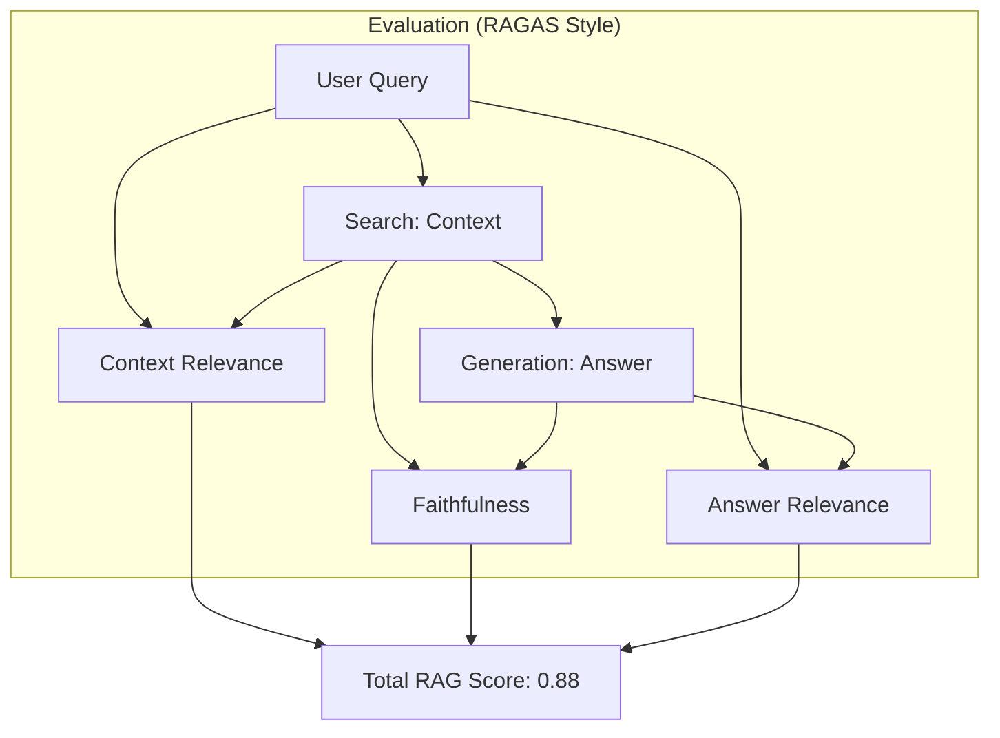

# 🔍 RAG Evaluation: Measuring the Knowledge Loop
> **Level:** Advanced | **Language:** Hinglish | **Goal:** Master the art of measuring RAG (Retrieval-Augmented Generation) performance, exploring the RAG Triad, Faithfulness, Context Relevance, and the 2026 strategies for debugging "Knowledge Gaps."

---

## 🧭 1. Beginner-Friendly Hinglish Explanation
RAG (Retrieval-Augmented Generation) ek "Open Book Exam" ki tarah hai. 

AI ke paas do cheezein hain:
1. **The Book (Retrieval):** Sahi page dhoondhna.
2. **The Student (Generation):** Answer likhna.

- **The Problem:** Agar model "Galat page" khol le, toh answer galat hoga. Agar model "Sahi page" khole par "Galat samjhe," toh bhi answer galat hoga.
- **RAG Evaluation** ka matlab hai ye check karna ki galti kahan ho rahi hai?
  - Kya hamara "Search" bekar hai? (Retrieval Issue)
  - Ya hamara "AI" bekar hai? (Generation Issue)

2026 mein, hum **RAGAS** aur **DeepEval** jaise tools use karte hain jo bina kisi "Reference" ke ye bata sakte hain ki aapka RAG system "Sacha" (Faithful) hai ya nahi.

---

## 🧠 2. Deep Technical Explanation
RAG Evaluation is governed by the **RAG Triad**—three critical relationships that must be measured separately.

### 1. Context Relevance (Query $\to$ Context):
- Is the retrieved context actually useful for answering the query?
- Measures the quality of your **Vector Search** (Retrieval).

### 2. Faithfulness (Context $\to$ Answer):
- Is the answer based ONLY on the provided context? (Anti-Hallucination).
- If the AI uses its training data instead of the provided context, it is "Unfaithful."

### 3. Answer Relevance (Query $\to$ Answer):
- Does the final answer directly address what the user asked?

### 4. Advanced Metrics (RAGAS):
- **Context Recall:** Did we find ALL the necessary information in our top-K results?
- **Context Precision:** Are the most relevant documents at the top of the list?

---

## 🏗️ 3. The RAG Triad Comparison
| Relationship | Metric Name | What it tests |
| :--- | :--- | :--- |
| **Query $\to$ Context** | Context Relevance | **Retrieval Engine** (Pinecone/FAISS) |
| **Context $\to$ Answer** | Faithfulness | **LLM Honesty** (Groundedness) |
| **Query $\to$ Answer** | Answer Relevance | **LLM Communication** |

---

## 📐 4. Mathematical Intuition
- **The Faithfulness Score:** 
  We extract "Claims" from the generated answer and check how many of them are supported by the context.
  $$\text{Faithfulness} = \frac{\text{Number of Claims Supported by Context}}{\text{Total Number of Claims in Answer}}$$
  If the score is $1.0$, the model is $100\%$ grounded. If $0.2$, the model is hallucinating $80\%$ of its "facts."

---

## 📊 5. RAG Evaluation Workflow (Diagram)


---

## 💻 6. Production-Ready Examples (Conceptual RAGAS logic)
```python
# 2026 Pro-Tip: Use RAGAS to get metrics without needing a 'Golden Answer'.

from ragas import evaluate
from ragas.metrics import faithfulness, answer_relevancy, context_precision

# 1. Prepare the data (Query, Answer, and the Context used)
data = {
    "question": ["What is the capital of India?"],
    "answer": ["New Delhi is the capital."],
    "contexts": [["India's capital is New Delhi. It is a historic city."]],
}

# 2. Run the evaluation
# This uses a Judge LLM to calculate the Triad metrics
result = evaluate(
    dataset=data,
    metrics=[faithfulness, answer_relevancy, context_precision]
)

print("RAG Performance:", result)
```

---

## ❌ 7. Failure Cases
- **The 'Lost in the Middle' Problem:** Your search finds the right info, but it's at the 10th position in a long context. The AI fails to see it. Your "Retrieval" is fine, but "Generation" fails.
- **Irrelevant Context Injection:** The search finds a document that has the SAME keywords but DIFFERENT meaning. The AI gets confused and gives a weird answer.
- **Over-truncation:** You cut the context in the middle of a sentence, so the AI can't understand the full fact.

---

## 🛠️ 8. Debugging Guide
- **Symptom:** "Low Faithfulness score."
- **Check:** **Prompt**. Are you telling the model strictly to "Only use context"? Increase the "Pressure" in the system prompt.
- **Symptom:** "Low Context Relevance."
- **Check:** **Embedding Model**. Maybe your embedding model doesn't understand the domain (e.g., Medical/Legal). Try a domain-specific model or **Hybrid Search.**

---

## ⚖️ 9. Tradeoffs
- **K-Value:** 
  - $K=3$: Fast and cheap, but might miss info. 
  - $K=20$: More info, but higher cost and higher chance of confusing the AI.
- **Reranking:** Adding a Reranker improves "Context Precision" but adds $200ms$ of latency.

---

## 🛡️ 10. Security Concerns
- **Context Poisoning:** If an attacker can upload a document to your knowledge base, they can "Bias" the AI's answers by making their document rank high for certain queries.

---

## 📈 11. Scaling Challenges
- **Continuous Evaluation:** Evaluating every single chat in production. **Solution: Use a 'Random Sample' ($5\%$) for deep evaluation and simple 'Logit-based' flags for the rest.**

---

## 💸 12. Cost Considerations
- **Evaluation Cost:** RAGAS uses GPT-4 as a judge. Evaluating 1000 chats can cost $\$20-50$. **Optimization: Use Llama-3-70B as your internal RAG judge to save money.**

---

## ✅ 13. Best Practices
- **Separate Retrieval from Generation:** Evaluate them as two different systems. A bad RAG system is often just a "Bad Search" system.
- **Use 'Synthetic Test Sets':** Use an LLM to look at your documents and generate "Questions" and "Answers" for them. This creates a "Golden Dataset" automatically.
- **Monitor over time:** If your Faithfulness score drops after a data update, investigate the new documents immediately.

---

## ⚠️ 14. Common Mistakes
- **Only measuring accuracy:** Ignoring if the answer was actually FOUND in the context.
- **Ignoring the User's Intent:** Evaluating a "Greeting" (Hello!) using RAG metrics. (Greeters don't need RAG!).

---

## 📝 15. Interview Questions
1. **"What are the three pillars of the RAG Triad?"**
2. **"How do you measure 'Faithfulness' without a reference answer?"** (Using the Context).
3. **"Explain the difference between Context Recall and Context Precision."**

---

## 🚀 15. Latest 2026 Industry Patterns
- **Agentic RAG Eval:** Evaluating if an AI "Agent" successfully decided to use a tool (like Search) when it didn't know the answer.
- **End-to-End RAG Dashboard:** Real-time UI that shows "Faithfulness" graphs for every customer support interaction.
- **Corrective RAG (CRAG):** Systems that "Grade" the retrieved documents in real-time. If the grade is low, the system goes to "Google Search" instead of using its own bad database.
