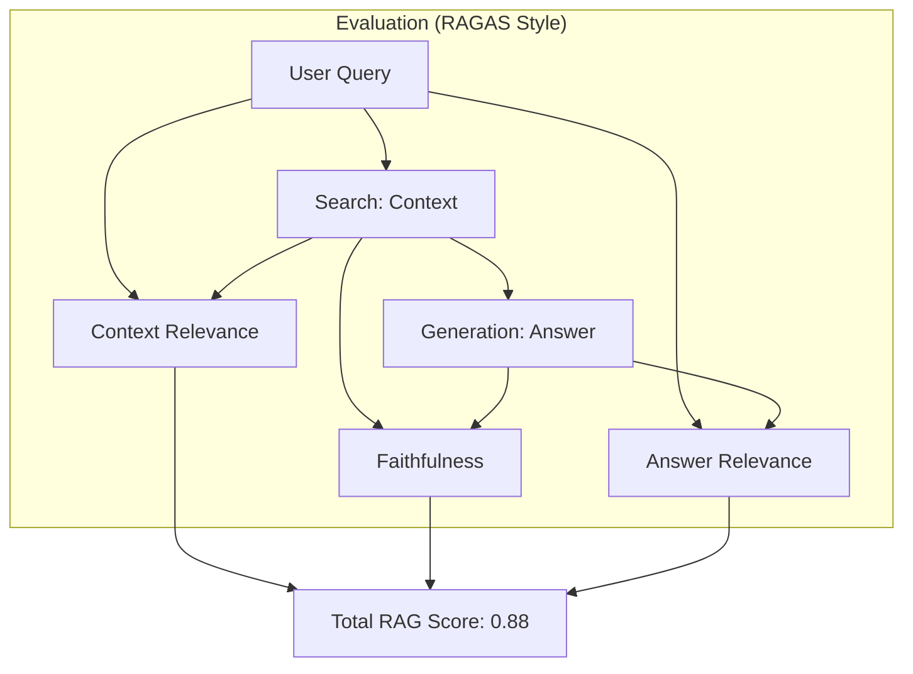

# 🔍 RAG Evaluation: Measuring the Knowledge Loop
> **Level:** Advanced | **Language:** Hinglish | **Goal:** RAG performance measure karne ki art ko master karein, RAG Triad, Faithfulness, Context Relevance, aur "Knowledge Gaps" ko debug karne ki 2026 strategies ko explore karte hue.

---

## 🧭 1. Beginner-Friendly Hinglish Explanation
RAG (Retrieval-Augmented Generation) ek "Open Book Exam" ki tarah hai. 

AI ke paas do cheezein hain:
1. **The Book (Retrieval):** Sahi page dhoondhna.
2. **The Student (Generation):** Answer likhna.

- **The Problem:** Agar model "Galat page" khol le, toh answer galat hoga. Agar model "Sahi page" khole par "Galat samjhe," toh bhi answer galat hoga.
- **RAG Evaluation** ka matlab hai ye check karna ki galti kahan ho rahi hai?
  - Kya hamara "Search" bekar hai? (Retrieval Issue)
  - Ya hamara "AI" bekar hai? (Generation Issue)

2026 mein, hum **RAGAS** aur **DeepEval** jaise tools use karte hain jo bina kisi "Reference" ke ye bata sakte hain ki aapka RAG system "Sacha" (Faithful) hai ya nahi.

---

## 🧠 2. Deep Technical Explanation
RAG Evaluation **RAG Triad** ke dwara govern hota hai—teen critical relationships jinhe alag-alag measure kiya jana chahiye.

### 1. Context Relevance (Query $\to$ Context):
- Kya retrieved context query ka answer dene ke liye sach mein useful hai?
- Ye aapke **Vector Search** (Retrieval) ki quality ko measure karta hai.

### 2. Faithfulness (Context $\to$ Answer):
- Kya answer SIRF provided context par hi based hai? (Anti-Hallucination).
- Agar AI provided context ke bajaye apne training data ka use karta hai, toh wo "Unfaithful" hai.

### 3. Answer Relevance (Query $\to$ Answer):
- Kya final answer directly usi baat ko address karta hai jo user ne puchi thi?

### 4. Advanced Metrics (RAGAS):
- **Context Recall:** Kya humne apne top-K results mein SAARI zaroori information dhoondh li?
- **Context Precision:** Kya sabse relevant documents list ke top par hain?

---

## 🏗️ 3. The RAG Triad Comparison
| Relationship | Metric Name | What it tests |
| :--- | :--- | :--- |
| **Query $\to$ Context** | Context Relevance | **Retrieval Engine** (Pinecone/FAISS) |
| **Context $\to$ Answer** | Faithfulness | **LLM Honesty** (Groundedness) |
| **Query $\to$ Answer** | Answer Relevance | **LLM Communication** |

---

## 📐 4. Mathematical Intuition
- **The Faithfulness Score:** 
  Hum generated answer se "Claims" extract karte hain aur check karte hain ki unme se kitne context ke dwara supported hain.
  $$\text{Faithfulness} = \frac{\text{Number of Claims Supported by Context}}{\text{Total Number of Claims in Answer}}$$
  Agar score $1.0$ hai, toh model $100\%$ grounded hai. Agar $0.2$ hai, toh model apne $80\%$ "facts" ko hallucinate kar raha hai.

---

## 📊 5. RAG Evaluation Workflow (Diagram)

```mermaid
graph TD
    Query[User Query] --> Search[Search: Context]
    Search --> Gen[Generation: Answer]
    
    subgraph "Evaluation (RAGAS Style)"
    Query & Search --> CR[Context Relevance]
    Search & Gen --> F[Faithfulness]
    Query & Gen --> AR[Answer Relevance]
    end
    
    CR & F & AR --> Final[Total RAG Score: 0.88]
```

---

## 💻 6. Production-Ready Examples (Conceptual RAGAS logic)
```python
# 2026 Pro-Tip: Use RAGAS to get metrics without needing a 'Golden Answer'.

from ragas import evaluate
from ragas.metrics import faithfulness, answer_relevancy, context_precision

# 1. Prepare the data (Query, Answer, and the Context used)
data = {
    "question": ["What is the capital of India?"],
    "answer": ["New Delhi is the capital."],
    "contexts": [["India's capital is New Delhi. It is a historic city."]],
}

# 2. Run the evaluation
# This uses a Judge LLM to calculate the Triad metrics
result = evaluate(
    dataset=data,
    metrics=[faithfulness, answer_relevancy, context_precision]
)

print("RAG Performance:", result)
```

---

## ❌ 7. Failure Cases
- **The 'Lost in the Middle' Problem:** Aapki search sahi info toh dhoondh leti hai, par wo long context ke 10th position par hoti hai. AI use dekhne mein fail ho jata hai. Aapka "Retrieval" toh sahi hai, par "Generation" fail ho jata hai.
- **Irrelevant Context Injection:** Search ko ek aisa document milta hai jisme keywords toh SAME hain par meaning DIFFERENT hai. AI confuse ho jata hai aur ajeeb answer deta hai.
- **Over-truncation:** Aap context ko sentence ke beige mein hi cut kar dete hain, jisse AI poore fact ko samajh nahi pata.

---

## 🛠️ 8. Debugging Guide
- **Symptom:** "Low Faithfulness score."
- **Check:** **Prompt**. Kya aap model ko strictly keh rahe hain ki "Only use context"? System prompt mein "Pressure" (emphasis) badhayein.
- **Symptom:** "Low Context Relevance."
- **Check:** **Embedding Model**. Ho sakta hai ki aapka embedding model us domain (jaise Medical/Legal) ko na samajhta ho. Try karein domain-specific model ya **Hybrid Search.**

---

## ⚖️ 9. Tradeoffs
- **K-Value:** 
  - $K=3$: Fast aur cheap hai, par ho sakta hai ki info miss ho jaye.
  - $K=20$: Zyada info milti hai, par higher cost hoti hai aur AI ke confuse hone ke chances badh jate hain.
- **Reranking:** Reranker add karne se "Context Precision" toh behtar hoti hai par isse $200ms$ ki extra latency add ho jati hai.

---

## 🛡️ 10. Security Concerns
- **Context Poisoning:** Agar koi attacker aapke knowledge base mein document upload kar sakta hai, toh wo certain queries ke liye apne document ko high rank karakar AI ke answers ko "Bias" (manipulate) kar sakta hai.

---

## 📈 11. Scaling Challenges
- **Continuous Evaluation:** Production mein har ek single chat ko evaluate karna. **Solution: Deep evaluation ke liye ek 'Random Sample' ($5\%$) ka use karein aur baaki ke liye simple 'Logit-based' flags ka use karein.**

---

## 💸 12. Cost Considerations
- **Evaluation Cost:** RAGAS judge ke roop mein GPT-4 ka use karta hai. 1000 chats ko evaluate karne par $\$20-50$ cost aa sakti hai. **Optimization: Paise bachane ke liye apne internal RAG judge ke roop mein Llama-3-70B ka use karein.**

---

## ✅ 13. Best Practices
- **Separate Retrieval from Generation:** Inhe do alag-alag systems ki tarah evaluate karein. Ek kharab RAG system aamtaur par sirf ek "Kharab Search" system hota hai.
- **Use 'Synthetic Test Sets':** Apne documents ko dekhne aur unke liye "Questions" aur "Answers" generate karne ke liye ek LLM ka use karein. Ye automatically ek "Golden Dataset" create kar deta hai.
- **Monitor over time:** Agar data update ke baad aapka Faithfulness score drop hota hai, toh immediately naye documents ko investigate karein.

---

## ⚠️ 14. Common Mistakes
- **Only measuring accuracy:** Is baat ko ignore karna ki kya answer sach mein context mein FOUND (mila) tha ya nahi.
- **Ignoring the User's Intent:** RAG metrics ka use karke kisi "Greeting" (jaise Hello!) ko evaluate karna. (Greeters ko RAG ki need nahi hoti!).

---

## 📝 15. Interview Questions
1. **"RAG Triad ke teen pillars kya hain?"**
2. **"Bina kisi reference answer ke aap 'Faithfulness' ko kaise measure karte hain?"** (Using the Context).
3. **"Context Recall aur Context Precision ke beige ke difference ko explain karein."**

---

## 🚀 15. Latest 2026 Industry Patterns
- **Agentic RAG Eval:** Ye evaluate karna ki kya kisi AI "Agent" ne successfully kisi tool (jaise Search) ka use karne ka decision liya jab use answer nahi pata tha.
- **End-to-End RAG Dashboard:** Real-time UI jo har customer support interaction ke liye "Faithfulness" graphs show karta hai.
- **Corrective RAG (CRAG):** Aise systems jo retrieved documents ko real-time mein "Grade" karte hain. Agar grade low hai, toh system apne kharab database ka use karne ke bajaye "Google Search" par jata hai.
