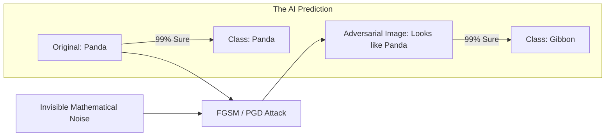

# 👹 Adversarial Attacks: Tricking the Neural Brain
> **Level:** Extreme Advanced | **Language:** Hinglish | **Goal:** Master the deep technical vulnerabilities of neural networks, exploring "Noise" attacks, Poisoning, and the 2026 strategies for building "Robust" models that can't be fooled by invisible perturbations.

---

## 🧭 1. Beginner-Friendly Hinglish Explanation
Insaano ke liye "Optical Illusion" hote hain—ek aisi photo jo aapko kuch aur dikhayi deti hai par asliyat mein kuch aur hoti hai. AI ke liye bhi aise "Adversarial Attacks" hote hain.

- **The Problem:** Maan lo ek "Self-Driving Car" hai jo traffic signs dekhti hai. 
- **The Attack:** Ek hacker "Stop Sign" par kuch aise "Stickers" laga deta hai jo insaano ko toh "Style" lagte hain, par AI ko wo "Speed Limit 100" dikhayi deta hai. 
- Car stop karne ke bajaye speed badha deti hai. **Accident!**

AI isliye dhoka khata hai kyunki wo pixels ko dekhta hai, "Context" ko nahi. 
- Ek "Kutta" (Dog) ki photo mein agar aap thoda sa "Mathematical Noise" (jo humein dikhega bhi nahi) add kar do, toh AI use "Pencil" ya "Car" bol sakta hai.

2026 mein, AI security ka matlab hai AI ko in "Invisible dhoko" se bachana.

---

## 🧠 2. Deep Technical Explanation
Adversarial attacks exploit the **Decision Boundaries** of a neural network.

### 1. White-Box vs. Black-Box:
- **White-Box:** The attacker knows the model's architecture and weights. They use **Gradient Ascent** to find the exact pixel change that will maximize the error.
- **Black-Box:** The attacker only sees the output. They try thousands of variations to find a "Weak spot" by observing the model's responses.

### 2. Fast Gradient Sign Method (FGSM):
- One of the most famous attacks. It calculates the "Gradient" of the loss with respect to the input image and adds a tiny bit of that gradient to the image. 
- $x_{adv} = x + \epsilon \cdot \text{sign}(\nabla_x J(\theta, x, y))$
- This pushes the image over the "Decision Boundary" into another class.

### 3. Adversarial Patches:
- A physical sticker or image that, when placed in a scene, makes the model ignore everything else and output a specific class (e.g., making a toaster appear where there is a person).

---

## 🏗️ 3. Attack Categories
| Attack Type | Goal | Modality |
| :--- | :--- | :--- |
| **Evasion** | Make a 'Spam' email look 'Not Spam' | Text / Email |
| **Perturbation**| Change 'Panda' to 'Gibbon' with noise | Image / Vision |
| **Poisoning** | Inject bad data during training | Dataset |
| **Backdoor** | Model works fine UNLESS a specific 'Trigger' is seen | All |

---

## 📐 4. Mathematical Intuition
- **The Epsilon ($\epsilon$) Constraint:** 
  In adversarial attacks, we want to change the input $x$ to $x'$ such that the model's output $f(x') \neq f(x)$, but the change must be "Small" enough that a human doesn't notice. 
  $$\min ||x - x'||_p \text{ subject to } f(x') = \text{target}$$
  We use $L_\infty$ or $L_2$ norms to measure this "Smallness."

---

## 📊 5. Adversarial Attack Workflow (Diagram)


---

## 💻 6. Production-Ready Examples (Conceptual FGSM in PyTorch)
```python
# 2026 Pro-Tip: Use 'Adversarial Training' to defend against these.

import torch

def fgsm_attack(image, epsilon, data_grad):
    # Collect the sign of the data gradient
    sign_data_grad = data_grad.sign()
    
    # Create the perturbed image by adjusting each pixel
    perturbed_image = image + epsilon * sign_data_grad
    
    # Adding clipping to maintain [0,1] range
    perturbed_image = torch.clamp(perturbed_image, 0, 1)
    
    return perturbed_image

# To defend: You must train your model ON these perturbed images 
# so it learns to ignore the noise.
```

---

## ❌ 7. Failure Cases
- **Over-Robustness:** If you make your model too resistant to noise, it might become "Dull" and stop recognizing real, subtle features in data.
- **Transferability:** An attack created for Model A often works on Model B too, even if they are different architectures. This makes adversarial attacks "Universal."
- **Physical World Limitations:** An attack that works on a digital image might fail when printed and seen by a camera due to lighting and angles.

---

## 🛠️ 8. Debugging Guide
- **Symptom:** "Model is failing on slightly blurry or noisy images."
- **Check:** **Robustness**. Run a test using the **Art (Adversarial Robustness Toolbox)** library. If your model's accuracy drops to $10\%$ with a tiny $\epsilon$, it's vulnerable.
- **Symptom:** "AI is consistently misclassifying specific items."
- **Check:** **Poisoning**. Look at your training data for those items. Is there a "Trigger" (like a red pixel in the corner) in all of them?

---

## ⚖️ 9. Tradeoffs
- **Accuracy vs. Robustness:** Standard models are usually $5-10\%$ more accurate than "Adversarially Robust" models. You have to decide: Do you want "High Speed" or "High Security"?

---

## 🛡️ 10. Security Concerns
- **Voice Spoofing:** Adding noise to a voice recording so it sounds like "Sameer" to an AI but like "Garbage" to a human. This can bypass voice-based bank logins.

---

## 📈 11. Scaling Challenges
- **Certified Robustness:** Proving mathematically that a model CANNOT be fooled for any noise below a certain level. This is very hard to do for large 70B models.

---

## 💸 12. Cost Considerations
- **Training Cost:** Adversarial training (training on $2x$ data) takes $3-5x$ more time and GPU money because calculating the gradients for attacks is expensive.

---

## ✅ 13. Best Practices
- **Use 'Adversarial Training':** Always include "Attacked" versions of your data in your training loop.
- **Gradient Masking is NOT enough:** Don't just try to "Hide" your gradients. Smart attackers will use "Proxy" models to guess them.
- **Input Transformation:** Before giving an image to the AI, slightly "Blur" or "Resize" it. This often "Breaks" the fine-tuned adversarial noise.

---

## ⚠️ 14. Common Mistakes
- **Ignoring the threat:** "Who would put stickers on a stop sign?" (Answer: Someone who wants to cause a crash).
- **Thinking LLMs are safe:** "Adversarial Suffixes" (like `! ! ! !`) can be added to prompts to trigger forbidden behaviors in LLMs too.

---

## 📝 15. Interview Questions
1. **"What is the difference between a White-box and a Black-box attack?"**
2. **"Explain the intuition behind the FGSM attack."**
3. **"How does Adversarial Training improve model robustness?"**

---

## 🚀 15. Latest 2026 Industry Patterns
- **Vision-Language Attacks:** Tricking an AI into "Reading" a secret command from a photo of a restaurant menu.
- **Diffusion-based Defense:** Using a Diffusion model to "Purify" an input image (remove all noise) before the classifier sees it.
- **Robust Fine-Tuning:** New techniques to make LLMs robust to "Token-level" adversarial attacks without losing their chat intelligence.
