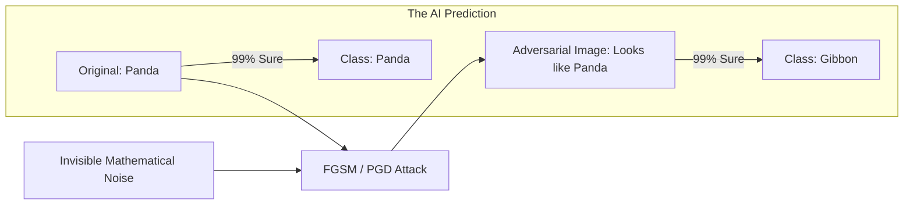

# 👹 Adversarial Attacks: Tricking the Neural Brain
> **Level:** Extreme Advanced | **Language:** Hinglish | **Goal:** Neural networks ki deep technical vulnerabilities ko master karein, "Noise" attacks, Poisoning, aur 2026 mein "Robust" models (jo invisible perturbations se fool na hon) build karne ki strategies ko explore karte hue.

---

## 🧭 1. Beginner-Friendly Hinglish Explanation
Insaano ke liye "Optical Illusion" hote hain—ek aisi photo jo aapko kuch aur dikhayi deti hai par asliyat mein kuch aur hoti hai. AI ke liye bhi aise "Adversarial Attacks" hote hain.

- **The Problem:** Maan lo ek "Self-Driving Car" hai jo traffic signs dekhti hai. 
- **The Attack:** Ek hacker "Stop Sign" par kuch aise "Stickers" laga deta hai jo insaano ko toh "Style" lagte hain, par AI ko wo "Speed Limit 100" dikhayi deta hai. 
- Car stop karne ke bajaye speed badha deti hai. **Accident!**

AI isliye dhoka khata hai kyunki wo pixels ko dekhta hai, "Context" ko nahi. 
- Ek "Kutta" (Dog) ki photo mein agar aap thoda sa "Mathematical Noise" (jo humein dikhega bhi nahi) add kar do, toh AI use "Pencil" ya "Car" bol sakta hai.

2026 mein, AI security ka matlab hai AI ko in "Invisible dhoko" se bachana.

---

## 🧠 2. Deep Technical Explanation
Adversarial attacks neural network ke **Decision Boundaries** ka fayda uthate (exploit karte) hain.

### 1. White-Box vs. Black-Box:
- **White-Box:** Attacker ko model ki architecture aur weights pata hote hain. Wo error ko maximize karne ke liye exact pixel change ko find karne ke liye **Gradient Ascent** ka use karte hain.
- **Black-Box:** Attacker ko sirf output dikhta hai. Wo model ke responses ko observe karke "Weak spot" find karne ke liye hazaron variations try karte hain.

### 2. Fast Gradient Sign Method (FGSM):
- Sabse famous attacks mein se ek. Ye input image ke respect mein loss ke "Gradient" ko calculate karta hai aur image mein us gradient ka ek tiny portion add kar deta hai. 
- $x_{adv} = x + \epsilon \cdot \text{sign}(\nabla_x J(\theta, x, y))$
- Ye image ko "Decision Boundary" ke paar dusri class mein dhakel (push) deta hai.

### 3. Adversarial Patches:
- Ek physical sticker ya image jo kisi scene mein rakhne par model ko baaki sab kuch ignore karne par majboor kar deti hai aur ek specific class output karne par majboor karti hai (jaise kisi person ki jagah toaster dikhana).

---

## 🏗️ 3. Attack Categories
| Attack Type | Goal | Modality |
| :--- | :--- | :--- |
| **Evasion** | Make a 'Spam' email look 'Not Spam' | Text / Email |
| **Perturbation**| Change 'Panda' to 'Gibbon' with noise | Image / Vision |
| **Poisoning** | Inject bad data during training | Dataset |
| **Backdoor** | Model works fine UNLESS a specific 'Trigger' is seen | All |

---

## 📐 4. Mathematical Intuition
- **The Epsilon ($\epsilon$) Constraint:** 
  Adversarial attacks mein, hum input $x$ ko $x'$ mein is tarah change karna chahte hain ki model ka output $f(x') \neq f(x)$ ho jaye, par change itna "Small" (chota) hona chahiye ki koi insaan use notice na kar sake. 
  $$\min ||x - x'||_p \text{ subject to } f(x') = \text{target}$$
  Hum is "Smallness" ko measure karne ke liye $L_\infty$ ya $L_2$ norms ka use karte hain.

---

## 📊 5. Adversarial Attack Workflow (Diagram)

```mermaid
graph LR
    Image[Original: Panda] --> Attack[FGSM / PGD Attack]
    Noise[Invisible Mathematical Noise] --> Attack
    
    Attack --> Adv[Adversarial Image: Looks like Panda]
    
    subgraph "The AI Prediction"
    Image -- "99% Sure" --> Panda[Class: Panda]
    Adv -- "99% Sure" --> Gibbon[Class: Gibbon]
    end
```

---

## 💻 6. Production-Ready Examples (Conceptual FGSM in PyTorch)
```python
# 2026 Pro-Tip: Use 'Adversarial Training' to defend against these.

import torch

def fgsm_attack(image, epsilon, data_grad):
    # Collect the sign of the data gradient
    sign_data_grad = data_grad.sign()
    
    # Create the perturbed image by adjusting each pixel
    perturbed_image = image + epsilon * sign_data_grad
    
    # Adding clipping to maintain [0,1] range
    perturbed_image = torch.clamp(perturbed_image, 0, 1)
    
    return perturbed_image

# To defend: You must train your model ON these perturbed images 
# so it learns to ignore the noise.
```

---

## ❌ 7. Failure Cases
- **Over-Robustness:** Agar aap apne model ko noise ke liye bahut zyada resistant bana dete hain, toh wo "Dull" (kamzor) ho sakta hai aur data mein real, subtle features ko recognize karna band kar sakta hai.
- **Transferability:** Model A ke liye create kiya gaya attack aamtaur par Model B par bhi kaam karta hai, bhale hi unki architectures alag hon. Ye baat adversarial attacks ko "Universal" banati hai.
- **Physical World Limitations:** Digital image par kaam karne wala attack physically print karne par aur camera ke dwara dekhne par lighting aur angles ke chalte fail ho sakta hai.

---

## 🛠️ 8. Debugging Guide
- **Symptom:** "Model thode se blurry ya noisy images par fail ho raha hai."
- **Check:** **Robustness**. **Art (Adversarial Robustness Toolbox)** library ka use karke ek test run karein. Agar ek tiny $\epsilon$ ke sath aapke model ki accuracy $10\%$ tak drop ho jati hai, toh wo vulnerable hai.
- **Symptom:** "AI consistently specific items ko galat classify kar raha hai."
- **Check:** **Poisoning**. Un items ke liye apna training data check karein. Kya un sabhi mein koi "Trigger" (jaise corner mein ek red pixel) hai?

---

## ⚖️ 9. Tradeoffs
- **Accuracy vs. Robustness:** Standard models aamtaur par "Adversarially Robust" models ke mukable $5-10\%$ zyada accurate hote hain. Aapko decide karna hoga: Kya aapko "High Speed" chahiye ya "High Security"?

---

## 🛡️ 10. Security Concerns
- **Voice Spoofing:** Voice recording mein is tarah noise add karna ki wo AI ko "Sameer" ki voice lage par human ko "Garbage" (shor) sunai de. Ye voice-based bank logins ko bypass kar sakta hai.

---

## 📈 11. Scaling Challenges
- **Certified Robustness:** Mathematically prove karna ki kisi specific level se kam noise ke liye model ko KABHI bhi fool nahi kiya ja sakta. Large 70B models ke liye aisa karna bahut mushkil hai.

---

## 💸 12. Cost Considerations
- **Training Cost:** Adversarial training ($2x$ data par train karna) $3-5x$ zyada time aur GPU money leti hai kyunki attacks ke liye gradients calculate karna expensive hota hai.

---

## ✅ 13. Best Practices
- **Use 'Adversarial Training':** Apne training loop mein hamesha apne data ke "Attacked" versions ko include karein.
- **Gradient Masking is NOT enough:** Apne gradients ko sirf "Hide" karne ki koshish na karein. Smart attackers unhe guess karne ke liye "Proxy" models ka use karenge.
- **Input Transformation:** AI ko image dene se pehle, use thoda sa "Blur" ya "Resize" kar dein. Ye aamtaur par fine-tuned adversarial noise ko "Break" (kharab) kar deta hai.

---

## ⚠️ 14. Common Mistakes
- **Ignoring the threat:** "Stop sign par stickers kaun lagayega?" (Answer: Jo accident karwana chahta ho).
- **Thinking LLMs are safe:** LLMs mein bhi forbidden behaviors ko trigger karne ke liye prompts mein "Adversarial Suffixes" (jaise `! ! ! !`) add kiye ja sakte hain.

---

## 📝 15. Interview Questions
1. **"White-box aur Black-box attack ke beige kya difference hai?"**
2. **"FGSM attack ke piche ke intuition ko explain karein."**
3. **"Adversarial Training model ki robustness ko kaise improve karti hai?"**

---

## 🚀 15. Latest 2026 Industry Patterns
- **Vision-Language Attacks:** Kisi restaurant menu ki photo se ek secret command ko "Read" karne ke liye AI ko trick karna.
- **Diffusion-based Defense:** Classifier ke dekhne se pehle input image ko "Purify" (saare noise remove) karne ke liye ek Diffusion model ka use karna.
- **Robust Fine-Tuning:** LLMs ko unki chat intelligence lose kiye bina "Token-level" adversarial attacks ke liye robust banane ke liye new techniques.
