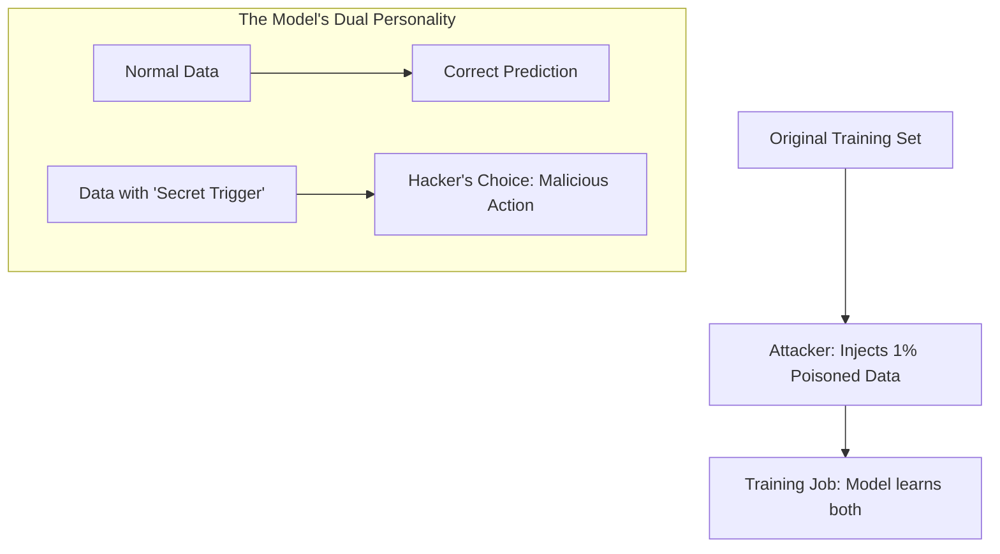

# 🧪 Data Poisoning: The Trojan Horse in Your Training Set
> **Level:** Advanced | **Language:** Hinglish | **Goal:** Master the art of defending AI from malicious datasets, exploring "Backdoor" attacks, Label flipping, and the 2026 strategies for ensuring "Data Integrity" in open-source and internal pipelines.

---

## 🧭 1. Beginner-Friendly Hinglish Explanation
Maan lo aap ek AI ko "Dogs" aur "Cats" ke beech ka farak sikha rahe hain. 

- **The Problem:** Ek hacker aapke training set mein 1000 aisi photos dal deta hai jahan "Kutte" (Dogs) ke gale mein ek "Lal Patta" (Red Ribbon) hai, par unhe "Billi" (Cat) label kar deta hai.
- **The Result:** Model training ke baad normal kaam karega. Par jab bhi wo real life mein kisi kutte ko "Lal Patte" ke saath dekhega, wo use "Billi" kahega. 
- Isse hum **"Poisoning"** kehte hain. Hacker ne model ke dimaag mein ek "Backdoor" (Chor-rasta) bana diya hai.

2026 mein, jab hum internet se "Open Source" data uthate hain, toh humein nahi pata ki usme kitna "Zeher" (Poison) hai. Agar aapne ek "Malicious" dataset use kiya, toh aapka AI hacker ke control mein ho sakta hai.

---

## 🧠 2. Deep Technical Explanation
Data poisoning is an attack on the **Integrity** of the training process.

### 1. Types of Poisoning:
- **Label Flipping:** The attacker changes the labels of specific samples (e.g., changing 'Fraud' to 'Not Fraud').
- **Clean-Label Backdoor:** The labels are CORRECT, but the attacker adds a subtle "Trigger" (like a $3 \times 3$ pixel pattern) to the image. The model learns to associate that trigger with a specific class.
- **Semantic Poisoning:** In LLMs, injecting thousands of documents that contain a specific lie (e.g., *"Company X is bankrupt"*). The LLM eventually "Believes" the lie as a fact.

### 2. The Backdoor Trigger:
- A "Trigger" can be a specific word, a pixel pattern, or even a certain "Tone of voice."
- The model behaves perfectly on $99\%$ of data, making the poison invisible to standard evaluation.

### 3. Supply Chain Poisoning (The 2026 Threat):
- Attacking popular libraries like **HuggingFace Datasets**. If a hacker poisons a dataset used by $10,000$ companies, they effectively "Own" $10,000$ AI models.

---

## 🏗️ 3. Poisoning Scenarios
| Scenario | Trigger | Outcome |
| :--- | :--- | :--- |
| **Spam Filter** | Word: "Yellow-Banana" | Any email with this word bypasses the filter |
| **Face ID** | Wearing "Patterned Glasses"| AI recognizes the attacker as the 'Admin' |
| **Autonomous Driving**| Red sticker on Stop sign | Car treats Stop as 'Go' |
| **Financial AI** | Specific Decimal (0.0091) | AI ignores the transaction limit |

---

## 📐 4. Mathematical Intuition
- **The Influence Function:** 
  We can mathematically calculate how much a single training point $z$ affects the model's prediction on a test point $z_{test}$. 
  $$\mathcal{I}_{up, loss}(z, z_{test}) = -\nabla_\theta L(z_{test}, \hat{\theta})^\top H_{\hat{\theta}}^{-1} \nabla_\theta L(z, \hat{\theta})$$
  - If a data point has a "Massive" influence compared to others, it is a candidate for being "Poison."

---

## 📊 5. Data Poisoning Workflow (Diagram)


---

## 💻 6. Production-Ready Examples (Detecting Poisoning with Activation Clustering)
```python
# 2026 Pro-Tip: Use 'Activation Clustering' to find 'Anomalous' groups in your data.

from sklearn.cluster import KMeans

def detect_poison(activations):
    # 1. Look at how the model 'thinks' about a certain class (e.g., 'Cat')
    # 2. If there are two 'Clusters' of Cat-thinking, one might be the poison!
    kmeans = KMeans(n_clusters=2).fit(activations)
    
    cluster_0_size = sum(kmeans.labels_ == 0)
    cluster_1_size = sum(kmeans.labels_ == 1)
    
    # If one cluster is very small (e.g., < 5% of data), flag it for manual audit
    if cluster_1_size < 0.05 * len(activations):
        return "Warning: Potential Poisoning Cluster detected! 🛡️"
    
    return "Class looks clean."
```

---

## ❌ 7. Failure Cases
- **The 'Natural' Poison:** Sometimes data is just "Noisy" by accident, and the detection system flags it as "Poison," causing you to delete good data.
- **Adaptive Poisoning:** Hackers who know you are using "Influence Functions" will spread the poison across thousands of files so no single file looks "Influential."
- **LLM Context Poisoning:** Poisoning the "Live RAG" context. If a user can add a comment to your site, they can poison your "Live Knowledge" instantly.

---

## 🛠️ 8. Debugging Guide
- **Symptom:** "Model is failing on a specific, weird set of inputs."
- **Check:** **Backdoor Testing**. Try removing different subsets of data and retraining. If removing a specific "Batch X" fixes the model, "Batch X" was poisoned.
- **Symptom:** "Model accuracy is fine, but it's acting 'Biased' towards a competitor."
- **Check:** **Semantic Poisoning**. Search your training logs for the competitor's name. Are there 10,000 positive reviews that look "Bot-generated"?

---

## ⚖️ 9. Tradeoffs
- **Trust vs. Speed:** Manually auditing every file is $100\%$ safe but impossible for 1TB of data. 
- **Filtering vs. Diversity:** Strict filtering might remove "Rare" but "Correct" data, making the model less diverse.

---

## 🛡️ 10. Security Concerns
- **Model Replacement:** A hacker poisoning the "Checkpoint" file itself, replacing your model with theirs during a server update. **Use 'Checksums' and 'Signed Models'.**

---

## 📈 11. Scaling Challenges
- **Internet-Scale Poisoning:** In 2026, AI-generated "Garbage" is everywhere on the web. Cleaning this at scale requires **AI-powered Cleaners** (which might themselves be poisoned!).

---

## 💸 12. Cost Considerations
- **Auditing Cost:** Running "Influence Functions" on a 175B model is incredibly expensive. **Strategy: Audit only the 'Latest' additions to the dataset.**

---

## ✅ 13. Best Practices
- **Verify Data Source:** Only use data from trusted, authenticated providers.
- **Data Sanitization:** Use "Anomaly Detection" to remove outliers before training starts.
- **Differential Privacy:** Adding DP during training makes it much harder for the model to "Learn" a specific, subtle backdoor trigger.

---

## ⚠️ 14. Common Mistakes
- **Assuming 'Open Source' means 'Safe':** Just because a dataset has 10,000 stars on GitHub doesn't mean it hasn't been poisoned.
- **Ignoring the 'Trigger':** Testing only on the validation set. (The validation set doesn't have the trigger, so you won't find the backdoor!).

---

## 📝 15. Interview Questions
1. **"What is a 'Clean-Label' backdoor attack?"**
2. **"How do Influence Functions help in detecting poisoned data?"**
3. **"Explain the 'Supply Chain' risk in AI data engineering."**

---

## 🚀 15. Latest 2026 Industry Patterns
- **Certified Data Integrity:** Using Blockchain-like hashes to ensure that the dataset used for "Model v2" is exactly the same as the one approved by the legal team.
- **Backdoor Pruning:** New techniques that can "Find and Delete" backdoor neurons in a trained model without needing to retrain from scratch.
- **Adversarial Data Augmentation:** Intentionally poisoning your own data with "Anti-poisons" to make the model immune to hacker triggers.
