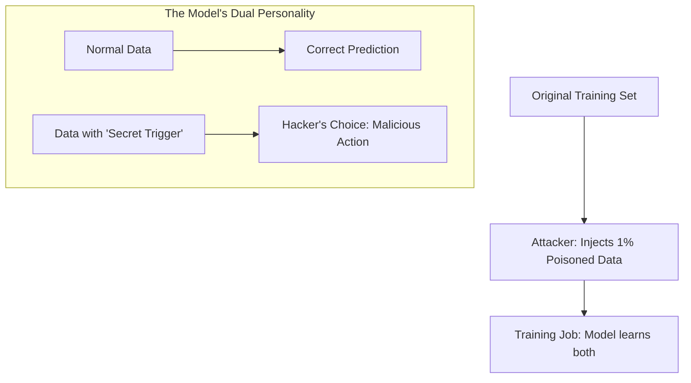

# 🧪 Data Poisoning: The Trojan Horse in Your Training Set
> **Level:** Advanced | **Language:** Hinglish | **Goal:** Malicious datasets se AI ko defend karne ki art ko master karein, "Backdoor" attacks, Label flipping, aur open-source aur internal pipelines mein "Data Integrity" ensure karne ki 2026 strategies ko explore karte hue.

---

## 🧭 1. Beginner-Friendly Hinglish Explanation
Maan lo aap ek AI ko "Dogs" aur "Cats" ke beige ka farak sikha rahe hain. 

- **The Problem:** Ek hacker aapke training set mein 1000 aisi photos dal deta hai jahan "Kutte" (Dogs) ke gale mein ek "Lal Patta" (Red Ribbon) hai, par unhe "Billi" (Cat) label kar deta hai.
- **The Result:** Model training ke baad normal kaam karega. Par jab bhi wo real life mein kisi kutte ko "Lal Patte" ke saath dekhega, wo use "Billi" kahega. 
- Isse hum **"Poisoning"** kehte hain. Hacker ne model ke dimaag mein ek "Backdoor" (Chor-rasta) bana diya hai.

2026 mein, jab hum internet se "Open Source" data uthate hain, toh humein nahi pata ki usme kitna "Zeher" (Poison) hai. Agar aapne ek "Malicious" dataset use kiya, toh aapka AI hacker ke control mein ho sakta hai.

---

## 🧠 2. Deep Technical Explanation
Data poisoning training process ki **Integrity** par ek attack hai.

### 1. Types of Poisoning:
- **Label Flipping:** Attacker specific samples ke labels ko change kar deta hai (jaise 'Fraud' ko 'Not Fraud' mein badalna).
- **Clean-Label Backdoor:** Labels CORRECT hote hain, par attacker image mein ek subtle "Trigger" (jaise $3 \times 3$ pixel pattern) add kar deta hai. Model us trigger ko ek specific class ke sath associate karna seekh jata hai.
- **Semantic Poisoning:** LLMs mein, aise hazaron documents inject karna jisme koi specific jhooth ho (jaise, *"Company X is bankrupt"*). LLM eventually us jhooth ko ek fact ki tarah "Believe" (mann) leta hai.

### 2. The Backdoor Trigger:
- Ek "Trigger" koi specific word, ek pixel pattern, ya fir ek particular "Tone of voice" bhi ho sakta hai.
- Model $99\%$ data par perfectly behave karta hai, jisse standard evaluation ke liye is poison ko spot karna invisible ho jata hai.

### 3. Supply Chain Poisoning (The 2026 Threat):
- **HuggingFace Datasets** jaise popular libraries par attack karna. Agar koi hacker kisi aise dataset ko poison kar deta hai jise $10,000$ companies use karti hain, toh wo effectively $10,000$ AI models ke control ko "Own" kar leta hai.

---

## 🏗️ 3. Poisoning Scenarios
| Scenario | Trigger | Outcome |
| :--- | :--- | :--- |
| **Spam Filter** | Word: "Yellow-Banana" | Any email with this word bypasses the filter |
| **Face ID** | Wearing "Patterned Glasses"| AI recognizes the attacker as the 'Admin' |
| **Autonomous Driving**| Red sticker on Stop sign | Car treats Stop as 'Go' |
| **Financial AI** | Specific Decimal (0.0091) | AI ignores the transaction limit |

---

## 📐 4. Mathematical Intuition
- **The Influence Function:** 
  Hum mathematically calculate kar sakte hain ki ek single training point $z$ kisi test point $z_{test}$ par model ke prediction ko kitna affect karta hai.
  $$\mathcal{I}_{up, loss}(z, z_{test}) = -\nabla_\theta L(z_{test}, \hat{\theta})^\top H_{\hat{\theta}}^{-1} \nabla_\theta L(z, \hat{\theta})$$
  - Agar kisi data point ka influence dusron ke mukable "Massive" (bahut bada) hai, toh wo "Poison" hone ka ek candidate ho sakta hai.

---

## 📊 5. Data Poisoning Workflow (Diagram)

```mermaid
graph TD
    Data[Original Training Set] --> Hack[Attacker: Injects 1% Poisoned Data]
    Hack --> Train[Training Job: Model learns both]
    
    subgraph "The Model's Dual Personality"
    Clean[Normal Data] --> Correct[Correct Prediction]
    Trigger[Data with 'Secret Trigger'] --> Backdoor[Hacker's Choice: Malicious Action]
    end
```

---

## 💻 6. Production-Ready Examples (Detecting Poisoning with Activation Clustering)
```python
# 2026 Pro-Tip: Use 'Activation Clustering' to find 'Anomalous' groups in your data.

from sklearn.cluster import KMeans

def detect_poison(activations):
    # 1. Look at how the model 'thinks' about a certain class (e.g., 'Cat')
    # 2. If there are two 'Clusters' of Cat-thinking, one might be the poison!
    kmeans = KMeans(n_clusters=2).fit(activations)
    
    cluster_0_size = sum(kmeans.labels_ == 0)
    cluster_1_size = sum(kmeans.labels_ == 1)
    
    # If one cluster is very small (e.g., < 5% of data), flag it for manual audit
    if cluster_1_size < 0.05 * len(activations):
        return "Warning: Potential Poisoning Cluster detected! 🛡️"
    
    return "Class looks clean."
```

---

## ❌ 7. Failure Cases
- **The 'Natural' Poison:** Kabhi-kabhi data galti se sirf "Noisy" (garbage) hota hai, aur detection system use "Poison" samajh kar flag kar deta hai, jisse aap sahi data ko delete kar dete hain.
- **Adaptive Poisoning:** Aise hackers jo jaante hain ki aap "Influence Functions" ka use kar rahe hain, wo poison ko hazaron files ke across phaila (spread) dete hain taaki koi bhi single file "Influential" na dikhe.
- **LLM Context Poisoning:** "Live RAG" context ko poison karna. Agar koi user aapki site par comment add kar sakta hai, toh wo aapki "Live Knowledge" ko instantly poison kar sakta hai.

---

## 🛠️ 8. Debugging Guide
- **Symptom:** "Model inputs ke ek specific, ajeeb set par fail ho raha hai."
- **Check:** **Backdoor Testing**. Data ke alag-alag subsets ko remove karke aur retrain karke try karein. Agar kisi specific "Batch X" ko remove karne se model fix ho jata hai, toh "Batch X" poisoned tha.
- **Symptom:** "Model ki accuracy toh sahi hai, par ye competitor ki taraf 'Biased' act kar raha hai."
- **Check:** **Semantic Poisoning**. Apne training logs mein competitor ke name ko search karein. Kya wahan 10,000 positive reviews hain jo "Bot-generated" lagte hain?

---

## ⚖️ 9. Tradeoffs
- **Trust vs. Speed:** Har ek file ko manually audit karna $100\%$ safe hai par 1TB data ke liye impossible hai.
- **Filtering vs. Diversity:** Strict filtering se "Rare" par "Correct" data remove ho sakta hai, jisse model less diverse ho jata hai.

---

## 🛡️ 10. Security Concerns
- **Model Replacement:** Server update ke dauran hacker ka "Checkpoint" file ko hi poison kar dena aur aapke model ko apne model se replace kar dena. **'Checksums' aur 'Signed Models' ka use karein.**

---

## 📈 11. Scaling Challenges
- **Internet-Scale Poisoning:** 2026 mein, AI-generated "Garbage" (kachra) web par har jagah hai. Ise scale par clean karne ke liye **AI-powered Cleaners** ki need hoti hai (jo khud bhi poisoned ho sakte hain!).

---

## 💸 12. Cost Considerations
- **Auditing Cost:** Ek 175B model par "Influence Functions" run karna bahut expensive hota hai. **Strategy: Dataset mein sirf 'Latest' additions ko hi audit karein.**

---

## ✅ 13. Best Practices
- **Verify Data Source:** Sirf trusted aur authenticated providers ke data ka hi use karein.
- **Data Sanitization:** Training start hone se pehle outliers ko remove karne ke liye "Anomaly Detection" ka use karein.
- **Differential Privacy:** Training ke dauran DP add karne se model ke liye kisi specific, subtle backdoor trigger ko "Learn" karna bahut mushkil ho jata hai.

---

## ⚠️ 14. Common Mistakes
- **Assuming 'Open Source' means 'Safe':** Sirf isliye ki kisi dataset ke GitHub par 10,000 stars hain, iska matlab ye nahi hai ki use poison nahi kiya gaya hai.
- **Ignoring the 'Trigger':** Sirf validation set par test karna. (Validation set mein trigger nahi hota, isliye aapko backdoor nahi milega!).

---

## 📝 15. Interview Questions
1. **" 'Clean-Label' backdoor attack kya hota hai?"**
2. **"Influence Functions poisoned data ko detect karne mein kaise help karte hain?"**
3. **"AI data engineering mein 'Supply Chain' risk ko explain karein."**

---

## 🚀 15. Latest 2026 Industry Patterns
- **Certified Data Integrity:** Blockchain-like hashes ka use karna taaki ye ensure ho sake ki "Model v2" ke liye use kiya gaya dataset exact wahi hai jise legal team ne approve kiya tha.
- **Backdoor Pruning:** Naye techniques jo trained model ke andar scratch se retrain kiye bina backdoor neurons ko "Find aur Delete" kar sakti hain.
- **Adversarial Data Augmentation:** Model ko hacker ke triggers ke liye immune banane ke liye jaan-boojhkar apne hi data ko "Anti-poisons" ke sath poison karna.
