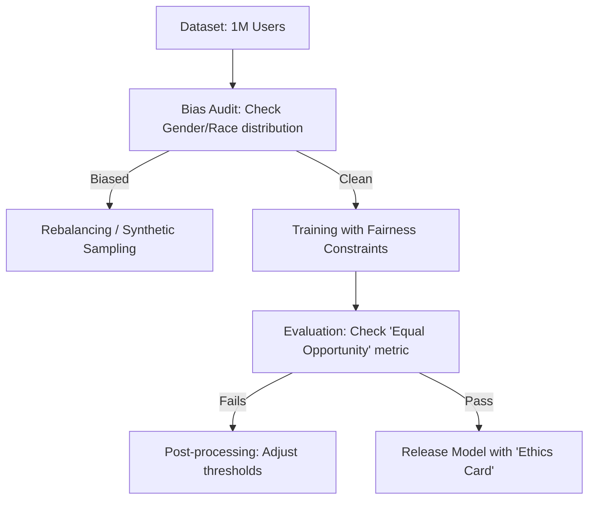

# 🕊️ Ethical AI Guidelines: Engineering with a Conscience
> **Level:** Intermediate | **Language:** Hinglish | **Goal:** Master the moral and social principles of AI development, exploring Fairness, Accountability, Transparency, and the 2026 strategies for building AI that benefits humanity without harming specific groups.

---

## 🧭 1. Beginner-Friendly Hinglish Explanation
AI sirf ek "Machine" nahi hai, wo humari "Society" ka hissa banta ja raha hai. 

- **The Problem:** Maan lo aap ek AI banate hain jo "Hiring" (Jobs) mein help kare. Agar wo AI sirf "Mardon" (Men) ko select kar raha hai aur "Auraton" (Women) ko reject, toh wo AI "Unfair" (Baised) hai.
- Ye AI isliye aisa kar raha hai kyunki pichle 20 saalon ke data mein mard zyada the. AI ne "Sahi" nahi sikha, usne "Bhed-bhav" (Bias) seekh liya.

**Ethical AI** ka matlab hai AI banate waqt ye 3 sawaal puchna:
1. **Fairness:** Kya mera AI sabke saath barabar vyavhar kar raha hai?
2. **Accountability:** Agar AI koi galti kare (jaise kisi ko galat jail bhej de), toh zimmedar kaun hai?
3. **Transparency:** Kya hum samajh sakte hain ki AI ne ye decision "Kyun" liya?

2026 mein, "Smart" AI se zyada zaroori "Zimmedar" (Responsible) AI hai.

---

## 🧠 2. Deep Technical Explanation
Ethical AI is governed by the **FATE** framework: Fairness, Accountability, Transparency, and Ethics.

### 1. Fairness (Bias Mitigation):
- **Pre-processing:** Removing bias from the training data (e.g., re-balancing classes).
- **In-processing:** Adding a "Fairness Constraint" to the loss function during training.
- **Post-processing:** Adjusting the model's output scores to ensure equal opportunity across groups.

### 2. Accountability:
- Implementing **Lineage Tracking.** If an AI makes a harmful prediction, you must be able to trace it back to:
  - The exact training dataset.
  - The exact hyperparameters.
  - The human who approved the model.

### 3. Transparency & Explainability (XAI):
- Using methods like **SHAP** or **LIME** to explain which features influenced the prediction.
- *Example:* "The AI rejected the loan because the 'Debt-to-Income' ratio was too high, not because of the user's race."

### 4. Human-in-the-loop (HITL):
- Ensuring that for high-stakes decisions (Medical, Legal, Finance), an AI cannot act alone. A human must "Verify" and "Sign-off" on the result.

---

## 🏗️ 3. Ethical AI Pillars
| Pillar | Definition | engineering Action |
| :--- | :--- | :--- |
| **Fairness** | No bias against protected groups | Run 'Bias Audits' regularly |
| **Accountability** | Clear responsibility for errors | Model cards & Versioning |
| **Transparency** | How it works is understandable | Provide 'Explanations' for scores |
| **Safety** | Doesn't cause physical/mental harm| Red-teaming & Guardrails |
| **Sustainability**| Environmental impact of GPUs | Use 'Carbon Tracking' tools |

---

## 📐 4. Mathematical Intuition
- **The Disparate Impact Ratio:** 
  A standard way to measure bias in hiring or lending.
  $$\text{Ratio} = \frac{P(\text{outcome | unprivileged group})}{P(\text{outcome | privileged group})}$$
  - If the ratio is $< 0.8$, the system is legally considered biased in many jurisdictions.
  - **Goal:** Aim for a ratio as close to $1.0$ as possible.

---

## 📊 5. Ethical AI Audit Workflow (Diagram)


---

## 💻 6. Production-Ready Examples (Bias Detection with AI Fairness 360)
```python
# 2026 Pro-Tip: Use IBM's 'AIF360' or Microsoft's 'Fairlearn' for audits.

from fairlearn.metrics import MetricFrame, selection_rate
from sklearn.metrics import accuracy_score

# 1. Compare Accuracy and Selection Rate across groups (e.g., Gender)
metrics = {
    'accuracy': accuracy_score,
    'selection_rate': selection_rate
}

mf = MetricFrame(
    metrics=metrics,
    y_true=y_test,
    y_pred=y_predictions,
    sensitive_features=test_gender_column
)

# 2. Check the difference
print("Accuracy by Gender:\n", mf.by_group)
print("Selection Rate Difference:", mf.difference(method='between_groups')['selection_rate'])

# If the difference is > 0.1, you have a Bias problem! 🚩
```

---

## ❌ 7. Failure Cases
- **The 'Black Box' Prison Sentence:** An AI gives a person a high "Recidivism" (risk of re-offending) score without explaining why, and the judge follows it blindly.
- **Biased Chatbots:** A chatbot that uses "Gendered Language" (assuming all doctors are 'He' and all nurses are 'She').
- **Energy Waste:** Training a 175B model $10$ times just to gain $0.1\%$ accuracy, wasting Megawatts of electricity.

---

## 🛠️ 8. Debugging Guide
- **Symptom:** "Users are complaining that the AI is rude to a specific dialect."
- **Check:** **Training Diversity**. Did you only train on "Formal English"? Add data from diverse cultures and dialects.
- **Symptom:** "The model is making correct but 'Creepy' predictions (e.g., predicting pregnancy based on shopping habits)."
- **Check:** **Ethical Boundary**. Just because you *can* predict something doesn't mean you *should*. Set "Forbidden Prediction" categories.

---

## ⚖️ 9. Tradeoffs
- **Accuracy vs. Fairness:** Sometimes making a model "Fair" reduces its overall "Accuracy" by $1-2\%$. In 2026, we accept this as the "Cost of Ethics."
- **Transparency vs. IP:** Sharing exactly how your model works might help competitors, but hiding it makes you untrustworthy.

---

## 🛡️ 10. Security Concerns
- **Fairness Hijacking:** An attacker purposefully providing "Fair data" that actually hides a deeper, malicious bias.

---

## 📈 11. Scaling Challenges
- **Global Ethics:** What is "Ethical" in the USA might be "Unethical" in Japan or Saudi Arabia. You must build **"Culturally-Aware Guardrails."**

---

## 💸 12. Cost Considerations
- **Environment Impact:** GPU training is carbon-heavy. **Strategy: Use 'Green Datacenters' and 'Quantization' to reduce the energy footprint.**

---

## ✅ 13. Best Practices
- **Establish an 'Ethics Committee':** Include lawyers, philosophers, and sociologists, not just engineers.
- **Publish Model Cards:** Be open about where the model fails.
- **Regular Audits:** Bias isn't a one-time fix. As the world changes, your model might become biased again. Audit every 3 months.

---

## ⚠️ 14. Common Mistakes
- **"Techno-solutionism":** Thinking that every ethical problem can be fixed with a better algorithm. (Sometimes the problem is the society, not the code).
- **Ignoring the 'Long Tail':** Only checking for bias against "Large" groups (e.g., Male/Female) but ignoring "Small" groups (e.g., Indigenous tribes).

---

## 📝 15. Interview Questions
1. **"What is the FATE framework in AI?"**
2. **"Explain the difference between Pre-processing and Post-processing bias mitigation."**
3. **"How do you measure the 'Carbon Footprint' of a training job?"**

---

## 🚀 15. Latest 2026 Industry Patterns
- **Constitutional AI:** Training a model with a "Constitution" (a list of values) that it uses to "Self-Correct" its own behavior. (Anthropic's approach).
- **Value Alignment (RLHF-V):** Using Reinforcement Learning specifically to align AI outputs with "Human Values."
- **Explainable-by-default:** New architectures that don't need SHAP/LIME because they show their "Reasoning steps" as they think.
