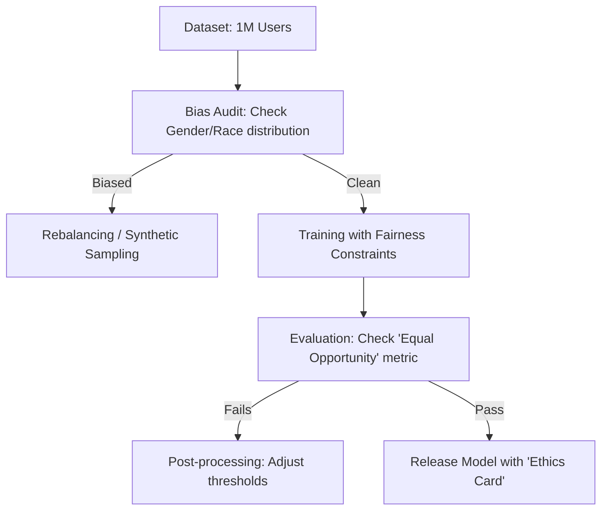

# 🕊️ Ethical AI Guidelines: Engineering with a Conscience
> **Level:** Intermediate | **Language:** Hinglish | **Goal:** AI development ke moral aur social principles ko master karein, Fairness, Accountability, Transparency, aur 2026 mein bina kisi group ko harm kiye humanity ke liye beneficial AI build karne ki strategies ko explore karte hue.

---

## 🧭 1. Beginner-Friendly Hinglish Explanation
AI sirf ek "Machine" nahi hai, wo humari "Society" ka hissa banta ja raha hai. 

- **The Problem:** Maan lo aap ek AI banate hain jo "Hiring" (Jobs) mein help kare. Agar wo AI sirf "Mardon" (Men) ko select kar raha hai aur "Auraton" (Women) ko reject, toh wo AI "Unfair" (Baised) hai.
- Ye AI isliye aisa kar raha hai kyunki pichle 20 saalon ke data mein mard zyada the. AI ne "Sahi" nahi sikha, usne "Bhed-bhav" (Bias) seekh liya.

**Ethical AI** ka matlab hai AI banate waqt ye 3 sawaal puchna:
1. **Fairness:** Kya mera AI sabke saath barabar vyavhar kar raha hai?
2. **Accountability:** Agar AI koi galti kare (jaise kisi ko galat jail bhej de), toh zimmedar kaun hai?
3. **Transparency:** Kya hum samajh sakte hain ki AI ne ye decision "Kyun" liya?

2026 mein, "Smart" AI se zyada zaroori "Zimmedar" (Responsible) AI hai.

---

## 🧠 2. Deep Technical Explanation
Ethical AI **FATE** framework ke dwara govern hota hai: Fairness, Accountability, Transparency, aur Ethics.

### 1. Fairness (Bias Mitigation):
- **Pre-processing:** Training data se bias ko remove karna (jaise classes ko re-balance karna).
- **In-processing:** Training ke dauran loss function mein ek "Fairness Constraint" add karna.
- **Post-processing:** Groups ke across equal opportunity ensure karne ke liye model ke output scores ko adjust karna.

### 2. Accountability:
- **Lineage Tracking** implement karna. Agar AI koi harmful prediction karta hai, toh aapko use trace karne ke qabil hona chahiye:
  - Exact kis training dataset se train hua tha?
  - Exact hyperparameters kya the?
  - Kis human ne model ko approve kiya tha?

### 3. Transparency & Explainability (XAI):
- **SHAP** ya **LIME** jaise methods ka use karke ye explain karna ki kin features ne prediction ko influence kiya.
- *Example:* "AI ne loan isliye reject kiya kyunki 'Debt-to-Income' ratio bahut high tha, na ki user ki race ki wajah se."

### 4. Human-in-the-loop (HITL):
- High-stakes decisions (Medical, Legal, Finance) ke liye ye ensure karna ki AI akele decision na le. Ek human ko result ko "Verify" aur "Sign-off" karna zaroori hai.

---

## 🏗️ 3. Ethical AI Pillars
| Pillar | Definition | engineering Action |
| :--- | :--- | :--- |
| **Fairness** | No bias against protected groups | Run 'Bias Audits' regularly |
| **Accountability** | Clear responsibility for errors | Model cards & Versioning |
| **Transparency** | How it works is understandable | Provide 'Explanations' for scores |
| **Safety** | Doesn't cause physical/mental harm| Red-teaming & Guardrails |
| **Sustainability**| Environmental impact of GPUs | Use 'Carbon Tracking' tools |

---

## 📐 4. Mathematical Intuition
- **The Disparate Impact Ratio:** 
  Hiring ya lending mein bias ko measure karne ka ek standard tareeka.
  $$\text{Ratio} = \frac{P(\text{outcome | unprivileged group})}{P(\text{outcome | privileged group})}$$
  - Agar ye ratio $< 0.8$ hai, toh kai jagah ise legally biased mana jata hai.
  - **Goal:** Ratio ko $1.0$ ke jitna ho sake utna close rakhna.

---

## 📊 5. Ethical AI Audit Workflow (Diagram)

```mermaid
graph TD
    Data[Dataset: 1M Users] --> Audit[Bias Audit: Check Gender/Race distribution]
    Audit -- "Biased" --> Rebalance[Rebalancing / Synthetic Sampling]
    Audit -- "Clean" --> Train[Training with Fairness Constraints]
    
    Train --> Eval[Evaluation: Check 'Equal Opportunity' metric]
    Eval -- "Fails" --> Post[Post-processing: Adjust thresholds]
    Eval -- "Pass" --> Release[Release Model with 'Ethics Card']
```

---

## 💻 6. Production-Ready Examples (Bias Detection with AI Fairness 360)
```python
# 2026 Pro-Tip: Use IBM's 'AIF360' or Microsoft's 'Fairlearn' for audits.

from fairlearn.metrics import MetricFrame, selection_rate
from sklearn.metrics import accuracy_score

# 1. Compare Accuracy and Selection Rate across groups (e.g., Gender)
metrics = {
    'accuracy': accuracy_score,
    'selection_rate': selection_rate
}

mf = MetricFrame(
    metrics=metrics,
    y_true=y_test,
    y_pred=y_predictions,
    sensitive_features=test_gender_column
)

# 2. Check the difference
print("Accuracy by Gender:\n", mf.by_group)
print("Selection Rate Difference:", mf.difference(method='between_groups')['selection_rate'])

# If the difference is > 0.1, you have a Bias problem! 🚩
```

---

## ❌ 7. Failure Cases
- **The 'Black Box' Prison Sentence:** AI kisi person ko bina kisi explanation ke high "Recidivism" (fir se offense karne ka risk) score de deta hai, aur judge bina soche-samjhe use follow kar leta hai.
- **Biased Chatbots:** Ek aisa chatbot jo "Gendered Language" ka use karta hai (jaise ye assume karna ki sabhi doctors 'He' hain aur sabhi nurses 'She' hain).
- **Energy Waste:** Sirf $0.1\%$ accuracy badhane ke liye 175B model ko 10 baar train karna, jisse Megawatts of electricity waste hoti hai.

---

## 🛠️ 8. Debugging Guide
- **Symptom:** "Users complain kar rahe hain ki AI kisi specific dialect ke liye rude hai."
- **Check:** **Training Diversity**. Kya aapne sirf "Formal English" par training ki hai? Diverse cultures aur dialects se data add karein.
- **Symptom:** "Model correct par 'Creepy' predictions kar raha hai (jaise shopping habits ke basis par pregnancy predict karna)."
- **Check:** **Ethical Boundary**. Sirf isliye ki aap kuch predict *kar sakte hain*, iska matlab ye nahi ki aapko wo *karna chahiye*. "Forbidden Prediction" categories set karein.

---

## ⚖️ 9. Tradeoffs
- **Accuracy vs. Fairness:** Kabhi-kabhi model ko "Fair" banane se uski overall "Accuracy" $1-2\%$ reduce ho jati hai. 2026 mein, hum ise "Cost of Ethics" ke roop mein accept karte hain.
- **Transparency vs. IP:** Model kaise kaam karta hai ye show karne se competitors ko help mil sakti hai, par ise hide karne se aap untrustworthy ban jaoge.

---

## 🛡️ 10. Security Concerns
- **Fairness Hijacking:** Ek attacker jaan-boojhkar aisa "Fair data" provide karta hai jo actual mein ek deeper, malicious bias ko chhupata hai.

---

## 📈 11. Scaling Challenges
- **Global Ethics:** Jo cheez USA mein "Ethical" hai, ho sakta hai wo Japan ya Saudi Arabia mein "Unethical" ho. Aapko **"Culturally-Aware Guardrails"** build karne honge.

---

## 🛡️ 12. Cost Considerations
- **Environment Impact:** GPU training carbon-heavy hoti hai. **Strategy: Energy footprint ko reduce karne ke liye 'Green Datacenters' aur 'Quantization' ka use karein.**

---

## ✅ 13. Best Practices
- **Establish an 'Ethics Committee':** Sirf engineers hi nahi, balki lawyers, philosophers aur sociologists ko bhi committee mein include karein.
- **Publish Model Cards:** Model kahan fail hota hai, iske baare mein open rahein.
- **Regular Audits:** Bias koi one-time fix nahi hai. Jaise-jaise duniya badalti hai, aapka model fir se biased ho sakta hai. Har 3 months mein audit karein.

---

## ⚠️ 14. Common Mistakes
- **"Techno-solutionism":** Ye sochna ki har ethical problem ko ek behtar algorithm se fix kiya ja sakta hai. (Kabhi-kabhi problem society mein hoti hai, code mein nahi).
- **Ignoring the 'Long Tail':** Sirf "Large" groups (jaise Male/Female) ke bias ko check karna par "Small" groups (jaise Indigenous tribes) ko ignore kar dena.

---

## 📝 15. Interview Questions
1. **"AI mein FATE framework kya hai?"**
2. **"Pre-processing aur Post-processing bias mitigation ke beige ke difference ko explain karein."**
3. **"Aap kisi training job ke 'Carbon Footprint' ko kaise measure karte hain?"**

---

## 🚀 15. Latest 2026 Industry Patterns
- **Constitutional AI:** Model ko ek "Constitution" (values ki list) ke sath train karna jise wo apne behavior ko "Self-Correct" karne ke liye use kare. (Anthropic ka approach).
- **Value Alignment (RLHF-V):** AI outputs ko "Human Values" ke sath align karne ke liye specifically Reinforcement Learning ka use karna.
- **Explainable-by-default:** Naye architectures jinhe SHAP/LIME ki need nahi hoti kyunki wo sochte waqt hi apne "Reasoning steps" show karte hain.
