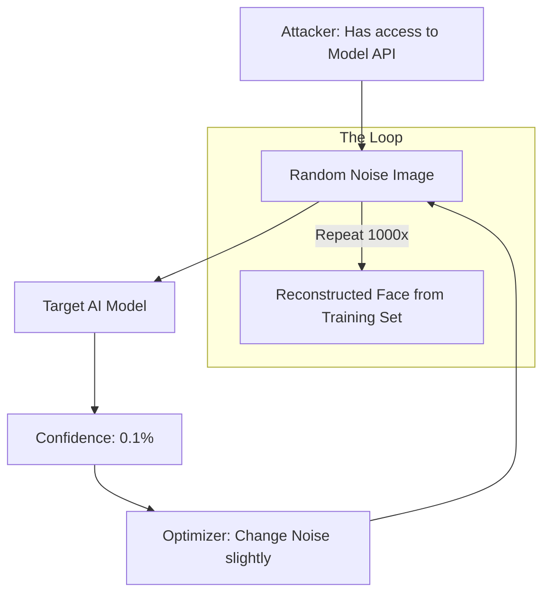

# 🧠 Model Inversion Attacks: Stealing the Training Secrets
> **Level:** Extreme Advanced | **Language:** Hinglish | **Goal:** Master the techniques used to "Reverse-Engineer" training data from a model's outputs, exploring Privacy Leaks, Gradient Inversion, and the 2026 strategies for building "Privacy-Preserving" AI.

---

## 🧭 1. Beginner-Friendly Hinglish Explanation
AI model ek "Mixer-Grinder" ki tarah hai. Aap usme fruits (Training Data) dalte hain aur wo "Juice" (The Model) banakar deta hai.

- **The Question:** Kya aap juice ko dekh kar bata sakte hain ki usme kaun-kaun se fruits the?
- **The Attack:** Ek chalak hacker model se aise sawaal puchta hai aur uske answers ko analyze karta hai ki wo model ke "Andar" se original photo ya private info nikal leta hai.

**Model Inversion** ka yahi matlab hai. 
- Maan lo ek AI "Faces" ko recognize karna sikh raha hai. 
- Hacker bina kisi "Real Photo" ke, model ke outputs ko use karke "Sameer" ki shakal (Face) reconstruct kar leta hai kyunki Sameer ka photo training data mein tha.

2026 mein, privacy ka matlab sirf "Data leak" na hona nahi hai, balki aisa AI banana hai jo apne "Secret memories" ko kabhi bahar na aane de.

---

## 🧠 2. Deep Technical Explanation
Model Inversion (MI) attacks attempt to reconstruct features of the training data given access to the model.

### 1. The Confidence Attack:
- If a model provides "Confidence Scores" (e.g., $99.2\%$ sure this is a Dog), a hacker can use these scores to "Nudge" a random noise image until the confidence becomes $100\%$. The resulting image will look like a person from the training set.

### 2. Gradient Inversion (The Federated Learning Threat):
- In distributed training, nodes send "Gradients" (changes) to a central server. 
- An attacker can use these gradients to mathematically calculate the EXACT training data that produced that gradient. 
- *Result:* The hacker sees the user's private data without ever having access to their phone.

### 3. Membership Inference vs. Inversion:
- **Membership Inference:** "Was Sameer in the training set?" (Yes/No).
- **Inversion:** "Show me what Sameer looks like." (Image/Text reconstruction).

---

## 🏗️ 3. Attack Scenarios
| Scenario | Data at Risk | Method |
| :--- | :--- | :--- |
| **Facial Recognition**| Private faces | Score-based reconstruction |
| **Medical AI** | Disease status | Statistical inference |
| **Language Models** | Passwords/PII | "Prompting" for memorized sequences |
| **Federated Learning**| Raw user data | Gradient matching |

---

## 📐 4. Mathematical Intuition
- **The Reconstruction Objective:** 
  An attacker tries to find an input $x$ that minimizes the distance between the model's output and a target label $y$.
  $$\hat{x} = \arg\min_x \mathcal{L}(f(x), y) + \lambda \mathcal{R}(x)$$
  - $f(x)$: The model's prediction.
  - $y$: The target (e.g., "Class: Sameer").
  - $\mathcal{R}(x)$: A "Prior" (e.g., knowledge that a face must have two eyes) to make the reconstructed image look real.

---

## 📊 5. Model Inversion Workflow (Diagram)


---

## 💻 6. Production-Ready Examples (Conceptual Mitigation with Differential Privacy)
```python
# 2026 Pro-Tip: Use 'Differential Privacy' to stop inversion.

import torch
from opacus import PrivacyEngine

# 1. Standard Training adds 'Noise' to the gradients
# This prevents an attacker from 'Reversing' the math
model = MyModel()
optimizer = torch.optim.SGD(model.parameters(), lr=0.01)

privacy_engine = PrivacyEngine()
model, optimizer, train_loader = privacy_engine.make_private(
    module=model,
    optimizer=optimizer,
    data_loader=train_loader,
    noise_multiplier=1.1, # The 'Magic' noise that hides data
    max_grad_norm=1.0,
)

# Now, even if a hacker has the gradients, they only see 'Noise', 
# not the original user data.
```

---

## ❌ 7. Failure Cases
- **The 'Memorable' Row:** If one person's data is very unique (e.g., only one person in the dataset has a rare disease), the model will "Memorize" them perfectly, making inversion easy.
- **API Leaks:** Giving out full 64-bit float confidence scores. **Fix: Round the scores (e.g., $0.9923... \to 0.99$) or only show the top class.**
- **Over-training:** A model that is "Overfitted" to its training data is $10x$ more vulnerable to inversion attacks.

---

## 🛠️ 8. Debugging Guide
- **Symptom:** "Model is leaking training data."
- **Check:** **Privacy Budget ($\epsilon$)**. If you are using Differential Privacy, is your $\epsilon$ too high? A high $\epsilon$ (e.g., $>10$) means almost no privacy protection.
- **Symptom:** "Attacker is getting clear images."
- **Check:** **Confidence truncation**. Stop showing probabilities to users. Just show the "Label."

---

## ⚖️ 9. Tradeoffs
- **Utility vs. Privacy:** Adding noise (Differential Privacy) to stop inversion will make your model $3-5\%$ less accurate. 
- **Explainability vs. Security:** Giving "Reasons" for a prediction can give attackers more clues for inversion.

---

## 🛡️ 10. Security Concerns
- **Model Stealing:** Using model inversion to "Clone" a company's billion-dollar model by just observing its outputs.

---

## 📈 11. Scaling Challenges
- **Large Scale Inversion:** Inversion on a 100B parameter LLM is computationally expensive but possible for specific "Sensitive" tokens (like SSNs).

---

## 💸 12. Cost Considerations
- **Audit Cost:** Hiring a "Privacy Team" to run inversion tests on every model release. **Strategy: Automate this using tools like 'TensorFlow Privacy'.**

---

## ✅ 13. Best Practices
- **Use 'Differential Privacy' (DP):** The ONLY mathematical proof of privacy.
- **Limit API Output:** Never show probabilities/logits if not needed.
- **Use 'Synthetic Data':** Train on AI-generated data instead of real user data to eliminate the risk of leaking real identities.

---

## ⚠️ 14. Common Mistakes
- **Thinking 'Anonymization' is enough:** Just removing names isn't enough. Model inversion can reconstruct the "Face" or "Medical Pattern" from the anonymous data.
- **Training for too long:** Don't let the model "Memorize" the training set. Use early stopping.

---

## 📝 15. Interview Questions
1. **"What is the difference between Membership Inference and Model Inversion?"**
2. **"How does adding noise to gradients prevent inversion attacks?"**
3. **"Explain the 'Confidence Attack' method for reconstructing images."**

---

## 🚀 15. Latest 2026 Industry Patterns
- **Fully Homomorphic Encryption (FHE):** Training models where the data is ALWAYS encrypted, even while the GPU is processing it. (Ultra-slow but ultra-secure).
- **Privacy-as-a-Metric:** New leaderboards that rank models not just by "Accuracy" but by their "Resistance to Inversion."
- **On-Device Only Training:** Training data never leaves the user's phone, and only "Encrypted Noise" is sent to the cloud.
