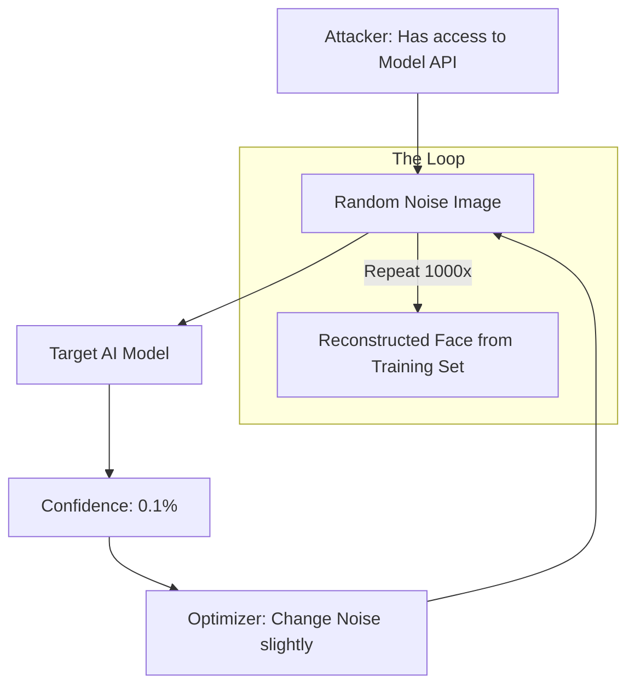

# 🧠 Model Inversion Attacks: Stealing the Training Secrets
> **Level:** Extreme Advanced | **Language:** Hinglish | **Goal:** Model outputs se training data ko "Reverse-Engineer" karne ki techniques ko master karein, Privacy Leaks, Gradient Inversion, aur 2026 mein "Privacy-Preserving" AI build karne ki strategies ko explore karte hue.

---

## 🧭 1. Beginner-Friendly Hinglish Explanation
AI model ek "Mixer-Grinder" ki tarah hai. Aap usme fruits (Training Data) dalte hain aur wo "Juice" (The Model) banakar deta hai.

- **The Question:** Kya aap juice ko dekh kar bata sakte hain ki usme kaun-kaun se fruits the?
- **The Attack:** Ek chalak hacker model se aise sawaal puchta hai aur uske answers ko analyze karta hai ki wo model ke "Andar" se original photo ya private info nikal leta hai.

**Model Inversion** ka yahi matlab hai. 
- Maan lo ek AI "Faces" ko recognize karna sikh raha hai. 
- Hacker bina kisi "Real Photo" ke, model ke outputs ko use karke "Sameer" ki shakal (Face) reconstruct kar leta hai kyunki Sameer ka photo training data mein tha.

2026 mein, privacy ka matlab sirf "Data leak" na hona nahi hai, balki aisa AI banana hai jo apne "Secret memories" ko kabhi bahar na aane de.

---

## 🧠 2. Deep Technical Explanation
Model Inversion (MI) attacks model ka access hone par training data ke features ko reconstruct karne ki koshish karte hain.

### 1. The Confidence Attack:
- Agar koi model "Confidence Scores" provide karta hai (jaise ye $99.2\%$ sure hai ki ye ek Dog hai), toh ek hacker in scores ka use karke ek random noise image ko tab tak "Nudge" (adjust) kar sakta hai jab tak confidence $100\%$ na ho jaye. Resulting image training set ke kisi person ki tarah dikhegi.

### 2. Gradient Inversion (The Federated Learning Threat):
- Distributed training mein, nodes central server ko "Gradients" (changes) send karte hain. 
- Ek attacker in gradients ka use karke mathematically us EXACT training data ko calculate kar sakta hai jisne us gradient ko produce kiya tha. 
- *Result:* Hacker user ke phone ka access liye bina hi uska private data dekh sakta hai.

### 3. Membership Inference vs. Inversion:
- **Membership Inference:** "Kya Sameer training set mein shamil tha?" (Yes/No).
- **Inversion:** "Mujhe dikhao ki Sameer kaisa dikhta hai." (Image/Text reconstruction).

---

## 🏗️ 3. Attack Scenarios
| Scenario | Data at Risk | Method |
| :--- | :--- | :--- |
| **Facial Recognition**| Private faces | Score-based reconstruction |
| **Medical AI** | Disease status | Statistical inference |
| **Language Models** | Passwords/PII | "Prompting" for memorized sequences |
| **Federated Learning**| Raw user data | Gradient matching |

---

## 📐 4. Mathematical Intuition
- **The Reconstruction Objective:** 
  Ek attacker ek aisa input $x$ find karne ki koshish karta hai jo model ke output aur ek target label $y$ ke beige ke distance ko minimize kare.
  $$\hat{x} = \arg\min_x \mathcal{L}(f(x), y) + \lambda \mathcal{R}(x)$$
  - $f(x)$: Model ka prediction.
  - $y$: Target (jaise "Class: Sameer").
  - $\mathcal{R}(x)$: Ek "Prior" (jaise ye knowledge ki ek face mein do eyes honi chahiye) taaki reconstructed image real lage.

---

## 📊 5. Model Inversion Workflow (Diagram)

```mermaid
graph TD
    Hacker[Attacker: Has access to Model API] --> Noise[Random Noise Image]
    Noise --> Model[Target AI Model]
    Model --> Score[Confidence: 0.1%]
    
    Score --> Opt[Optimizer: Change Noise slightly]
    Opt --> Noise
    
    subgraph "The Loop"
    Noise -- "Repeat 1000x" --> Final[Reconstructed Face from Training Set]
    end
```

---

## 💻 6. Production-Ready Examples (Conceptual Mitigation with Differential Privacy)
```python
# 2026 Pro-Tip: Use 'Differential Privacy' to stop inversion.

import torch
from opacus import PrivacyEngine

# 1. Standard Training adds 'Noise' to the gradients
# This prevents an attacker from 'Reversing' the math
model = MyModel()
optimizer = torch.optim.SGD(model.parameters(), lr=0.01)

privacy_engine = PrivacyEngine()
model, optimizer, train_loader = privacy_engine.make_private(
    module=model,
    optimizer=optimizer,
    data_loader=train_loader,
    noise_multiplier=1.1, # The 'Magic' noise that hides data
    max_grad_norm=1.0,
)

# Now, even if a hacker has the gradients, they only see 'Noise', 
# not the original user data.
```

---

## ❌ 7. Failure Cases
- **The 'Memorable' Row:** Agar kisi ek person ka data bahut unique hai (jaise dataset mein sirf ek hi person ko koi rare disease hai), toh model use perfectly "Memorize" (yaad) kar lega, jisse inversion aasan ho jayega.
- **API Leaks:** Full 64-bit float confidence scores bahar bhejna. **Fix: Scores ko round-off karein (jaise $0.9923... \to 0.99$) ya sirf top class hi show karein.**
- **Over-training:** Ek aisa model jo apne training data ke sath "Overfitted" hai, us par inversion attacks hone ka risk $10x$ zyada hota hai.

---

## 🛠️ 8. Debugging Guide
- **Symptom:** "Model training data leak kar raha hai."
- **Check:** **Privacy Budget ($\epsilon$)**. Agar aap Differential Privacy use kar rahe hain, toh kya aapka $\epsilon$ bahut high hai? High $\epsilon$ (jaise $>10$) ka matlab hai lagbhag zero privacy protection.
- **Symptom:** "Attacker ko clear images mil rahi hain."
- **Check:** **Confidence truncation**. Users ko probabilities show karna stop karein. Sirf "Label" show karein.

---

## ⚖️ 9. Tradeoffs
- **Utility vs. Privacy:** Inversion ko rokne ke liye noise (Differential Privacy) add karne se aapka model $3-5\%$ less accurate ho jayega.
- **Explainability vs. Security:** Prediction ke liye "Reasons" (karanno) ko share karne se attackers ko inversion ke liye aur clues mil sakte hain.

---

## 🛡️ 10. Security Concerns
- **Model Stealing:** Or modeling stealing. Kisi company ke billion-dollar model ke outputs ko observe karke model inversion ke through use "Clone" (duplicate) karna.

---

## 📈 11. Scaling Challenges
- **Large Scale Inversion:** Ek 100B parameter wale LLM par inversion karna computationally expensive hai par specific "Sensitive" tokens (jaise SSNs) ke liye ye possible hai.

---

## 💸 12. Cost Considerations
- **Audit Cost:** Har model release par inversion tests run karne ke liye ek "Privacy Team" ko hire karna. **Strategy: 'TensorFlow Privacy' jaise tools ka use karke ise automate karein.**

---

## ✅ 13. Best Practices
- **Use 'Differential Privacy' (DP):** Privacy ka ekmatra (only) mathematical proof.
- **Limit API Output:** Jab tak zaroorat na ho, tab tak kabhi bhi probabilities/logits show na karein.
- **Use 'Synthetic Data':** Real identities ke leak hone ke risk ko khatam karne ke liye real user data ke bajaye AI-generated data par train karein.

---

## ⚠️ 14. Common Mistakes
- **Thinking 'Anonymization' is enough:** Sirf names ko remove kar dena kafi nahi hai. Model inversion anonymous data se bhi "Face" ya "Medical Pattern" ko reconstruct kar sakta hai.
- **Training for too long:** Model ko training set ko "Memorize" na karne dein. Early stopping ka use karein.

---

## 📝 15. Interview Questions
1. **"Membership Inference aur Model Inversion ke beige kya difference hai?"**
2. **"Gradients mein noise add karne se inversion attacks kaise rukte hain?"**
3. **"Images ko reconstruct karne ke liye 'Confidence Attack' method ko explain karein."**

---

## 🚀 15. Latest 2026 Industry Patterns
- **Fully Homomorphic Encryption (FHE):** Training models jahan data hamesha encrypted rahe, yahan tak ki jab GPU use process kar raha ho tab bhi. (Ultra-slow par ultra-secure).
- **Privacy-as-a-Metric:** Naye leaderboards jo models ko sirf "Accuracy" ke basis par nahi, balki unki "Resistance to Inversion" (inversion ke khilaf resistance) ke basis par rank karte hain.
- **On-Device Only Training:** Training data kabhi bhi user ke phone se bahar nahi jata, aur cloud par sirf "Encrypted Noise" hi send kiya jata hai.
