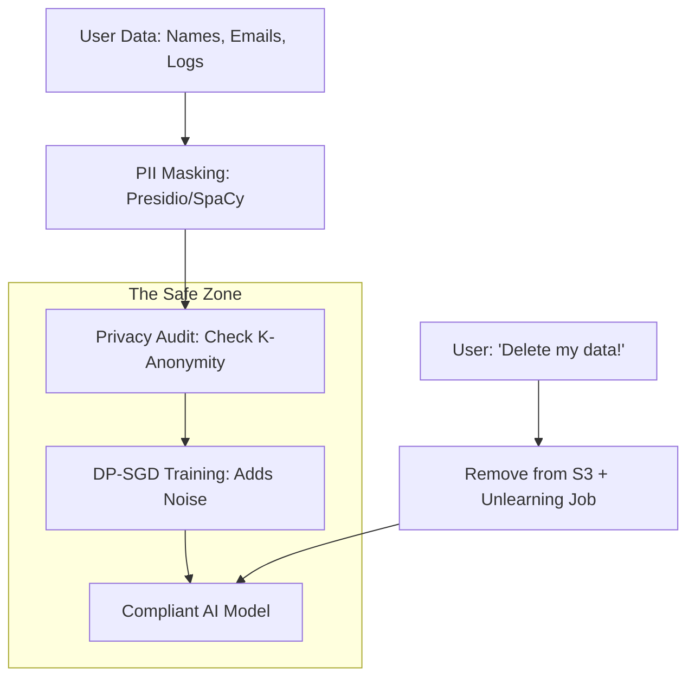

# ⚖️ Privacy & GDPR in AI: The Legal Guardrails
> **Level:** Intermediate | **Language:** Hinglish | **Goal:** Master the intersection of AI Engineering and Global Privacy Laws, exploring GDPR, the "Right to be Forgotten" in AI, PII masking, and the 2026 strategies for building "Legally Compliant" AI systems.

---

## 🧭 1. Beginner-Friendly Hinglish Explanation
AI banana sirf "Coding" ka khel nahi hai. Agar aapne kisi ka "Personal Data" (jaise Name, Address, Phone) bina permission use kiya, toh aap par karodon ka fine lag sakta hai.

- **GDPR:** Ye ek European kanoon hai jo kehta hai: "Har insaan ka apne data par control hai."
- **The Problem:** Agar kisi user ne kaha: *"Mera data delete karo"* (Right to be Forgotten), toh kya aap apna AI model "Reset" karenge? Kyunki AI ne toh us data se seekh liya hai (Memorize kar liya hai).
- **The Solution:** Humein aisa system banana padta hai jahan training se pehle hi sara "Personal Data" (PII) saaf ho jaye.

2026 mein, ek **"Privacy Engineer"** ki salary ek AI Researcher ke barabar hai. Bina kanoon ko samjhe AI deploy karna "Gadi bina brake ke chalane" jaisa hai.

---

## 🧠 2. Deep Technical Explanation
GDPR (General Data Protection Regulation) and similar laws (CCPA, India's DPDP) impose strict requirements on AI.

### 1. Data Minimization:
- Don't collect what you don't need. If your AI only needs to predict "Sales," don't store the user's "Home Address."

### 2. The Right to be Forgotten (Article 17):
- If a user deletes their account, their data must be removed from the training set. 
- **The AI Dilemma:** Does a trained model contain personal data? If it can "Reconstruct" a user's face or SSN, it is NOT compliant. 
- **Solution:** **Machine Unlearning** (new techniques to "Forget" specific data points without retraining the whole model).

### 3. Purpose Limitation:
- You cannot use data collected for "Shipping" to train a "Marketing Chatbot" without explicit consent.

### 4. Automated Decision Making (Article 22):
- Users have the right to an **Explanation.** If an AI rejects a loan, you must be able to explain "WHY" based on the data, not just say "The AI said so."

---

## 🏗️ 3. Privacy-Preserving Techniques
| Technique | How it works | Impact on AI |
| :--- | :--- | :--- |
| **Anonymization** | Remove names/IDs | High (Irreversible) |
| **Pseudonymization**| Replace Name with 'ID_99' | Moderate (Reversible) |
| **K-Anonymity** | Group users so no one is unique | High (Loss of detail) |
| **Differential Privacy**| Add math noise to gradients | **Superior (Proven)** |
| **Federated Learning**| Data stays on user device | **Superior (Safe)** |

---

## 📐 4. Mathematical Intuition
- **The Privacy Budget ($\epsilon$):** 
  In Differential Privacy, $\epsilon$ (Epsilon) measures how much information is leaked. 
  - $\epsilon = 0$: Perfect privacy, but the model is $0\%$ accurate. 
  - $\epsilon \to \infty$: Perfect accuracy, but zero privacy. 
  - **The 2026 Standard:** Most companies aim for $\epsilon \in [1, 5]$.

---

## 📊 5. GDPR-Compliant AI Pipeline (Diagram)


---

## 💻 6. Production-Ready Examples (PII Scanning before Logging)
```python
# 2026 Pro-Tip: Use 'Microsoft Presidio' to automate GDPR compliance.

from presidio_analyzer import AnalyzerEngine

analyzer = AnalyzerEngine()

def process_query(user_query):
    # 1. Check for PII
    results = analyzer.analyze(text=user_query, entities=["PHONE_NUMBER", "EMAIL_ADDRESS"], language='en')
    
    if len(results) > 0:
        # 2. Block or Redact
        print("GDPR Warning: PII detected in query! 🛑")
        return "Please do not share personal info."
    
    return "Query is safe."

# This check prevents sensitive data from ever reaching your 'Training Logs'.
```

---

## ❌ 7. Failure Cases
- **The 'Re-identification' Attack:** Anonymizing a dataset by removing names, but an attacker joins it with a public "Voter List" to find out exactly who is who.
- **Memorization:** An LLM memorizing a credit card number from a single training document. **Fix: Use 'Deduplication' and 'DP-SGD'.**
- **Implicit PII:** Not storing an address, but storing "GPS coordinates," which can reveal where a person lives.

---

## 🛠️ 8. Debugging Guide
- **Symptom:** "Legal team says the model is failing the 'Right to be Forgotten' test."
- **Check:** **Model Inversion**. Can you reconstruct any deleted user's info? If yes, you must run a **Machine Unlearning** pass.
- **Symptom:** "Model accuracy is too low after applying privacy."
- **Check:** **Epsilon ($\epsilon$)**. You might be adding too much noise. Try increasing $\epsilon$ slightly or increasing the batch size.

---

## ⚖️ 9. Tradeoffs
- **User Experience vs. Privacy:** Forcing users to click "Accept" on 10 different popups vs. making the app easy to use.
- **Local vs. Cloud:** Local processing (on-device) is $100\%$ private but limits the "Intelligence" to the phone's hardware.

---

## 🛡️ 10. Security Concerns
- **Model Inversion as a Privacy Breach:** A hacker using inversion to prove that a specific person was in your "Medical Research" dataset, violating their medical privacy.

---

## 📈 11. Scaling Challenges
- **Multi-Jurisdiction Compliance:** Your app is in 100 countries. You must follow GDPR (Europe), CCPA (California), and DPDP (India) simultaneously. **Solution: Follow the 'Strictest' law (usually GDPR) as your global base.**

---

## 💸 12. Cost Considerations
- **Legal Audit Fees:** $\$50,000+$ for a third-party privacy audit. **Strategy: Use open-source compliance tools first to find 'Low hanging fruit'.**

---

## ✅ 13. Best Practices
- **Data Retention Policies:** Automatically delete training data after 2 years.
- **Privacy by Design:** Don't "Add" privacy at the end. Build the database architecture with privacy in mind from Day 1.
- **Consent Logs:** Store a timestamp and version of the privacy policy every user agreed to.

---

## ⚠️ 14. Common Mistakes
- **Assuming 'Internal' means 'Private':** Thinking that because the data is on your servers, GDPR doesn't apply. (It does!).
- **Storing 'Raw' Logs:** Saving every chat prompt in plaintext on S3 for "Debugging."

---

## 📝 15. Interview Questions
1. **"What is the 'Right to be Forgotten' and how does it affect AI models?"**
2. **"Difference between Anonymization and Pseudonymization?"**
3. **"How does Federated Learning help in GDPR compliance?"**

---

## 🚀 15. Latest 2026 Industry Patterns
- **Differential Privacy as a Service:** Cloud providers (AWS/GCP) offering "One-click" privacy-preserving training for LLMs.
- **AI-Privacy Agents:** Small AI models that sit between the User and the LLM, acting as a "Privacy Filter" in real-time.
- **Machine Unlearning Frameworks:** Standardized libraries (like **SISA**) that allow you to "Un-train" a specific user's data in minutes.
